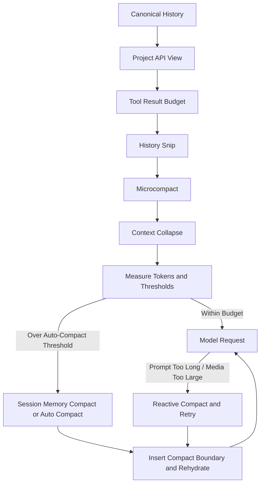
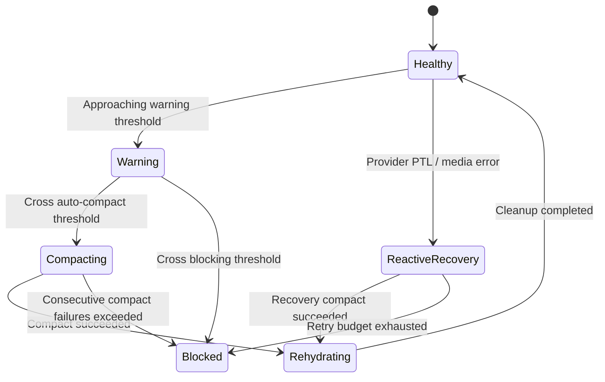
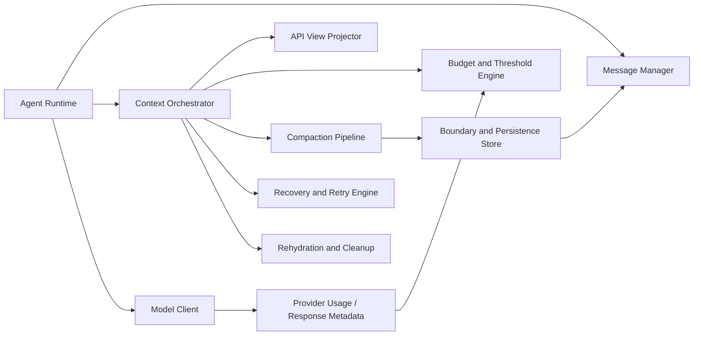

# 01 - 源码对齐与目标架构

## 1. 文档目的

本文档回答两个问题：

1. Claude Code 的上下文管理系统到底由哪些部件组成。
2. 这些部件在 `renx-code-v3` 中应该落在哪里，以什么架构形式实现。

它是整套设计的总架构文档，不深入单个算法细节，但必须明确系统边界、职责分工、关键状态对象和运行时调用顺序。

## 2. Claude Code 中已确认存在的能力

根据源码与文档，可以确认 Claude Code 的上下文管理至少包含以下部分：

- 基于真实 `usage` 的上下文统计与 UI 预算展示。
- 在模型调用前对消息做多层次压缩投影。
- 轻量级前置裁剪，包括工具结果预算、history snip、microcompact。
- 较重的折叠型压缩，包括 context collapse 与 auto compact。
- 特殊快速路径，即 session memory compact。
- 压缩后边界消息、保留段、归档消息的持久化和链式追踪。
- 压缩失败、Prompt-Too-Long、媒体过大、输出 token 过大的恢复流程。
- 压缩后的后处理，包括恢复工作上下文与清理过时缓存。
- 通过 forked agent 运行单轮无工具摘要，复用主线程 prompt cache prefix。

这些能力说明，Claude Code 不是“对历史消息做一次摘要”的实现，而是把上下文管理嵌入到 query loop、消息模型、持久化、缓存、恢复逻辑中的一整套系统。

## 3. Claude Code 的运行视角

从 query loop 角度看，Claude Code 的核心流程可以压缩成下图：



注意两个关键点：

- 管线中的前几层主要作用于“请求视图”，不是直接销毁主历史。
- AutoCompact 并不是唯一压缩层，而是兜底层。

## 4. 在 renx-code-v3 中的目标架构

### 4.1 总体原则

`renx-code-v3` 应采用“主历史稳定、请求视图可投影、压缩结果可恢复”的架构。推荐新增 `packages/agent/src/context/` 目录承载上下文管理实现，但主接入点仍然在 `runtime.ts`。

推荐目录结构如下：

```text
packages/agent/src/context/
  index.ts
  types.ts
  budget.ts
  thresholds.ts
  api-view.ts
  grouping.ts
  tool-result-budget.ts
  history-snip.ts
  microcompact.ts
  context-collapse.ts
  session-memory-compact.ts
  auto-compact.ts
  recovery.ts
  rehydration.ts
  cleanup.ts
  persistence.ts
  summary-prompt.ts
```

说明：

- 文件名不要求与 Claude Code 完全一致，但职责必须能一一映射。
- 可以在实现中合并部分文件，只要职责边界不丢失。

### 4.2 模块职责划分

| 模块 | 职责 |
| --- | --- |
| `api-view.ts` | 从 canonical history 计算本轮 API 视图 |
| `budget.ts` | 汇总 system prompt、messages、tools 的 token 预算 |
| `thresholds.ts` | 计算 warning、compact、error、blocking 阈值 |
| `grouping.ts` | 提供 API round 分组与原子截断能力 |
| `tool-result-budget.ts` | 处理工具结果的预算截断、缓存引用、恢复 |
| `history-snip.ts` | 最早历史裁剪与尾部保护 |
| `microcompact.ts` | 每轮轻量微压缩，清理冷工具结果 |
| `context-collapse.ts` | 可逆细粒度折叠视图 |
| `session-memory-compact.ts` | 使用已有 session memory 作为摘要快速路径 |
| `auto-compact.ts` | 触发结构化语义摘要压缩 |
| `recovery.ts` | 处理 PTL、媒体过大、输出过大等错误恢复 |
| `rehydration.ts` | 压缩后恢复最近文件、计划、技能等上下文 |
| `cleanup.ts` | 压缩后的 cache/reset 清理 |
| `persistence.ts` | 生成 compact boundary、持久化 preserved segment |
| `summary-prompt.ts` | 维护结构化摘要 prompt 与格式化器 |

### 4.3 运行时接入位置

| 文件 | 接入责任 |
| --- | --- |
| `packages/agent/src/runtime.ts` | `run()` / `stream()` 进入点，执行预算、压缩、恢复、重试 |
| `packages/agent/src/base.ts` | 暴露 context manager 配置与依赖装配 |
| `packages/agent/src/message/manager.ts` | 只负责构建基础消息视图，不负责完整预算判定 |
| `packages/agent/src/message/types.ts` | 承载消息元数据、边界类型、usage 关联、轮次标识 |
| `packages/model/src/types.ts` | 承载 provider response id、usage、iteration 统计、缓存命中信息 |

## 5. Canonical History 与 API View

这是整个系统最重要的分层之一。

### 5.1 Canonical History

Canonical history 是运行时保留的完整会话主线，特点如下：

- 作为 checkpoint / resume / 审计 / 调试 / 崩溃恢复的基础数据。
- 可以包含边界消息、摘要消息、归档映射、工具缓存引用。
- 不应因为单次 API 请求视图裁剪而直接丢失。

### 5.2 API View

API view 是某一轮真正发送给模型的消息投影，特点如下：

- 它是“动态计算结果”，不是单独维护的另一条历史。
- 可以去掉旧工具结果、折叠旧对话、替换媒体块、引入摘要。
- 必须仍然满足模型协议完整性和工具调用配对完整性。

### 5.3 为什么必须区分

如果不区分两者，会出现四类问题：

- 压缩后无法恢复被折叠部分。
- Resume 后无法知道从哪里继续。
- 多次压缩后无法链式追踪边界。
- UI 与运行时看到的上下文统计不一致。

因此，`renx-code-v3` 不允许继续沿用“在 messageManager 中直接裁掉旧消息”的单层思路。

## 6. 目标状态机

推荐在实现中把上下文管理看成一个状态机，而不是零散工具函数。



这个状态机必须同时适用于 `run()` 和 `stream()`。

## 7. 核心设计原则

### 7.1 轻量优先，重型兜底

先执行不损伤语义、成本更低的压缩层，再进入 LLM 摘要层。顺序上应当是：

1. tool result budget
2. history snip
3. microcompact
4. context collapse
5. session memory compact
6. auto compact

### 7.2 所有裁剪都必须是协议安全的

任何一层都不能把以下对象拆开：

- 同一 `message.id` 下的 assistant thinking/text/tool_use 片段
- tool_use 与对应 tool_result
- 同一 provider response 下的多段 assistant streaming 产物

### 7.3 压缩与恢复必须配套

任何压缩层如果会删除足以影响当前工作的上下文，就必须定义压缩后的恢复动作，至少包括：

- 恢复最近活跃文件
- 恢复 plan / plan mode 指令
- 恢复 skills / hooks / MCP 指令
- 恢复 deferred tool 元数据

### 7.4 运行时行为必须可观测

系统需要暴露如下事件或日志：

- 当前预算与阈值状态
- 触发的压缩层及原因
- 压缩前后 token 变化
- PTL 恢复重试次数
- 连续压缩失败次数
- 恢复注入项列表

否则后续调试会非常困难。

## 8. 与 Claude Code 行为对齐的最小要求

以下行为必须与 Claude Code 外部效果对齐：

- 预算计算基于真实 usage 和增量估算混合得出。
- 超阈值后先尝试轻量层，再尝试重型层。
- 压缩后插入边界并形成可追踪链路。
- 压缩请求本身超长时仍可重试而非直接失败。
- 压缩后会重新恢复工作上下文。
- 连续自动压缩失败会熔断，不会无限循环。
- 摘要调用优先复用 forked agent cache prefix。

以下部分允许内部实现与 Claude Code 不完全相同，但行为契约不能变：

- `ContextCollapse` 的内部数据结构与折叠算法。
- session memory 的存储介质与抽取实现。
- tool result budget 的引用缓存物理存储方式。

## 9. renx-code-v3 的最终目标架构图



其中 `Context Orchestrator` 可以是一个独立对象，也可以是若干服务加一个协调层，但必须统一调度预算、压缩、恢复与恢复后的后处理。

## 10. 实施要求

后续实现时，不允许只挑一个子能力落地。最少也必须把以下闭环同时完成：

- API view 投影
- 混合 token 计数
- 多级阈值
- 多层压缩管线
- 压缩边界持久化
- reactive compact
- post-compact rehydration
- cleanup 与熔断
- runtime 主循环接入

如果缺少其中任意一项，系统都会在真实长会话里出现行为断裂。
