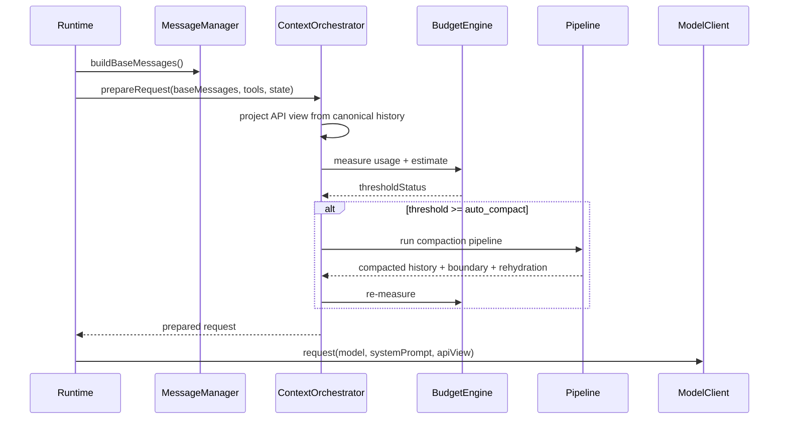
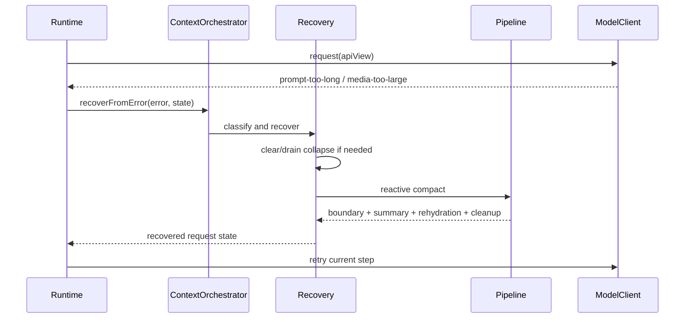
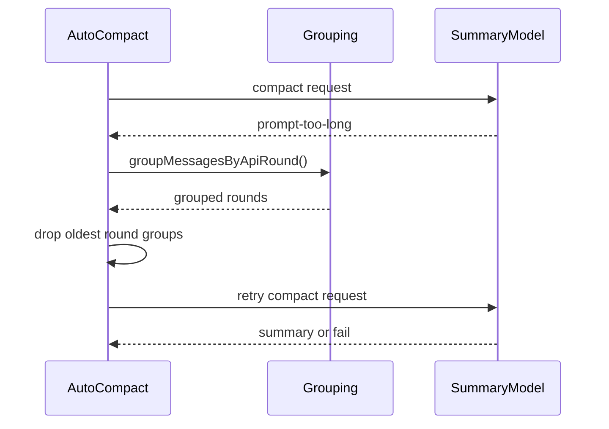
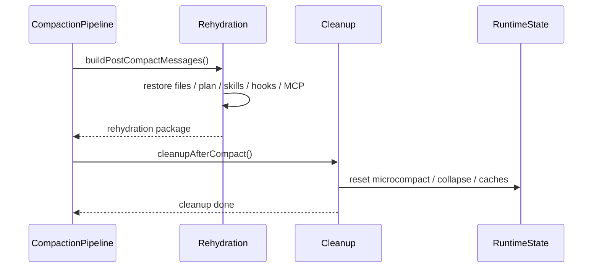
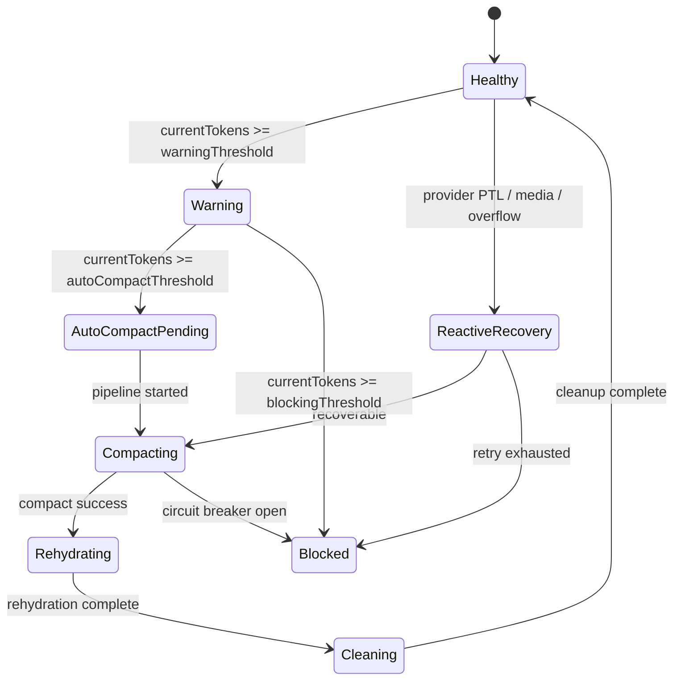

# 08 - 默认参数、时序与验收附录

## 1. 文档目的

本文档把前面设计中分散出现的“默认参数建议、关键时序、状态转移、验收矩阵、故障注入案例”集中到一个附录里，供后续实现、联调、测试、上线前审查统一使用。

如果说前七份文档解决的是“设计是否完整”，那么本附录解决的是“实现是否容易跑偏”。

## 2. 默认配置总表

以下默认值不是要求硬编码，但建议作为 `renx-code-v3` 的第一版默认参数基线。

| 配置项 | 建议默认值 | 说明 |
| --- | --- | --- |
| `reservedOutputTokens` | `min(maxOutputTokens, 20000)` | 输出保留窗口 |
| `warningBufferTokens` | `33000` | 进入 warning 的预警缓冲 |
| `autoCompactBufferTokens` | `13000` | 触发 auto compact 的缓冲 |
| `errorBufferTokens` | `20000` | error 风险区缓冲 |
| `blockingHeadroomTokens` | `3000` | 阻断前必须保留的最小 headroom |
| `maxPromptTooLongRetries` | `3` | 主请求 PTL 重试次数 |
| `maxReactiveCompactAttempts` | `3` | reactive compact 尝试上限 |
| `maxConsecutiveAutocompactFailures` | `3` | 自动压缩熔断阈值 |
| `historySnipMinRecentRounds` | `50` | 默认保留最近轮次 |
| `historySnipMaxDropRounds` | `10` | 单次 snip 最大丢弃轮次数 |
| `maxToolResultChars` | `120000` | 单轮工具结果总字符预算建议值 |
| `maxToolResultCharsPerMessage` | `30000` | 单消息工具结果预算建议值 |
| `recentFilesRehydrateCount` | `5` | 压缩后默认恢复最近文件数 |
| `recentFilesRehydrateBudgetTokens` | `50000` | 最近文件恢复总预算 |
| `recentFileBudgetTokens` | `5000` | 单文件恢复预算 |
| `planRehydrateBudgetTokens` | `5000` | Plan 恢复预算 |
| `skillsRehydrateBudgetTokens` | `25000` | Skills 恢复预算 |

## 3. 阈值计算附录

推荐统一公式：

```ts
const reservedOutputTokens = Math.min(maxOutputTokens, 20000);
const effectiveContextWindow = modelContextWindow - reservedOutputTokens;
const warningThreshold = effectiveContextWindow - warningBufferTokens;
const autoCompactThreshold = effectiveContextWindow - autoCompactBufferTokens;
const errorThreshold = autoCompactThreshold - errorBufferTokens;
const blockingThreshold = effectiveContextWindow - blockingHeadroomTokens;
```

### 3.1 解释

- `warningThreshold` 用于提醒，不应立即触发高成本压缩。
- `autoCompactThreshold` 是主动压缩起点。
- `errorThreshold` 表示即便压缩也可能危险，应收紧预算策略。
- `blockingThreshold` 表示不允许继续发起模型调用。

### 3.2 实现要求

无论 `run()` 还是 `stream()`，都必须使用同一公式和同一配置来源。

## 4. 请求准备时序



## 5. 主请求 PTL 恢复时序



## 6. 压缩请求自身 PTL 时序



## 7. 压缩后恢复与清理时序



## 8. 状态机附录



## 9. 默认数据结构清单

建议在实现中至少具备以下核心结构：

```ts
interface ContextWindowConfig {}
interface ContextRuntimeState {}
interface UsageSnapshot {}
interface ContextThresholdStatus {}
interface ContextBudgetMeasurement {}
interface ApiView {}
interface PreservedSegment {}
interface CompactBoundaryPayload {}
interface CompactSummaryPayload {}
interface ToolResultStorageState {}
interface ContextCollapseState {}
interface RehydrationPackage {}
interface CompactCircuitBreakerState {}
```

如果实现中缺少其中多个核心结构，通常意味着系统已经被过度简化。

## 10. 默认文件落点建议

| 责任 | 推荐文件 |
| --- | --- |
| 编排入口 | `packages/agent/src/context/index.ts` |
| API view 投影 | `packages/agent/src/context/api-view.ts` |
| 预算计算 | `packages/agent/src/context/budget.ts` |
| 阈值判断 | `packages/agent/src/context/thresholds.ts` |
| 分组与安全截断 | `packages/agent/src/context/grouping.ts` |
| Tool result budget | `packages/agent/src/context/tool-result-budget.ts` |
| History snip | `packages/agent/src/context/history-snip.ts` |
| Microcompact | `packages/agent/src/context/microcompact.ts` |
| Context collapse | `packages/agent/src/context/context-collapse.ts` |
| Session memory compact | `packages/agent/src/context/session-memory-compact.ts` |
| Auto compact | `packages/agent/src/context/auto-compact.ts` |
| Recovery | `packages/agent/src/context/recovery.ts` |
| Rehydration | `packages/agent/src/context/rehydration.ts` |
| Cleanup | `packages/agent/src/context/cleanup.ts` |
| Persistence | `packages/agent/src/context/persistence.ts` |
| Prompt formatter | `packages/agent/src/context/summary-prompt.ts` |

## 11. 功能完成定义矩阵

只有同时满足以下条件，某功能才算“完成”，而不是“有个雏形”。

| 功能 | 完成定义 |
| --- | --- |
| 混合 token 计数 | 能消费真实 usage，能处理 response/iteration 回溯，能输出 breakdown |
| API view | 能从最近 boundary 后投影，能应用多层压缩视图 |
| Tool result budget | 能缓存引用替换，能保留配对完整性 |
| History snip | 能按 round group 裁剪，能保护最近尾部 |
| Microcompact | 能每轮执行，能基于热度/时间清理旧结果 |
| Context collapse | 有独立状态，可投影、可清理、可恢复 |
| Session memory compact | 可无 LLM 摘要快速生成 summary + boundary |
| Auto compact | 有 9 段式 prompt、无工具、单轮、格式化输出 |
| Reactive compact | 能处理 provider PTL/media/overflow 错误并重试 |
| Rehydration | 能恢复文件、plan、skills、hooks、MCP 等关键上下文 |
| Cleanup | 能清掉旧投影和缓存，避免压缩后污染 |
| Forked compact | 能使用 cache-safe 单轮 forked agent 摘要路径 |
| Runtime 接入 | `run()`/`stream()` 阈值与恢复行为一致 |

## 12. 验收矩阵

### 12.1 功能验收

| 场景 | 预期结果 |
| --- | --- |
| 普通短对话 | 不触发压缩，不改变现有行为 |
| 长文本对话 | 进入 warning，再进入 auto compact |
| 工具结果堆积 | 先由 tool result budget / microcompact 生效 |
| 大量 JSON 输出 | token 估算使用更高密度系数 |
| 并行工具调用 | 不破坏 tool_use / tool_result / thinking 原子性 |
| 图片/文档消息 | 压缩请求前转换为 `[image]` / `[document]` |
| 主请求 PTL | reactive compact 成功恢复 |
| 摘要请求 PTL | round-group 截断后重试 |
| resume 后继续会话 | 从最近 boundary 正确重建 API view |

### 12.2 非功能验收

| 类别 | 验收要求 |
| --- | --- |
| 可观测性 | 每层压缩有日志和前后 token 统计 |
| 一致性 | `run()` / `stream()` 行为一致 |
| 可恢复性 | checkpoint / resume 不丢边界与状态 |
| 健壮性 | 连续失败达到上限会熔断 |
| 可调优性 | 默认参数集中配置而非散落硬编码 |

## 13. 故障注入清单

建议测试和联调时主动注入以下故障：

1. provider 返回 `CONTEXT_OVERFLOW`
2. provider 返回媒体过大错误
3. stream 结束事件缺少 usage
4. 同一 assistant 响应拆成多条 thinking/text/tool_use chunks
5. tool_result 超长且多次被后续引用
6. compact request 连续 3 次 PTL
7. auto compact 连续失败达到熔断阈值
8. rehydration 恢复文件过大导致二次逼近阈值

## 14. 日志字段标准化

推荐统一以下日志字段：

- `context_window`
- `effective_context_window`
- `current_tokens`
- `remaining_tokens`
- `threshold_level`
- `compaction_layer`
- `tokens_before`
- `tokens_after`
- `provider_response_id`
- `iteration_id`
- `compact_boundary_id`
- `reactive_retry_count`
- `autocompact_failure_count`

## 15. 上线前检查表

上线前必须逐项确认：

1. `run()` 与 `stream()` 已共用同一 prepare/recover 编排。
2. `packages/model/src/types.ts` 已补 usage/response metadata/iteration stats。
3. boundary、summary、preserved segment 已可持久化。
4. PTL 恢复与 compact-request PTL retry 均可运行。
5. rehydration 与 cleanup 已接入。
6. circuit breaker 已生效。
7. 关键测试样例已通过。
8. 日志字段已接入。

## 16. 结论

至此，这套文档不仅描述了上下文管理系统的结构和行为，还补齐了实现默认值、落地文件、关键时序、完成定义、故障注入和上线检查。后续如果实现仍然偏离需求，原因更可能是实现执行问题，而不是文档定义不足。
