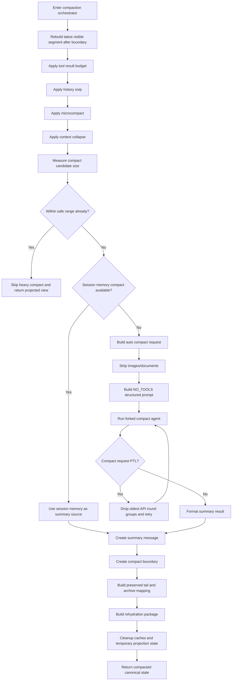
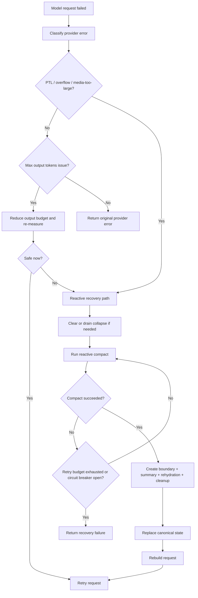
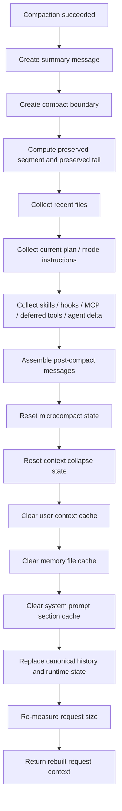
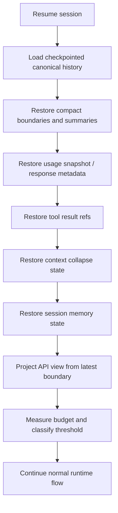

# 09 - 端到端整流程图与决策树

## 1. 文档目的

前面的文档已经把上下文管理系统拆成多个能力模块，但在真正实现和联调时，开发者往往还需要一个“从 runtime 开始，到模型请求、压缩、恢复、回写结束”的整流程视图。

本文档提供：

- 一张完整主流程图
- 三张关键子流程图
- 每个判断节点的详细说明
- 每一步“做什么”和“为什么这么做”

目标是让实现者可以直接拿这份文档做开发顺序、联调脚本、排错路径和 code review 依据。

## 2. 主流程总图

```mermaid
flowchart TD
    A["Start run() / stream()"] --> B["Load runtime state and canonical history"]
    B --> C["Normalize input messages and memory injections"]
    C --> D["Filter allowed tools and build tool definitions"]
    D --> E["Project API view from canonical history"]
    E --> F["Locate latest compact boundary"]
    F --> G["Apply tool result budget projection"]
    G --> H["Apply history snip"]
    H --> I["Apply microcompact"]
    I --> J["Apply context collapse projection"]
    J --> K["Measure context tokens"]
    K --> L{"Has latest usage/iteration stats?"}
    L -- Yes --> M["Use usage + delta estimation"]
    L -- No --> N["Use estimate-only fallback"]
    M --> O["Classify threshold state"]
    N --> O

    O --> P{"Threshold = blocking?"}
    P -- Yes --> P1["Block request and emit blocking event"] --> Z["Return context blocking error"]
    P -- No --> Q{"Threshold >= auto_compact?"}

    Q -- No --> R["Build prepared request"] --> S["Send model request"]
    Q -- Yes --> T["Enter compaction orchestrator"]

    T --> U["Re-project latest visible message segment"]
    U --> V["Apply lightweight layers again for compaction input"]
    V --> W{"Session memory compact available?"}
    W -- Yes --> X["Run session memory compact"]
    W -- No --> Y["Run auto compact summary path"]

    X --> AA["Create summary + compact boundary + preserved tail"]
    Y --> AB["Strip media for compact request"]
    AB --> AC["Build NO_TOOLS structured compact prompt"]
    AC --> AD["Run forked compact agent or equivalent"]
    AD --> AE{"Compact request PTL?"}
    AE -- Yes --> AF["Group messages by API round and truncate oldest groups"] --> AD
    AE -- No --> AG["Format summary output"]
    AG --> AA

    AA --> AH["Build post-compact rehydration package"]
    AH --> AI["Cleanup microcompact/collapse/caches"]
    AI --> AJ["Replace canonical history with compacted state"]
    AJ --> AK["Re-project API view and re-measure"]
    AK --> AL{"Still blocking?"}
    AL -- Yes --> Z
    AL -- No --> R

    S --> AM{"Model request succeeded?"}
    AM -- Yes --> AN["Write assistant response / tool calls / tool results"]
    AN --> AO["Capture provider response id and usage snapshot"]
    AO --> AP["Update API round grouping and access heat"]
    AP --> AQ["Update session memory candidates"]
    AQ --> AR["Persist checkpoint-capable runtime state"]
    AR --> AS["Emit telemetry and finish"]

    AM -- No --> AT["Classify provider error"]
    AT --> AU{"Prompt too long / context overflow / media too large?"}
    AU -- No --> AV{"Max output tokens / output budget issue?"}
    AU -- Yes --> AW["Enter reactive recovery"]
    AV -- Yes --> AX["Reduce output budget and re-measure"]
    AV -- No --> AY["Return original model error"]

    AX --> AZ{"Safe after output budget reduction?"}
    AZ -- Yes --> R
    AZ -- No --> AW

    AW --> BA["Clear or drain context collapse if needed"]
    BA --> BB["Run reactive compact"]
    BB --> BC{"Reactive compact succeeded?"}
    BC -- No --> BD{"Retry budget exhausted or circuit breaker open?"}
    BC -- Yes --> BE["Create boundary + rehydrate + cleanup + replace state"]
    BE --> BF["Retry current step with rebuilt request"]
    BF --> S
    BD -- Yes --> BG["Return recovery failure"]
    BD -- No --> BB
```

## 3. 主流程逐步说明

### 3.1 `Start run() / stream()`

做什么：

- 从 `runtime.ts` 进入当前轮执行。
- 统一进入 context orchestration，而不是直接调 model。

为什么：

- `run()` 和 `stream()` 必须共享同一套上下文预算、压缩、恢复逻辑。
- 如果在入口处不统一，后面一定会出现两个执行分支渐渐漂移。

### 3.2 `Load runtime state and canonical history`

做什么：

- 加载 canonical history。
- 加载上一次 usage snapshot、compact boundary、collapse 状态、tool result refs、session memory。

为什么：

- 上下文管理不是纯函数，它依赖历史状态。
- 没有这些状态，就无法正确重建 API view，也无法做混合 token 计数。

### 3.3 `Normalize input messages and memory injections`

做什么：

- 对当前用户输入、已有消息、memory 注入做规范化。
- 修正基础 tool pair 或消息合法性问题。

为什么：

- 后续所有裁剪和分组都依赖消息结构稳定。
- 如果输入本身结构不一致，后面的 grouping 和 safe-cut 会出错。

### 3.4 `Filter allowed tools and build tool definitions`

做什么：

- 根据 policy、mode、runtime 状态筛选本轮允许使用的工具。
- 生成发送给模型的 tool definitions。

为什么：

- tools 本身也占上下文。
- 不同阈值状态下，工具集合可能需要收紧。

### 3.5 `Project API view from canonical history`

做什么：

- 从 canonical history 投影出本轮 API view，而不是直接拿全量 history。

为什么：

- canonical history 用于持久化与恢复。
- API view 用于请求，允许被压缩、折叠、媒体替换、预算裁剪。

### 3.6 `Locate latest compact boundary`

做什么：

- 找到最近一次 `compact_boundary`，确定本轮视图的逻辑起点。

为什么：

- 多次压缩后，不应该每次都从最早历史重新投影。
- 边界是恢复、resume、继续压缩的核心锚点。

### 3.7 `Apply tool result budget projection`

做什么：

- 对大型 tool_result 做预算裁剪或 `_cacheRef` 替换。

为什么：

- 工具结果常常是上下文爆炸的第一来源。
- 若不先做这一层，会过早进入昂贵的摘要压缩。

### 3.8 `Apply history snip`

做什么：

- 按 API round 丢弃最老的一批安全轮次。

为什么：

- 这是最便宜的减负方式，不需要模型。
- 对近期工作上下文影响最小。

### 3.9 `Apply microcompact`

做什么：

- 对冷却工具结果、旧缓存内容做微压缩。

为什么：

- microcompact 应该是“每轮都可尝试”的保洁层。
- 它能延缓系统进入重型压缩。

### 3.10 `Apply context collapse projection`

做什么：

- 对中间历史片段做可逆折叠投影。

为什么：

- collapse 比摘要更轻，更适合中间历史的可逆收缩。
- 它能减少真正需要丢进 auto compact 的内容量。

### 3.11 `Measure context tokens`

做什么：

- 统计 system prompt、messages、tools、rehydration 的总 token 占用。

为什么：

- 所有后续判断都必须基于统一预算数据，而不是拍脑袋。

### 3.12 `Has latest usage/iteration stats?`

做什么：

- 判断是否有最近真实 usage 或 iteration context tokens 可用。

为什么：

- 有真实 usage 时，预算更接近真实 provider 视图。
- 无真实 usage 时，才退回 estimate-only。

### 3.13 `Classify threshold state`

做什么：

- 把当前预算状态归类为 `healthy`、`warning`、`auto_compact`、`error`、`blocking`。

为什么：

- 上下文管理不是“超了/没超”二元判断。
- 必须有多级阈值，才能支持渐进式处理。

### 3.14 `Threshold = blocking?`

做什么：

- 判断是否已经没有安全 headroom。

为什么：

- 如果已经到 blocking 区，继续请求只会浪费一次 provider 调用。
- 必须在本地提前阻断。

### 3.15 `Threshold >= auto_compact?`

做什么：

- 判断是否需要进入主动压缩流程。

为什么：

- 在 warning 区可先观察，不一定要压缩。
- 到 auto compact 区时，必须主动处理。

## 4. 主请求成功路径说明

### 4.1 `Build prepared request`

做什么：

- 产出最终 API view、threshold status、allowed tools、可选 rehydration package。

为什么：

- 这样 `runtime.ts` 与 context orchestrator 之间就有清晰契约。

### 4.2 `Send model request`

做什么：

- 发起 provider 请求。

为什么：

- 只有经过完整上下文预算与压缩判断后的请求，才允许到达模型层。

### 4.3 `Write assistant response / tool calls / tool results`

做什么：

- 把本轮响应写回 canonical history。

为什么：

- canonical history 是恢复和下一轮投影的来源。

### 4.4 `Capture provider response id and usage snapshot`

做什么：

- 写回 `providerResponseId`、`usage`、`iterationStats`。

为什么：

- 下一轮混合 token 计数必须依赖这些真实数据。

### 4.5 `Update API round grouping and access heat`

做什么：

- 更新 round grouping。
- 更新 tool_result 热度和访问时间。

为什么：

- 后续 history snip、microcompact、PTL retry 都依赖这些状态。

### 4.6 `Update session memory candidates`

做什么：

- 把当前轮对话纳入 session memory 候选提取范围。

为什么：

- 为之后的 session memory compact 快速路径做准备。

### 4.7 `Persist checkpoint-capable runtime state`

做什么：

- 把 boundary、usage snapshot、collapse 状态、tool refs 等写入可 checkpoint 的状态。

为什么：

- 否则 resume 后无法恢复真实上下文管理状态。

## 5. 主动压缩子流程图

## 6. 主动压缩流程详细说明

### 6.1 为什么轻量层要再执行一次

在进入 compaction orchestrator 后，仍然要先跑 tool result budget、history snip、microcompact、collapse，而不是直接调用摘要模型。原因是：

- 这些层可能已经足够把请求拉回安全区。
- 它们成本更低、信息损失更小。
- 压缩输入越小，后续 auto compact 的成本和 PTL 风险越低。

### 6.2 `Session memory compact available?`

做什么：

- 判断是否已有可直接复用的 session memory。

为什么：

- 如果能直接复用，就不应再花一次额外摘要调用。

### 6.3 `Build auto compact request`

做什么：

- 为结构化摘要构造输入视图。

为什么：

- 摘要请求和正常对话请求不是同一个输入规范。
- 必须去掉媒体，禁止工具，只保留与摘要有关的信息。

### 6.4 `Compact request PTL?`

做什么：

- 判断压缩请求自己是否也超长。

为什么：

- 这是实际系统中非常容易被忽略的递归问题。
- 若不处理，会在“超长 -> 请求压缩 -> 压缩请求也超长”中死循环。

### 6.5 `Build preserved tail and archive mapping`

做什么：

- 保留最近尾部消息。
- 为被摘要覆盖的消息建立归档映射。

为什么：

- 压缩不能只留下摘要，必须保留足够的新鲜上下文和恢复锚点。

## 7. 错误恢复子流程图

## 8. 错误恢复详细说明

### 8.1 为什么先分类错误

不同错误必须走不同恢复路径：

- PTL / overflow / media-too-large 需要压缩输入。
- output budget 问题可能先通过降低输出预算解决。
- 其他 provider 错误不应误触发压缩。

### 8.2 为什么要 `Clear or drain collapse`

collapse 是一种投影视图。出现 PTL 时，先清空或排空 collapse 有两个好处：

- 消除旧投影视图带来的状态复杂性。
- 避免 reactive compact 基于过期或二次折叠视图继续工作。

### 8.3 为什么要熔断

如果 reactive compact 或 auto compact 连续失败，还无限重试，会导致：

- 成本浪费
- 延迟失控
- 日志噪音
- 用户体验恶化

因此必须有 `maxConsecutiveAutocompactFailures` 和 retry 上限。

## 9. 压缩后恢复与清理子流程图

## 10. 压缩后恢复详细说明

### 10.1 为什么 rehydration 是必须的

压缩后如果只留下摘要，会丢掉当前工作的局部上下文，例如：

- 最近打开或修改的文件
- 当前计划和步骤
- 当前启用的技能
- hooks、MCP 说明、deferred tools 信息

这些内容不恢复，agent 虽然“没超 token”，但会“不会继续工作”。

### 10.2 为什么 cleanup 要放在 rehydration 之后

因为 cleanup 清掉的是中间投影状态和缓存，而不是要清掉刚刚构造好的 rehydration package。推荐顺序是：

1. 先确定压缩后要恢复什么。
2. 再清理旧投影缓存。
3. 最后用新 canonical state 和 rehydration package 重建请求。

## 11. Resume 流程图

## 12. Resume 说明

resume 不是“把消息数组读回来继续跑”，而是：

- 恢复 canonical history
- 恢复压缩与预算相关状态
- 重新投影 API view
- 再进入正常预算与请求流程

只有这样，恢复后的行为才会与未中断会话一致。

## 13. 完整判断节点清单

实现时必须至少包含以下判断节点：

1. 是否存在最近 compact boundary
2. 是否存在最新 usage 或 iteration stats
3. 当前 threshold 是否为 warning
4. 当前 threshold 是否进入 auto compact
5. 当前 threshold 是否进入 blocking
6. session memory compact 是否可用
7. compact request 是否 PTL
8. provider 错误是否属于 PTL / overflow / media-too-large
9. provider 错误是否属于 output budget 问题
10. reactive compact 是否成功
11. retry budget 是否耗尽
12. circuit breaker 是否打开
13. rehydration 后是否重新进入 blocking
14. resume 时是否能恢复到最近 boundary

如果少掉这些判断中的若干项，整套上下文管理系统就不是完整闭环。

## 14. 建议实现顺序

推荐按下面顺序边写代码边对照这份流程图：

1. 先实现从 `Start run() / stream()` 到 `Classify threshold state`。
2. 再实现主动压缩路径。
3. 然后实现 provider 错误分类与 reactive recovery。
4. 接着实现 rehydration 和 cleanup。
5. 最后接 checkpoint/resume 和 telemetry。

这样最容易形成可运行闭环，也最容易对照每一条分支做测试。

## 15. 结论

本文档给出的不是简化版示意图，而是一份完整的端到端决策流程图。后续开发、调试、code review、测试设计都应以这份流程图为主线，逐节点确认：

- 这一步是否存在
- 输入输出是否清楚
- 判断分支是否完整
- 状态回写是否闭环

只要实现能严格跑通这里的主流程、压缩流程、恢复流程、resume 流程，`renx-code-v3` 的上下文管理系统就能达到与 Claude Code 对齐的完整度。
