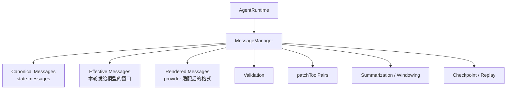
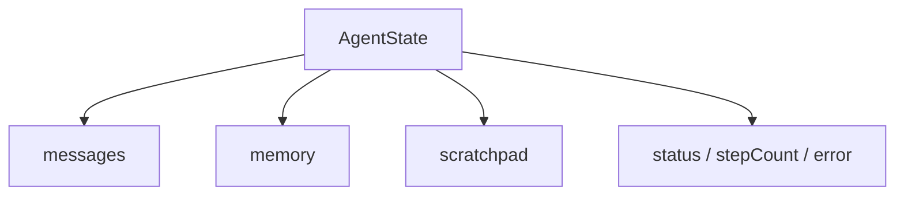
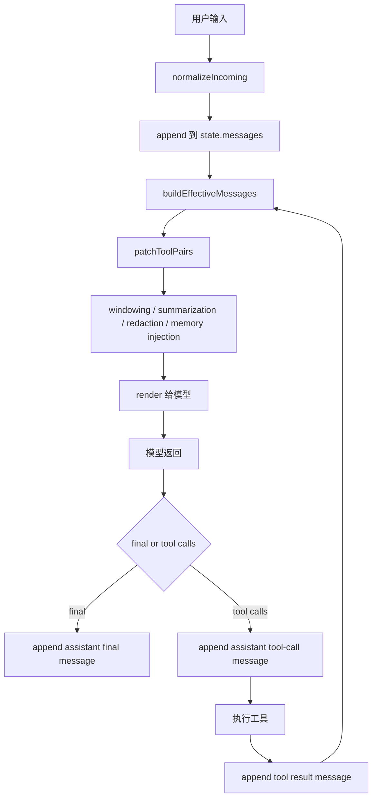
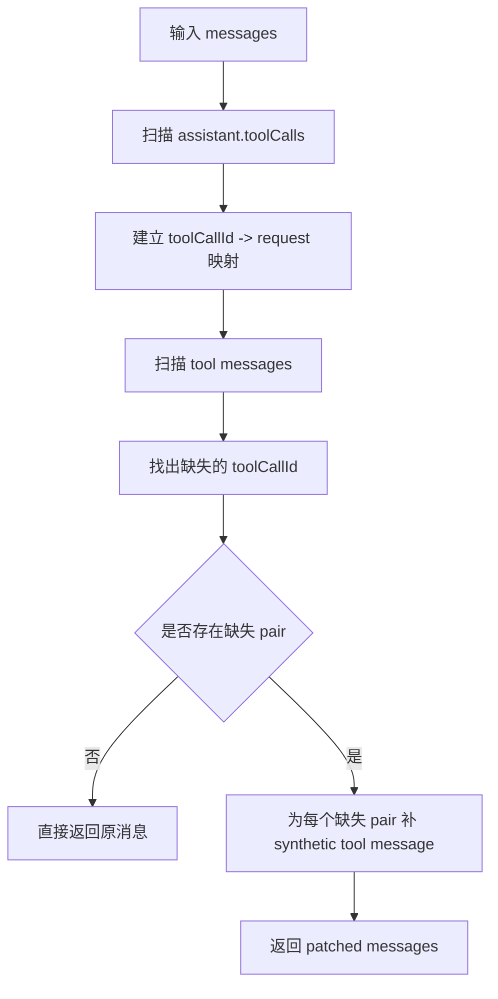
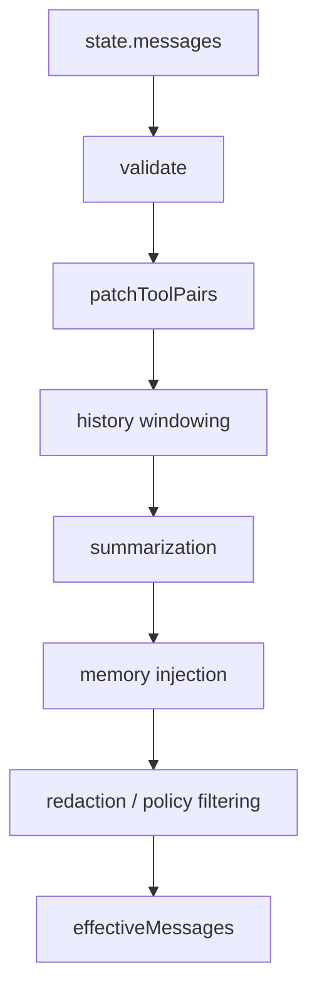
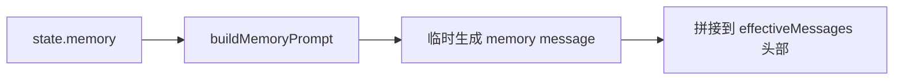
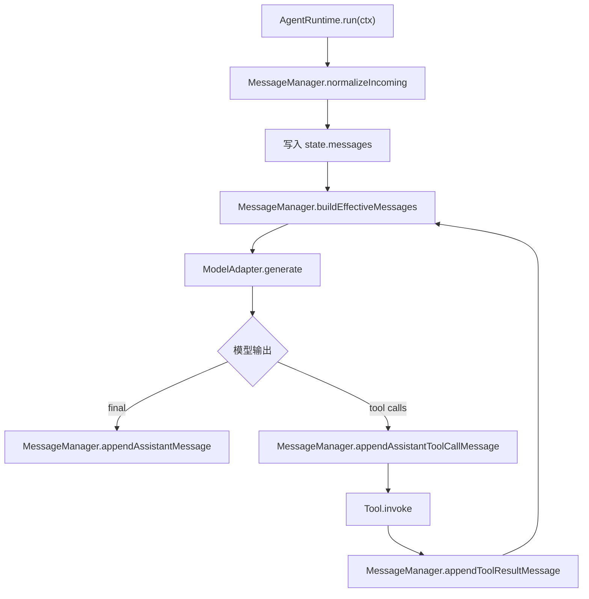
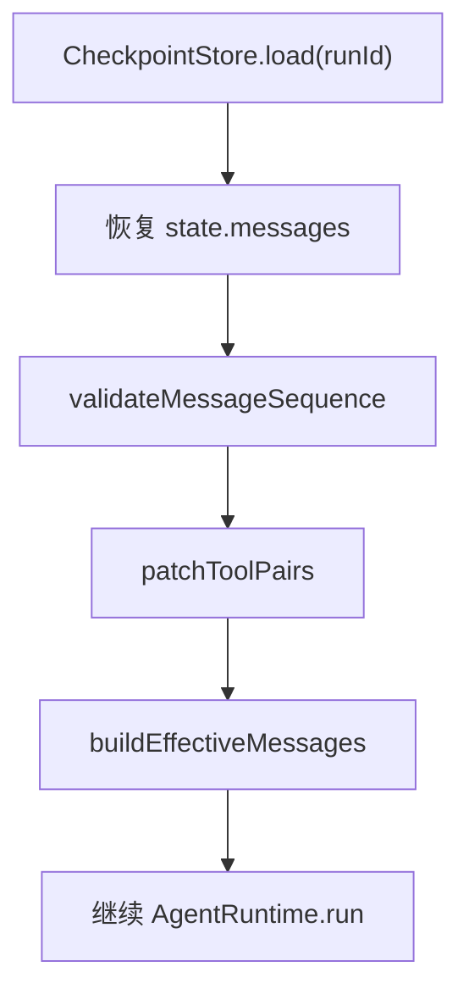

# Agent Message 管理详细设计

本文档专门描述企业 Agent Runtime 中 `message list` 的设计与实现。重点回答两个问题：

1. `message` 在 Agent 里应该如何表示和管理
2. `message list` 如何与 `AgentRuntime`、`Tool`、`Checkpoint`、`Audit`、`Memory` 结合

这份设计文档默认与 [enterprise-agent-base-design.md](/Users/wrr/work/renx-code-v3/enterprise-agent-base-design.md) 配合阅读，但它本身是独立可落地的。

---

## 1. 设计目标

消息管理层的目标不是简单保存一个 `messages: []` 数组，而是建立一套：

- 可恢复
- 可审计
- 可裁剪
- 可摘要
- 可配对修复
- 可适配多模型
- 可支持 tool 调用

的消息基础设施。

### 1.1 必须解决的问题

- 用户输入如何规范化
- 模型输出如何落到消息历史
- tool call 与 tool result 如何配对
- 历史过长时如何窗口化与摘要
- checkpoint 恢复后如何修补半截历史
- provider-specific 消息格式如何隔离
- 审批、中断、失败时消息链如何保持结构合法

### 1.2 非目标

第一版不要求：

- 支持所有 provider 的富媒体原生 block 格式
- 支持任意复杂 DAG 并发消息编排
- 做成完整多模态消息系统

这些可以在消息基础模型稳定后继续演进。

---

## 2. 核心原则

### 2.1 存全量，发窗口

`state.messages` 永远保存规范化后的完整历史；每次发给模型时再从完整历史派生出一个 `effectiveMessages` 窗口。

### 2.2 存规范，发适配

状态里只保存统一内部消息协议，不直接保存 OpenAI/Anthropic/任意 provider 的原始消息结构。

### 2.3 assistant tool request 与 tool result 必须成对

如果模型发起了 tool call，就必须在历史里看得到对应的 tool result；如果真实结果缺失，也必须补一条 synthetic message，保证结构完整。

### 2.4 system prompt 不直接持久化进对话主线

`systemPrompt`、`memory prompt`、`policy prompt` 应在运行时动态注入，不应污染 `state.messages` 的主链。

### 2.5 所有写入都走统一 reducer / patch

不要让业务代码随处 `push`、`splice`、`rewrite` 消息数组。消息变更应该有明确操作和审计边界。

---

## 3. 整体架构



### 3.1 推荐模块划分

- `AgentRuntime`
  - 决定什么时候处理消息
- `MessageManager`
  - 决定怎么处理消息
- `MessageRenderer`
  - 决定如何转为特定模型 SDK 格式
- `MessageReducer`
  - 决定消息变更如何合并

---

## 4. 三层消息视图

企业 Agent 最容易出问题的点之一，是把“存储视图”和“模型视图”混在一起。建议明确分成三层。


### 4.1 Canonical Messages

这是保存在 `AgentState.messages` 里的消息主线。

特点：

- 规范化
- 可恢复
- 可审计
- provider 无关
- 包含 user / assistant / tool 历史

### 4.2 Effective Messages

这是每轮发给模型前的“可见消息窗口”。

特点：

- 从完整历史派生
- 可做裁剪、摘要、脱敏、memory 注入
- 不直接覆盖原始历史

### 4.3 Rendered Messages

这是适配某个模型 SDK 之后的最终请求消息。

特点：

- provider-specific
- 不进 checkpoint
- 不进审计主存储
- 每次请求重新生成

---

## 5. 消息数据模型

## 5.1 基础消息结构

建议采用统一内部协议：

```ts
export type AgentMessageRole =
  | "user"
  | "assistant"
  | "tool";

export interface AgentMessage {
  id: string;
  role: AgentMessageRole;
  content: string;
  createdAt: string;
  name?: string;
  toolCallId?: string;
  metadata?: Record<string, unknown>;
}
```

### 字段说明

- `id`
  - 消息唯一标识
  - 用于去重、审计、恢复、UI 回放
- `role`
  - `user` / `assistant` / `tool`
- `content`
  - 消息主文本
- `createdAt`
  - ISO 时间戳
- `name`
  - 工具消息时可存工具名
- `toolCallId`
  - tool message 与 assistant tool request 配对的关键字段
- `metadata`
  - 扩展字段，如 tokens、summary 标记、toolCalls、redacted 状态等

## 5.2 assistant 工具请求消息

assistant 请求调用工具时，建议也用一条消息记录下来。

```ts
export interface AssistantToolCall {
  id: string;
  name: string;
  input: unknown;
}

export interface AssistantMessageMetadata {
  toolCalls?: AssistantToolCall[];
  summary?: boolean;
  synthetic?: boolean;
  redacted?: boolean;
  [key: string]: unknown;
}
```

assistant 的 tool request 消息示例：

```ts
{
  id: "msg_a1",
  role: "assistant",
  content: "我来查询订单信息。",
  createdAt: "2026-03-31T08:00:00.000Z",
  metadata: {
    toolCalls: [
      { id: "tc_1", name: "get_order", input: { orderId: "123" } }
    ]
  }
}
```

## 5.3 tool 结果消息

```ts
{
  id: "msg_t1",
  role: "tool",
  name: "get_order",
  toolCallId: "tc_1",
  content: "{\"status\":\"paid\"}",
  createdAt: "2026-03-31T08:00:01.000Z"
}
```

### 为什么 tool message 必须带 `toolCallId`

因为这是以下能力的基础：

- 配对校验
- resume 恢复
- UI 展示
- 审计链
- synthetic 补丁

---

## 6. AgentState 中的消息位置

推荐把消息作为 `AgentState` 的核心字段：

```ts
export interface AgentState {
  runId: string;
  threadId?: string;
  messages: AgentMessage[];
  memory: Record<string, unknown>;
  scratchpad: Record<string, unknown>;
  stepCount: number;
  status: "running" | "completed" | "failed" | "interrupted" | "waiting_approval";
  lastModelResponse?: ModelResponse;
  lastToolCall?: ToolCall;
  lastToolResult?: ToolResult;
  error?: AgentError;
}
```

### 为什么消息必须进入 State

因为企业 Agent 的以下能力都依赖消息主线：

- 多轮对话
- 工具调用
- resume / retry
- 审计回放
- 摘要
- UI 展示



---

## 7. MessageManager 设计

建议不要让 `AgentRuntime` 直接处理消息数组细节，而是抽出一个 `MessageManager`。

## 7.1 MessageManager 职责

- 规范化输入消息
- 追加 user / assistant / tool 消息
- 校验消息结构
- 修补 tool pair
- 构建 effectiveMessages
- 历史窗口裁剪
- 摘要消息生成与替换
- provider 渲染前准备

## 7.2 推荐接口

```ts
export interface MessageManager {
  normalizeIncoming(input: AgentInput): AgentMessage[];
  appendUserMessage(state: AgentState, text: string): AgentState;
  appendAssistantMessage(state: AgentState, content: string): AgentState;
  appendAssistantToolCallMessage(
    state: AgentState,
    content: string,
    toolCalls: ToolCall[],
  ): AgentState;
  appendToolResultMessage(
    state: AgentState,
    toolName: string,
    toolCallId: string,
    content: string,
  ): AgentState;
  validate(messages: AgentMessage[]): MessageValidationResult;
  patchToolPairs(messages: AgentMessage[]): PatchToolPairsResult;
  buildEffectiveMessages(ctx: AgentRunContext): AgentMessage[];
}
```

---

## 8. 核心消息生命周期



### 8.1 用户输入阶段

用户输入先进入 `normalizeIncoming`：

- 补 message id
- 补时间戳
- 统一 content 结构
- 清理不需要的 provider 字段

### 8.2 模型调用前

不要直接把 `state.messages` 发给模型，而是先：

1. 修补结构
2. 做窗口裁剪
3. 注入摘要
4. 注入 memory
5. 做安全脱敏

### 8.3 模型产生 tool calls

先写一条 assistant message，记录它做了什么决策，再执行工具。

### 8.4 工具执行后

每个工具结果都应该 append 一条 `tool` message。

### 8.5 模型最终回答

再 append 一条 assistant final message。

---

## 9. 消息变更模型

不要让消息数组随意修改，建议使用 patch / reducer。

## 9.1 状态补丁

```ts
export interface MessageStatePatch {
  appendMessages?: AgentMessage[];
  replaceMessages?: AgentMessage[];
}
```

## 9.2 reducer

```ts
export function applyMessagePatch(
  state: AgentState,
  patch: MessageStatePatch,
): AgentState {
  if (patch.replaceMessages) {
    return {
      ...state,
      messages: patch.replaceMessages,
    };
  }

  if (patch.appendMessages?.length) {
    return {
      ...state,
      messages: [...state.messages, ...patch.appendMessages],
    };
  }

  return state;
}
```

### 为什么不推荐散落的 `push`

因为那会导致：

- 无法统一审计
- 无法回放消息变更
- 无法在恢复时定位是哪一步写坏了历史

---

## 10. normalizeIncoming 设计

## 10.1 作用

把外部输入统一转为内部 `AgentMessage[]`。

## 10.2 处理内容

- 统一 role
- 清洗空内容
- 生成稳定 id
- 补齐 `createdAt`
- 兼容 `inputText` 和 `messages`

## 10.3 推荐实现

```ts
function normalizeIncoming(input: AgentInput): AgentMessage[] {
  if (input.messages?.length) {
    return input.messages.map(normalizeMessage);
  }

  if (input.inputText) {
    return [
      {
        id: crypto.randomUUID(),
        role: "user",
        content: input.inputText,
        createdAt: new Date().toISOString(),
      },
    ];
  }

  return [];
}
```

---

## 11. append 系列操作

## 11.1 appendUserMessage

```ts
appendUserMessage(state, text)
```

负责：

- 新建 user message
- 统一写入消息主线

## 11.2 appendAssistantMessage

```ts
appendAssistantMessage(state, content)
```

用于：

- 最终回答
- 普通 assistant 中间输出

## 11.3 appendAssistantToolCallMessage

```ts
appendAssistantToolCallMessage(state, content, toolCalls)
```

用于：

- 落库模型发起工具调用的决策
- 作为后续 tool pairing 的依据

## 11.4 appendToolResultMessage

```ts
appendToolResultMessage(state, toolName, toolCallId, content)
```

用于：

- 写入工具实际结果
- 与 assistant tool request 对账

---

## 12. validateMessageSequence 设计

消息结构校验应该单独存在，不要等 provider 报错时才知道历史坏了。

## 12.1 目标

检查：

- role 是否合法
- message id 是否唯一
- tool message 是否有 `toolCallId`
- assistant tool request 是否引用了合法 tool call
- tool result 是否能找到对应 request

## 12.2 返回结构

```ts
export interface MessageValidationIssue {
  code:
    | "DUPLICATE_MESSAGE_ID"
    | "INVALID_ROLE"
    | "MISSING_TOOL_CALL_ID"
    | "DANGLING_TOOL_CALL"
    | "ORPHAN_TOOL_RESULT";
  message: string;
  messageId?: string;
  toolCallId?: string;
}

export interface MessageValidationResult {
  valid: boolean;
  issues: MessageValidationIssue[];
}
```

## 12.3 推荐使用时机

- 每轮模型调用前
- checkpoint 恢复后
- 调试模式下每次 patch 之后

---

## 13. patchToolPairs 设计

这是 message 管理层里最关键的修复能力之一。

## 13.1 作用

修补 assistant tool request 与 tool result 不成对的问题。

### 它解决的典型问题

- assistant 已经发起 tool call，但 tool result 还没写入
- tool 执行中断，历史停在半截
- 审批拒绝后，没有真实 tool result
- checkpoint 恢复时，消息链不完整

## 13.2 标准合法结构

```text
user
assistant(toolCalls=[tc1])
tool(toolCallId=tc1)
assistant(final)
```

## 13.3 不完整结构示例

```text
user
assistant(toolCalls=[tc1])
assistant(final)
```

## 13.4 修补策略

1. 扫描所有 assistant message 中的 `toolCalls`
2. 建立 `toolCallId -> request` 映射
3. 扫描所有 tool message
4. 找到缺失的 pair
5. 为缺失项补 synthetic tool message

## 13.5 synthetic tool message 示例

```ts
{
  id: "msg_patch_tc1",
  role: "tool",
  name: "get_order",
  toolCallId: "tc1",
  content: "[Synthetic tool result: missing, interrupted, or rejected]",
  createdAt: new Date().toISOString(),
  metadata: {
    synthetic: true,
    patchReason: "missing_tool_result"
  }
}
```

## 13.6 返回结果

```ts
export interface PatchToolPairsResult {
  messages: AgentMessage[];
  patched: boolean;
  patchedToolCallIds: string[];
}
```

## 13.7 为什么不能跳过这一步

因为不修补会导致：

- 模型上下文不一致
- provider 可能拒绝请求
- resume 失败
- 审计链断裂

## 13.8 patchToolPairs 流程图



## 13.9 推荐实现位置

- `buildEffectiveMessages()` 里
- `resume()` 恢复后
- 审批拒绝路径里

---

## 14. buildEffectiveMessages 设计

`state.messages` 不应该直接发给模型。必须先构造成一份 `effectiveMessages`。

## 14.1 处理目标

- 修补坏历史
- 限制上下文长度
- 摘要旧消息
- 注入 memory
- 做安全脱敏

## 14.2 推荐处理顺序



## 14.3 推荐实现

```ts
function buildEffectiveMessages(ctx: AgentRunContext): AgentMessage[] {
  let messages = [...ctx.state.messages];

  const validation = validateMessageSequence(messages);
  if (!validation.valid) {
    const patched = patchToolPairs(messages);
    messages = patched.messages;
  } else {
    messages = patchToolPairs(messages).messages;
  }

  messages = applyHistoryWindow(messages, {
    maxRecentMessages: 30,
  });

  messages = applySummarization(messages, ctx.state);
  messages = injectMemoryMessages(messages, ctx.state.memory);
  messages = applyRedaction(messages, ctx);

  return messages;
}
```

---

## 15. 历史窗口与摘要策略

上下文过长是所有 Agent 的基础问题，消息层必须承担这部分能力。

## 15.1 历史窗口策略

第一版建议使用简单策略：

- 保留最近 `N` 条消息
- 对更早的历史用一条 summary message 代替

## 15.2 summary message 设计

```ts
{
  id: "msg_summary_1",
  role: "assistant",
  content: "此前对话摘要：用户询问了订单、退款和发票问题，已经查到订单 123 已支付。",
  createdAt: new Date().toISOString(),
  metadata: {
    summary: true,
    summarizedMessageIds: ["m1", "m2", "m3"]
  }
}
```

### 注意

summary message 也是 canonical message 的一部分，但它应明确打上 `summary: true` 标记。

## 15.3 摘要与完整历史的关系

推荐做法：

- `state.messages` 中保留 summary 替代项
- 原始全量历史可进入单独归档存储
- checkpoint 主状态只保留必要上下文

这样能平衡：

- 恢复能力
- 上下文长度
- 存储成本

---

## 16. Memory 与消息的结合

memory 不建议直接无脑拼进 `state.messages`。

推荐做法是：

- `state.memory` 保存结构化 memory
- 在 `buildEffectiveMessages()` 阶段动态注入 memory message

## 16.1 memory 注入示意



## 16.2 好处

- memory 可独立更新
- 不污染持久化主消息链
- 更容易控制安全边界
- 更适合多租户动态上下文

---

## 17. 与 AgentRuntime 的结合方式

这是这份文档最核心的部分。

## 17.1 角色划分

### `AgentRuntime`

负责：

- 决定什么时候读取消息
- 决定什么时候写入消息
- 在模型/工具阶段调用 MessageManager

### `MessageManager`

负责：

- 决定如何追加
- 决定如何修补
- 决定如何构造 effectiveMessages

## 17.2 结合流程



## 17.3 runtime 里的推荐调用点

### 在 invoke 开始时

```ts
const incoming = messageManager.normalizeIncoming(input);
ctx.state = applyMessagePatch(ctx.state, { appendMessages: incoming });
```

### 在模型调用前

```ts
const effectiveMessages = messageManager.buildEffectiveMessages(ctx);
```

### 在模型返回 tool calls 后

```ts
ctx.state = messageManager.appendAssistantToolCallMessage(
  ctx.state,
  modelResp.thought ?? "",
  modelResp.toolCalls,
);
```

### 在工具执行后

```ts
ctx.state = messageManager.appendToolResultMessage(
  ctx.state,
  tool.name,
  call.id,
  toolResult.content,
);
```

### 在模型最终回答后

```ts
ctx.state = messageManager.appendAssistantMessage(
  ctx.state,
  modelResp.output,
);
```

---

## 18. 与 Checkpoint 的结合

消息历史是 checkpoint 的核心载荷之一。

## 18.1 保存策略

建议在以下节点保存：

- 用户输入追加后
- assistant tool-call 消息追加后
- tool result 消息追加后
- assistant final 消息追加后
- summary 替换后

## 18.2 恢复策略

恢复后先不要立刻调用模型，而是：

1. 读取 `state.messages`
2. 执行 `validateMessageSequence`
3. 执行 `patchToolPairs`
4. 再构造 `effectiveMessages`

## 18.3 resume 流程图



---

## 19. 与 Audit 的结合

审计层不应该只记录最终输出，也应该记录消息变更关键点。

## 19.1 推荐审计事件

- `message_appended`
- `message_sequence_patched`
- `message_summarized`
- `message_window_built`
- `message_redacted`

## 19.2 推荐审计内容

- `runId`
- `messageId`
- `role`
- `toolCallId`
- 是否 synthetic
- 是否 summary
- 原因描述

### 特别建议

如果发生 `patchToolPairs`，强烈建议写一条审计记录，因为这意味着历史链发生过不完整或中断。

---

## 20. MessageRenderer 设计

消息管理层与模型适配层之间，建议再多一层 `MessageRenderer`。

## 20.1 职责

- 将 `effectiveMessages` 转为 provider-specific 格式
- 注入 system prompt
- 处理工具 schema 渲染
- 保持状态层与 SDK 解耦

## 20.2 接口建议

```ts
export interface MessageRenderer<TProviderMessage = unknown> {
  render(
    systemPrompt: string,
    messages: AgentMessage[],
    tools: ToolDefinition[],
  ): TProviderMessage[];
}
```

### 为什么要单独一层

因为否则你会把：

- SDK 消息格式
- runtime 逻辑
- 内部消息协议

三者混在一起，后面很难维护。

---

## 21. 并发与子任务场景

如果后面做并发子任务，消息管理要提前考虑：

- 主线消息与子任务消息是否混存
- 子任务是否有独立 message list
- 子任务结果如何回写主线

### 推荐第一版策略

- 每个子任务有独立 `messages`
- 子任务只回写一条归纳后的 assistant/tool message 给主线程

不要第一版就把多个子任务的细碎消息直接并到主线，会很快失控。

---

## 22. 常见失败场景与处理策略

## 22.1 模型发出 tool call 后程序崩溃

处理：

- 恢复 checkpoint
- 执行 `patchToolPairs`
- 补 synthetic tool message
- 再继续模型循环或进入人工处理

## 22.2 tool 已执行成功，但结果没来得及 append

处理：

- 审计里如果有成功记录，可补写真实 tool message
- 否则补 synthetic result 并标注缺失

## 22.3 审批拒绝

处理：

- 不执行真实 tool
- 写 synthetic tool message
- `metadata.patchReason = approval_rejected`

## 22.4 历史太长

处理：

- 归档旧历史
- 写 summary message
- 保留最近窗口

---

## 23. 参考实现骨架

## 23.1 MessageManager 类

```ts
export class DefaultMessageManager implements MessageManager {
  normalizeIncoming(input: AgentInput): AgentMessage[] {
    if (input.messages?.length) {
      return input.messages.map((m) => this.normalizeMessage(m));
    }
    if (input.inputText) {
      return [this.createUserMessage(input.inputText)];
    }
    return [];
  }

  appendUserMessage(state: AgentState, text: string): AgentState {
    return applyMessagePatch(state, {
      appendMessages: [this.createUserMessage(text)],
    });
  }

  appendAssistantMessage(state: AgentState, content: string): AgentState {
    return applyMessagePatch(state, {
      appendMessages: [this.createAssistantMessage(content)],
    });
  }

  appendAssistantToolCallMessage(
    state: AgentState,
    content: string,
    toolCalls: ToolCall[],
  ): AgentState {
    return applyMessagePatch(state, {
      appendMessages: [
        {
          id: crypto.randomUUID(),
          role: "assistant",
          content,
          createdAt: new Date().toISOString(),
          metadata: { toolCalls },
        },
      ],
    });
  }

  appendToolResultMessage(
    state: AgentState,
    toolName: string,
    toolCallId: string,
    content: string,
  ): AgentState {
    return applyMessagePatch(state, {
      appendMessages: [
        {
          id: crypto.randomUUID(),
          role: "tool",
          name: toolName,
          toolCallId,
          content,
          createdAt: new Date().toISOString(),
        },
      ],
    });
  }

  validate(messages: AgentMessage[]): MessageValidationResult {
    return validateMessageSequence(messages);
  }

  patchToolPairs(messages: AgentMessage[]): PatchToolPairsResult {
    return patchToolPairs(messages);
  }

  buildEffectiveMessages(ctx: AgentRunContext): AgentMessage[] {
    let messages = [...ctx.state.messages];
    messages = this.patchToolPairs(messages).messages;
    messages = applyHistoryWindow(messages, { maxRecentMessages: 30 });
    messages = injectMemoryMessages(messages, ctx.state.memory);
    return messages;
  }

  private normalizeMessage(message: AgentMessage): AgentMessage {
    return {
      ...message,
      id: message.id || crypto.randomUUID(),
      createdAt: message.createdAt || new Date().toISOString(),
      metadata: message.metadata ?? {},
    };
  }

  private createUserMessage(text: string): AgentMessage {
    return {
      id: crypto.randomUUID(),
      role: "user",
      content: text,
      createdAt: new Date().toISOString(),
    };
  }

  private createAssistantMessage(text: string): AgentMessage {
    return {
      id: crypto.randomUUID(),
      role: "assistant",
      content: text,
      createdAt: new Date().toISOString(),
    };
  }
}
```

---

## 24. 文件划分建议

```text
src/agent/messages/
  types.ts
  reducer.ts
  manager.ts
  validator.ts
  patch-tool-pairs.ts
  effective.ts
  summarizer.ts
  renderer.ts
```

### 推荐实现顺序

1. `types.ts`
2. `reducer.ts`
3. `validator.ts`
4. `patch-tool-pairs.ts`
5. `manager.ts`
6. `effective.ts`
7. `renderer.ts`
8. `summarizer.ts`

---

## 25. 总结

message 管理层不是一个简单数组，而是企业 Agent Runtime 的核心基础设施。

最推荐的设计是：

- `state.messages` 保存 canonical history
- `MessageManager` 统一处理追加、校验、修补、窗口化
- `buildEffectiveMessages()` 负责模型视图构建
- `MessageRenderer` 负责 provider 适配
- `patchToolPairs()` 保证工具调用链结构完整
- `Checkpoint` 与 `Audit` 围绕消息主线做恢复和追踪

一句话总结：

**让消息成为 AgentState 的主线，让 MessageManager 管消息结构，让 AgentRuntime 驱动消息生命周期。**

---

## 26. 下一步建议

如果继续落代码，最合理的顺序是：

1. `src/agent/messages/types.ts`
2. `src/agent/messages/reducer.ts`
3. `src/agent/messages/validator.ts`
4. `src/agent/messages/patch-tool-pairs.ts`
5. `src/agent/messages/manager.ts`
6. `src/agent/messages/effective.ts`

等这 6 个文件稳定后，再接入：

- `runtime.ts`
- `checkpoint.ts`
- `audit.ts`
- `renderer.ts`
