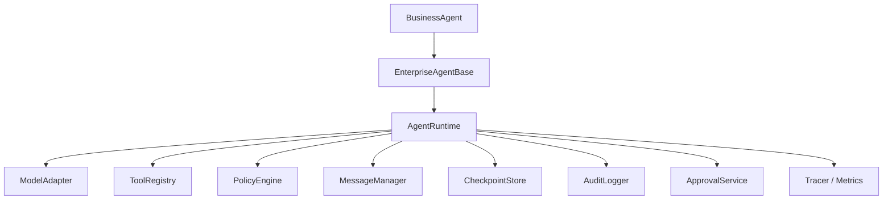
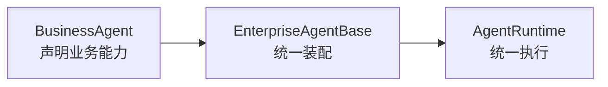
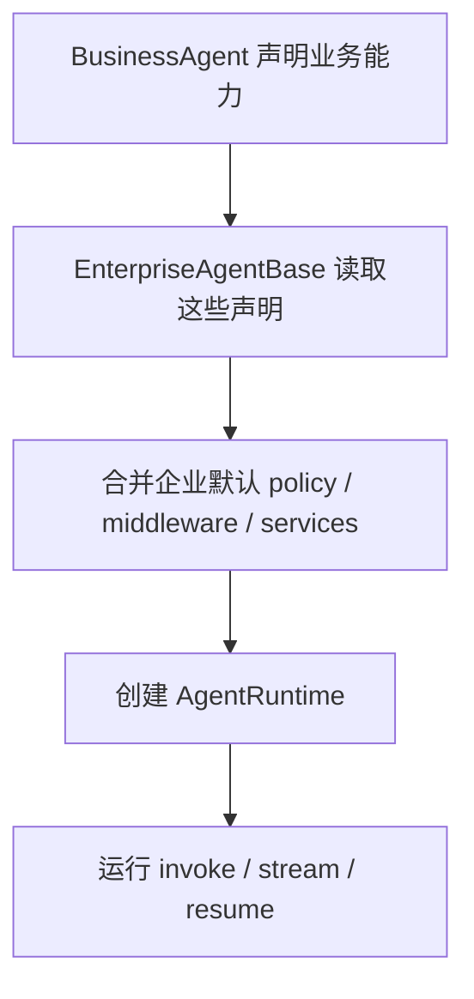
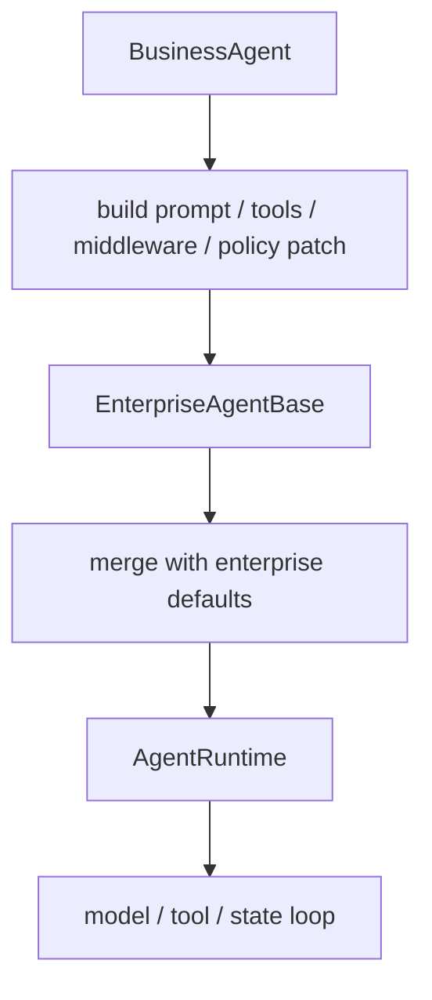
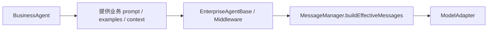
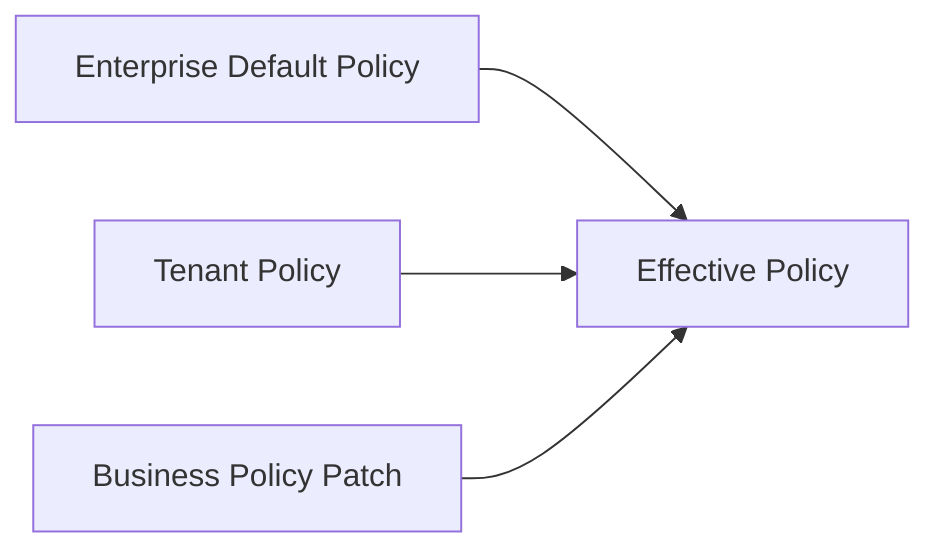

# BusinessAgent 详细设计

本文档详细定义企业 Agent 架构中的 `BusinessAgent` 设计方式。重点不是描述一个“能调用模型的类”，而是定义：

- `BusinessAgent` 在整体架构中的准确职责
- 它和 `EnterpriseAgentBase`、`AgentRuntime`、`PolicyEngine`、`MessageManager` 的边界
- 它应该如何声明业务能力，而不是承担执行职责
- 它如何在企业场景中保持可复用、可治理、可审计、可扩展

本文档默认与以下文档一起构成完整设计：

- [enterprise-agent-base-design.md](/Users/wrr/work/renx-code-v3/enterprise-agent-base-design.md)
- [agent-message-management-design.md](/Users/wrr/work/renx-code-v3/agent-message-management-design.md)
- [provider-model-adapter-error-design.md](/Users/wrr/work/renx-code-v3/provider-model-adapter-error-design.md)

---

## 1. 为什么需要 BusinessAgent

在企业 Agent 架构里，最容易失控的地方是把下面几类逻辑混在一个类里：

- 业务意图定义
- 模型调用
- 工具调度
- 权限控制
- checkpoint / 审计
- runtime loop
- 错误处理

一旦混在一起，就会出现：

- 业务 Agent 各自复制一套运行逻辑
- 企业治理能力无法统一收口
- 各 Agent 风格不一致
- 很难做统一审批、审计、观测
- 新增一个业务 Agent 成本很高

`BusinessAgent` 的目的，就是把“业务能力声明”和“底层执行治理”分开。

一句话：

> `BusinessAgent` 不是执行引擎，而是业务声明层。

---

## 2. 在整体架构中的位置



### 2.1 三层职责

#### `BusinessAgent`

业务层负责：

- 业务系统提示词
- 业务工具集合
- 业务输出格式
- 业务专用中间件
- 业务上下文声明
- 业务级策略增量

#### `EnterpriseAgentBase`

模板层负责：

- 构造运行上下文
- 注入统一企业治理能力
- 合并业务配置与企业配置
- 创建 runtime
- 提供标准入口：`invoke / stream / resume`

#### `AgentRuntime`

执行层负责：

- 推理循环
- 模型调用
- 工具调用调度
- 状态推进
- 中间件调度
- 权限校验
- checkpoint / audit / event 记录

---

## 3. BusinessAgent 的准确定位

最准确的定义是：

> `BusinessAgent` 是“业务能力声明层 + 业务边界定义层”，不是“运行时执行层”。

这意味着它的责任是：

- 定义这个 Agent 的业务身份
- 定义这个 Agent 的领域提示词
- 定义它能使用的业务工具
- 定义业务特有的中间件
- 定义业务输出契约
- 定义业务级限制和 guardrails

而不是：

- 自己管理 state
- 自己做 tool 调度
- 自己决定 retry/fallback
- 自己解析 provider 响应
- 自己写 checkpoint

---

## 4. BusinessAgent 负责什么

## 4.1 业务身份

每个 BusinessAgent 都应该有明确的业务身份。

例如：

- `finance-analyst`
- `support-agent`
- `ops-agent`
- `legal-assistant`
- `sales-assistant`

推荐提供：

- `businessId`
- `businessName`
- `businessDescription`

这些字段可用于：

- 路由
- 审计
- UI 展示
- 观测标签
- agent registry

## 4.2 业务系统提示词

BusinessAgent 必须定义自己的业务系统提示词。

它应该说明：

- 这个 Agent 的职责是什么
- 可以回答什么
- 不能回答什么
- 如何表达不确定性
- 领域术语如何使用
- 哪些场景必须依赖工具而不能臆断

### 系统提示词建议只放业务规则

例如：

- 财务 Agent：不能编造数字，结论需标注口径
- 客服 Agent：不能杜撰工单结果
- 运维 Agent：高风险动作必须先说明风险

而下面这些不应该主要在 BusinessAgent prompt 里做：

- 企业统一安全策略
- 通用权限控制
- 平台级审计规范

这些属于更上层的企业治理。

## 4.3 业务工具集合

BusinessAgent 要明确声明它需要哪些工具。

例如：

- 财务 Agent：报表查询、预算读取、BI 数据查询
- 客服 Agent：FAQ 搜索、工单查询、客户资料查询
- 运维 Agent：监控查询、日志检索、执行审批请求

### 重要原则

BusinessAgent 只声明工具集合，不直接执行工具调度。

也就是说：

- `buildTools()` 属于 BusinessAgent
- tool 执行顺序、异常处理、结果回写 属于 Runtime

## 4.4 业务输出格式

BusinessAgent 应该能够声明输出契约。

输出格式可能是：

- 纯文本
- JSON schema
- 某种领域结构化对象
- 报告式结构

例如：

- 财务分析结果：`summary / risks / recommendations`
- 客服答复结果：`answer / suggested_next_step / escalation_needed`
- 运维结果：`summary / root_cause / impact / action_items`

## 4.5 业务专用中间件

BusinessAgent 可以声明业务专用中间件。

例如：

- 财务术语规范化 middleware
- PII masking middleware
- 客服语气规范 middleware
- SQL read-only hint middleware
- 领域上下文注入 middleware

### 原则

这些中间件应该是：

- 业务领域相关
- 不破坏运行时主循环
- 不替代企业级治理中间件

## 4.6 业务上下文

BusinessAgent 应该能声明业务上下文。

例如：

- 当前客户 ID
- 当前工单 ID
- 当前组织/部门
- 当前财务期间
- 当前项目空间

这部分上下文不建议直接混进原始 message list，而应通过：

- metadata
- business context
- prompt injection
- middleware

的方式接入。

## 4.7 业务 guardrails

BusinessAgent 可以定义领域 guardrails：

- 财务 Agent 不允许做模糊估算
- 客服 Agent 必须先查知识库再答
- 运维 Agent 对生产写操作必须先确认

这些 guardrails 更像“业务约束”，介于 prompt 和 policy 之间。

---

## 5. BusinessAgent 不负责什么

这部分边界非常关键。

BusinessAgent 不应该负责：

- 推理循环
- tool orchestration
- 消息管理主流程
- checkpoint 保存与恢复
- 审计主链路
- 通用重试
- provider 协议适配
- 模型接口调用
- JWT / Session / mTLS 解析
- 通用权限框架

换句话说，BusinessAgent 不应该成为“半个 Runtime”。

---

## 6. 最推荐的设计方式

## 6.1 模板方法 + 声明式扩展

推荐方式是：

- `BusinessAgent` 继承 `EnterpriseAgentBase`
- BusinessAgent 只覆写“业务声明方法”
- EnterpriseAgentBase 负责把这些声明装配成可运行实例



### 好处

- 业务代码非常集中
- 企业治理统一收口
- Runtime 不会被不同业务 agent 污染
- 业务 Agent 易测、易复用、易注册

---

## 7. 推荐抽象接口

下面是一组比较稳定的 BusinessAgent 抽象接口。

## 7.1 核心抽象

```ts
export abstract class BusinessAgent extends EnterpriseAgentBase {
  protected abstract getBusinessId(): string;
  protected abstract getBusinessName(): string;
  protected abstract buildSystemPrompt(
    ctx: AgentRunContext,
  ): Promise<string> | string;
  protected abstract buildTools(
    ctx: AgentRunContext,
  ): Promise<AgentTool[]> | AgentTool[];

  protected buildBusinessDescription(): string {
    return "";
  }

  protected buildOutputSchema(): unknown | undefined {
    return undefined;
  }

  protected buildBusinessContext(
    _ctx: AgentRunContext,
  ): Record<string, unknown> {
    return {};
  }

  protected buildBusinessMiddleware(
    _ctx: AgentRunContext,
  ): AgentMiddleware[] {
    return [];
  }

  protected buildBusinessPolicy(
    _ctx: AgentRunContext,
  ): PartialBusinessPolicy | undefined {
    return undefined;
  }

  protected buildExamples(
    _ctx: AgentRunContext,
  ): string[] {
    return [];
  }

  protected buildGuardrails(
    _ctx: AgentRunContext,
  ): string[] {
    return [];
  }

  protected buildBusinessTags(
    _ctx: AgentRunContext,
  ): string[] {
    return [];
  }

  protected supports(
    _ctx: AgentRunContext,
  ): boolean {
    return true;
  }
}
```

---

## 8. 每个方法的详细职责

## 8.1 `getBusinessId()`

返回稳定的业务标识。

要求：

- 全局唯一
- 稳定不变
- 不依赖运行时输入

用途：

- registry key
- 审计标签
- 路由选择
- metrics 标签

## 8.2 `getBusinessName()`

返回人类可读名称。

用途：

- UI 展示
- 文档
- 观测面板

## 8.3 `buildSystemPrompt(ctx)`

产出业务层系统提示词。

建议包含：

- 业务职责
- 业务边界
- 领域术语要求
- 不确定时如何表达
- 何时必须调用工具

不建议包含：

- 通用安全审计条款
- 全平台认证约束
- 重试规则
- checkpoint 规则

## 8.4 `buildTools(ctx)`

返回此业务 Agent 的工具集合。

要求：

- 只返回业务可见工具
- 不直接在这里做权限判断
- 不在这里执行工具

权限判断应交给 `PolicyEngine`。

## 8.5 `buildOutputSchema()`

返回输出契约。

可选类型：

- `undefined`：纯文本输出
- JSON schema
- typed object schema

建议让基类统一把这个 schema 交给 Runtime/OutputValidator。

## 8.6 `buildBusinessContext(ctx)`

构造业务上下文。

例如：

- 当前客户信息
- 当前组织/项目
- 当前工单
- 当前会计期间

这部分应该是结构化的，不建议直接拼成自然语言字符串。

## 8.7 `buildBusinessMiddleware(ctx)`

声明业务专用中间件。

适合放这里的：

- 领域术语补充
- 风格与语气约束
- 业务上下文注入
- 特定领域脱敏

不适合放这里的：

- 通用审计
- 通用 checkpoint
- 通用 retry
- provider fallback

## 8.8 `buildBusinessPolicy(ctx)`

返回业务级 policy patch，而不是完整 policy 重写。

例如：

- 禁止某些工具
- 某些工具强制审批
- 特定业务最大 steps

建议返回“增量配置”，再由基类和企业默认 policy 合并。

## 8.9 `buildExamples(ctx)`

返回业务级 few-shot 示例。

用途：

- 规范输出结构
- 规范工具使用时机
- 减少业务风格漂移

## 8.10 `buildGuardrails(ctx)`

返回业务 guardrails。

例如：

- 不能编造数据
- 不能越权解释未授权内容
- 必须先查工具再回答

## 8.11 `buildBusinessTags(ctx)`

返回业务标签。

例如：

- `finance`
- `customer-support`
- `production-ops`

用于：

- 审计
- tracing
- metrics
- 路由与面板筛选

## 8.12 `supports(ctx)`

声明该 BusinessAgent 是否适合处理当前请求。

这是未来做 agent router 时非常有价值的能力。

---

## 9. BusinessAgent 与 EnterpriseAgentBase 的结合

推荐让 `EnterpriseAgentBase` 统一装配，而 BusinessAgent 只负责声明。

## 9.1 结合方式



## 9.2 最核心的装配逻辑

BusinessAgent 不直接 new Runtime，而是调用基类装配入口。

### 推荐骨架

```ts
export abstract class BusinessAgent extends EnterpriseAgentBase {
  protected override async createRuntime(
    ctx: AgentRunContext,
  ): Promise<AgentRuntime> {
    const systemPrompt = await this.buildSystemPrompt(ctx);
    const tools = await this.buildTools(ctx);
    const outputSchema = this.buildOutputSchema();
    const businessContext = this.buildBusinessContext(ctx);
    const middleware = this.buildBusinessMiddleware(ctx);
    const businessPolicy = this.buildBusinessPolicy(ctx);

    return this.createEnterpriseRuntime({
      ctx,
      businessId: this.getBusinessId(),
      businessName: this.getBusinessName(),
      businessDescription: this.buildBusinessDescription(),
      systemPrompt,
      tools,
      middleware,
      businessPolicy,
      outputSchema,
      businessContext,
      examples: this.buildExamples(ctx),
      guardrails: this.buildGuardrails(ctx),
      tags: this.buildBusinessTags(ctx),
    });
  }
}
```

### 设计意义

这样做之后：

- 业务层没有运行时耦合
- 企业层保留装配主导权
- Runtime 仍然是统一的

---

## 10. BusinessAgent 与 AgentRuntime 的结合

## 10.1 Runtime 不应理解业务细节

Runtime 只应看到：

- systemPrompt
- tools
- middleware
- effective policy
- output schema
- business metadata/tags

而不应看到“这是财务 Agent 还是客服 Agent”的具体 if/else 逻辑。

## 10.2 结合流程



## 10.3 Runtime 读取 BusinessAgent 的哪些产物

Runtime 应该读取：

- 最终 `systemPrompt`
- 最终可用工具集
- 最终合并的 policy
- 最终 middleware 列表
- output schema
- tags / metadata

---

## 11. BusinessAgent 与 Message 管理的结合

BusinessAgent 不应该直接管理 message list，但它会影响 message 的构造方式。

## 11.1 影响点

BusinessAgent 可以影响：

- system prompt 的内容
- examples 注入
- business context 注入
- guardrails 注入

这些最终会在 `buildEffectiveMessages()` 或 prompt/render 阶段进入模型请求。

## 11.2 不建议的做法

不要让 BusinessAgent：

- 直接 append message
- 直接 patch tool pair
- 直接做摘要
- 直接做消息裁剪

这些应该由 `MessageManager` 统一处理。

## 11.3 正确关系



---

## 12. BusinessAgent 与 PolicyEngine 的结合

BusinessAgent 可以声明业务默认限制，但不应该完全接管 policy。

## 12.1 推荐方式：Policy Patch

```ts
export interface PartialBusinessPolicy {
  allowToolNames?: string[];
  denyToolNames?: string[];
  requireApprovalToolNames?: string[];
  maxSteps?: number;
  outputRedactionLevel?: "low" | "medium" | "high";
}
```

### 为什么是 patch

因为企业治理必须统一收口，不能让每个业务 Agent 随意重写整套权限系统。

## 12.2 合并顺序建议



### 推荐优先级

从低到高：

1. enterprise default
2. tenant override
3. business patch
4. runtime urgent override

---

## 13. BusinessAgent 与周边服务的结合

BusinessAgent 通常不直接控制周边服务，但可以影响服务的使用方式。

### `ModelAdapter`

BusinessAgent 一般不应直接选厂商协议细节，但可以：

- 指定推荐模型档位
- 指定是否允许 fallback
- 指定输出模式

### `ToolRegistry`

BusinessAgent 可以通过 `buildTools()` 选择业务工具。

### `CheckpointStore`

BusinessAgent 不直接写 checkpoint。

### `AuditLogger`

BusinessAgent 不直接写主审计流程，但可以提供 tags / businessId。

### `ApprovalService`

BusinessAgent 不直接驱动审批主流程，但可以通过 policy patch 声明哪些工具需要审批。

### `Tracer/Metrics`

BusinessAgent 可提供 tags，但不要直接埋运行时 span 主逻辑。

---

## 14. 推荐的 BusinessAgent 基础类型

## 14.1 推荐上下文补充类型

```ts
export interface BusinessAgentDefinition {
  businessId: string;
  businessName: string;
  description?: string;
  outputSchema?: unknown;
  tags?: string[];
}
```

## 14.2 推荐配置聚合

```ts
export interface BusinessRuntimeConfig {
  definition: BusinessAgentDefinition;
  systemPrompt: string;
  tools: AgentTool[];
  middleware: AgentMiddleware[];
  businessPolicy?: PartialBusinessPolicy;
  businessContext?: Record<string, unknown>;
  examples?: string[];
  guardrails?: string[];
}
```

这样 EnterpriseAgentBase 在装配时就很清晰：

- 业务 agent 先产出 `BusinessRuntimeConfig`
- 基类再合并企业层默认能力

---

## 15. 推荐实现模板

## 15.1 BusinessAgent 抽象类

```ts
export abstract class BusinessAgent extends EnterpriseAgentBase {
  protected abstract getBusinessId(): string;
  protected abstract getBusinessName(): string;

  protected buildBusinessDescription(): string {
    return "";
  }

  protected abstract buildSystemPrompt(
    ctx: AgentRunContext,
  ): Promise<string> | string;

  protected abstract buildTools(
    ctx: AgentRunContext,
  ): Promise<AgentTool[]> | AgentTool[];

  protected buildOutputSchema(): unknown | undefined {
    return undefined;
  }

  protected buildBusinessContext(
    _ctx: AgentRunContext,
  ): Record<string, unknown> {
    return {};
  }

  protected buildBusinessMiddleware(
    _ctx: AgentRunContext,
  ): AgentMiddleware[] {
    return [];
  }

  protected buildBusinessPolicy(
    _ctx: AgentRunContext,
  ): PartialBusinessPolicy | undefined {
    return undefined;
  }

  protected buildExamples(_ctx: AgentRunContext): string[] {
    return [];
  }

  protected buildGuardrails(_ctx: AgentRunContext): string[] {
    return [];
  }

  protected buildBusinessTags(_ctx: AgentRunContext): string[] {
    return [];
  }

  protected supports(_ctx: AgentRunContext): boolean {
    return true;
  }

  protected async buildBusinessRuntimeConfig(
    ctx: AgentRunContext,
  ): Promise<BusinessRuntimeConfig> {
    return {
      definition: {
        businessId: this.getBusinessId(),
        businessName: this.getBusinessName(),
        description: this.buildBusinessDescription(),
        outputSchema: this.buildOutputSchema(),
        tags: this.buildBusinessTags(ctx),
      },
      systemPrompt: await this.buildSystemPrompt(ctx),
      tools: await this.buildTools(ctx),
      middleware: this.buildBusinessMiddleware(ctx),
      businessPolicy: this.buildBusinessPolicy(ctx),
      businessContext: this.buildBusinessContext(ctx),
      examples: this.buildExamples(ctx),
      guardrails: this.buildGuardrails(ctx),
    };
  }
}
```

---

## 16. 示例一：FinanceAnalystAgent

```ts
export class FinanceAnalystAgent extends BusinessAgent {
  protected getBusinessId() {
    return "finance-analyst";
  }

  protected getBusinessName() {
    return "Finance Analyst";
  }

  protected buildBusinessDescription() {
    return "面向财务分析、预算查询、报表解释的企业财务助手。";
  }

  protected buildSystemPrompt() {
    return [
      "你是企业财务分析助手。",
      "你只能基于授权的财务数据回答。",
      "不能编造数字或口径。",
      "如果结论存在假设，必须显式说明。",
    ].join("\n");
  }

  protected buildTools() {
    return [
      getFinanceReportTool,
      queryBudgetTool,
      readOnlySqlTool,
    ];
  }

  protected buildBusinessPolicy() {
    return {
      denyToolNames: ["send_email", "execute_script"],
      requireApprovalToolNames: ["export_finance_report"],
      maxSteps: 10,
    };
  }

  protected buildBusinessMiddleware() {
    return [
      financeTerminologyMiddleware(),
      financeDataMaskingMiddleware(),
    ];
  }

  protected buildOutputSchema() {
    return {
      type: "object",
      properties: {
        summary: { type: "string" },
        risks: { type: "array" },
        recommendations: { type: "array" },
      },
    };
  }

  protected buildBusinessTags() {
    return ["finance", "analysis"];
  }
}
```

### 设计亮点

- 业务身份清晰
- 业务工具清晰
- 业务限制显式
- 没有侵入 runtime 内部逻辑

---

## 17. 示例二：SupportAgent

```ts
export class SupportAgent extends BusinessAgent {
  protected getBusinessId() {
    return "support-agent";
  }

  protected getBusinessName() {
    return "Support Agent";
  }

  protected buildBusinessDescription() {
    return "面向客服答疑、FAQ 检索、工单查询的企业客服助手。";
  }

  protected buildSystemPrompt() {
    return [
      "你是企业客服助手。",
      "回答必须遵守知识库和工单权限边界。",
      "不能杜撰退款状态、订单状态或处理结果。",
      "不确定时必须明确说明并建议下一步。"
    ].join("\n");
  }

  protected buildTools() {
    return [
      searchFaqTool,
      queryTicketTool,
      getCustomerProfileTool,
    ];
  }

  protected buildBusinessPolicy() {
    return {
      denyToolNames: ["refund_order", "delete_ticket"],
      maxSteps: 8,
    };
  }

  protected buildBusinessMiddleware() {
    return [
      supportToneMiddleware(),
      piiMaskingMiddleware(),
    ];
  }

  protected buildBusinessTags() {
    return ["support", "customer-service"];
  }
}
```

---

## 18. 示例三：OpsAgent

对于运维类 Agent，BusinessAgent 设计尤其重要，因为风险很高。

```ts
export class OpsAgent extends BusinessAgent {
  protected getBusinessId() {
    return "ops-agent";
  }

  protected getBusinessName() {
    return "Operations Agent";
  }

  protected buildSystemPrompt() {
    return [
      "你是企业运维助手。",
      "你必须优先做诊断和信息收集，不要在没有充分证据时执行变更。",
      "所有高风险操作都必须明确说明风险和影响。"
    ].join("\n");
  }

  protected buildTools() {
    return [
      queryMetricsTool,
      queryLogsTool,
      requestRunbookActionTool,
    ];
  }

  protected buildBusinessPolicy() {
    return {
      requireApprovalToolNames: ["request_restart_service", "request_scale_down"],
      maxSteps: 12,
    };
  }

  protected buildGuardrails() {
    return [
      "禁止直接对生产系统做未授权写操作。",
      "高风险操作必须先触发审批。",
    ];
  }

  protected buildBusinessTags() {
    return ["ops", "infra", "production"];
  }
}
```

---

## 19. BusinessAgent 的扩展方向

## 19.1 Agent Router 友好设计

如果后续会做多 agent 路由，`BusinessAgent` 最好支持：

- `supports(ctx)`
- `priority`
- `routeHints`

例如：

```ts
protected supports(ctx: AgentRunContext): boolean {
  return ctx.metadata.domain === "finance";
}
```

## 19.2 BusinessAgent Registry

后续建议可以加 registry：

```ts
export class BusinessAgentRegistry {
  private readonly agents = new Map<string, BusinessAgent>();

  register(agent: BusinessAgent) {
    this.agents.set(agent.constructor.name, agent);
  }

  list(): BusinessAgent[] {
    return [...this.agents.values()];
  }
}
```

这样方便：

- 路由
- 面板展示
- 配置化启用/禁用

---

## 20. 常见误区

## 20.1 误区一：BusinessAgent 直接 new Runtime

这样会让：

- 企业治理散落
- 运行方式不统一
- 不同业务 Agent 变成各自一套 runtime

## 20.2 误区二：BusinessAgent 直接做权限判断

不推荐。业务 agent 可以声明业务限制，但最终权限判断要交给 `PolicyEngine`。

## 20.3 误区三：BusinessAgent 直接操作消息主线

不推荐。消息主线应由 `MessageManager` 统一管理。

## 20.4 误区四：把业务上下文直接硬拼到所有 user message

这会污染 message list。更推荐通过：

- prompt 注入
- middleware
- metadata

来处理。

## 20.5 误区五：每个 BusinessAgent 完全自定义一整套 policy

这会削弱企业统一治理能力。更推荐 policy patch。

---

## 21. 推荐文件结构

```text
src/agent/business/
  business-agent.ts
  business-types.ts
  business-registry.ts

src/agents/
  finance/
    finance-agent.ts
  support/
    support-agent.ts
  ops/
    ops-agent.ts
```

### 推荐实现顺序

1. `business-types.ts`
2. `business-agent.ts`
3. `finance-agent.ts`
4. `support-agent.ts`
5. `ops-agent.ts`
6. `business-registry.ts`

---

## 22. 最终总结

BusinessAgent 最理想的定位是：

> 业务能力声明层，而不是执行引擎。

它的核心职责是：

- 定义业务身份
- 定义业务提示词
- 定义业务工具
- 定义业务输出契约
- 定义业务中间件
- 定义业务级限制与 guardrails

它不应该承担：

- runtime 主循环
- provider 调用
- 工具调度
- checkpoint / 审计主流程
- 通用治理与权限框架

一句话总结：

**BusinessAgent 决定“这个业务 Agent 要什么”，EnterpriseAgentBase 决定“怎么装起来”，AgentRuntime 决定“怎么跑起来”。**

---

## 23. 下一步建议

如果继续落代码，建议直接从这些文件开始：

1. `src/agent/business/business-types.ts`
2. `src/agent/business/business-agent.ts`
3. `src/agents/finance/finance-agent.ts`
4. `src/agents/support/support-agent.ts`
5. `src/agents/ops/ops-agent.ts`

等这些稳定后，再继续做：

- business registry
- agent router
- config-driven business agent loading
