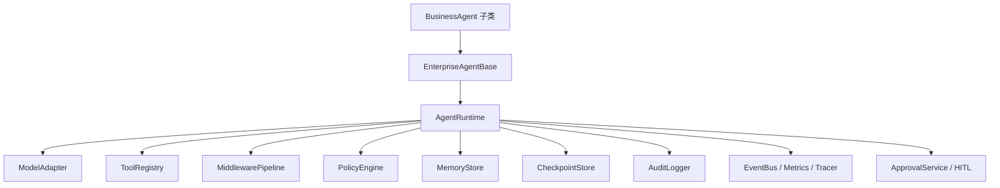
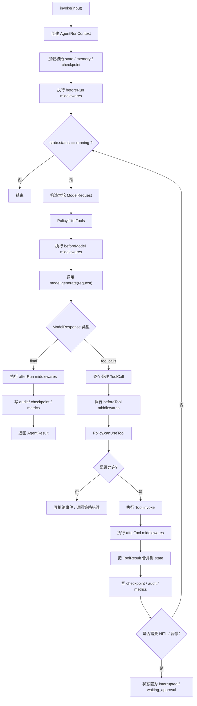
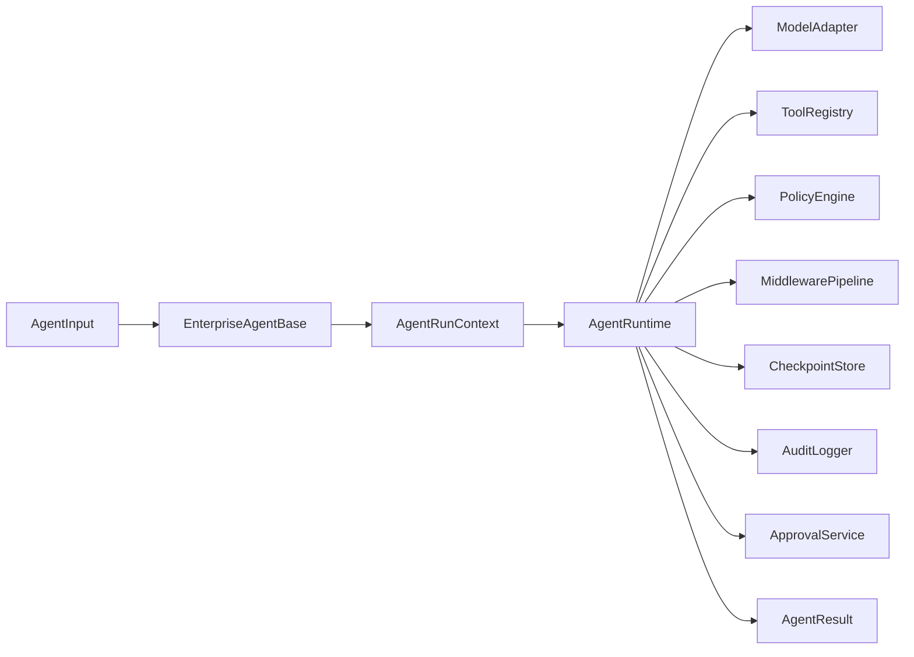
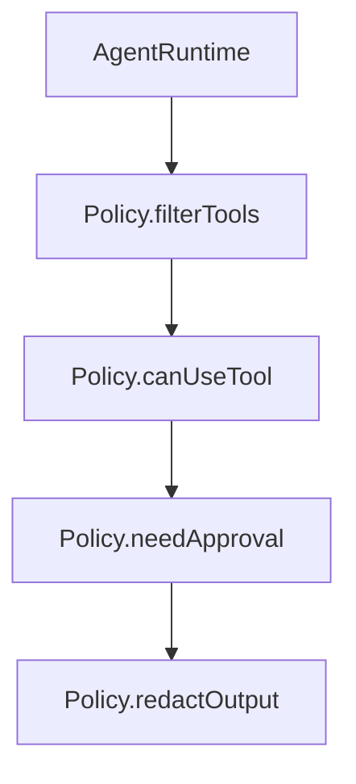
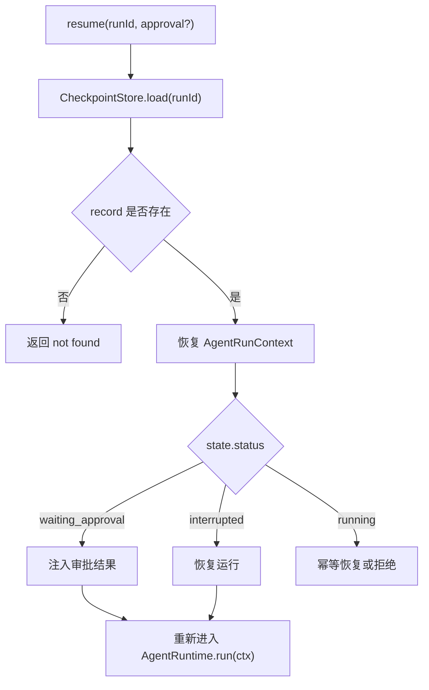
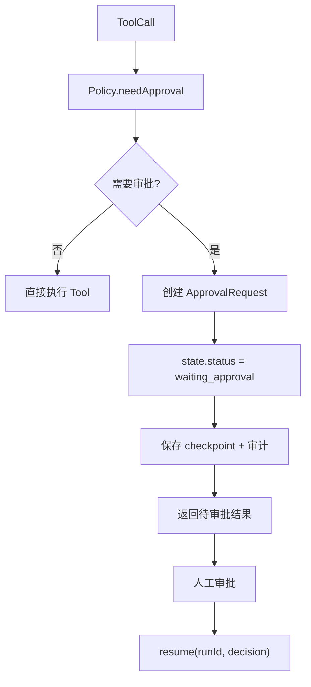
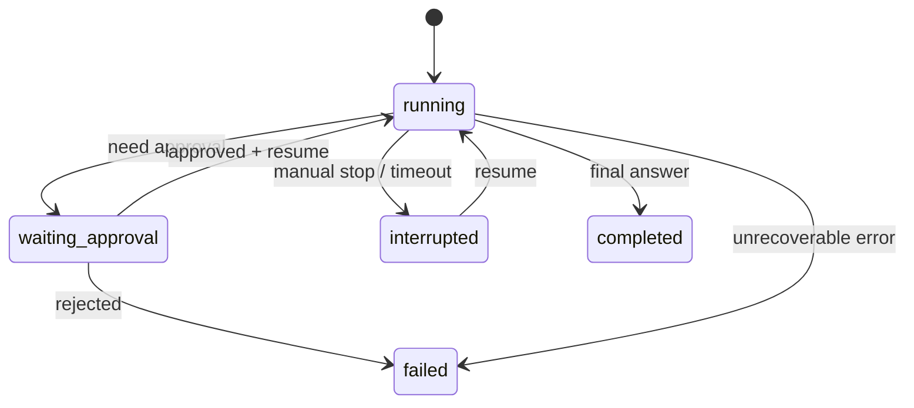
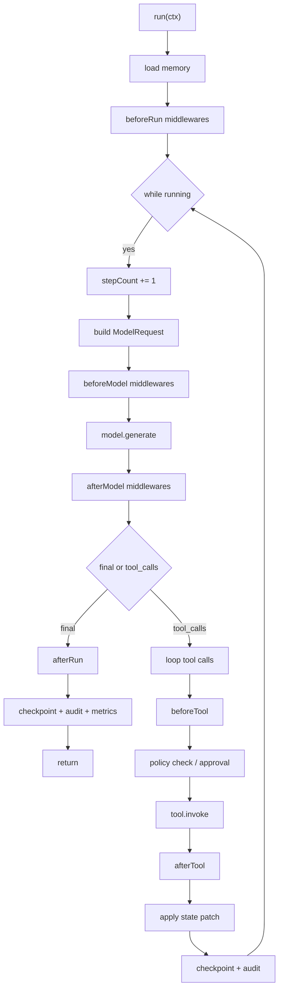

# 企业 Agent 基础架构详细设计

本文档描述一个不依赖 DeepAgent、从零实现的企业级 Agent Runtime。目标不是做一个简单的 `invoke()` 封装，而是设计一套可落地、可治理、可恢复、可审计、可扩展的 Agent 基础设施。

这份设计适合以下场景：

- 企业内部问答 Agent
- 工单/客服 Agent
- 数据分析 Agent
- 工作流执行 Agent
- 需要工具调用、权限控制、人工审批、审计留痕的复杂 Agent 系统

---

## 1. 设计目标

### 1.1 核心目标

- 不依赖第三方 Agent 框架，拥有自定义 Runtime
- 将业务逻辑与运行时治理解耦
- 统一模型、工具、消息、状态、策略、审计协议
- 支持多轮推理、工具调用、人工中断、状态恢复
- 支持企业级权限、审计、可观测性、合规控制
- 支持不同业务 Agent 在统一基类上复用

### 1.2 非目标

当前版本先不把下面这些作为第一优先级：

- 多 Agent 图编排平台
- 完整 DAG 调度系统
- 完整低代码工作流系统
- 跨语言 SDK 设计
- 训练/微调平台集成

这些能力未来可以在 Runtime 稳定后逐步扩展。

### 1.3 设计原则

1. **组合优于继承**
   `EnterpriseAgentBase` 只定义模板，真正能力都通过组合注入。

2. **治理优于提示词约束**
   权限、审批、审计、边界控制不能只依赖 prompt，必须有程序层硬约束。

3. **状态显式化**
   Agent 的消息、步骤、工具调用、暂停状态、审批状态都必须进入显式状态模型。

4. **协议先行**
   Model、Tool、Middleware、Policy、Checkpoint、Audit 都先定义协议，再写实现。

5. **恢复优先**
   企业 Agent 一定要能 resume、retry、审计追溯，否则很难上生产。

---

## 2. 总体架构



### 2.1 分层职责

#### `BusinessAgent`

业务层只负责：

- 业务系统提示词
- 业务工具集合
- 业务输出格式
- 业务专用中间件

#### `EnterpriseAgentBase`

模板层负责：

- 构造运行上下文
- 注入统一企业治理能力
- 创建 runtime
- 提供标准入口：`invoke` / `stream` / `resume`

#### `AgentRuntime`

执行层负责：

- 推理循环
- 工具调用调度
- 状态推进
- 中间件调度
- 权限校验
- checkpoint / audit / event 记录

#### 周边服务

- `ModelAdapter`：模型适配层
- `ToolRegistry`：工具注册与查找
- `PolicyEngine`：权限与治理中心
- `CheckpointStore`：状态保存与恢复
- `AuditLogger`：审计日志
- `ApprovalService`：人工审批
- `Tracer/Metrics`：可观测性

---

## 3. 运行时执行流程



### 3.1 为什么必须自己实现 Runtime

因为企业级 Agent 的关键问题不在“能不能调模型”，而在：

- 谁可以调用什么工具
- 工具执行前后怎么审计
- 一旦失败怎么恢复
- 如何人工审批
- 如何追踪每一步
- 如何对外暴露稳定契约

这些问题都要求你拥有显式 Runtime，而不是只靠外部框架的默认循环。

---

## 4. 核心模块关系



### 4.1 组件职责矩阵

| 组件 | 职责 | 是否建议抽象为接口 |
|------|------|------------------|
| `EnterpriseAgentBase` | 模板化装配与标准入口 | 否 |
| `AgentRuntime` | 主循环、状态推进、工具调度 | 否 |
| `ModelAdapter` | 屏蔽不同模型 SDK 差异 | 是 |
| `AgentTool` | 工具统一协议 | 是 |
| `ToolRegistry` | 工具注册、查找、元数据管理 | 是 |
| `PolicyEngine` | 权限、输入治理、审批前置判断 | 是 |
| `AgentMiddleware` | 横切逻辑注入 | 是 |
| `CheckpointStore` | 持久化 state 与恢复 | 是 |
| `AuditLogger` | 记录审计事件 | 是 |
| `ApprovalService` | HITL / 人工审批 | 是 |
| `MemoryStore` | 长短期记忆的装载和写入 | 是 |
| `Tracer/Metrics` | 追踪和指标上报 | 是 |

---

## 5. 类型系统设计

这一层一定要先稳定，否则后面的 runtime、tool、middleware 都会频繁返工。

## 5.1 消息协议

Agent 内部消息建议不要直接复用某个模型 SDK 的消息对象，而是设计统一消息协议。

```ts
export type AgentMessageRole =
  | "system"
  | "user"
  | "assistant"
  | "tool";

export interface AgentMessage {
  id: string;
  role: AgentMessageRole;
  content: string;
  name?: string;
  toolCallId?: string;
  createdAt: string;
  metadata?: Record<string, unknown>;
}
```

### 设计原因

- 屏蔽不同模型供应商的 message 格式差异
- 统一工具消息与普通消息
- 支持审计、回放、脱敏、导出
- 让 checkpoint 格式稳定

## 5.2 工具调用协议

```ts
export interface ToolCall {
  id: string;
  name: string;
  input: unknown;
}
```

### 设计要求

- `id` 必须存在，便于审计和链路追踪
- `name` 必须稳定，不允许动态生成
- `input` 应该是 JSON 兼容结构

## 5.3 模型请求协议

```ts
export interface ModelRequest {
  systemPrompt: string;
  messages: AgentMessage[];
  tools: ToolDefinition[];
  temperature?: number;
  maxTokens?: number;
  metadata?: Record<string, unknown>;
}
```

### 注意

- `tools` 不直接传 `AgentTool` 实例，建议传精简后的 `ToolDefinition`
- `metadata` 里可以放 traceId、tenantId、userId、runId

## 5.4 模型响应协议

```ts
export type ModelResponse =
  | {
      type: "final";
      output: string;
      metadata?: Record<string, unknown>;
    }
  | {
      type: "tool_calls";
      toolCalls: ToolCall[];
      metadata?: Record<string, unknown>;
    };
```

### 为什么不要直接返回“任意结构”

因为 runtime 只关心两种分支：

- 给出最终答案
- 继续调用工具

把状态压成这两个分支，执行逻辑会干净很多。

## 5.5 工具协议

```ts
export interface ToolDefinition {
  name: string;
  description: string;
  inputSchema?: unknown;
}

export interface ToolContext {
  ctx: AgentRunContext;
  toolCall: ToolCall;
}

export interface ToolResult {
  content: string;
  structured?: unknown;
  metadata?: Record<string, unknown>;
  statePatch?: AgentStatePatch;
}

export interface AgentTool {
  name: string;
  description: string;
  schema?: unknown;
  invoke(input: unknown, ctx: ToolContext): Promise<ToolResult>;
}
```

### 关键点

- `ToolResult` 不是单纯字符串
- 允许工具返回 `statePatch`
- 允许工具返回结构化数据和审计元信息

## 5.6 状态协议

```ts
export type AgentStatus =
  | "running"
  | "completed"
  | "failed"
  | "interrupted"
  | "waiting_approval";

export interface AgentState {
  runId: string;
  threadId?: string;
  messages: AgentMessage[];
  scratchpad: Record<string, unknown>;
  memory: Record<string, unknown>;
  stepCount: number;
  status: AgentStatus;
  lastModelResponse?: ModelResponse;
  lastToolCall?: ToolCall;
  lastToolResult?: ToolResult;
  error?: AgentError;
}
```

### 状态字段建议

- `scratchpad`：运行时临时工作区
- `memory`：长期/中期记忆快照
- `lastModelResponse`：便于调试和审计
- `lastToolCall` / `lastToolResult`：便于恢复与失败分析

## 5.7 状态补丁协议

建议明确 patch 格式，而不是让工具直接 mutate state。

```ts
export interface AgentStatePatch {
  appendMessages?: AgentMessage[];
  setScratchpad?: Record<string, unknown>;
  mergeMemory?: Record<string, unknown>;
  setStatus?: AgentStatus;
  setError?: AgentError;
}
```

### 原因

- 可审计
- 可回放
- 便于 reducer 化处理
- 便于支持并发或子任务扩展

## 5.8 运行上下文协议

```ts
export interface AgentIdentity {
  userId: string;
  tenantId: string;
  roles: string[];
  sessionId?: string;
}

export interface AgentInput {
  messages?: AgentMessage[];
  inputText?: string;
  metadata?: Record<string, unknown>;
}

export interface AgentRunContext {
  input: AgentInput;
  identity: AgentIdentity;
  state: AgentState;
  services: {
    checkpoint?: CheckpointStore;
    audit?: AuditLogger;
    approval?: ApprovalService;
    memory?: MemoryStore;
    tracer?: Tracer;
    metrics?: Metrics;
  };
  metadata: Record<string, unknown>;
}
```

---

## 6. 基类与 Runtime 的边界

## 6.1 `EnterpriseAgentBase` 负责什么

- 组装 runtime 所需依赖
- 把业务能力与企业能力合并
- 标准化上下文创建
- 暴露统一调用入口

## 6.2 `AgentRuntime` 负责什么

- 执行 loop
- 驱动 middleware
- 调用模型
- 调用工具
- 合并状态
- 写 checkpoint/audit

## 6.3 不该放进基类的东西

下面这些不要直接塞进 `EnterpriseAgentBase`：

- 复杂状态机逻辑
- 工具执行细节
- 审批引擎实现
- 审计存储细节
- 模型 SDK 具体适配逻辑

---

## 7. Middleware 设计

中间件是整个系统最重要的横切扩展点。

## 7.1 Hook 设计

```ts
export interface AgentMiddleware {
  name: string;
  beforeRun?(ctx: AgentRunContext): Promise<void> | void;
  beforeModel?(
    ctx: AgentRunContext,
    req: ModelRequest,
  ): Promise<ModelRequest> | ModelRequest;
  afterModel?(
    ctx: AgentRunContext,
    resp: ModelResponse,
  ): Promise<ModelResponse> | ModelResponse;
  beforeTool?(ctx: AgentRunContext, call: ToolCall): Promise<void> | void;
  afterTool?(
    ctx: AgentRunContext,
    result: ToolExecutionResult,
  ): Promise<void> | void;
  onError?(ctx: AgentRunContext, error: AgentError): Promise<void> | void;
  afterRun?(ctx: AgentRunContext, result: AgentResult): Promise<void> | void;
}
```

相比前一版，多加一个 `afterModel` 和 `onError` 更稳。

## 7.2 Middleware 适合承载什么

- 输入规范化
- prompt 注入
- 自动上下文装载
- 工具参数修正
- 工具调用日志
- PII 脱敏
- 自动摘要
- 安全审查
- trace/span 记录
- 错误转换

## 7.3 Middleware 不适合承载什么

- 核心业务流程主逻辑
- 长时间阻塞的审批系统主循环
- 持久化状态机本身

---

## 8. PolicyEngine 设计

Policy 是企业 Agent 跟 demo Agent 最大的区别之一。



## 8.1 建议拆成 4 层规则

### 第一层：静态能力控制

- 某个 Agent 永远不允许 `execute`
- 某个租户永远不能访问某些内部工具

### 第二层：身份授权控制

- 某个角色能不能看客户工单
- 某个用户能不能发消息给外部系统

### 第三层：输入级风险控制

- SQL 输入里是否包含危险操作
- 文件路径是否越权
- 外部请求是否命中禁用域名

### 第四层：审批控制

- 可疑操作进入 `waiting_approval`
- 高风险写操作必须人工审核

## 8.2 PolicyEngine 推荐接口

```ts
export interface PolicyEngine {
  filterTools(
    ctx: AgentRunContext,
    tools: AgentTool[],
  ): Promise<AgentTool[]> | AgentTool[];

  canUseTool(
    ctx: AgentRunContext,
    tool: AgentTool,
    input: unknown,
  ): Promise<boolean> | boolean;

  needApproval?(
    ctx: AgentRunContext,
    tool: AgentTool,
    input: unknown,
  ): Promise<boolean> | boolean;

  redactOutput?(
    ctx: AgentRunContext,
    output: string,
  ): Promise<string> | string;
}
```

---

## 9. Checkpoint 与恢复设计

恢复能力是企业 Agent 的刚需。

## 9.1 什么时候保存 checkpoint

建议至少在下面几个时机保存：

- `beforeRun` 之后
- 每次 `model.generate` 之后
- 每次工具执行之后
- 状态变成 `waiting_approval` 时
- `completed` / `failed` / `interrupted` 结束时

## 9.2 CheckpointStore 接口

```ts
export interface CheckpointRecord {
  runId: string;
  state: AgentState;
  metadata?: Record<string, unknown>;
  createdAt: string;
  updatedAt: string;
}

export interface CheckpointStore {
  load(runId: string): Promise<CheckpointRecord | null>;
  save(record: CheckpointRecord): Promise<void>;
  delete?(runId: string): Promise<void>;
}
```

## 9.3 resume 设计



### 关键要求

- `resume` 必须幂等
- 审批恢复必须带审批上下文
- 恢复后要保留完整审计链路

---

## 10. Audit 设计

企业 Agent 不记录审计，基本等于不可上线。

## 10.1 审计事件类型

```ts
export type AuditEventType =
  | "run_started"
  | "model_called"
  | "model_returned"
  | "tool_called"
  | "tool_succeeded"
  | "tool_failed"
  | "approval_requested"
  | "approval_resolved"
  | "run_completed"
  | "run_failed";

export interface AuditEvent {
  id: string;
  runId: string;
  type: AuditEventType;
  timestamp: string;
  actor?: string;
  payload: Record<string, unknown>;
}
```

## 10.2 审计记录建议内容

- 用户身份
- 租户信息
- 模型名称
- prompt 摘要
- 工具名称
- 工具参数摘要
- 工具结果摘要
- 最终输出摘要
- 错误信息
- 审批人和审批结论

### 注意

审计不等于把所有原始内容无脑落库。很多企业场景要做：

- 内容裁剪
- PII 脱敏
- 参数摘要化
- 敏感字段哈希化

---

## 11. HITL / 审批设计



## 11.1 ApprovalService 协议

```ts
export interface ApprovalRequest {
  id: string;
  runId: string;
  toolName: string;
  input: unknown;
  reason: string;
  createdAt: string;
}

export interface ApprovalDecision {
  requestId: string;
  approved: boolean;
  reviewerId: string;
  comment?: string;
  decidedAt: string;
}

export interface ApprovalService {
  create(request: ApprovalRequest): Promise<void>;
  get(requestId: string): Promise<ApprovalDecision | null>;
}
```

---

## 12. 错误模型设计

错误模型建议一开始就标准化，不要到处 `throw new Error(...)`。

```ts
export type AgentErrorCode =
  | "MODEL_ERROR"
  | "TOOL_ERROR"
  | "POLICY_DENIED"
  | "APPROVAL_REQUIRED"
  | "CHECKPOINT_ERROR"
  | "VALIDATION_ERROR"
  | "MAX_STEPS_EXCEEDED"
  | "SYSTEM_ERROR";

export interface AgentError {
  code: AgentErrorCode;
  message: string;
  cause?: unknown;
  retryable?: boolean;
  metadata?: Record<string, unknown>;
}
```

## 12.1 错误分层

- `MODEL_ERROR`：调用模型失败、响应不合法
- `TOOL_ERROR`：工具内部失败
- `POLICY_DENIED`：权限拒绝
- `APPROVAL_REQUIRED`：需要审批，不是异常但需要特殊处理
- `CHECKPOINT_ERROR`：持久化失败
- `VALIDATION_ERROR`：工具输入不合法
- `MAX_STEPS_EXCEEDED`：循环超限
- `SYSTEM_ERROR`：兜底未知错误

## 12.2 状态迁移建议



---

## 13. Memory 设计

记忆建议至少分两层：

## 13.1 短期记忆

直接来自当前 `messages`、`scratchpad`、最近工具结果。

## 13.2 长期记忆

外部持久化内容，比如：

- 用户偏好
- 租户配置
- 项目事实
- 历史会话摘要

## 13.3 MemoryStore 接口

```ts
export interface MemoryStore {
  load(
    ctx: AgentRunContext,
  ): Promise<Record<string, unknown>> | Record<string, unknown>;

  save?(
    ctx: AgentRunContext,
    patch: Record<string, unknown>,
  ): Promise<void> | void;
}
```

### 建议

- `load` 在 `beforeRun` 或 `beforeModel` 阶段执行
- `save` 在 `afterTool` 或 `afterRun` 阶段执行
- 不建议让业务代码随意直接改 MemoryStore

---

## 14. 可观测性设计

## 14.1 Tracing

建议每轮至少生成以下 span：

- `agent.run`
- `agent.model.generate`
- `agent.tool.invoke`
- `agent.policy.check`
- `agent.checkpoint.save`

## 14.2 Metrics

建议至少统计：

- 每次运行耗时
- 每轮模型耗时
- 工具调用次数
- 工具错误率
- 审批触发率
- 平均 stepCount
- 模型 token 统计

## 14.3 EventBus

建议把运行时事件显式发布出来：

```ts
export interface AgentEventBus {
  emit(event: AuditEvent): Promise<void> | void;
}
```

这样后期做：

- 实时 UI
- 进度展示
- 审批面板
- 运行监控

都会更容易。

---

## 15. 流式输出设计

虽然第一版可先不实现 streaming，但协议要留出来。

## 15.1 推荐事件流

```ts
export type AgentStreamEvent =
  | { type: "run_started"; runId: string }
  | { type: "model_started" }
  | { type: "assistant_delta"; text: string }
  | { type: "tool_call"; call: ToolCall }
  | { type: "tool_result"; result: ToolResult }
  | { type: "approval_required"; requestId: string }
  | { type: "run_completed"; output: string }
  | { type: "run_failed"; error: AgentError };
```

## 15.2 价值

- UI 可以实时展示过程
- 工具调用可视化
- 审批弹窗更自然
- 后续接前端会省很多改造成本

---

## 16. `EnterpriseAgentBase` 详细设计

`EnterpriseAgentBase` 应使用模板方法模式。

## 16.1 推荐抽象点

- `getName()`
- `getSystemPrompt(ctx)`
- `getTools(ctx)`
- `getModel()`
- `getMiddlewares()`
- `getPolicy()`
- `getMemoryStore()`
- `getCheckpointStore()`
- `getAuditLogger()`
- `getApprovalService()`
- `getMaxSteps()`

## 16.2 基础类骨架

```ts
export abstract class EnterpriseAgentBase {
  protected abstract getName(): string;

  protected abstract getSystemPrompt(
    ctx: AgentRunContext,
  ): Promise<string> | string;

  protected abstract getTools(
    ctx: AgentRunContext,
  ): Promise<AgentTool[]> | AgentTool[];

  protected abstract getModel(): ModelAdapter;

  protected getMiddlewares(): AgentMiddleware[] {
    return [];
  }

  protected getPolicy(): PolicyEngine {
    return new AllowAllPolicy();
  }

  protected getMemoryStore(): MemoryStore | undefined {
    return undefined;
  }

  protected getCheckpointStore(): CheckpointStore | undefined {
    return undefined;
  }

  protected getAuditLogger(): AuditLogger | undefined {
    return undefined;
  }

  protected getApprovalService(): ApprovalService | undefined {
    return undefined;
  }

  protected getMaxSteps(): number {
    return 12;
  }

  async invoke(input: AgentInput): Promise<AgentResult> {
    const ctx = await this.createRunContext(input);
    const runtime = await this.createRuntime(ctx);
    return runtime.run(ctx);
  }

  async resume(
    runId: string,
    payload?: Record<string, unknown>,
  ): Promise<AgentResult> {
    const checkpoint = this.getCheckpointStore();
    if (!checkpoint) {
      throw new Error("CheckpointStore is required for resume");
    }

    const record = await checkpoint.load(runId);
    if (!record) {
      throw new Error(`Checkpoint not found: ${runId}`);
    }

    const ctx = await this.createResumeContext(record, payload);
    const runtime = await this.createRuntime(ctx);
    return runtime.run(ctx);
  }

  protected async createRuntime(
    ctx: AgentRunContext,
  ): Promise<AgentRuntime> {
    return new AgentRuntime({
      name: this.getName(),
      model: this.getModel(),
      tools: await this.getTools(ctx),
      middlewares: this.getMiddlewares(),
      policy: this.getPolicy(),
      memory: this.getMemoryStore(),
      checkpoint: this.getCheckpointStore(),
      audit: this.getAuditLogger(),
      approval: this.getApprovalService(),
      systemPrompt: await this.getSystemPrompt(ctx),
      maxSteps: this.getMaxSteps(),
    });
  }

  protected async createRunContext(
    input: AgentInput,
  ): Promise<AgentRunContext> {
    const runId = crypto.randomUUID();

    return {
      input,
      identity: {
        userId: "unknown",
        tenantId: "default",
        roles: [],
      },
      state: {
        runId,
        messages: input.messages ?? [],
        scratchpad: {},
        memory: {},
        stepCount: 0,
        status: "running",
      },
      services: {
        checkpoint: this.getCheckpointStore(),
        audit: this.getAuditLogger(),
        approval: this.getApprovalService(),
        memory: this.getMemoryStore(),
      },
      metadata: {},
    };
  }

  protected async createResumeContext(
    record: CheckpointRecord,
    payload?: Record<string, unknown>,
  ): Promise<AgentRunContext> {
    return {
      input: {
        metadata: payload,
      },
      identity: {
        userId: "unknown",
        tenantId: "default",
        roles: [],
      },
      state: {
        ...record.state,
        status: "running",
      },
      services: {
        checkpoint: this.getCheckpointStore(),
        audit: this.getAuditLogger(),
        approval: this.getApprovalService(),
        memory: this.getMemoryStore(),
      },
      metadata: payload ?? {},
    };
  }
}
```

---

## 17. `AgentRuntime` 详细设计

`AgentRuntime` 是真正的执行引擎。

## 17.1 Runtime 配置

```ts
export interface RuntimeConfig {
  name: string;
  model: ModelAdapter;
  tools: AgentTool[];
  middlewares: AgentMiddleware[];
  policy: PolicyEngine;
  memory?: MemoryStore;
  checkpoint?: CheckpointStore;
  audit?: AuditLogger;
  approval?: ApprovalService;
  systemPrompt: string;
  maxSteps: number;
}
```

## 17.2 主循环设计



## 17.3 为什么工具结果要支持 statePatch

如果工具只能返回字符串，那么这些事情会很难做：

- 工具顺手更新 memory
- 工具触发状态暂停
- 工具回写结构化结果到 scratchpad
- 工具标记“等待人工确认”

所以工具结果要允许返回：

- `content`
- `structured`
- `metadata`
- `statePatch`

## 17.4 状态合并建议

建议 runtime 维护一个集中 reducer：

```ts
function applyStatePatch(
  state: AgentState,
  patch?: AgentStatePatch,
): AgentState {
  if (!patch) return state;

  return {
    ...state,
    messages: patch.appendMessages
      ? [...state.messages, ...patch.appendMessages]
      : state.messages,
    scratchpad: patch.setScratchpad
      ? { ...state.scratchpad, ...patch.setScratchpad }
      : state.scratchpad,
    memory: patch.mergeMemory
      ? { ...state.memory, ...patch.mergeMemory }
      : state.memory,
    status: patch.setStatus ?? state.status,
    error: patch.setError ?? state.error,
  };
}
```

这样所有状态更新都会经过统一入口，更容易审计和调试。

---

## 18. 目录结构建议

```text
src/
  agent/
    base.ts
    runtime.ts
    types.ts
    model.ts
    tools.ts
    tool-registry.ts
    middleware.ts
    policy.ts
    checkpoint.ts
    audit.ts
    approval.ts
    memory.ts
    errors.ts
    metrics.ts
```

### 推荐实现顺序

1. `types.ts`
2. `errors.ts`
3. `model.ts`
4. `tools.ts`
5. `policy.ts`
6. `middleware.ts`
7. `checkpoint.ts`
8. `audit.ts`
9. `runtime.ts`
10. `base.ts`

---

## 19. 典型子类示例

## 19.1 财务分析 Agent

```ts
class FinanceAnalystAgent extends EnterpriseAgentBase {
  protected getName() {
    return "finance-analyst";
  }

  protected getSystemPrompt() {
    return "你是企业财务分析助手，只能基于授权财务数据回答。";
  }

  protected getTools() {
    return [
      // 财务报表查询工具
      // BI 数据工具
    ];
  }

  protected getMiddlewares() {
    return [
      // 财务领域专用中间件
    ];
  }

  protected getPolicy() {
    return financePolicy;
  }

  protected getModel() {
    return myModelAdapter;
  }
}
```

## 19.2 客服 Agent

```ts
class SupportAgent extends EnterpriseAgentBase {
  protected getName() {
    return "support-agent";
  }

  protected getSystemPrompt() {
    return "你是企业客服助手，回答必须遵守知识库和工单权限边界。";
  }

  protected getTools() {
    return [
      // FAQ 检索工具
      // 工单查询工具
      // CRM 读取工具
    ];
  }

  protected getPolicy() {
    return supportPolicy;
  }

  protected getModel() {
    return myModelAdapter;
  }
}
```

## 19.3 写操作型 Agent

对会调用外部系统写操作的 Agent，建议默认开启审批：

- 发邮件
- 发 IM 消息
- 修改工单
- 执行脚本
- 修改数据库

这种 Agent 的 Policy 层和 Approval 层会比 Prompt 更重要。

---

## 20. 常见误区

## 20.1 误区一：只要有 prompt 就够了

不够。企业场景必须有程序级约束：

- prompt 负责指导
- policy 负责强制
- middleware 负责治理

## 20.2 误区二：工具只返回字符串

不够。企业工具往往还要：

- 回写状态
- 写 memory
- 触发审批
- 附带审计元信息

## 20.3 误区三：不需要 checkpoint

不现实。没有 checkpoint：

- 审批后无法恢复
- 中断后无法续跑
- 故障后无法重试
- 审计链不完整

## 20.4 误区四：所有逻辑放一个类

会导致：

- 难测试
- 难扩展
- 难治理
- 难替换底层能力

---

## 21. 不建议的设计

以下做法后期几乎都会变成负担：

- 只做一个 `invoke()` 薄封装
- 让业务 Agent 直接依赖模型 SDK
- 权限完全依赖 prompt
- 把状态直接随处 mutate
- 不定义统一消息协议
- 工具协议没有结构化返回
- 不做错误分层
- 审计和运行状态混在一起

---

## 22. 设计总结

这套基础架构的本质是：

- `EnterpriseAgentBase` 负责模板化装配
- `AgentRuntime` 负责显式执行循环
- `ModelAdapter` 负责模型抽象
- `AgentTool` 负责工具统一协议
- `PolicyEngine` 负责企业治理
- `AgentMiddleware` 负责横切能力
- `CheckpointStore` 负责恢复能力
- `AuditLogger` 负责审计追踪
- `ApprovalService` 负责人工审批

最终形成的是一套：

- 可扩展
- 可治理
- 可审计
- 可恢复
- 可维护

的企业 Agent 基础设施。

---

## 23. 下一步实施建议

如果要开始编码，建议按下面顺序推进：

### 第一阶段：协议稳定

- `types.ts`
- `errors.ts`
- `model.ts`
- `tools.ts`

### 第二阶段：治理骨架

- `policy.ts`
- `middleware.ts`
- `checkpoint.ts`
- `audit.ts`

### 第三阶段：执行引擎

- `runtime.ts`
- `base.ts`

### 第四阶段：企业能力增强

- `approval.ts`
- `memory.ts`
- `metrics.ts`
- `streaming.ts`

### 第五阶段：业务 Agent 落地

- `finance-agent.ts`
- `support-agent.ts`
- `ops-agent.ts`

如果继续往下做，最合理的下一步就是先在这个目录里落第一版：

1. `src/agent/types.ts`
2. `src/agent/errors.ts`
3. `src/agent/runtime.ts`
4. `src/agent/base.ts`
