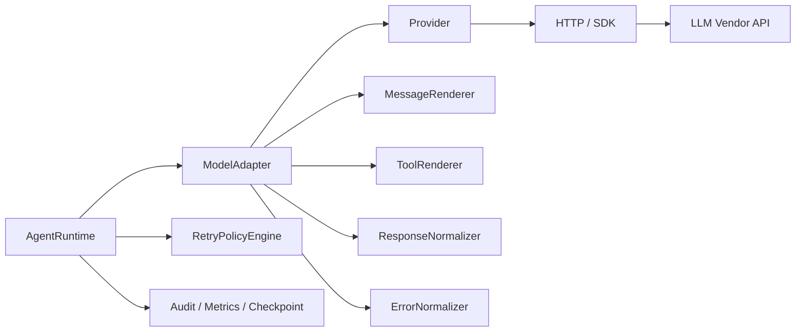
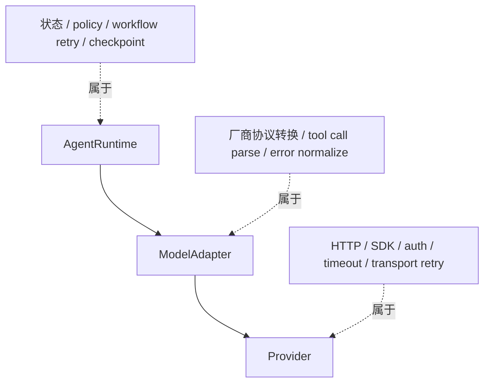
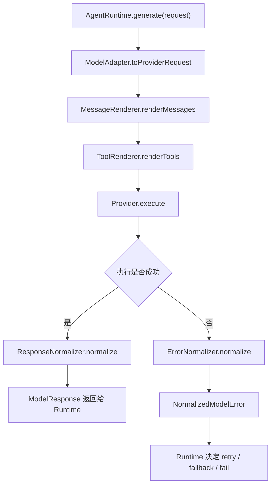
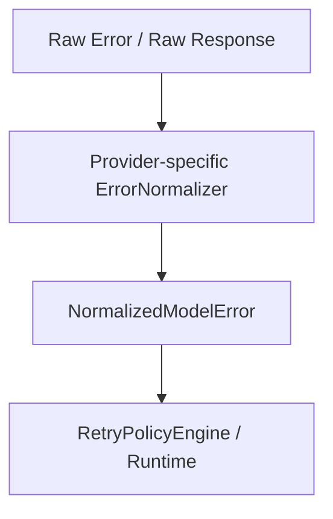
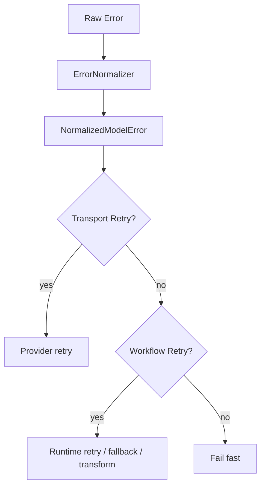

# Provider + ModelAdapter + 错误处理详细设计

本文档定义企业 Agent Runtime 中与模型调用相关的核心基础设施设计，重点覆盖：

- `Provider` 的职责与边界
- `ModelAdapter` 的职责与边界
- Provider / Adapter / Runtime 三层关系
- 多厂商模型协议适配
- 错误归一化与重试分层
- 认证边界
- streaming 设计
- 注册与扩展机制

本文档的目标是为后续实现提供清晰且稳定的架构边界，避免将：

- 模型调用
- 协议适配
- Agent 状态
- 重试策略
- 审计治理

混杂在同一层里。

---

## 1. 设计目标

### 1.1 核心目标

- 让 `AgentRuntime` 不依赖具体模型厂商
- 让多厂商协议差异收敛在统一适配层
- 让 Provider 保持无运行时状态
- 让错误处理、重试、fallback 有统一语义
- 让 streaming、tools、message 渲染有统一入口
- 让后续新增厂商成本最小化

### 1.2 非目标

当前设计先不覆盖：

- 多模态富媒体完整协议统一
- 所有厂商的全部高级特性
- 调度多个模型组成复杂 DAG

这些能力后续可在当前设计上继续扩展。

---

## 2. 总体架构



### 2.1 核心结论

- `Provider` 是无状态的模型接口调用层
- `ModelAdapter` 是厂商协议适配层
- `AgentRuntime` 是工作流与状态管理层

一句话概括：

> Provider 负责“把请求发出去”，  
> ModelAdapter 负责“把我们的统一协议翻译成厂商协议，再翻译回来”，  
> Runtime 负责“什么时候调用、失败后怎么办、如何进入 Agent 循环”。

---

## 3. Provider 与 ModelAdapter 的职责边界

## 3.1 Provider 是什么

Provider 本质上就是：

**模型 API Client**

它负责：

- 认证头注入
- timeout
- transport 级 retry
- 发 HTTP / SDK 请求
- 返回原始响应
- 返回原始基础设施错误

### Provider 不理解什么

Provider 不应该理解：

- `AgentState`
- `messages` 的业务语义
- `systemPrompt`
- `memory`
- `tool calling` 的 Agent 工作流含义
- `checkpoint`
- `审批`
- `tenant/user` 的业务授权逻辑

### Provider 的关键约束

**Provider 必须无运行时状态。**

它可以持有：

- endpoint
- api key / auth provider
- timeout
- retry config
- http client / sdk client

但它不应持有：

- messages
- runId
- stepCount
- memory
- thread state
- tool history
- tenant 上下文

---

## 3.2 ModelAdapter 是什么

ModelAdapter 是：

**厂商协议适配层**

它负责：

- `ModelRequest -> ProviderRequest`
- Provider 原始响应 -> `ModelResponse`
- message 渲染
- tool schema 渲染
- tool call 提取
- final output 归一
- provider 错误归一化

### ModelAdapter 理解什么

它理解：

- 我们的统一 `ModelRequest`
- 我们的统一 `ModelResponse`
- 厂商请求格式
- 厂商返回格式
- tool calling 差异

### ModelAdapter 不负责什么

它不负责：

- Agent 状态管理
- 是否继续循环
- 是否做 workflow 级重试
- 是否做 checkpoint
- 是否写审计主逻辑

---

## 3.3 一张边界图



---

## 4. 统一模型协议

`AgentRuntime` 不应该直接看到 OpenAI/Anthropic/Gemini 的原生协议，而应该只看统一模型协议。

## 4.1 ModelRequest

```ts
export interface ModelRequest {
  model: string;
  systemPrompt: string;
  messages: AgentMessage[];
  tools: ToolDefinition[];
  temperature?: number;
  maxTokens?: number;
  metadata?: Record<string, unknown>;
}
```

### 字段说明

- `model`
  - 逻辑模型标识，如 `openai:gpt-4.1`
- `systemPrompt`
  - runtime 构造的系统提示
- `messages`
  - 已经过消息层处理后的 canonical/effective messages
- `tools`
  - 标准化工具定义
- `metadata`
  - traceId、tenantId、runId、tags 等

## 4.2 ModelResponse

```ts
export type ModelResponse =
  | {
      type: "final";
      output: string;
      metadata?: Record<string, unknown>;
    }
  | {
      type: "tool_calls";
      toolCalls: ToolCall[];
      metadata?: Record<string, unknown>;
    };
```

### 为什么只保留两个分支

因为 Runtime 主循环只关心：

- 本轮是否结束
- 还是继续调工具

把响应压成两个分支，可以大幅降低 runtime 复杂度。

---

## 5. Provider 协议设计

Provider 协议应该尽量“朴素”。

## 5.1 ProviderRequest

```ts
export interface ProviderRequest {
  url: string;
  method?: "POST";
  headers: Record<string, string>;
  body: unknown;
  timeoutMs?: number;
  metadata?: Record<string, unknown>;
}
```

## 5.2 ProviderResponse

```ts
export interface ProviderResponse {
  status: number;
  headers: Record<string, string>;
  body: unknown;
  raw?: unknown;
}
```

## 5.3 Provider 接口

```ts
export interface Provider {
  name: string;
  execute(request: ProviderRequest): Promise<ProviderResponse>;
}
```

### 设计特点

- 不包含 `messages` 语义
- 不包含 `tool` 语义
- 只是一层 transport client

---

## 6. ModelAdapter 协议设计

## 6.1 最小接口

```ts
export interface ModelAdapter {
  name: string;
  generate(request: ModelRequest): Promise<ModelResponse>;
  stream?(request: ModelRequest): AsyncIterable<ModelStreamEvent>;
}
```

## 6.2 推荐抽象基类

```ts
export abstract class BaseModelAdapter implements ModelAdapter {
  abstract name: string;

  constructor(protected readonly provider: Provider) {}

  async generate(request: ModelRequest): Promise<ModelResponse> {
    try {
      const providerRequest = await this.toProviderRequest(request);
      const providerResponse = await this.provider.execute(providerRequest);
      return await this.fromProviderResponse(providerResponse, request);
    } catch (error) {
      throw await this.normalizeError(error, request);
    }
  }

  protected abstract toProviderRequest(
    request: ModelRequest,
  ): Promise<ProviderRequest> | ProviderRequest;

  protected abstract fromProviderResponse(
    response: ProviderResponse,
    request: ModelRequest,
  ): Promise<ModelResponse> | ModelResponse;

  protected abstract normalizeError(
    error: unknown,
    request: ModelRequest,
  ): Promise<NormalizedModelError> | NormalizedModelError;
}
```

---

## 7. MessageRenderer / ToolRenderer / Normalizer

建议不要把所有转换逻辑都塞进单一 adapter 类。最稳妥的方式是拆成几个部件。

## 7.1 MessageRenderer

```ts
export interface MessageRenderer<TProviderMessage = unknown> {
  renderSystemPrompt(systemPrompt: string): TProviderMessage | null;
  renderMessages(messages: AgentMessage[]): TProviderMessage[];
}
```

职责：

- 将内部消息渲染为厂商消息格式
- 决定 system prompt 放在哪个字段

## 7.2 ToolRenderer

```ts
export interface ToolRenderer<TProviderTool = unknown> {
  renderTools(tools: ToolDefinition[]): TProviderTool[];
}
```

职责：

- 将统一 tool schema 转为厂商所需格式

## 7.3 ResponseNormalizer

```ts
export interface ResponseNormalizer {
  normalize(response: ProviderResponse): ModelResponse;
}
```

职责：

- 把厂商原始响应归一成 `final` 或 `tool_calls`

## 7.4 ErrorNormalizer

```ts
export interface ErrorNormalizer {
  normalize(error: unknown): NormalizedModelError;
}
```

职责：

- 将厂商原始错误映射成统一错误语义

---

## 8. 一次完整调用流程



---

## 9. 多厂商协议差异收敛策略

不同模型厂商最主要的差异集中在下面几处：

- system prompt 放置位置不同
- messages 格式不同
- tool schema 格式不同
- tool call response 格式不同
- 流式事件格式不同
- 错误响应格式不同

这些都应该由 `ModelAdapter` 层收敛。

## 9.1 统一输入，不统一厂商协议

不要尝试让所有 provider 接受相同原始 body，而应该：

- Runtime 只认统一输入
- Adapter 负责做厂商专属转换

## 9.2 OpenAI 与 Anthropic 的典型差异

### OpenAI 风格

- system 可能放在 messages 里
- tools 是 `function` 风格
- tool call 在 `message.tool_calls`

### Anthropic 风格

- system 独立字段
- content block 结构不同
- tool use / tool result block 结构不同

所以：

- `OpenAIModelAdapter`
- `AnthropicModelAdapter`

应是两个明确独立的适配器。

---

## 10. 一个推荐的 OpenAI 风格实现

```ts
export class OpenAIModelAdapter extends BaseModelAdapter {
  name = "openai";

  protected toProviderRequest(request: ModelRequest): ProviderRequest {
    return {
      url: "https://api.openai.com/v1/chat/completions",
      headers: {
        "Content-Type": "application/json",
      },
      body: {
        model: request.model,
        messages: [
          ...(request.systemPrompt
            ? [{ role: "system", content: request.systemPrompt }]
            : []),
          ...request.messages.map((m) => {
            if (m.role === "tool") {
              return {
                role: "tool",
                tool_call_id: m.toolCallId,
                content: m.content,
              };
            }

            return {
              role: m.role,
              content: m.content,
            };
          }),
        ],
        tools: request.tools.map((tool) => ({
          type: "function",
          function: {
            name: tool.name,
            description: tool.description,
            parameters: tool.inputSchema,
          },
        })),
        temperature: request.temperature,
        max_tokens: request.maxTokens,
      },
    };
  }

  protected fromProviderResponse(response: ProviderResponse): ModelResponse {
    const raw = response.body as any;
    const message = raw?.choices?.[0]?.message;

    if (message?.tool_calls?.length) {
      return {
        type: "tool_calls",
        toolCalls: message.tool_calls.map((tc: any) => ({
          id: tc.id,
          name: tc.function.name,
          input: JSON.parse(tc.function.arguments || "{}"),
        })),
      };
    }

    return {
      type: "final",
      output: message?.content ?? "",
    };
  }

  protected normalizeError(error: unknown): NormalizedModelError {
    return openAIErrorNormalizer.normalize(error);
  }
}
```

---

## 11. Provider 认证边界

这里要明确区分：

- Provider 认证
- 用户/租户身份认证

## 11.1 Provider 负责的认证

Provider 只负责模型接口调用所需认证，例如：

- API Key
- Bearer Token
- Azure AD Token
- 企业 AI Gateway Token

### Provider 不负责

- JWT / Session / Cookie 解析
- tenant 身份识别
- 用户角色判断
- 服务到服务调用授权判断

这些应该在上游 Gateway 或 Runtime 身份上下文中完成。

## 11.2 AuthProvider 接口

```ts
export interface AuthProvider {
  getHeaders(): Promise<Record<string, string>> | Record<string, string>;
}
```

### 示例

```ts
export class ApiKeyAuthProvider implements AuthProvider {
  constructor(private readonly apiKey: string) {}

  getHeaders() {
    return {
      Authorization: `Bearer ${this.apiKey}`,
    };
  }
}
```

### Provider 使用方式

```ts
export class HttpProvider implements Provider {
  name = "http";

  constructor(
    private readonly authProvider: AuthProvider,
    private readonly timeoutMs: number,
  ) {}

  async execute(request: ProviderRequest): Promise<ProviderResponse> {
    const authHeaders = await this.authProvider.getHeaders();
    const res = await fetch(request.url, {
      method: request.method ?? "POST",
      headers: {
        ...authHeaders,
        ...request.headers,
      },
      body: JSON.stringify(request.body),
    });

    const body = await res.json();

    return {
      status: res.status,
      headers: Object.fromEntries(res.headers.entries()),
      body,
      raw: body,
    };
  }
}
```

---

## 12. 错误处理设计

不同厂商的状态码、错误 code、错误 body 完全不一致，不能直接基于原始错误做统一逻辑。

正确策略是：

**先统一错误语义，再做重试决策。**

## 12.1 统一错误协议

```ts
export type ModelErrorCode =
  | "RATE_LIMIT"
  | "AUTH_ERROR"
  | "PERMISSION_DENIED"
  | "INVALID_REQUEST"
  | "CONTEXT_OVERFLOW"
  | "SERVER_ERROR"
  | "TIMEOUT"
  | "NETWORK_ERROR"
  | "BAD_RESPONSE"
  | "MODEL_OVERLOADED"
  | "UNKNOWN";

export type RetryMode =
  | "NONE"
  | "IMMEDIATE"
  | "BACKOFF"
  | "AFTER_DELAY"
  | "TRANSFORM_AND_RETRY"
  | "FALLBACK_MODEL";

export interface NormalizedModelError extends Error {
  provider: string;
  model?: string;
  code: ModelErrorCode;
  retryable: boolean;
  retryMode: RetryMode;
  retryAfterMs?: number;
  httpStatus?: number;
  rawCode?: string | number;
  rawType?: string;
  raw: unknown;
}
```

## 12.2 为什么不能直接看 HTTP status

因为：

- 相同 `429` 在不同厂商下含义不同
- 有的 `400` 实际是上下文过长
- 有的 `200` 响应体仍然可能是不合法结构
- 有的 SDK 抛异常而不是返回响应

所以统一策略必须基于语义分类，而不是只看状态码。

---

## 13. ErrorNormalizer 设计

每个厂商都应该有自己专属的错误归一化器。

## 13.1 接口

```ts
export interface ProviderErrorNormalizer {
  normalize(error: unknown): NormalizedModelError;
}
```

## 13.2 一般处理流程



## 13.3 推荐解析信息

- HTTP status
- body.error.type
- body.error.code
- SDK exception 类型
- `retry-after` header
- 是否网络异常
- 是否 timeout

---

## 14. 重试逻辑放在哪里

重试逻辑不应该只放一个地方，而应该分层。

## 14.1 Provider 层：基础设施级重试

适合放在 Provider 的重试：

- 网络错误
- timeout
- 502 / 503 / 504
- 明确 transient 的 429

这些都属于：

**同一请求原样再发一次仍然成立。**

## 14.2 Runtime 层：工作流级重试

适合放在 Runtime 的重试：

- provider fallback
- model fallback
- context overflow 后裁剪再试
- BAD_RESPONSE 后做协议修复再试
- tool 调用失败后整步 retry

这些必须依赖上下文，所以不应放在 Provider。

## 14.3 重试分层图



## 14.4 推荐判断标准

### Provider 重试

如果满足：

- 不依赖 Agent 上下文
- 请求体不需要变

那么放 Provider。

### Runtime 重试

如果满足任意一条：

- 需要修改 request
- 需要裁剪 messages
- 需要 fallback 模型
- 需要写审计/治理
- 需要结合 policy/budget

那么放 Runtime。

---

## 15. streaming 设计

第一版即使不实现 streaming，也建议预留协议。

## 15.1 ModelStreamEvent

```ts
export type ModelStreamEvent =
  | { type: "text_delta"; text: string }
  | { type: "tool_call_delta"; partial: unknown }
  | { type: "tool_call"; call: ToolCall }
  | { type: "done" };
```

## 15.2 Adapter 接口

```ts
export interface ModelAdapter {
  name: string;
  generate(request: ModelRequest): Promise<ModelResponse>;
  stream?(request: ModelRequest): AsyncIterable<ModelStreamEvent>;
}
```

## 15.3 Provider 也可支持流式执行

```ts
export interface StreamingProvider extends Provider {
  executeStream?(
    request: ProviderRequest,
  ): AsyncIterable<ProviderStreamChunk>;
}
```

### 推荐边界

- Provider 输出原始 stream chunk
- Adapter 负责把 chunk 归一成 `ModelStreamEvent`

---

## 16. Registry 设计

后续只要支持多厂商，就建议提供 registry。

## 16.1 ModelAdapterRegistry

```ts
export class ModelAdapterRegistry {
  private readonly adapters = new Map<string, ModelAdapter>();

  register(name: string, adapter: ModelAdapter): void {
    this.adapters.set(name, adapter);
  }

  get(name: string): ModelAdapter {
    const adapter = this.adapters.get(name);
    if (!adapter) {
      throw new Error(`ModelAdapter not found: ${name}`);
    }
    return adapter;
  }
}
```

## 16.2 model 命名建议

建议使用带前缀的逻辑模型名：

- `openai:gpt-4.1`
- `anthropic:claude-sonnet-4-5`
- `azure-openai:gpt-4o`

这样 Runtime 很容易按前缀路由 adapter。

---

## 17. Runtime 如何使用 ModelAdapter

Runtime 不应直接依赖 Provider，而应只依赖 `ModelAdapter`。

## 17.1 推荐调用方式

```ts
const response = await adapter.generate({
  model: "openai:gpt-4.1",
  systemPrompt,
  messages: effectiveMessages,
  tools: toolDefinitions,
  temperature: 0.2,
  metadata: {
    runId,
    tenantId,
    traceId,
  },
});
```

## 17.2 为什么 Runtime 不应该碰 Provider

否则 Runtime 就会：

- 知道厂商请求格式
- 知道厂商响应结构
- 知道厂商错误格式

这会直接破坏分层。

---

## 18. 实现建议

## 18.1 目录结构

```text
src/agent/model/
  types.ts
  provider.ts
  adapter.ts
  errors.ts
  registry.ts
  retry.ts
  renderer.ts
  normalizer.ts

src/agent/providers/
  openai/
    adapter.ts
    error-normalizer.ts
  anthropic/
    adapter.ts
    error-normalizer.ts

src/infra/http/
  http-provider.ts
  auth-provider.ts
```

## 18.2 推荐实现顺序

1. `src/agent/model/types.ts`
2. `src/agent/model/provider.ts`
3. `src/agent/model/errors.ts`
4. `src/agent/model/adapter.ts`
5. `src/agent/model/registry.ts`
6. `src/infra/http/http-provider.ts`
7. `src/infra/http/auth-provider.ts`
8. `src/agent/providers/openai/adapter.ts`
9. `src/agent/providers/openai/error-normalizer.ts`
10. `src/agent/providers/anthropic/adapter.ts`

---

## 19. 常见误区

### 误区 1：Provider 也处理消息和 tools

不推荐。这样 Provider 很快会膨胀成半个 Runtime。

### 误区 2：ModelAdapter 直接承担 retry 决策

不推荐。Adapter 可以归一错误，但 workflow 级 retry 应由 Runtime 决定。

### 误区 3：所有厂商共享一个错误处理器

不推荐。每个厂商的错误格式差异很大，最好独立 normalizer。

### 误区 4：Runtime 直接依赖 SDK

不推荐。这样会破坏多厂商扩展能力。

### 误区 5：把认证和用户身份上下文放进 Provider

不推荐。Provider 只处理模型 API 认证，不处理业务身份认证。

---

## 20. 总结

这套设计的核心结论是：

- `Provider` 是无状态模型接口调用层
- `ModelAdapter` 是厂商协议适配层
- `ErrorNormalizer` 统一错误语义
- `Provider` 只做 transport retry
- `Runtime` 才做 workflow retry 与 fallback

一句话总结：

**Provider 负责调用，Adapter 负责翻译，Normalizer 负责统一错误，Runtime 负责决策。**

---

## 21. 下一步建议

如果继续落代码，建议按这个顺序推进：

1. `src/agent/model/types.ts`
2. `src/agent/model/provider.ts`
3. `src/agent/model/errors.ts`
4. `src/agent/model/adapter.ts`
5. `src/infra/http/http-provider.ts`
6. `src/infra/http/auth-provider.ts`
7. `src/agent/providers/openai/adapter.ts`
8. `src/agent/providers/openai/error-normalizer.ts`
9. `src/agent/model/registry.ts`

这套骨架稳定后，再接入：

- streaming
- fallback model policy
- provider gateway routing
- metrics / tracing
