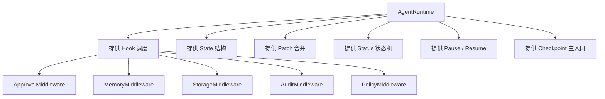
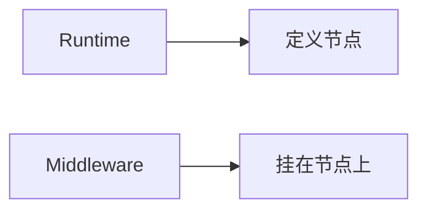
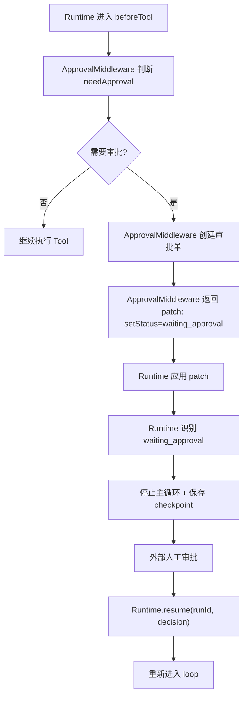
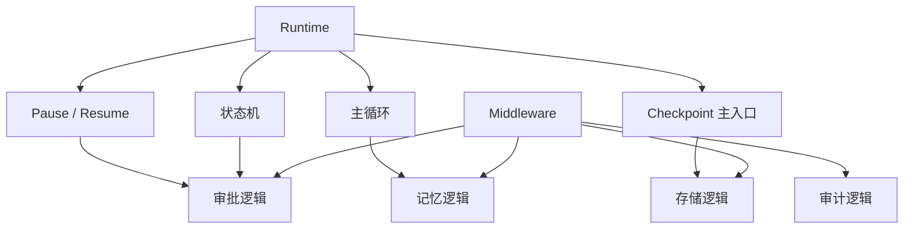

# Runtime 与 Middleware 边界设计

本文档详细说明企业 Agent 架构中 `AgentRuntime` 与 `Middleware` 的边界划分，重点回答下面这个关键问题：

> 权限审批、存储、记忆等能力，是否可以全部实现成独立 Middleware，而不在 Runtime 中写任何具体实现？

结论先说：

**可以尽量做成独立 Middleware，但 Runtime 不能完全没有这些能力对应的基础机制。**

更准确地说：

- `Middleware` 负责具体能力逻辑
- `Runtime` 负责状态机、控制流、生命周期、暂停/恢复等基础机制

一句话总结：

> Middleware 负责“做什么增强/规则”，  
> Runtime 负责“什么时候执行、什么时候停止、如何恢复、状态如何推进”。

---

## 1. 问题背景

在企业 Agent 系统里，常见的横切能力包括：

- 权限校验
- 审批
- 记忆加载与更新
- checkpoint 存储
- 审计
- 脱敏
- tracing / metrics

很多团队一开始会有两种极端倾向：

### 极端一：全部写死在 Runtime

结果：

- Runtime 越来越胖
- 业务扩展困难
- 各能力耦合严重
- 难测试、难替换

### 极端二：全部丢给 Middleware

结果：

- Middleware 要自己“偷着控制主循环”
- 没有统一暂停/恢复协议
- 各能力各自篡改状态
- Runtime 失去稳定的控制流定义

所以需要明确边界。

---

## 2. 一句话边界

最推荐的边界是：

### Runtime

负责：

- 生命周期节点
- 推理主循环
- 状态机
- 状态 patch 合并
- 中断 / 恢复
- 统一错误处理
- checkpoint 入口

### Middleware

负责：

- 在节点上挂能力
- 读取上下文
- 修改 request / response
- 产出 patch / 决策
- 调用外部服务

---

## 3. 总体关系图



这张图的关键点是：

- Runtime 不是具体实现每个能力
- Runtime 是能力运行的骨架
- Middleware 才是能力的具体实现位置

---

## 4. 判断标准

判断某个能力应该放 Runtime 还是 Middleware，可以用下面两个问题：

### 问题 1

这个能力是在回答：

- “**做什么规则/增强？**”

还是在回答：

- “**控制流怎么推进？**”

如果是前者，更适合 Middleware。  
如果是后者，必须 Runtime 支持。

### 问题 2

这个能力是否需要：

- 暂停主循环
- 恢复主循环
- 切换状态
- 统一落 checkpoint

如果需要，那 Runtime 必须原生支持。

---

## 5. Runtime 应该原生提供什么

即使大量能力 middleware 化，Runtime 也必须提供一组“基础控制点”。

## 5.1 生命周期节点

例如：

- `beforeRun`
- `beforeModel`
- `afterModel`
- `beforeTool`
- `afterTool`
- `onError`
- `afterRun`

Middleware 只能在这些节点上工作。

## 5.2 显式状态模型

Runtime 必须有统一状态：

```ts
export type AgentStatus =
  | "running"
  | "completed"
  | "failed"
  | "interrupted"
  | "waiting_approval";

export interface AgentState {
  runId: string;
  messages: AgentMessage[];
  memory: Record<string, unknown>;
  scratchpad: Record<string, unknown>;
  stepCount: number;
  status: AgentStatus;
  error?: AgentError;
}
```

没有统一状态，Middleware 就无法用统一方式表达：

- 暂停
- 恢复
- 审批中
- 失败

## 5.3 统一 patch 机制

Runtime 必须有统一 patch/reducer。

```ts
export interface AgentStatePatch {
  appendMessages?: AgentMessage[];
  mergeMemory?: Record<string, unknown>;
  setScratchpad?: Record<string, unknown>;
  setStatus?: AgentStatus;
  setError?: AgentError;
}
```

Middleware 应通过 patch 修改状态，而不是随意 mutate state。

## 5.4 Pause / Resume 能力

如果某个 middleware 想让 Agent 暂停，例如：

- 等审批
- 等人工输入
- 等外部异步任务

Runtime 必须认识这种状态并真正停止循环。

## 5.5 Checkpoint 主入口

Middleware 可以触发“需要保存”，但 Runtime 必须决定：

- 在哪些关键节点保存
- `resume(runId)` 如何重新进入主循环

## 5.6 错误主流程

Middleware 可以抛错，但 Runtime 必须统一：

- 捕获错误
- 标准化错误
- 触发 `onError`
- 决定是否终止

---

## 6. Middleware 应该负责什么

Middleware 非常适合实现横切能力。

## 6.1 典型适合 Middleware 的能力

- 权限增强校验
- 审批触发
- 记忆装载与保存
- 审计记录
- tracing / metrics
- prompt 注入
- 脱敏
- tool 结果修补
- message 修补

## 6.2 Middleware 的本质

Middleware 不是第二个 Runtime，而是 Runtime 的“可组合策略扩展层”。



### Runtime 决定

- 什么时候进入 `beforeTool`
- 什么时候停
- 什么时候继续

### Middleware 决定

- 在 `beforeTool` 时要不要审批
- 在 `beforeModel` 时要不要注入 memory
- 在 `afterTool` 时要不要更新审计

---

## 7. 权限审批如何设计

权限审批是最典型的边界案例。

---

## 7.1 哪些部分适合做 Middleware

审批逻辑非常适合作为 Middleware 来实现：

- 判断某个 tool call 是否需要审批
- 创建审批请求
- 记录审计
- 返回一个状态 patch

例如：

```ts
export class ApprovalMiddleware implements AgentMiddleware {
  name = "approval";

  constructor(
    private readonly approvalService: ApprovalService,
    private readonly policy: PolicyEngine,
  ) {}

  async beforeTool(ctx: AgentRunContext, call: ToolCall) {
    const tool = ctx.metadata.toolRegistry.get(call.name);
    const needApproval = await this.policy.needApproval?.(
      ctx,
      tool,
      call.input,
    );

    if (!needApproval) {
      return call;
    }

    await this.approvalService.create({
      id: crypto.randomUUID(),
      runId: ctx.state.runId,
      toolName: call.name,
      input: call.input,
      reason: "Tool requires approval",
      createdAt: new Date().toISOString(),
    });

    ctx.state = applyStatePatch(ctx.state, {
      setStatus: "waiting_approval",
      appendMessages: [
        {
          id: crypto.randomUUID(),
          role: "assistant",
          content: `操作 ${call.name} 需要审批，已进入待审批状态。`,
          createdAt: new Date().toISOString(),
          metadata: {
            approvalRequired: true,
            toolCallId: call.id,
          },
        },
      ],
    });

    return call;
  }
}
```

### 这个 Middleware 负责了什么

- 判断是否需要审批
- 调审批服务
- 生成 patch
- 写入提示消息

这些都非常适合放 middleware。

---

## 7.2 哪些部分必须 Runtime 支持

审批不可能完全只靠 Middleware。

Runtime 必须支持：

- 识别 `waiting_approval`
- 停止主循环
- 返回“当前 run 已暂停”
- 支持 `resume(runId, decision)`

### 如果 Runtime 不支持这些

那就会出现：

- middleware 设置了状态，但 loop 还在继续跑
- 审批完成后没有恢复入口
- checkpoint 无法和审批状态对齐

所以：

> 审批逻辑可以 middleware 化，  
> 但审批状态机和恢复入口必须 Runtime 原生支持。

---

## 7.3 审批完整流程



---

## 8. 记忆如何设计

记忆是最适合 Middleware 的能力之一。

## 8.1 为什么 Memory 很适合 Middleware

记忆的典型工作方式是：

- `beforeRun` 或 `beforeModel` 读取 memory
- `beforeModel` 注入 prompt/context
- `afterTool` 或 `afterRun` 更新 memory

这本质上就是横切增强，而不是控制流主逻辑。

## 8.2 MemoryMiddleware 示例

```ts
export class MemoryMiddleware implements AgentMiddleware {
  name = "memory";

  constructor(private readonly memoryStore: MemoryStore) {}

  async beforeRun(ctx: AgentRunContext): Promise<void> {
    const memory = await this.memoryStore.load(ctx);
    ctx.state = applyStatePatch(ctx.state, {
      mergeMemory: memory,
    });
  }

  beforeModel(ctx: AgentRunContext, req: ModelRequest): ModelRequest {
    const memoryText = JSON.stringify(ctx.state.memory, null, 2);

    return {
      ...req,
      systemPrompt: [
        req.systemPrompt,
        "",
        "以下是可用记忆：",
        memoryText,
      ].join("\n"),
    };
  }

  async afterRun(ctx: AgentRunContext): Promise<void> {
    await this.memoryStore.save?.(ctx, ctx.state.memory);
  }
}
```

## 8.3 Runtime 需要提供什么

Runtime 对 Memory 不需要理解具体业务逻辑，但必须提供：

- `ctx.state.memory`
- 统一 patch 合并
- 生命周期 hook

所以这类能力可以做到“逻辑完全 middleware 化”，Runtime 只提供基础骨架。

---

## 9. 存储如何设计

这里要先区分两种“存储”。

## 9.1 业务存储 / 领域存储

例如：

- 用户画像存储
- FAQ cache
- 历史摘要库
- 项目配置库
- 领域数据快照

这些非常适合由独立 `StorageMiddleware` 或 `MemoryMiddleware` 来管理。

## 9.2 Runtime Checkpoint 存储

例如：

- 当前 `messages`
- 当前 `stepCount`
- 当前 `status`
- 当前 `lastToolCall`
- 当前 `error`

这类存储不是普通业务存储，而是 Runtime 自身的生命线。

### 结论

业务存储可以 middleware 化；  
checkpoint 存储不能完全 middleware 化。

---

## 9.3 为什么 checkpoint 不能只靠 Middleware

因为 checkpoint 回答的问题不是：

- “要不要存一点业务数据”

而是：

- “Agent 在哪里停下来了”
- “恢复时从哪里接着跑”
- “当前状态机应该进入什么状态”

这些都必须由 Runtime 主控。

## 9.4 正确分工

### Runtime

- 提供 `saveCheckpoint()` 入口
- 提供 `resume(runId)` 入口
- 决定哪些状态必须保存
- 在关键节点统一保存

### Middleware

- 可以补充 checkpoint metadata
- 可以在节点上触发存储
- 可以写业务侧存储

---

## 10. 审计如何设计

审计也非常适合 middleware，但 Runtime 仍然需要提供统一事件节点。

## 10.1 审计适合 Middleware 的原因

审计通常是：

- 观察调用
- 记录事件
- 不改变主流程

这正是 Middleware 的典型职责。

## 10.2 AuditMiddleware 示例

```ts
export class AuditMiddleware implements AgentMiddleware {
  name = "audit";

  constructor(private readonly auditLogger: AuditLogger) {}

  async beforeModel(ctx: AgentRunContext, req: ModelRequest) {
    await this.auditLogger.log({
      id: crypto.randomUUID(),
      runId: ctx.state.runId,
      type: "model_called",
      timestamp: new Date().toISOString(),
      payload: {
        model: req.model,
        messageCount: req.messages.length,
      },
    });

    return req;
  }

  async afterTool(ctx: AgentRunContext, result: ToolExecutionResult) {
    await this.auditLogger.log({
      id: crypto.randomUUID(),
      runId: ctx.state.runId,
      type: "tool_succeeded",
      timestamp: new Date().toISOString(),
      payload: {
        toolName: result.tool.name,
        toolCallId: result.call.id,
      },
    });

    return result;
  }

  async onError(ctx: AgentRunContext, error: AgentError) {
    await this.auditLogger.log({
      id: crypto.randomUUID(),
      runId: ctx.state.runId,
      type: "run_failed",
      timestamp: new Date().toISOString(),
      payload: {
        code: error.code,
        message: error.message,
      },
    });
  }
}
```

## 10.3 Runtime 要提供什么

Runtime 至少要保证：

- `beforeModel`、`afterTool`、`onError` 等 hook 会被稳定调用
- `runId`、`state`、`metadata` 可供 middleware 读取

---

## 11. Middleware 可以做到什么程度

这里可以给一个很明确的结论。

## 11.1 可以几乎完全 middleware 化的能力

- 记忆
- prompt augment
- 审计
- tracing
- 脱敏
- tool result 修补
- message repair
- 业务存储

## 11.2 不能只有 middleware 的能力

- 主循环
- 状态机
- 暂停与恢复
- checkpoint 入口
- 错误主流程

这些必须 Runtime 原生支持。

---

## 12. 推荐的 Runtime 能力最小集合

如果你想尽量减少 Runtime 的业务实现，Runtime 至少也要保留下面这些基础能力：

```ts
export interface RuntimeCoreCapabilities {
  run(ctx: AgentRunContext): Promise<AgentResult>;
  resume(runId: string, payload?: Record<string, unknown>): Promise<AgentResult>;
  applyStatePatch(
    state: AgentState,
    patch: AgentStatePatch,
  ): AgentState;
  saveCheckpoint(ctx: AgentRunContext): Promise<void>;
  isTerminalStatus(status: AgentStatus): boolean;
  shouldPause(status: AgentStatus): boolean;
}
```

### 这几个能力不能下放给 middleware 的原因

因为它们定义的是 Runtime 的骨架，不是某个横切能力的实现。

---

## 13. 最推荐的实现模式

最佳模式不是：

- Runtime 全写死

也不是：

- 完全交给 Middleware 自由发挥

而是：

> Runtime 提供状态机、生命周期、patch、pause/resume、checkpoint 主入口  
> Middleware 在这些节点上实现具体能力



---

## 14. 一个推荐的抽象方式

你可以把 Runtime 当成“控制系统”，Middleware 当成“插件”。

### Runtime 提供

- 可观察节点
- 可修改对象
- 可提交 patch
- 可改变 status

### Middleware 提供

- 规则
- 计算
- 外部服务调用
- 决策建议

### 最后由 Runtime 统一执行控制动作

例如：

- middleware 说“需要审批”
- Runtime 决定“暂停并返回”

---

## 15. 推荐接口设计

## 15.1 Middleware 返回 patch / 决策

建议让 middleware 尽量返回明确 patch，而不是随意直接修改状态。

```ts
export interface MiddlewareDecision {
  statePatch?: AgentStatePatch;
  stopCurrentStep?: boolean;
}
```

比如审批 middleware：

```ts
{
  statePatch: {
    setStatus: "waiting_approval",
  },
  stopCurrentStep: true,
}
```

然后 Runtime 统一解释：

- 应用 patch
- 停止当前 step
- 保存 checkpoint

这样边界就很干净。

---

## 16. 常见误区

## 16.1 误区一：既然能 middleware 化，就不需要 Runtime 支持

错误。  
如果 Runtime 没有状态机和 pause/resume，审批 middleware 根本无法真正生效。

## 16.2 误区二：middleware 可以随便改 state

不推荐。  
应走统一 patch/reducer，否则调试、审计、恢复都会变得很难。

## 16.3 误区三：checkpoint 可以完全由 middleware 决定

不推荐。  
checkpoint 的主入口和 resume 逻辑必须由 Runtime 统一控制。

## 16.4 误区四：Policy / Middleware / Runtime 没必要区分

一旦不区分，后期就会：

- 规则散落
- 状态流混乱
- 审批/恢复难以维护

---

## 17. 设计总结

关于“权限审批、存储、记忆是不是应该做独立 middleware”这个问题，最终答案是：

### 可以做独立 Middleware 的部分

- 权限审批逻辑
- 记忆加载与更新
- 审计
- 业务存储
- 上下文注入
- 结果修补

### 必须由 Runtime 原生支持的部分

- 状态机
- pause / resume
- checkpoint 主入口
- 主循环控制
- 错误主流程

一句话总结：

**Middleware 负责实现能力，Runtime 负责让这些能力真正进入可控的执行流程。**

---

## 18. 下一步建议

如果继续实现，建议下一步直接落这几类代码：

1. `src/agent/middleware/types.ts`
2. `src/agent/middleware/pipeline.ts`
3. `src/agent/middleware/approval-middleware.ts`
4. `src/agent/middleware/memory-middleware.ts`
5. `src/agent/middleware/audit-middleware.ts`
6. `src/agent/runtime/runtime-core.ts`

其中：

- `runtime-core.ts` 只保留状态机、pause/resume、patch、checkpoint 主入口
- 各能力都尽量放到 middleware 文件里
