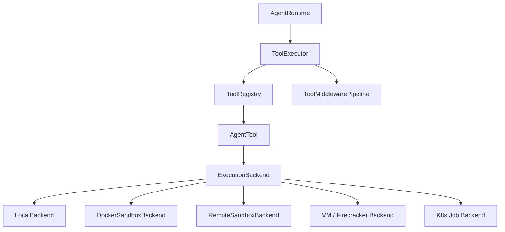
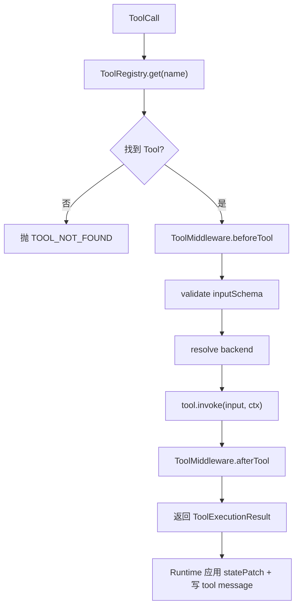
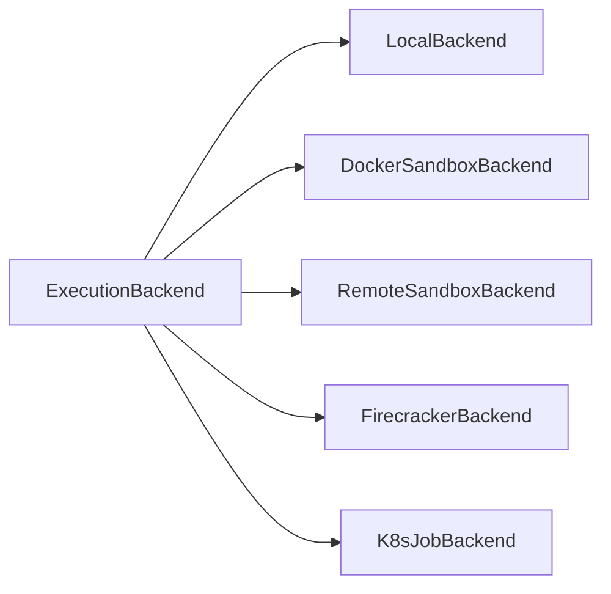
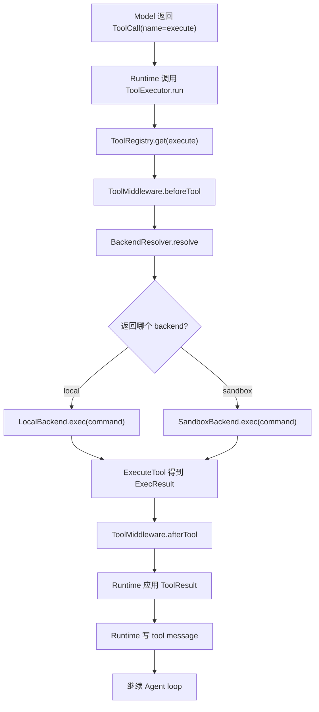

# 工具执行与可扩展 Sandbox 设计

本文档详细说明企业 Agent Runtime 中“工具系统”应如何设计，重点覆盖：

- 工具管理如何实现
- 工具执行链路如何实现
- 工具与 Runtime / Middleware / Policy / Message 的关系
- `sandbox` 如何设计成可扩展 backend
- 如何同时支持 sandbox 执行与本地执行
- 一个完整的工具例子
- 工具到底“在哪里执行”

本文档默认与以下文档配合阅读：

- [enterprise-agent-base-design.md](/Users/wrr/work/renx-code-v3/enterprise-agent-base-design.md)
- [runtime-vs-middleware-boundary-design.md](/Users/wrr/work/renx-code-v3/runtime-vs-middleware-boundary-design.md)
- [provider-model-adapter-error-design.md](/Users/wrr/work/renx-code-v3/provider-model-adapter-error-design.md)
- [agent-message-management-design.md](/Users/wrr/work/renx-code-v3/agent-message-management-design.md)

---

## 1. 设计目标

工具系统的目标不是简单提供几个函数，而是建立一套：

- 可注册
- 可查找
- 可调度
- 可治理
- 可审计
- 可切换执行环境
- 可扩展 sandbox/local backend

的工具基础设施。

### 1.1 必须解决的问题

- 工具如何统一注册与发现
- Runtime 如何执行工具
- tool call 结果如何进入 Agent 主循环
- 工具前后如何挂 middleware
- 哪些工具走 sandbox，哪些走本地
- backend 如何按策略动态选择
- 高风险工具如何审批和审计

### 1.2 一句话目标

> 工具本体负责“做事”，  
> ToolExecutor 负责“执行调度”，  
> Backend 负责“在哪执行”，  
> Middleware 负责“前后治理”。

---

## 2. 总体架构



### 2.1 核心结论

- 工具本体不是 middleware
- 工具执行主链路不能从 Runtime 中消失
- sandbox 不应该写死成一个特殊分支
- 应把 sandbox/local 都抽象为 backend

---

## 3. 工具系统的四层分工

工具系统最稳的方式是分成 4 层。

## 3.1 AgentTool

职责：

- 定义某个工具的名称、描述、输入输出
- 实现该工具的实际业务逻辑

例如：

- `query_ticket`
- `search_faq`
- `read_file`
- `write_file`
- `execute`

## 3.2 ToolRegistry

职责：

- 注册工具
- 根据名称查找工具
- 列出所有工具
- 支持后续做 alias / tags / capability 分类

## 3.3 ToolExecutor

职责：

- 接收 `ToolCall`
- 查找工具
- 跑 `beforeTool/afterTool` middleware
- 校验输入
- 注入 backend
- 执行工具
- 收集 `ToolResult`
- 回给 Runtime

## 3.4 ExecutionBackend

职责：

- 提供执行环境抽象
- 决定到底在本地、sandbox、远程环境执行

---

## 4. 工具不是 Middleware

这是最重要的边界之一。

### 工具本体

回答的是：

> “这个能力怎么做？”

### Middleware

回答的是：

> “这个能力执行前后要做什么增强、限制、记录？”

所以：

- 工具本体不是 middleware
- 工具执行前后的审批、审计、修补才适合 middleware

---

## 5. Tool 协议设计

## 5.1 ToolCall

```ts
export interface ToolCall {
  id: string;
  name: string;
  input: unknown;
}
```

### 设计要求

- `id` 必须存在，方便 message pairing 与审计
- `name` 必须稳定
- `input` 必须能序列化

## 5.2 ToolResult

```ts
export interface ToolResult {
  content: string;
  structured?: unknown;
  metadata?: Record<string, unknown>;
  statePatch?: AgentStatePatch;
}
```

### 为什么不是只返回字符串

因为企业工具执行后经常还需要：

- 返回结构化信息
- 更新 state
- 写 memory
- 触发审批或暂停
- 带审计 metadata

## 5.3 ToolContext

```ts
export interface ToolContext {
  runContext: AgentRunContext;
  toolCall: ToolCall;
  backend?: ExecutionBackend;
  metadata?: Record<string, unknown>;
}
```

### 为什么要把 backend 放在 ToolContext

因为：

- 有些工具需要执行环境
- 有些工具只是业务 HTTP/API 工具，不需要 backend

让 backend 出现在 `ToolContext` 里，可以让工具按能力选择使用，而不是写死依赖。

## 5.4 AgentTool

```ts
export interface AgentTool {
  name: string;
  description: string;
  inputSchema?: unknown;
  capabilities?: string[];
  invoke(input: unknown, ctx: ToolContext): Promise<ToolResult>;
}
```

### `capabilities` 可做什么

例如：

- `requires-exec`
- `requires-filesystem-read`
- `requires-filesystem-write`
- `read-only`
- `high-risk`

后续可供 policy 和 backend resolver 参考。

---

## 6. ToolRegistry 设计

Registry 不负责执行，只负责注册与查找。

## 6.1 最小接口

```ts
export interface ToolRegistry {
  register(tool: AgentTool): void;
  get(name: string): AgentTool | undefined;
  list(): AgentTool[];
}
```

## 6.2 内存版实现

```ts
export class InMemoryToolRegistry implements ToolRegistry {
  private readonly tools = new Map<string, AgentTool>();

  register(tool: AgentTool): void {
    if (this.tools.has(tool.name)) {
      throw new Error(`Tool already registered: ${tool.name}`);
    }
    this.tools.set(tool.name, tool);
  }

  get(name: string): AgentTool | undefined {
    return this.tools.get(name);
  }

  list(): AgentTool[] {
    return [...this.tools.values()];
  }
}
```

## 6.3 后续可扩展的能力

- alias 支持
- 按 capability 查询
- tenant 级过滤
- business agent 专属工具集
- lazy load

---

## 7. ToolExecutor 设计

ToolExecutor 是工具系统的核心执行器。

## 7.1 ToolExecutor 职责

- 根据 tool name 查找 tool
- 做 schema 校验
- 跑 tool middleware
- 解析 backend
- 调用工具
- 包装工具执行结果

## 7.2 核心执行流程



## 7.3 ToolExecutionResult

```ts
export interface ToolExecutionResult {
  tool: AgentTool;
  call: ToolCall;
  output: ToolResult;
}
```

## 7.4 推荐实现

```ts
export class ToolExecutor {
  constructor(
    private readonly registry: ToolRegistry,
    private readonly middleware: ToolMiddlewarePipeline,
    private readonly backendResolver: BackendResolver,
  ) {}

  async run(
    call: ToolCall,
    ctx: AgentRunContext,
  ): Promise<ToolExecutionResult> {
    const tool = this.registry.get(call.name);
    if (!tool) {
      throw new Error(`Tool not found: ${call.name}`);
    }

    const patchedCall = await this.middleware.runBeforeTool(ctx, call);

    // 这里可以接 JSON schema 校验
    const backend = await this.backendResolver.resolve(ctx, tool, patchedCall);

    let output = await tool.invoke(patchedCall.input, {
      runContext: ctx,
      toolCall: patchedCall,
      backend,
    });

    let result: ToolExecutionResult = {
      tool,
      call: patchedCall,
      output,
    };

    result = await this.middleware.runAfterTool(ctx, result);
    return result;
  }
}
```

---

## 8. 为什么要抽象 ExecutionBackend

如果不抽象 backend，后面很快会演化成：

- `if sandbox then ...`
- `else if local then ...`
- `else if remote then ...`

最后每个工具里都是环境分支，扩展性和可维护性都会变差。

正确做法是：

> Tool 不关心自己是在本地还是 sandbox 里执行，  
> Tool 只依赖统一 backend 能力接口。

---

## 9. ExecutionBackend 设计

## 9.1 最小接口

```ts
export interface ExecOptions {
  cwd?: string;
  env?: Record<string, string>;
  timeoutMs?: number;
}

export interface ExecResult {
  stdout: string;
  stderr: string;
  exitCode: number;
}

export interface FileInfo {
  path: string;
  isDirectory?: boolean;
  size?: number;
  modifiedAt?: string;
}

export interface BackendCapabilities {
  exec: boolean;
  filesystemRead: boolean;
  filesystemWrite: boolean;
  network?: boolean;
  persistentSession?: boolean;
}

export interface ExecutionBackend {
  kind: string;

  capabilities(): BackendCapabilities;

  exec?(command: string, opts?: ExecOptions): Promise<ExecResult>;
  readFile?(path: string): Promise<string>;
  writeFile?(path: string, content: string): Promise<void>;
  listFiles?(path: string): Promise<FileInfo[]>;
}
```

## 9.2 为什么用 capability 而不是只看 `kind`

因为未来 backend 可能很多：

- local
- docker-sandbox
- remote-sandbox
- firecracker
- k8s-job

直接按 `kind` 写逻辑会越来越多。  
按 capability 做判断更稳：

- 支不支持 exec
- 支不支持文件写入
- 支不支持持久会话

---

## 10. Sandbox 设计成可扩展 backend

这是本文最重要的部分之一。

## 10.1 推荐原则

不要把 `sandbox` 当成一个固定对象，而要把它当成：

**`ExecutionBackend` 的一个实现族**



## 10.2 为什么 sandbox 必须可扩展

企业场景里会有不同需求：

- 开发环境直接本地执行
- 生产环境高风险任务必须容器隔离
- 多租户环境需要远程隔离沙箱
- 重计算任务需要独立 job backend

如果写死成一个 `SandboxBackend`，后续很快会卡住。

## 10.3 Session 能力

很多 sandbox 不是单次执行，而是有会话概念。

```ts
export interface BackendSession {
  id: string;
  exec(command: string, opts?: ExecOptions): Promise<ExecResult>;
  readFile(path: string): Promise<string>;
  writeFile(path: string, content: string): Promise<void>;
  close(): Promise<void>;
}

export interface SessionCapableBackend extends ExecutionBackend {
  createSession?(opts?: Record<string, unknown>): Promise<BackendSession>;
}
```

适用场景：

- 多步代码修改
- REPL
- 持续文件变更
- 上下文保持

---

## 11. 如何同时支持 Sandbox 和本地

这里有个关键结论：

> 不要做两套工具，  
> 要做一套工具 + 两种 backend。

例如：

- 一个 `execute` 工具
- 一个 `read_file` 工具
- 一个 `write_file` 工具

它们运行时通过 backend 决定到底去哪执行。

---

## 12. BackendResolver 设计

Runtime 或 ToolExecutor 不应自己写死：

- 哪个工具走 local
- 哪个工具走 sandbox

建议抽一个 `BackendResolver`。

## 12.1 接口

```ts
export interface BackendResolver {
  resolve(
    ctx: AgentRunContext,
    tool: AgentTool,
    call: ToolCall,
  ): Promise<ExecutionBackend | undefined>;
}
```

## 12.2 推荐决策依据

- tool capability
- policy
- 当前 environment
- 用户/租户权限
- 风险等级

## 12.3 一个简单实现

```ts
export class DefaultBackendResolver implements BackendResolver {
  constructor(
    private readonly localBackend: ExecutionBackend,
    private readonly sandboxBackend: ExecutionBackend,
  ) {}

  async resolve(
    _ctx: AgentRunContext,
    tool: AgentTool,
  ): Promise<ExecutionBackend | undefined> {
    if (tool.capabilities?.includes("requires-exec")) {
      return this.sandboxBackend;
    }

    if (
      tool.capabilities?.includes("requires-filesystem-read") ||
      tool.capabilities?.includes("requires-filesystem-write")
    ) {
      return this.sandboxBackend;
    }

    return this.localBackend;
  }
}
```

### 说明

这里只是一个示例策略。真实系统中，通常还要结合：

- tenant policy
- user role
- 审批结果
- 当前部署环境

---

## 13. 一个完整工具例子：`execute`

这是最典型的“既可 sandbox 又可本地”的工具。

## 13.1 工具定义

```ts
export class ExecuteTool implements AgentTool {
  name = "execute";
  description = "Execute a shell command";
  capabilities = ["requires-exec"];

  inputSchema = {
    type: "object",
    properties: {
      command: { type: "string" },
      cwd: { type: "string" },
    },
    required: ["command"],
  };

  async invoke(input: any, ctx: ToolContext): Promise<ToolResult> {
    if (!ctx.backend?.exec) {
      throw new Error("Current backend does not support exec");
    }

    const result = await ctx.backend.exec(input.command, {
      cwd: input.cwd,
    });

    return {
      content: [
        result.stdout,
        result.stderr,
        `[exitCode=${result.exitCode}]`,
      ]
        .filter(Boolean)
        .join("\n"),
      structured: result,
      metadata: {
        backendKind: ctx.backend.kind,
      },
    };
  }
}
```

## 13.2 它到底在哪里执行

取决于 `BackendResolver` 返回的 backend：

### 如果返回 `LocalBackend`

那就本地执行。

例如：

```ts
ctx.backend.kind === "local"
```

真正执行位置是：

- 当前应用所在机器
- 当前宿主进程可访问的本地环境

### 如果返回 `DockerSandboxBackend`

那就容器内执行。

例如：

```ts
ctx.backend.kind === "docker-sandbox"
```

真正执行位置是：

- 一个独立容器
- 带受限文件系统 / 网络 / 资源限制

### 如果返回 `RemoteSandboxBackend`

那就远程执行。

真正执行位置是：

- 远程 sandbox service
- VM / container / isolation worker

---

## 14. `execute` 工具完整执行过程



---

## 15. 本地 backend 例子

## 15.1 LocalBackend 接口实现

```ts
import { execFile } from "node:child_process";
import { promisify } from "node:util";

const execFileAsync = promisify(execFile);

export class LocalBackend implements ExecutionBackend {
  kind = "local";

  capabilities(): BackendCapabilities {
    return {
      exec: true,
      filesystemRead: true,
      filesystemWrite: true,
      network: true,
    };
  }

  async exec(command: string, opts?: ExecOptions): Promise<ExecResult> {
    const { stdout, stderr } = await execFileAsync("sh", ["-lc", command], {
      cwd: opts?.cwd,
      env: {
        ...process.env,
        ...(opts?.env ?? {}),
      },
      timeout: opts?.timeoutMs,
    });

    return {
      stdout,
      stderr,
      exitCode: 0,
    };
  }

  async readFile(path: string): Promise<string> {
    const fs = await import("node:fs/promises");
    return fs.readFile(path, "utf-8");
  }

  async writeFile(path: string, content: string): Promise<void> {
    const fs = await import("node:fs/promises");
    await fs.writeFile(path, content, "utf-8");
  }
}
```

### 注意

本地 backend 风险很高，必须配合：

- policy
- approval
- 工作目录限制
- 命令约束
- 审计

---

## 16. Sandbox backend 例子

这里给一个抽象示例，不绑定具体容器实现。

```ts
export interface SandboxClient {
  exec(command: string, opts?: ExecOptions): Promise<ExecResult>;
  readFile(path: string): Promise<string>;
  writeFile(path: string, content: string): Promise<void>;
}

export class RemoteSandboxBackend implements ExecutionBackend {
  kind = "remote-sandbox";

  constructor(private readonly client: SandboxClient) {}

  capabilities(): BackendCapabilities {
    return {
      exec: true,
      filesystemRead: true,
      filesystemWrite: true,
      network: false,
      persistentSession: true,
    };
  }

  exec(command: string, opts?: ExecOptions): Promise<ExecResult> {
    return this.client.exec(command, opts);
  }

  readFile(path: string): Promise<string> {
    return this.client.readFile(path);
  }

  writeFile(path: string, content: string): Promise<void> {
    return this.client.writeFile(path, content);
  }
}
```

### 这里真正在哪里执行

不是在当前进程里执行，而是在：

- 远程隔离服务
- 容器
- VM
- worker 节点

backend 只负责代理这件事。

---

## 17. 一个文件工具例子：`read_file`

## 17.1 工具定义

```ts
export class ReadFileTool implements AgentTool {
  name = "read_file";
  description = "Read a file from execution backend";
  capabilities = ["requires-filesystem-read"];

  inputSchema = {
    type: "object",
    properties: {
      path: { type: "string" },
    },
    required: ["path"],
  };

  async invoke(input: any, ctx: ToolContext): Promise<ToolResult> {
    if (!ctx.backend?.readFile) {
      throw new Error("Current backend does not support readFile");
    }

    const content = await ctx.backend.readFile(input.path);

    return {
      content,
      metadata: {
        backendKind: ctx.backend.kind,
        path: input.path,
      },
    };
  }
}
```

### 运行位置

- 如果 backend 是 local，就读本地文件系统
- 如果 backend 是 sandbox，就读 sandbox 内文件系统

这个工具本体不需要知道具体实现，只需要 backend 能力。

---

## 18. Tool Middleware 的作用

工具执行前后非常适合挂 middleware。

## 18.1 `beforeTool`

适合做：

- schema 二次校验
- policy 检查
- 审批
- backend 选择前的限制判断
- tracing/span 创建

## 18.2 `afterTool`

适合做：

- tool result 脱敏
- 截断大结果
- 记忆更新
- 审计
- cache 写入

## 18.3 一个审批中间件例子

```ts
export class ToolApprovalMiddleware implements AgentMiddleware {
  name = "tool-approval";

  constructor(
    private readonly approvalService: ApprovalService,
    private readonly policy: PolicyEngine,
  ) {}

  async beforeTool(ctx: AgentRunContext, call: ToolCall): Promise<ToolCall> {
    const tool = ctx.metadata.toolRegistry.get(call.name);
    const needApproval = await this.policy.needApproval?.(
      ctx,
      tool,
      call.input,
    );

    if (!needApproval) {
      return call;
    }

    await this.approvalService.create({
      id: crypto.randomUUID(),
      runId: ctx.state.runId,
      toolName: call.name,
      input: call.input,
      reason: "High risk tool call",
      createdAt: new Date().toISOString(),
    });

    ctx.state = applyStatePatch(ctx.state, {
      setStatus: "waiting_approval",
    });

    return call;
  }
}
```

### 注意

审批逻辑适合 middleware，但：

- Runtime 必须认识 `waiting_approval`
- Runtime 必须真正停下来

---

## 19. Runtime 如何接入工具系统

Runtime 不应直接操作具体工具实现，而应通过 `ToolExecutor`。

## 19.1 推荐调用方式

```ts
for (const call of modelResp.toolCalls) {
  const result = await this.toolExecutor.run(call, ctx);

  ctx.state = applyStatePatch(ctx.state, result.output.statePatch ?? {});

  ctx.state = this.messageManager.appendToolResultMessage(
    ctx.state,
    result.tool.name,
    result.call.id,
    result.output.content,
  );
}
```

## 19.2 为什么 Runtime 不直接调 Tool

因为那样会让 Runtime 同时承担：

- tool 查找
- input 校验
- backend 选择
- middleware 调度

最终又会膨胀成一个大类。

---

## 20. 安全与治理建议

支持本地和 sandbox 执行时，安全边界尤其重要。

## 20.1 本地执行的最小安全要求

- 必须受 policy 控制
- 高风险命令必须审批
- 限制 `cwd`
- 限制可写目录
- 记录审计
- 最好支持命令 allowlist/denylist

## 20.2 sandbox 执行的最小要求

- 隔离文件系统
- 限制网络
- 限制 CPU / memory / timeout
- 具备会话清理机制
- 支持审计

## 20.3 哪些工具建议默认走 sandbox

- `execute`
- `write_file`
- `edit_file`
- 任意用户输入会形成 shell 命令的工具
- 高风险代码分析/执行工具

## 20.4 哪些工具可以直接本地或业务服务调用

- `search_faq`
- `query_ticket`
- `get_customer_profile`
- `read_only_metrics_query`

---

## 21. 目录结构建议

```text
src/agent/tools/
  types.ts
  registry.ts
  executor.ts
  errors.ts

src/agent/backends/
  types.ts
  resolver.ts
  local-backend.ts
  remote-sandbox-backend.ts
  docker-sandbox-backend.ts

src/agent/tools/builtin/
  execute-tool.ts
  read-file-tool.ts
  write-file-tool.ts

src/agent/tools/business/
  query-ticket-tool.ts
  search-faq-tool.ts

src/agent/middleware/tools/
  tool-approval-middleware.ts
  tool-audit-middleware.ts
  tool-redaction-middleware.ts
```

---

## 22. 推荐实现顺序

最建议按下面顺序实现：

1. `tools/types.ts`
2. `tools/registry.ts`
3. `backends/types.ts`
4. `backends/resolver.ts`
5. `tools/executor.ts`
6. `backends/local-backend.ts`
7. `backends/remote-sandbox-backend.ts`
8. `tools/builtin/execute-tool.ts`
9. `tools/builtin/read-file-tool.ts`
10. `middleware/tools/tool-approval-middleware.ts`

这样你会先得到一条完整但不复杂的主链。

---

## 23. 总结

这套工具系统设计的核心结论是：

- 工具管理通过 `ToolRegistry`
- 工具执行通过 `ToolExecutor`
- 工具本体只负责能力实现
- 执行环境通过 `ExecutionBackend` 抽象
- sandbox 只是 backend 的一种实现
- 本地执行与 sandbox 执行通过 backend resolver 决定
- 工具前后治理通过 middleware 完成

一句话总结：

**Tool 负责做事，Executor 负责调度，Backend 决定在哪做，Middleware 决定执行前后要加什么治理。**

---

## 24. 下一步建议

如果继续落代码，最合理的下一步是先实现：

1. `src/agent/tools/types.ts`
2. `src/agent/tools/registry.ts`
3. `src/agent/backends/types.ts`
4. `src/agent/backends/resolver.ts`
5. `src/agent/tools/executor.ts`
6. `src/agent/tools/builtin/execute-tool.ts`

这几步完成后，再继续加：

- `local-backend.ts`
- `remote-sandbox-backend.ts`
- tool middleware
- 业务工具
