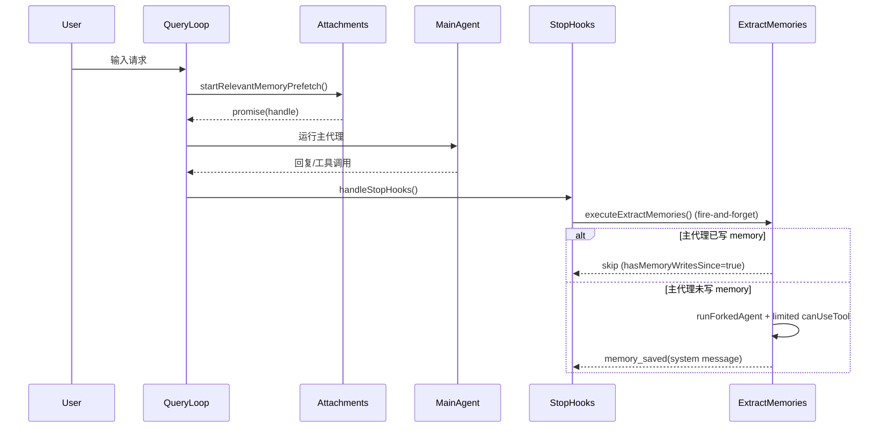
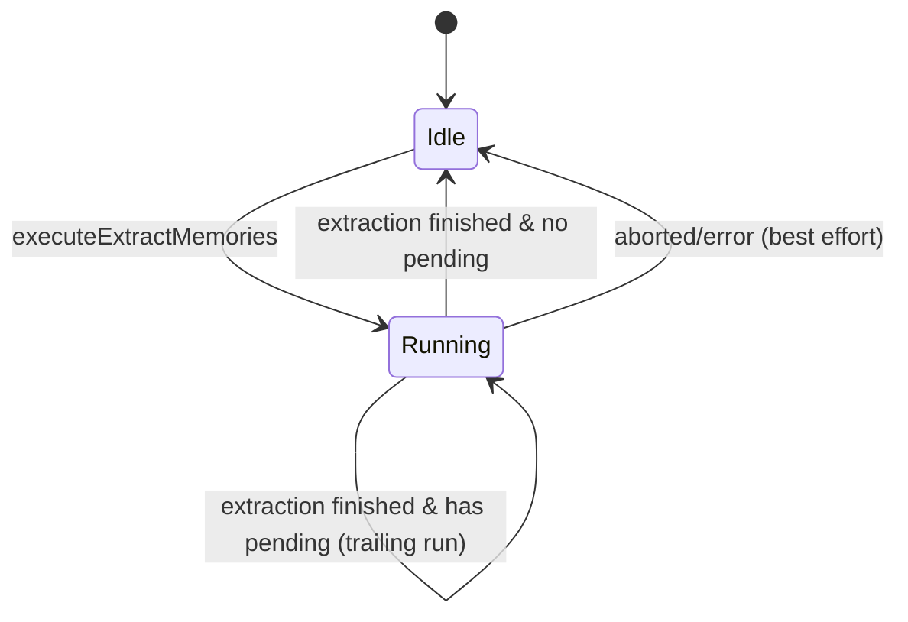
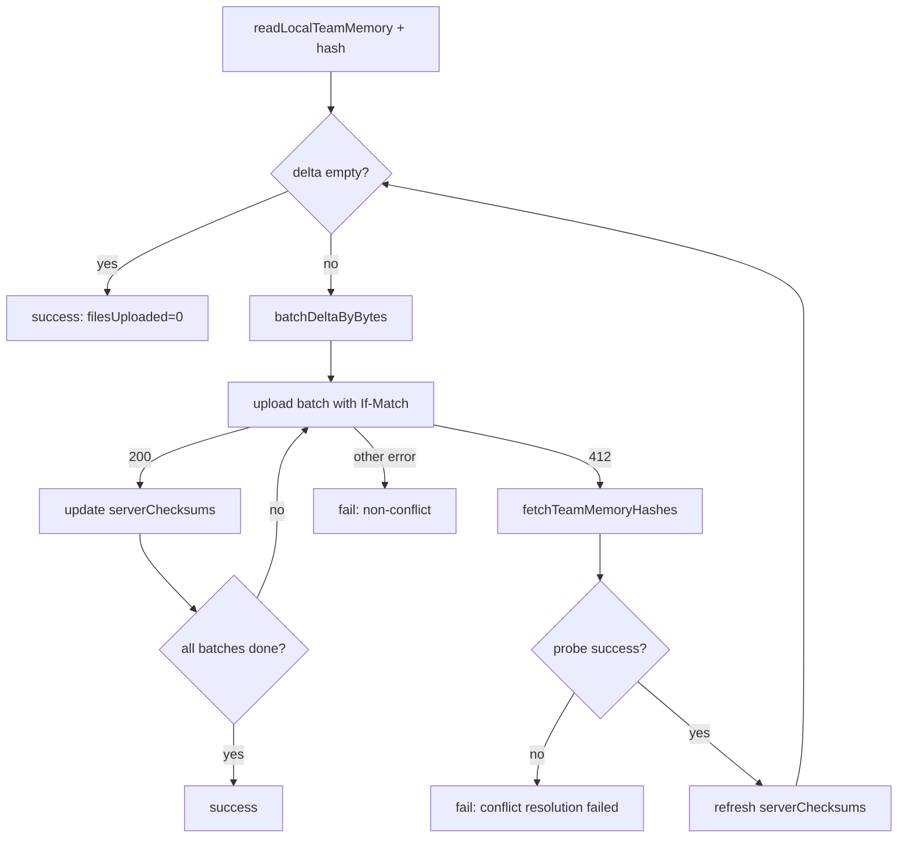
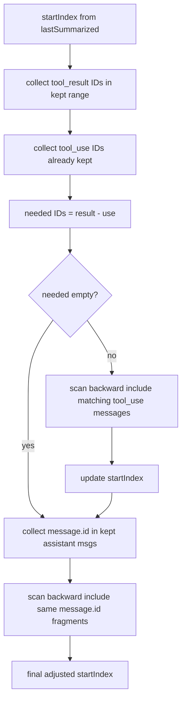

# 分册 05：形式化论证、审计附录与测试模板

> **节选来源**：[claude-code-memory-system-deep-analysis.md](./claude-code-memory-system-deep-analysis.md)  
> **分析源码树**：`D:\work\claude-code-source`  
> **本册对应合订本章节**：三十一～三十六、四十六～四十八。

### 使用方式

- **评审 / 审计**：优先看「函数副作用矩阵」与伪代码附录。  
- **写测**：复制「测试任务最小模板」并按模块填函数名与不变量。

---

## 三十一、形式化论证（一）：TeamMemory 412 冲突重试为什么可收敛

这一节把 `pushTeamMemory()` 的冲突处理写成接近证明的形式。

### 31.1 定义

设：

- 本地条目集合为 `L = { (k, hL(k)) }`，`hL` 是本地内容哈希；
- 客户端缓存的服务端哈希映射为 `S_t = { (k, hS_t(k)) }`，其中 `t` 是第 `t` 次重试轮次；
- 每轮上传增量集合定义为：

`Δ_t = { k | hL(k) != hS_t(k) }`

`pushTeamMemory()` 每轮实际上传的就是 `Δ_t`（再按字节切成批次）。

### 31.2 冲突后状态更新

当服务端返回 412 时，客户端执行 `fetchTeamMemoryHashes()`，得到最新服务端哈希映射 `S_(t+1)`。  
此后重新计算：

`Δ_(t+1) = { k | hL(k) != hS_(t+1)(k) }`

### 31.3 收敛性直觉

如果并发写入不是无限持续，且同一 key 的最终服务端状态趋于稳定，则：

1. 每次 `S_t` 刷新都更接近稳定服务端状态；
2. 对于已经与本地一致的 key，`k` 会从 `Δ_t` 中消失；
3. `|Δ_t|` 在有限重试窗口内要么下降，要么保持；
4. 当 `Δ_t = ∅` 时，上传可提前成功（“无增量成功”）。

### 31.4 非收敛边界

以下场景会导致“理论上可能不收敛”：

- 外部并发持续高频写同一 key，且每轮都改变值；
- 服务端哈希探针失败（`view=hashes` 不可用）；
- 客户端重试上限过小，提前放弃。

源码处理方式是有限重试 + 失败上报，而不是无限循环，这符合工程上“可控失败优先”的策略。

### 31.5 为什么不是三方合并

三方合并可提高同 key 并发编辑保真，但会显著增加：

- 协议复杂度；
- 合并冲突语义不确定性；
- 用户可解释性成本。

当前实现选择 local-wins（同 key）是“用户刚编辑内容不被静默吞掉”的产品优先级体现。

---

## 三十二、形式化论证（二）：SessionCompact 边界修正为何能避免 orphan tool_result

### 32.1 问题定义

在 Anthropic 消息协议中，`tool_result(tool_use_id=x)` 必须有先前 `tool_use(id=x)`。  
若 compact 切片导致结果在、调用不在，则请求非法。

### 32.2 算法要点（`adjustIndexToPreserveAPIInvariants`）

该函数执行两个回溯：

1. 收集保留区全部 `tool_result` 的 ID 集合 `R`；
2. 收集保留区已存在的 `tool_use` ID 集合 `U`；
3. 计算缺失集合 `M = R - U`；
4. 从 `startIndex - 1` 向前回溯，找到包含 `M` 中任一 ID 的 `tool_use` 消息并前移起点，直到 `M` 为空。

### 32.3 正确性结论（在当前消息数组稳定前提下）

若回溯完成后 `M = ∅`，则保留区内每个 `tool_result` 都存在对应 `tool_use`。  
因此不会出现 orphan tool_result。

### 32.4 仍需额外处理的第二类不变量

即使 tool pair 完整，仍可能丢失同 `message.id` 的 thinking 分片。  
所以函数还做第二轮回溯：同 `message.id` 祖先片段合并保留。

这保证了“协议合法 + 语义连贯”两层目标。

---

## 三十三、反例驱动分析：若移除关键约束会发生什么

### 33.1 反例 A：移除 extract 中主写互斥

若删除 `hasMemoryWritesSince` 判定：

- 主代理与抽取器可能同时改同一 memory topic；
- 会出现索引重复追加、内容来回覆盖、同义记忆分叉；
- 结果是记忆库质量快速劣化（重复率提升、召回噪声上升）。

### 33.2 反例 B：相关召回不做去重

若去掉 `alreadySurfaced + readFileState` 去重：

- 同一记忆在连续轮次重复注入；
- 预算被重复内容占满，新信息注入能力下降；
- 会话后段“召回看起来很活跃，实际上信息增量很低”。

### 33.3 反例 C：TeamMem 不做 secret scan

若写入和 push 前都不扫描：

- 模型一次误写 API key 即可能被同步到共享端；
- 风险范围从“单机泄露”扩大为“团队级扩散”；
- 后果不可接受，且难以补救（下游日志/备份可能已扩散）。

### 33.4 反例 D：compact 不修正 tool pair

若不做 `adjustIndexToPreserveAPIInvariants`：

- compact 后可能请求直接失败；
- 或出现“调用上下文断裂”的不可解释行为；
- 这不是体验问题，而是 correctness bug。

---

## 三十四、Mermaid 图谱（实现级）

> 以下图可直接在支持 Mermaid 的渲染器中展示。

### 34.1 主回合 + 预取 + 回合后抽取时序图



### 34.2 ExtractMemories 并发状态机



### 34.3 TeamMemory push 冲突重试图



### 34.4 Session compact 不变量修正图



---

## 三十五、测试策略升级：从覆盖率到“行为证明”

你如果要把这套系统验证到“论文级可信”，建议测试不只看覆盖率，而是看“性质（property）”。

### 35.1 属性测试（Property-based）建议

1. **Tool pair 完整性属性**
   - 输入：随机消息序列（含 tool_use/tool_result、分片 message.id）
   - 断言：compact 后不存在 orphan tool_result。

2. **Team delta 收敛属性**
   - 输入：随机本地集合 + 随机冲突脚本
   - 断言：在有限冲突停止后，delta 单调不增并最终为空或成功。

3. **路径安全属性**
   - 输入：随机路径变体（编码、unicode、symlink、UNC）
   - 断言：非法路径永不通过 `validateTeamMemKey/WritePath`。

4. **去重属性**
   - 输入：随机 surfacing 历史 + readFileState
   - 断言：同一路径在无内容变化场景下不会重复注入。

### 35.2 故障注入（Fault Injection）建议

- 注入 `fetchTeamMemoryHashes` 网络失败；
- 注入目录读写权限错误；
- 注入 stopHooks 中断；
- 注入大文件与 413；
- 注入 dangling symlink。

观察指标应覆盖：

- 是否错误分型正确；
- 是否触发正确熔断/回退；
- 是否造成状态泄漏或死循环。

### 35.3 回归守护（Golden Tests）建议

为以下函数建立 golden fixtures：

- `truncateEntrypointContent`（长行/长文件组合）
- `buildMemoryLines`（各 gate 组合）
- `adjustIndexToPreserveAPIInvariants`（复杂消息序列）
- `batchDeltaByBytes`（边界字节切分）

这样重构时不会悄悄破坏协议语义。

---

## 三十六、最终补充结论：从“工程实现”到“可演化基础设施”

现在可以更严格地说：

Claude Code 的记忆系统已经具备“可演化基础设施”特征，而不是 feature patch：

- 有稳定语义层（类型学、存储约束、使用规则）；
- 有运行时状态机（预取、抽取、压缩、同步）；
- 有协议不变量（tool pair、message 分片、冲突重试）；
- 有安全边界（路径、权限、secret）；
- 有可观测与可验证机制（telemetry + property tests + fault injection）。

这意味着后续演进应遵循“协议升级”思路，而不是“模块小修补”思路：

1. 先定义语义与不变量；
2. 再调整模块实现；
3. 最后用性质测试和故障注入验证。

如果你后续继续要“论文深度”，下一步可以做的就是：

- 为第 31-35 章每条结论补“可执行实验脚本”；
- 将本文件变为“设计+验证报告”二合一文档（Design + Validation Report）。

---

## 三十七、逐函数实现剖析（A）：`src/memdir/paths.ts`

## 四十六、代码审计级附录（一）：伪代码对照与形式化规格

> 本附录给出“可执行思维模型”。每个函数按统一模板描述：  
> **伪代码** -> **输入域/输出域** -> **不变量** -> **失败注入模板**。  
> 你可以直接把“失败注入模板”改成单测（Jest/Bun test）案例。

### 46.1 `isAutoMemoryEnabled`

#### 伪代码

```text
function isAutoMemoryEnabled():
  envVal = ENV.CLAUDE_CODE_DISABLE_AUTO_MEMORY
  if isTruthy(envVal): return false
  if isDefinedFalsy(envVal): return true

  if isTruthy(ENV.CLAUDE_CODE_SIMPLE): return false

  if isTruthy(ENV.CLAUDE_CODE_REMOTE) and not ENV.CLAUDE_CODE_REMOTE_MEMORY_DIR:
    return false

  settings = getInitialSettings()
  if settings.autoMemoryEnabled is defined:
    return settings.autoMemoryEnabled

  return true
```

#### 输入域/输出域

- 输入域：
  - `envVal ∈ {undefined, truthy, falsy}`
  - `CLAUDE_CODE_SIMPLE ∈ {true,false}`
  - `remoteMode ∈ {true,false}` + `remoteMemDir ∈ {set,unset}`
  - `settings.autoMemoryEnabled ∈ {undefined,true,false}`
- 输出域：`{true,false}`

#### 不变量

1. 若 `CLAUDE_CODE_DISABLE_AUTO_MEMORY` 明确 truthy，则输出必为 false。
2. 若 `CLAUDE_CODE_DISABLE_AUTO_MEMORY` 明确 falsy，则输出必为 true。
3. 当 env 未定义时，SIMPLE/remote 条件优先于 settings 默认值。

#### 失败注入模板

- Case A: env truthy + settings true -> 结果必须 false。
- Case B: env undefined + SIMPLE true + settings true -> 结果必须 false。
- Case C: remote true + remoteMemDir unset -> 结果必须 false。
- Case D: env undefined + settings undefined -> 结果必须 true。

---

### 46.2 `validateMemoryPath(raw, expandTilde)`

#### 伪代码

```text
function validateMemoryPath(raw, expandTilde):
  if raw is empty: return undefined
  candidate = raw

  if expandTilde and candidate startsWith "~/" or "~\":
    rest = candidate[2:]
    restNorm = normalize(rest or ".")
    if restNorm in {".",".."}: return undefined
    candidate = join(homedir(), rest)

  normalized = normalize(candidate).stripTrailingSlashes()

  if not isAbsolute(normalized): return undefined
  if length(normalized) < 3: return undefined
  if normalized matches "^[A-Za-z]:$": return undefined
  if normalized startsWith "\\\\" or "//": return undefined
  if normalized contains nullByte: return undefined

  return NFC(normalized + pathSeparator)
```

#### 输入域/输出域

- 输入：任意字符串路径（含空字符串、相对路径、绝对路径、UNC、盘符根、`~/`）
- 输出：`undefined` 或 “带尾分隔符的规范化绝对路径”

#### 不变量

1. 返回值若非 `undefined`，必为绝对路径，且包含单一尾分隔符。
2. 返回值不会是根目录或盘符根。
3. 返回值不含 null byte。

#### 失败注入模板

- `%2e%2e%2f` 类编码输入；
- `~/`、`~/..`、`~/foo/..`；
- Windows: `C:\`、`\\server\share`；
- Linux: `/`、`//tmp`；
- `abc`（相对路径）。

---

### 46.3 `truncateEntrypointContent`

#### 伪代码

```text
function truncateEntrypointContent(raw):
  trimmed = trim(raw)
  lines = split(trimmed, "\n")
  lineCount = len(lines)
  byteCount = len(trimmed)

  lineOverflow = lineCount > MAX_LINES
  byteOverflow = byteCount > MAX_BYTES
  if not lineOverflow and not byteOverflow:
    return full(trimmed)

  truncated = lineOverflow ? join(lines[0:MAX_LINES], "\n") : trimmed
  if len(truncated) > MAX_BYTES:
    cutAt = lastIndexOf("\n", MAX_BYTES)
    truncated = slice(truncated, 0, cutAt > 0 ? cutAt : MAX_BYTES)

  warning = buildWarning(lineOverflow, byteOverflow, lineCount, byteCount)
  return truncated + warning with metadata
```

#### 输入域/输出域

- 输入：任意 markdown 文本
- 输出：`EntrypointTruncation` 对象

#### 不变量

1. 输出 `content` 长度不超过字节阈值（近似字符长度阈值）。
2. 若超限，`wasLineTruncated` 或 `wasByteTruncated` 至少一者为 true。
3. 若未超限，`content == trimmed(raw)`。

#### 失败注入模板

- 超行不超字节（短行大量）；
- 超字节不超行（极长单行）；
- 双超限；
- 恰好等于阈值；
- 不含换行且超字节（cutAt = -1 路径）。

---

### 46.4 `findRelevantMemories`

#### 伪代码

```text
async function findRelevantMemories(query, memoryDir, signal, recentTools, alreadySurfaced):
  headers = await scanMemoryFiles(memoryDir, signal)
  candidates = filter(headers, h => h.filePath not in alreadySurfaced)
  if candidates empty: return []

  selectedNames = await selectRelevantMemories(query, candidates, signal, recentTools)
  byName = map filename -> header
  selectedHeaders = map selectedNames via byName and drop unknown

  logRecallShape(candidates, selectedHeaders) optional
  return map selectedHeaders => {path, mtimeMs}
```

#### 输入域/输出域

- 输入：query 字符串、目录路径、AbortSignal、工具名列表、已展示集合
- 输出：`RelevantMemory[]`（最多约 5，受选择器输出约束）

#### 不变量

1. 返回路径都来自 `scanMemoryFiles` 结果，不会凭空生成。
2. 返回路径不在 `alreadySurfaced`。
3. 中断或异常时返回空数组而非抛错。

#### 失败注入模板

- sideQuery 超时/异常；
- selector 返回未知 filename；
- `scanMemoryFiles` 返回空；
- signal 在 sideQuery 前后不同阶段 abort。

---

### 46.5 `createAutoMemCanUseTool`

#### 伪代码

```text
function createAutoMemCanUseTool(memoryDir):
  return async (tool, input):
    if tool.name == REPL: allow
    if tool.name in {READ, GREP, GLOB}: allow
    if tool.name == BASH:
      if parseSuccess(input) and tool.isReadOnly(parsed): allow
      else deny("read-only bash only")

    if tool.name in {EDIT, WRITE}:
      if typeof input.file_path == string and isAutoMemPath(input.file_path): allow

    deny("only specific tools and memoryDir writes allowed")
```

#### 输入域/输出域

- 输入：工具定义、工具输入对象
- 输出：`allow/deny` 决策对象（含拒绝原因）

#### 不变量

1. 非 memoryDir 写操作不会被允许。
2. Bash 非只读命令不会被允许。
3. Read/Grep/Glob 永远允许（只读）。

#### 失败注入模板

- Bash 命令包含重定向写文件；
- Write 到非 memory 路径；
- Edit 缺失 `file_path`；
- REPL 内调用 write 到非 memory 路径（应在内层再被拒）。

---

### 46.6 `runExtraction`（`initExtractMemories` 内部）

#### 伪代码（简化）

```text
async function runExtraction(context):
  newCount = countModelVisibleMessagesSince(messages, cursor)

  if hasMemoryWritesSince(messages, cursor):
    cursor = lastMessage.uuid
    log skip
    return

  if throttled and not trailing:
    turnsSinceLastExtraction++
    if turns < threshold: return
  turnsSinceLastExtraction = 0

  inProgress = true
  try:
    manifest = formatMemoryManifest(scanMemoryFiles(memoryDir))
    prompt = buildExtractPrompt(manifest, teamMode, skipIndex)
    result = runForkedAgent(prompt, canUseTool=createAutoMemCanUseTool)
    cursor = lastMessage.uuid
    paths = extractWrittenPaths(result.messages)
    emit telemetry + optional memorySaved system message
  catch:
    log error
  finally:
    inProgress = false
    if pendingContext exists:
      runExtraction(pendingContext, trailing=true)
```

#### 输入域/输出域

- 输入：`REPLHookContext`、`appendSystemMessage?`
- 输出：无显式返回（副作用型流程）

#### 不变量

1. 若主链已写 memory，则本轮不会再启动 fork 抽取。
2. `cursor` 只在成功抽取或主写跳过时前移。
3. 同时最多一个运行中的抽取流程。

#### 失败注入模板

- `runForkedAgent` 抛错；
- `scanMemoryFiles` 抛错；
- `appendSystemMessage` 不存在；
- 执行中收到多次新上下文（检查 pending 覆盖策略）。

---

### 46.7 `shouldExtractMemory`

#### 伪代码

```text
function shouldExtractMemory(messages):
  currentTokens = tokenCountWithEstimation(messages)

  if not initialized:
    if currentTokens < initThreshold: return false
    markInitialized()

  tokenOK = hasMetUpdateThreshold(currentTokens)
  toolCalls = countToolCallsSince(messages, lastMemoryMessageUuid)
  toolOK = toolCalls >= toolCallsBetweenUpdates
  lastTurnHasToolCalls = hasToolCallsInLastAssistantTurn(messages)

  should = (tokenOK and toolOK) or (tokenOK and not lastTurnHasToolCalls)
  if should:
    lastMemoryMessageUuid = lastMessage.uuid
    return true
  return false
```

#### 不变量

1. token 阈值未满足时绝不触发；
2. 初始化前必须先过 initThreshold；
3. 触发后会更新 `lastMemoryMessageUuid`。

#### 失败注入模板

- 大量 tool calls 但 token 不够；
- token 足够但始终有 tool calls；
- compact 后 uuid 不存在场景（观察计数是否合理）。

---

### 46.8 `adjustIndexToPreserveAPIInvariants`

#### 伪代码

```text
function adjustIndexToPreserveAPIInvariants(messages, start):
  adjusted = start

  resultIds = collect tool_result ids from [start, end)
  useIdsInRange = collect tool_use ids from [adjusted, end)
  needed = resultIds - useIdsInRange

  for i from adjusted-1 downto 0 while needed not empty:
    if message[i] contains any needed tool_use:
      adjusted = i
      remove found ids from needed

  msgIdsInRange = collect assistant.message.id from [adjusted, end)
  for i from adjusted-1 downto 0:
    if message[i].assistant and message[i].message.id in msgIdsInRange:
      adjusted = i

  return adjusted
```

#### 不变量

1. 调整后 kept range 不会缺失任何被引用的 tool_use（在可回溯找到前提下）。
2. 调整后同 message.id 的前序分片可被保留。

#### 失败注入模板

- 人工构造 tool_result 在 kept、tool_use 在被裁剪区；
- 同 message.id 跨多条消息分片；
- 嵌套 tool_use/tool_result 交错。

---

### 46.9 `pushTeamMemory`

#### 伪代码（简化）

```text
async function pushTeamMemory(state):
  assert oauth + repoSlug else fail(no_oauth/no_repo)

  {entries, skippedSecrets} = readLocalTeamMemory(state.serverMaxEntries)
  localHashes = map entries -> hashContent

  for conflictAttempt in [0..MAX_CONFLICT_RETRIES]:
    delta = {k | localHashes[k] != state.serverChecksums[k]}
    if delta empty: return success(filesUploaded=0, skippedSecrets)

    batches = batchDeltaByBytes(delta)
    filesUploaded = 0

    for batch in batches:
      r = uploadTeamMemory(state, repoSlug, batch, If-Match=state.lastKnownChecksum)
      if r.fail: break
      update state.serverChecksums for batch keys
      filesUploaded += batch.size

    if r.success: return success(filesUploaded, skippedSecrets)
    if not r.conflict: return fail(r)

    probe = fetchTeamMemoryHashes(state, repoSlug)
    if probe.fail: return fail(conflict resolution failed)
    state.serverChecksums = probe.entryChecksums

  return fail(unexpected end)
```

#### 不变量

1. 上传集合只包含“本地哈希与服务端哈希不一致”的键。
2. 冲突重试前一定刷新 serverChecksums。
3. 同一次 push 调用中，已成功批次的键会即时写回 `state.serverChecksums`。

#### 失败注入模板

- 第 1 批成功、第 2 批 412；
- `fetchTeamMemoryHashes` 返回 parse 错误；
- 413 结构化错误（学习 `serverMaxEntries`）；
- `scanForSecrets` 命中文件（应跳过而非整体失败）。

---

## 四十七、代码审计级附录（二）：函数副作用矩阵（可用于评审）

| 函数 | 读状态 | 写状态 | 外部IO | 关键副作用 |
|---|---|---|---|---|
| `isAutoMemoryEnabled` | env/settings | 无 | 无 | 决定整条 memory 链是否启用 |
| `getAutoMemPath` | env/settings/projectRoot | memoize cache | 无 | 生成全局 memory 路径基准 |
| `truncateEntrypointContent` | 文本入参 | 无 | 无 | 影响系统 prompt 大小 |
| `findRelevantMemories` | memory headers | 无 | sideQuery/read | 决定本轮注入哪些记忆 |
| `startRelevantMemoryPrefetch` | messages/readState | prefetch handle状态 | sideQuery/read | 异步预取 + 可取消 |
| `createAutoMemCanUseTool` | tool/input | 无 | 无 | 限制后台代理权限 |
| `runExtraction` | messages/cursor | cursor/pending/inProgress | fork+read/write | 自动补写 memory |
| `shouldExtractMemory` | messages + thresholds | lastMemoryMessageUuid | 无 | session 更新触发判定 |
| `adjustIndexToPreserveAPIInvariants` | message序列 | 无 | 无 | compact 协议正确性 |
| `pushTeamMemory` | local files + state | state.serverChecksums | network/read | team 增量同步与冲突收敛 |

---

## 四十八、代码审计级附录（三）：把文档直接转成测试任务的最小模板

你可以把下面模板复制成 issue / test plan：

### 模板 A：函数行为测试

```text
[目标函数]
- 名称:
- 文件:
- 断言性质:
  1)
  2)
  3)

[输入构造]
- 正常输入:
- 边界输入:
- 异常输入:

[预期]
- 返回值:
- 状态变化:
- 日志/事件:
```

### 模板 B：故障注入测试

```text
[故障点]
- 函数:
- 注入方式: throw / timeout / invalid response / partial success

[验证]
- 是否回退到安全路径:
- 是否保持不变量:
- 是否避免死循环:
- 是否给出可诊断事件:
```

### 模板 C：协议不变量测试

```text
[协议]
- 类型: tool_use/tool_result pairing 或 hash-delta convergence

[构造]
- 输入序列:
- 并发扰动:

[判定]
- 不变量是否成立:
- 失败是否可恢复:
```

---

## 四十九、流程图集（Mermaid）
