# 分册 06：图表（Mermaid）

> **节选来源**：[claude-code-memory-system-deep-analysis.md](./claude-code-memory-system-deep-analysis.md)  
> **分析源码树**：`D:\work\claude-code-source`  
> **本册对应合订本章节**：三十四（实现级图谱）、四十九（流程图集与逐步解读）。

### 渲染说明

在 Cursor / VS Code（Mermaid 插件）或 Git 托管预览中打开；流程图解读在「四十九」各小节图中上方。

---

## 三十四、Mermaid 图谱（实现级）

> 以下图可直接在支持 Mermaid 的渲染器中展示。

### 34.1 主回合 + 预取 + 回合后抽取时序图

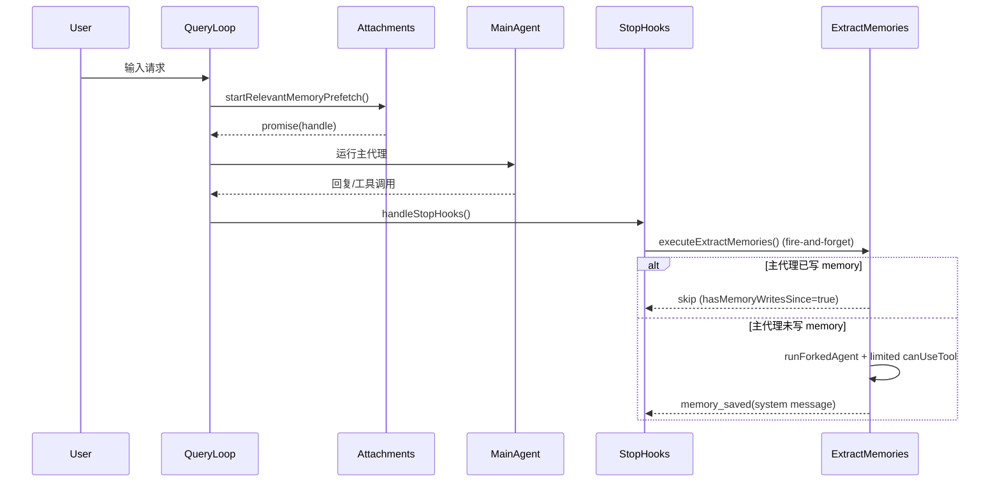

### 34.2 ExtractMemories 并发状态机

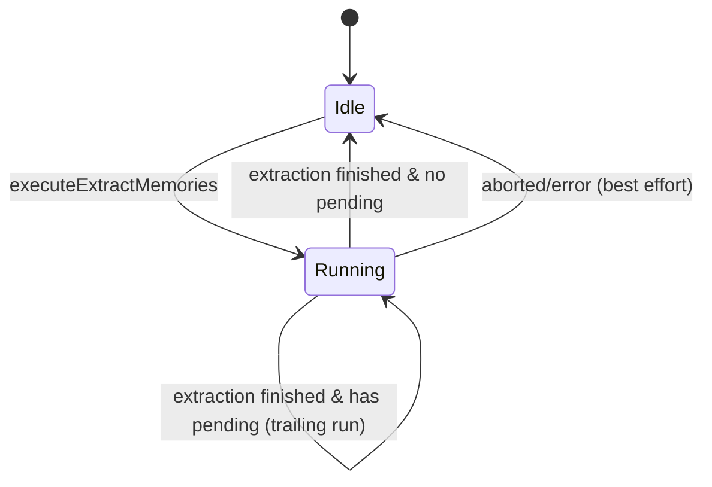

### 34.3 TeamMemory push 冲突重试图

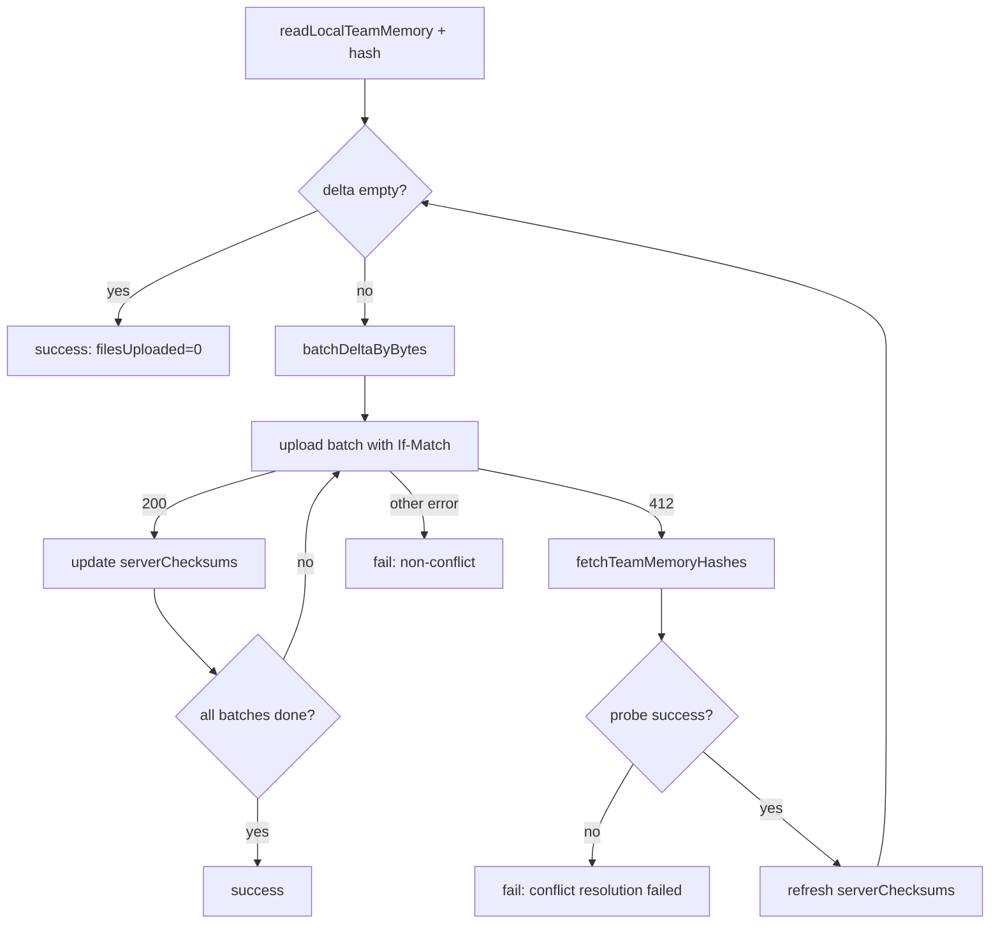

### 34.4 Session compact 不变量修正图

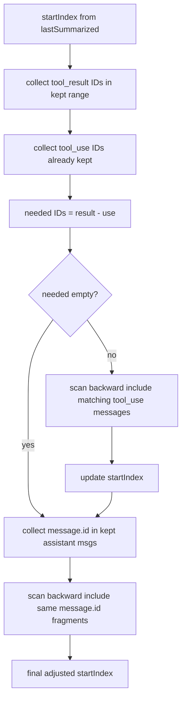

---

## 三十五、测试策略升级：从覆盖率到“行为证明”

## 四十九、流程图集（Mermaid）

> 这一节是“可视化导航层”，帮助你把前文文字分析映射到运行时数据流。  
> 建议在支持 Mermaid 的 Markdown 渲染器中查看（Cursor/VS Code 插件/Git 平台）。

### 49.1 记忆系统总架构流

文案解读（每步含 **输入 / 处理 / 输出**）：
1. `User Input -> Query Loop`
   - **输入**：用户消息、会话状态、项目根等运行时上下文。
   - **处理**：进入主查询循环，绑定本轮请求 ID 与消息序列。
   - **输出**：可继续构建 prompt 与执行推理的活跃回合。
2. `Query Loop -> Prompt Builder`
   - **输入**：系统默认 prompt 片段、技能/规则装配结果、memory 相关函数返回值。
   - **处理**：拼接系统提示词各段（含后续 Instruction / Auto Memory 段）。
   - **输出**：待发送给模型的系统消息体（或等价结构）。
3. `Prompt Builder -> Instruction Memory`
   - **输入**：仓库与用户目录下的 `CLAUDE.md` 及 include 链解析结果。
   - **处理**：加载、合并、去重或截断指令层文本。
   - **输出**：写入系统提示词的「指令记忆」段落。
4. `Prompt Builder -> Auto Memory Prompt`
   - **输入**：`loadMemoryPrompt` 产出的 memory 协议与索引信息、目录统计等。
   - **处理**：格式化为模型可执行的「如何维护 MEMORY / topic」说明。
   - **输出**：系统提示词中的 AutoMemory 行为段。
5. `Query Loop -> Relevant Retrieval`
   - **输入**：最新用户输入、memory 目录扫描能力、feature gate。
   - **处理**：异步启动预取（scan → select → read → attach），与主推理并行。
   - **输出**：后台任务句柄；完成后产生 `relevant_memories` 附件候选。
6. `Relevant Retrieval -> Main Agent`
   - **输入**：sideQuery 选中的路径、截断后的文件片段、去重后的附件列表。
   - **处理**：将附件并入本轮用户/上下文侧输入。
   - **输出**：主代理可见的「相关记忆」上下文块。
7. `Query Loop -> Main Agent`
   - **输入**：系统提示词、历史消息、工具状态、本轮用户消息、附件。
   - **处理**：主模型推理与（可选）工具调用循环。
   - **输出**：助手回复、工具调用序列、更新后的对话状态。
8. `Main Agent -> Stop Hooks`
   - **输入**：本轮完整消息轨迹与结束原因（正常停/工具结束等）。
   - **处理**：进入 `stopHooks` 编排，调度回合后任务。
   - **输出**：触发抽取、session 更新、telemetry 等副作用的入口信号。
9. `Stop Hooks -> ExtractMemories Fork`
   - **输入**：回合消息快照、memory 路径、gate 与节流状态。
   - **处理**：`executeExtractMemories` 异步 fork 子代理，白名单工具写 topic 文件。
   - **输出**：AutoMemory 文件变更、可选 `memory_saved` 系统消息、游标推进。
10. `Stop Hooks -> SessionMemory Update`
    - **输入**：token/工具调用计数、session memory 配置与当前文件内容。
    - **处理**：达阈值则 edit-only 子代理更新会话笔记文件。
    - **输出**：更新后的 session memory 文本与摘要边界元数据。
11. `SessionMemory Update -> SessionCompact`
    - **输入**：后续 compact 触发条件、session memory 文件、`tengu_sm_compact` 等 gate。
    - **处理**：compact 路径优先尝试以 session memory 为摘要锚点。
    - **输出**：压缩后的消息列表或回退 legacy compact 的结果。
12. `TeamMemory Watcher -> Team Sync -> Team Memory Files`
    - **输入**：`memory/team` 下文件变更事件、OAuth、repo slug、本地/服务端 checksum 状态。
    - **处理**：debounce → pull/push → delta 与 412 重试收敛。
    - **输出**：与远端一致的本地团队记忆文件集；更新后的同步状态。
13. `ExtractMemories -> Auto Memory Files` 与 `AMF/TMF -> Relevant Retrieval`
    - **输入**：抽取/同步写入后的磁盘上的 markdown 与 frontmatter。
    - **处理**：后续回合 `scanMemoryFiles` 将新内容纳入候选池；relevant 路径再被选中则重新注入。
    - **输出**：下一轮及之后主代理可能看到的记忆附件集合发生变化。

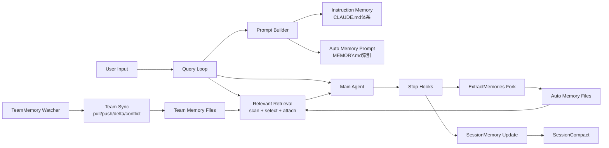

### 49.2 Prompt-time 记忆提示词构建流程

文案解读（每步含 **输入 / 处理 / 输出**）：
1. 入口 `loadMemoryPrompt`
   - **输入**：项目根、`isAutoMemoryEnabled`、KAIROS/TEAMMEM 构建期或运行时标志、目录路径解析结果。
   - **处理**：作为唯一入口聚合分支，避免在多处重复 if/else。
   - **输出**：进入 `AutoMemory Enabled?` 判定，或内部直接短路返回。
2. `AutoMemory Enabled?`
   - **输入**：env（如 SIMPLE/remote）、settings、`isAutoMemoryEnabled()` 结果。
   - **处理**：若关闭则不再读取 memdir、不拼接任何 memory 段。
   - **输出**：`no` → `return null`；`yes` → 进入 `KAIROS active?`。
3. `KAIROS active?`
   - **输入**：KAIROS 模式标志、当前 memdir 策略配置。
   - **处理**：选择 daily-log 专用提示词构建路径。
   - **输出**：`yes` → `buildAssistantDailyLogPrompt`；`no` → `TEAMMEM enabled?`。
4. `TEAMMEM enabled?`
   - **输入**：team memory feature gate、auto memory 已开启前提。
   - **处理**：决定是否要把 team 目录规则并入系统提示词。
   - **输出**：`yes` → combined 分支；`no` → auto-only 分支。
5. `buildCombinedMemoryPrompt`
   - **输入**：private memdir 与 team memdir 路径、类型说明模板。
   - **处理**：拼接双域行为约束与索引说明。
   - **输出**：合并后的 memory 提示词中间文本 → `ensureMemoryDirExists`。
6. `buildMemoryLines auto-only`
   - **输入**：单目录 memdir 元数据、memory 类型准则字符串。
   - **处理**：生成仅 AutoMemory 的协议与索引行。
   - **输出**：auto-only 中间文本 → `ensureMemoryDirExists`。
7. `buildAssistantDailyLogPrompt`（KAIROS 支路）
   - **输入**：append-only 日志语义、目录布局约定。
   - **处理**：生成与常规 topic 维护不同的 daily log 指引。
   - **输出**：KAIROS 中间文本 → `ensureMemoryDirExists`。
8. `ensureMemoryDirExists`
   - **输入**：解析后的 canonical memory 目录路径。
   - **处理**：`mkdir` 等确保目录存在（失败通常吞掉或记录，不阻断主流程）。
   - **输出**：目录就绪侧效应 + 与前面分支合并的文本流。
9. `return memory prompt text` / `return null`
   - **输入**：上述分支产出的字符串或空。
   - **处理**：返回给上层 prompt 装配。
   - **输出**：主系统提示词中 memory 段为字符串或完全省略。

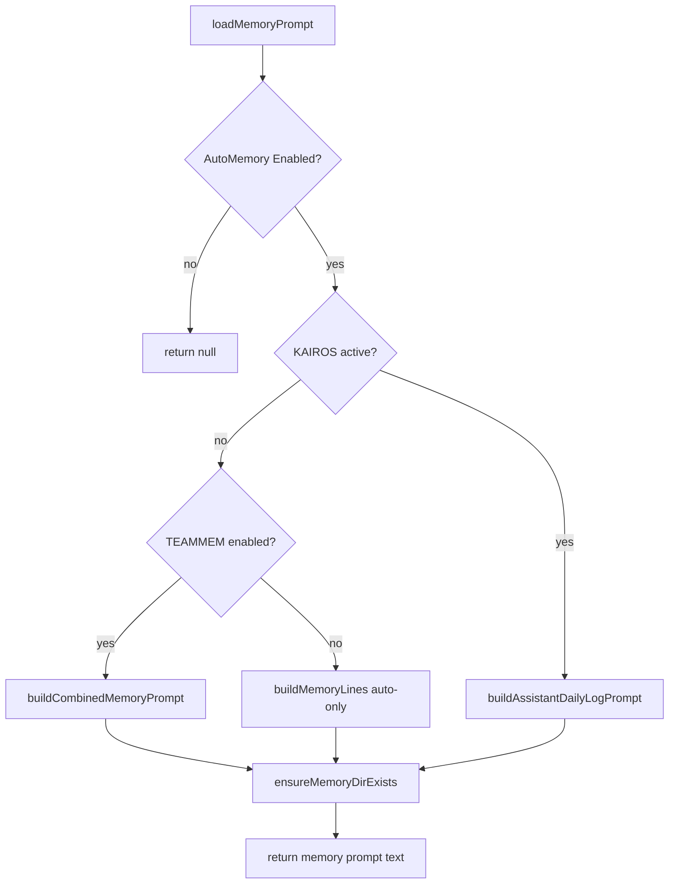

### 49.3 Relevant Retrieval 召回流程（query-time）

文案解读（每步含 **输入 / 处理 / 输出**）：
1. `Last user input -> Input valid?`
   - **输入**：当前轮最后一条用户可见文本、简单分词/长度启发式。
   - **处理**：判断是否足以支撑语义召回（如过滤单词、空串）。
   - **输出**：`valid` / `invalid` 分支。
2. `Input valid? = no -> Skip prefetch`
   - **输入**：无效输入标记。
   - **处理**：不发起扫描、不调用 sideQuery、不占用附件预算。
   - **输出**：无 `relevant_memories` 附件；预取任务结束。
3. `Input valid? = yes -> AutoMemory + Gate on?`
   - **输入**：`isAutoMemoryEnabled`、相关 feature gate（如 moth_copse 等）。
   - **处理**：与主链路门控对齐，避免禁用状态下仍预取。
   - **输出**：`gate on` / `gate off`。
4. `Gate = no -> Skip prefetch`
   - **输入**：门控关闭。
   - **处理**：同步骤 2，直接退出。
   - **输出**：无附件。
5. `Gate = yes -> scanMemoryFiles`
   - **输入**：memdir 根路径、递归扫描配置、节流读参数。
   - **处理**：读各 `.md` 文件头部/frontmatter，收集候选元数据。
   - **输出**：候选文件列表（路径、标题、类型、mtime 等）。
6. `filter alreadySurfaced`
   - **输入**：候选列表、历史已注入路径集合（already surfaced）。
   - **处理**：剔除本轮之前已展示过的路径。
   - **输出**：精简后的候选集。
7. `Candidates empty?`
   - **输入**：精简后候选集大小。
   - **处理**：若无候选则跳过后续模型调用。
   - **输出**：`empty` → `Skip prefetch`；`non-empty` → 进入 sideQuery。
8. `sideQuery selectRelevantMemories`
   - **输入**：用户问题文本、候选 manifest（文件名与白名单）、JSON schema 约束。
   - **处理**：对 Sonnet 等发起 sideQuery，解析结构化返回。
   - **输出**：模型选中的若干「合法文件名」。
9. `map filename->path`
   - **输入**：模型输出文件名、候选路径映射表。
   - **处理**：丢弃不在白名单中的名字，解析为绝对路径。
   - **输出**：待读取的真实路径列表。
10. `readMemoriesForSurfacing`
    - **输入**：路径列表、行数/字节上限。
    - **处理**：读文件并截断，组装可注入正文片段。
    - **输出**：内存中的 surfacing 文本块集合。
11. `filterDuplicateMemoryAttachments`
    - **输入**：surfacing 块、`readFileState` 等本轮已读记录。
    - **处理**：去掉与主代理已见内容重复的附件。
    - **输出**：去重后的附件候选。
12. `Attach relevant_memories`
    - **输入**：去重后的块与元数据。
    - **处理**：封装为 attachment 类型并挂入消息管线。
    - **输出**：主代理本轮请求携带的 `relevant_memories`。

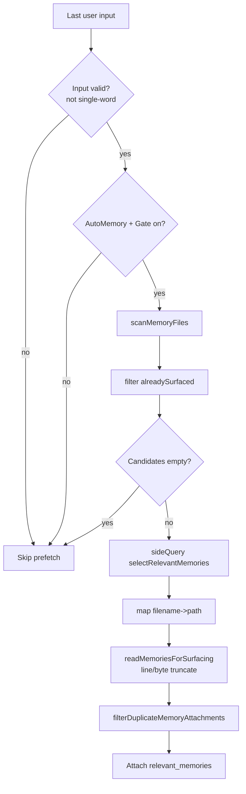

### 49.4 ExtractMemories 回合后抽取流程

文案解读（每步含 **输入 / 处理 / 输出**）：
1. `handleStopHooks -> executeExtractMemories`
   - **输入**：主回合结束事件、当前消息列表引用。
   - **处理**：注册 fire-and-forget 异步任务（不 await 阻塞 UI/流式输出）。
   - **输出**：抽取管线被调度；立即返回给 stop hook 其他逻辑。
2. `main thread + gate + autoMem?`
   - **输入**：线程标识、`isExtractModeActive` 等 gate、`isAutoMemoryEnabled`。
   - **处理**：三元与逻辑，任一 false 则拒绝执行。
   - **输出**：`pass` → 继续；`fail` → `return`。
3. 条件不满足 `-> return`
   - **输入**：失败原因（非主线程/无 gate/无 auto mem）。
   - **处理**：不写盘、不 fork、可记 telemetry skip。
   - **输出**：空闲状态；下一轮重新判定。
4. `inProgress?`
   - **输入**：模块内 `inProgress` 标志位。
   - **处理**：检测是否已有抽取运行中。
   - **输出**：`true` / `false`。
5. `inProgress = yes -> pendingContext = latest -> return`
   - **输入**：新上下文快照、旧 `pendingContext`。
   - **处理**：覆盖为最新上下文，避免排队多个并发 fork。
   - **输出**：当前 run 结束；待 inProgress 清零后消费 pending。
6. `inProgress = no -> runExtraction`
   - **输入**：通过前置检查后的完整抽取参数。
   - **处理**：置位 inProgress，进入互斥区。
   - **输出**：顺序执行后续子步骤。
7. `hasMemoryWritesSince?`
   - **输入**：主代理本轮工具写路径、memory 根路径集合、抽取游标。
   - **处理**：比对是否主线程已写 managed memory。
   - **输出**：`yes` → skip 分支；`no` → 节流检查。
8. `throttle passed?`
   - **输入**：上次抽取时间戳、配置的最小间隔。
   - **处理**：时间差与计数比较。
   - **输出**：未通过 → `return`；通过 → `scan manifest`。
9. `scan manifest`
   - **输入**：memdir 下现有文件枚举或清单摘要。
   - **处理**：注入子代理 system/user 上下文，引导更新而非重复造文件。
   - **输出**：manifest 文本进入 fork 输入。
10. `runForkedAgent maxTurns=5`
    - **输入**：回合消息、`createAutoMemCanUseTool` 白名单、工具实现。
    - **处理**：子代理最多 5 轮工具循环，写/编辑 memory 文件。
    - **输出**：子代理轨迹；磁盘上可能的文件变更。
11. `extractWrittenPaths`
    - **输入**：子代理 tool 调用记录或结果消息。
    - **处理**：解析实际写入的绝对路径，过滤非 topic 规则路径。
    - **输出**：写入路径列表 + 是否含 topic 记忆文件。
12. `memory topic files > 0?`
    - **输入**：上一步路径分类结果。
    - **处理**：若有 topic 产出则构造系统提示给用户可见反馈。
    - **输出**：`yes` → append `memory saved`；`no` → 静默。
13. `END`（`SKIP` / `SYS` / `END0` 汇合）
    - **输入**：本轮抽取最终结果（跳过/成功/无产出）。
    - **处理**：清除 inProgress、推进 last cursor、若有 pending 则链式触发下一次。
    - **输出**：模块回到可接受新回合的状态。

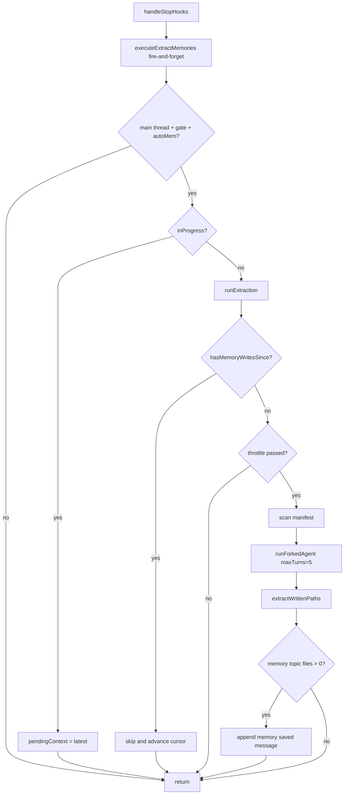

### 49.5 SessionMemory 更新与 SessionCompact 协同流

文案解读（每步含 **输入 / 处理 / 输出**）：

A. SessionMemory 更新链路（上半图）

1. `post-sampling hook`
   - **输入**：主线程 query 完成后的消息采样结果、session memory 配置。
   - **处理**：在 `sequential` 包装下排队，避免与同类 hook 并发踩踏。
   - **输出**：进入 `session gate on?`。
2. `session gate on?`
   - **输入**：`tengu_session_memory` 等 gate。
   - **处理**：判断是否启用会话记忆子系统。
   - **输出**：`off` → `return`；`on` → `shouldExtractMemory?`。
3. gate 关闭 `-> return`
   - **输入**：gate 关闭信号。
   - **处理**：不读盘、不 fork、不更新阈值计数（依实现可能仅短路）。
   - **输出**：会话记忆文件保持不变。
4. `shouldExtractMemory?`
   - **输入**：自上次提取以来的 token 增量、工具调用次数、`lastMemoryMessageUuid` 等。
   - **处理**：与配置阈值比较，决定是否值得跑一次更新。
   - **输出**：`no` → `return`；`yes` → `setupSessionMemoryFile`。
5. 阈值不满足 `-> return`
   - **输入**：未达阈值状态。
   - **处理**：跳过 fork，降低写放大与 API 成本。
   - **输出**：等待下次 hook 再评估。
6. `setupSessionMemoryFile`
   - **输入**：session memory 目标路径、默认模板字符串。
   - **处理**：不存在则创建并写入模板；存在则 `readFile`。
   - **输出**：当前文件内容与稳定路径句柄。
7. `buildSessionMemoryUpdatePrompt`
   - **输入**：文件内容、`analyzeSectionSizes` 超限提醒、变量替换表。
   - **处理**：拼装更新指令（保留结构、合并新事实、删冗余）。
   - **输出**：发给 fork 子代理的 user/system 片段。
8. `runForkedAgent (edit only session memory file)`
   - **输入**：上述 prompt、单文件 `canUseTool` 约束。
   - **处理**：子代理仅允许 edit 该 session 文件。
   - **输出**：磁盘上更新后的 session memory 文本。
9. `recordExtractionTokenCount`
   - **输入**：本轮对话 token 统计、子代理用量。
   - **处理**：写入模块状态，供下次 `shouldExtractMemory` 计算增量。
   - **输出**：更新后的基线与 telemetry 字段。
10. `setLastSummarizedMessageId if safe`
    - **输入**：当前消息 id、compact 安全条件（无悬空工具对等）。
    - **处理**：仅在安全时推进“已摘要边界”，避免 compact 切错。
    - **输出**：更新后的 `lastSummarizedMessageId` 或保持旧值。

B. SessionCompact 协同链路（下半图）

11. `compact trigger`
    - **输入**：上下文长度超阈、用户触发 compact、或内部策略信号。
    - **处理**：进入 compact 子系统入口。
    - **输出**：调用 `shouldUseSessionMemoryCompaction?`。
12. `shouldUseSessionMemoryCompaction?`
    - **输入**：`tengu_sm_compact`、`tengu_session_memory`、session 文件可用性标志。
    - **处理**：决定优先策略是否为 session-memory compaction。
    - **输出**：`no` → `legacy compact`；`yes` → `waitForSessionMemoryExtraction`。
13. 不满足 `-> legacy compact`
    - **输入**：gate 关闭或策略不允许。
    - **处理**：走历史 compact 实现（与 session 文件解耦）。
    - **输出**：传统压缩后的消息列表。
14. 满足 `-> waitForSessionMemoryExtraction`
    - **输入**：in-flight session extraction Promise、软超时毫秒数。
    - **处理**：await 或 race 超时，降低“压紧时文件仍陈旧”概率。
    - **输出**：同步点通过/超时结果 → `load session memory`。
15. `load session memory`
    - **输入**：session memory 文件路径。
    - **处理**：读入全文或截断版本供摘要使用。
    - **输出**：字符串内容 → `empty/template only?`。
16. `empty/template only?`
    - **输入**：文件内容与模板比对启发式。
    - **处理**：无有效摘要锚点则不可靠地压紧。
    - **输出**：`yes` → `legacy compact`；`no` → `calculateMessagesToKeepIndex`。
17. `calculateMessagesToKeepIndex`
    - **输入**：完整消息数组、token 预算、`lastSummarizedMessageId`。
    - **处理**：从尾部向前算保留窗口，得到初始 `startIndex`。
    - **输出**：数值索引 → `adjustIndexToPreserveAPIInvariants`。
18. `adjustIndexToPreserveAPIInvariants`
    - **输入**：`startIndex`、消息序列（tool 块、assistant 分片）。
    - **处理**：向前扩展以补齐 tool_use/tool_result 与同源 `message.id` 链。
    - **输出**：`adjustedIndex`。
19. `build compaction result`
    - **输入**：`adjustedIndex`、session memory 摘要正文、需丢弃区间。
    - **处理**：拼装新的压缩消息列表（通常含摘要 system/user 块）。
    - **输出**：可提交给 API 的 compact 后对话状态。

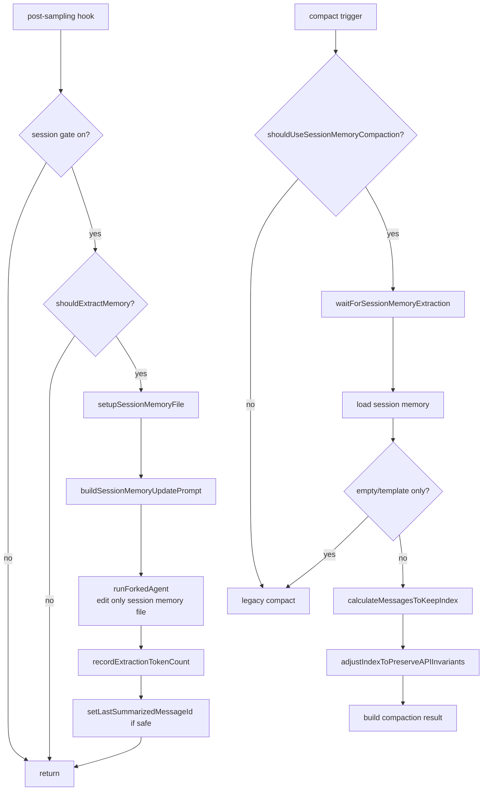

### 49.6 TeamMemory 同步与冲突收敛流程

文案解读（每步含 **输入 / 处理 / 输出**）：
1. `watch file change -> debounce`
   - **输入**：`fs.watch` 或等价事件、变更路径。
   - **处理**：定时器合并短时间 burst，抑制抖动。
   - **输出**：单次稳定的 `pushTeamMemory` 触发意图。
2. `debounce -> pushTeamMemory`
   - **输入**：防抖后的触发信号、同步状态对象。
   - **处理**：进入上传主函数，加锁或串行化（依实现）。
   - **输出**：进入 `OAuth + Repo ok?`。
3. `OAuth + Repo ok?`
   - **输入**：当前 OAuth token、GitHub remote 解析出的 repo slug。
   - **处理**：校验可调用 first-party API 的前置条件。
   - **输出**：`ok` / `fail` 及原因枚举。
4. 校验失败 `-> fail no_oauth/no_repo`
   - **输入**：失败原因码。
   - **处理**：记录事件；watcher 可能进入 suppression。
   - **输出**：本轮 push 终止；本地文件仍为脏直至条件恢复。
5. 校验通过 `-> readLocalTeamMemory + scan secrets`
   - **输入**：team memory 根目录、`scanForSecrets` 规则集。
   - **处理**：枚举条目读内容；命中 secret 的文件标记跳过。
   - **输出**：可上传条目集合 + 跳过列表。
6. `compute local hashes`
   - **输入**：每个 entry 的规范化内容字节。
   - **处理**：SHA256（或项目所用算法）逐条哈希。
   - **输出**：`localHashes` 映射。
7. `delta empty?`
   - **输入**：`localHashes`、内存中 `serverChecksums`。
   - **处理**：键集合并逐键比较，生成待上传子集。
   - **输出**：`empty` → `success filesUploaded=0`；否则进入分批。
8. `batchDeltaByBytes`
   - **输入**：delta 条目、单请求体字节上限。
   - **处理**：贪心或切片打包成若干 batch。
   - **输出**：batch 队列。
9. `uploadTeamMemory If-Match`
   - **输入**：batch 序列化体、每条目前服务端 etag/checksum。
   - **处理**：HTTP PUT + 条件头，实现乐观锁。
   - **输出**：HTTP 状态码 + 响应体（错误或新 checksum）。
10. `status 200? = yes`
    - **输入**：成功响应、本 batch 键列表。
    - **处理**：用响应中的权威 checksum 更新 `serverChecksums`。
    - **输出**：本批已收敛；进入 `more batches?`。
11. `more batches?`
    - **输入**：剩余 batch 队列。
    - **处理**：非空则回到步骤 9；空则整次 push 成功。
    - **输出**：`OK1 success` 或继续循环。
12. `status 200? = no -> status 412?`
    - **输入**：非 200 状态码、响应解析结果。
    - **处理**：区分冲突（412）与其它 4xx/5xx。
    - **输出**：路由到冲突解析或 `fail non-conflict`。
13. `status 412 = yes -> fetchTeamMemoryHashes`
    - **输入**：repo slug、鉴权头。
    - **处理**：调用 `view=hashes` 类端点拉全量或分页哈希视图。
    - **输出**：远端哈希映射或错误。
14. `probe success? = yes -> refresh serverChecksums -> delta`
    - **输入**：新远端哈希、本地内容。
    - **处理**：覆盖 `serverChecksums`，重新计算 delta（可能变小或变向）。
    - **输出**：回到步骤 7 的判定环，直至成功或重试上限。
15. `probe success? = no` 或 `status 412 = no`
    - **输入**：探针失败或 413/401/500 等非 412 错误。
    - **处理**：记录 telemetry；可能熔断 watcher 重试。
    - **输出**：`ERR` / `ERR2` 失败返回；本地与服务端可能仍不一致。

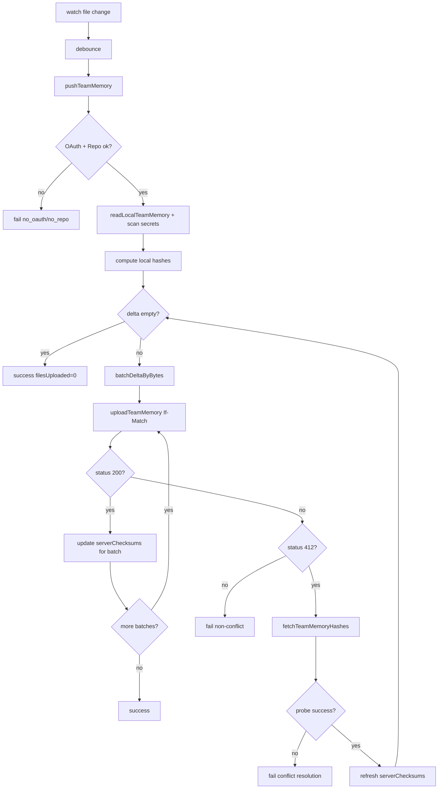

### 49.7 `adjustIndexToPreserveAPIInvariants` 细节流

文案解读（每步含 **输入 / 处理 / 输出**）：
1. 输入 `startIndex`
   - **输入**：`calculateMessagesToKeepIndex` 给出的初始裁剪下标、完整 `messages` 数组。
   - **处理**：作为算法当前保留窗口左边界候选。
   - **输出**：进入 tool 不变量修复阶段。
2. `collect tool_result IDs in kept range`
   - **输入**：`[adjustedIndex, end)` 内所有消息块。
   - **处理**：遍历 `tool_result` 块，收集其 `tool_use_id` 集合。
   - **输出**：`resultIds`（被引用集合）。
3. `collect tool_use IDs already kept`
   - **输入**：同一保留区间内的 `tool_use` 块。
   - **处理**：收集 `id` 字段。
   - **输出**：`useIds`（已存在调用集合）。
4. `needed IDs = result - use`
   - **输入**：`resultIds`、`useIds`。
   - **处理**：集合差分，得到孤儿引用所需的 tool_use id。
   - **输出**：`needed` 集合。
5. `needed empty?`（含 `scan backward ... tool_use`）
   - **输入**：`needed`、当前左边界索引、全序列。
   - **处理**：若非空则向左扩展窗口，每步吞入可能包含对应 `tool_use` 的 user 消息，直至 `needed` 清空或到 0。
   - **输出**：更新后的左边界 + `needed` 最终为空（或无法继续时的边界）。
6. `collect message.id in kept assistant messages`
   - **输入**：当前保留区内所有 assistant 消息及其 `message.id`。
   - **处理**：提取非空 id，表示“分片链”锚点。
   - **输出**：`fragmentIds` 集合。
7. `scan backward include same message.id fragments`
   - **输入**：`fragmentIds`、当前左边界。
   - **处理**：向左继续扩展，把相同 `message.id` 的相邻 assistant 片段全部纳入，避免半条消息进上下文。
   - **输出**：最终左边界索引。
8. `return adjustedIndex`
   - **输入**：最终左边界整数。
   - **处理**：作为函数返回值交给 compact 主流程切片。
   - **输出**：满足 API 配对与分片连续性的消息子数组起点。

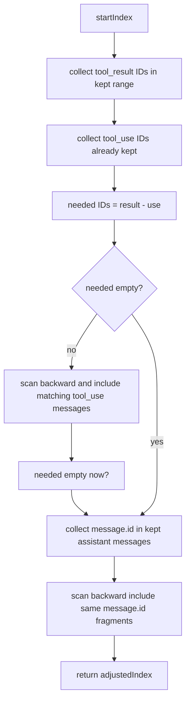

### 49.8 AgentMemory（子代理记忆）路径与加载流

文案解读（每步含 **输入 / 处理 / 输出**）：
1. 输入 `agentType + scope`
   - **输入**：子代理类型枚举、作用域（user / project / local）、项目根与用户主目录。
   - **处理**：决定记忆隔离策略（哪些路径可读、默认写哪里）。
   - **输出**：解析参数包 → `getAgentMemoryDir`。
2. `getAgentMemoryDir`
   - **输入**：上述参数、remote memory 目录覆盖（若存在）。
   - **处理**：拼接并规范化路径，应用 sanitize/校验。
   - **输出**：该 agent 的记忆根目录绝对路径。
3. `getAgentMemoryEntrypoint`
   - **输入**：记忆根目录。
   - **处理**：固定入口文件名（如 `MEMORY.md`）拼接。
   - **输出**：入口文件绝对路径。
4. `ensureMemoryDirExists fire-and-forget`
   - **输入**：记忆根目录路径。
   - **处理**：异步 `mkdir`（不 await 于关键路径上）。
   - **输出**：后台侧效应；主流程继续。
5. `buildMemoryPrompt Persistent Agent Memory`
   - **输入**：目录存在性探测结果（可选）、入口文件若存在则其摘要或全文（受截断策略）。
   - **处理**：生成「持久 Agent 记忆」说明段，与 AutoMem 文本风格对齐。
   - **输出**：待注入的 memory prompt 字符串。
6. `spawned agent system prompt`
   - **输入**：子代理 spawn 配置、其它系统段。
   - **处理**：合并为子代理初始化 system 消息。
   - **输出**：子代理运行时上下文；后续可读写自身记忆文件集合。

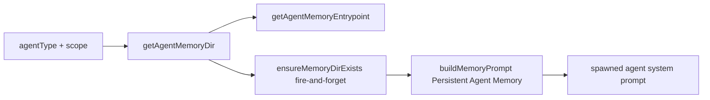

---

## 五十、运维与契约补充（生产可落地版）
