# Claude Code 记忆系统论文式深度技术文档

> 研究对象：`D:\work\claude-code-source`  
> 目标：不是“功能介绍”，而是从系统工程视角，把 Claude Code 记忆系统讲成一篇可用于架构评审、研发 onboarding、二次开发设计的技术论文。  
> 阅读建议：先看第 1-4 章建立全局模型，再按第 5-11 章逐条跟实现细节，最后看第 12-16 章进行工程落地与演进。  
> **分册阅读**：同目录已提供 6+1 拆分版（总览 / 子系统 / 安全运维 / 提示词 / 审计测试 / 图表），入口见 [`README.md`](./README.md)。**本文仍为完整合订本，未删除。**

---

## 摘要

Claude Code 的记忆系统并非单一“把文本写入某个文件”的模块，而是一个跨越提示词构建、会话运行时、后台异步代理、上下文压缩与团队同步协议的复合系统。它在实现上分化为六条能力链：指令记忆加载、自动持久记忆、相关记忆召回、回合后记忆抽取、会话记忆与压缩协同、团队记忆远端同步。六条链路共享若干设计原则：最小权限、按需注入、状态可追踪、失败可恢复、行为可观测。

如果把问题抽象成工程命题，这个系统试图同时满足三组冲突目标：

1. **长期一致性 vs 上下文成本**：长期沉淀信息，但不能持续全量注入；
2. **自动化沉淀 vs 错误写入风险**：要自动提取，但不能污染记忆库；
3. **团队共享协作 vs 安全边界**：要跨人同步，但不能泄露敏感信息或越权写盘。

本系统的核心解法是“分层 + 分时 + 分权限”：

- 分层：把指令、长期记忆、会话记忆、团队同步解耦；
- 分时：把 prompt-time、query-time、post-turn、compact-time 的动作拆开；
- 分权限：后台代理只拿到严格受限工具与受限路径。

---

## 1. 研究问题与分析框架

### 1.1 本文回答什么问题

本文不是告诉你“有哪些文件”，而是回答以下高价值问题：

- Claude Code 为什么要有多套记忆，而不是一套？
- 每条记忆链路在什么时机触发，如何避免互相打架？
- 相关召回（relevant memories）如何做到“有用而不噪声”？
- 后台抽取器如何避免重复写、越权写、并发重入？
- Session Memory 如何保障 compact 后仍满足 API 不变量？
- Team Memory 如何在冲突、限额、网络失败中保持可收敛？
- 这套设计背后的方法论是什么，未来如何演进？

### 1.2 分析方法

采用“结构-行为-约束”三层法：

1. **结构层**：模块边界、数据模型、目录组织；
2. **行为层**：时序、状态转换、错误分支；
3. **约束层**：安全、性能、一致性、可观测性。

---

## 2. 系统全景：六层记忆栈

在 `claude-code-source` 中，记忆能力可抽象为如下栈：

1. **Instruction Memory**（`CLAUDE.md` 体系）  
   目标：行为规范与规则约束，强调“怎么做”。

2. **Auto Memory (Memdir)**（`memory/`）  
   目标：跨会话沉淀用户/反馈/项目/外部引用信息，强调“记住什么”。

3. **Relevant Memory Retrieval**（运行时附件）  
   目标：按当前 query 选最相关少量记忆，强调“现在该看什么”。

4. **Extract Memories**（回合后后台抽取）  
   目标：当主代理没有主动写记忆时，自动补齐可沉淀信息。

5. **Session Memory**（会话摘要）  
   目标：服务长会话连续性，强调“当前会话进展”。

6. **Team Memory Sync**（`memory/team/` + 远端）  
   目标：组织协作共享，强调“跨成员共享与冲突收敛”。

这个分层决定了“同样叫 memory，职责并不相同”：  
Instruction Memory 是规则；Auto/Team Memory 是长期知识；Session Memory 是会话桥梁。

---

## 3. 代码地图：关键模块与职责

### 3.1 路径与门控

- `src/memdir/paths.ts`
  - `isAutoMemoryEnabled()`
  - `getAutoMemPath()`
  - `getAutoMemEntrypoint()`
  - `isAutoMemPath()`

### 3.2 Prompt 构建

- `src/memdir/memdir.ts`
  - `truncateEntrypointContent()`
  - `buildMemoryLines()`
  - `buildMemoryPrompt()`
  - `loadMemoryPrompt()`

- `src/memdir/memoryTypes.ts`
  - 类型学、写入准则、召回验证准则

### 3.3 指令记忆与文件装载

- `src/utils/claudemd.ts`
  - `getMemoryFiles()`
  - `processMemoryFile()`
  - `getClaudeMds()`
  - include 与排除逻辑

### 3.4 相关记忆召回

- `src/memdir/memoryScan.ts`
- `src/memdir/findRelevantMemories.ts`
- `src/utils/attachments.ts`

### 3.5 后台抽取

- `src/services/extractMemories/extractMemories.ts`
- `src/query/stopHooks.ts`
- `src/utils/backgroundHousekeeping.ts`

### 3.6 会话记忆与压缩

- `src/services/SessionMemory/sessionMemory.ts`
- `src/services/SessionMemory/sessionMemoryUtils.ts`
- `src/services/SessionMemory/prompts.ts`
- `src/services/compact/sessionMemoryCompact.ts`

### 3.7 团队记忆同步

- `src/memdir/teamMemPaths.ts`
- `src/services/teamMemorySync/index.ts`
- `src/services/teamMemorySync/watcher.ts`
- `src/services/teamMemorySync/teamMemSecretGuard.ts`

### 3.8 子代理记忆

- `src/tools/AgentTool/agentMemory.ts`
- `src/tools/AgentTool/agentMemorySnapshot.ts`

---

## 4. 统一语义模型：四类记忆 + 三类时间

### 4.1 四类记忆（业务语义）

在 `memoryTypes.ts` 中，Auto/Team 记忆被严格约束为：

- `user`：关于用户角色、偏好、能力背景；
- `feedback`：用户对协作方式的纠偏与肯定；
- `project`：不可从代码直接推导的项目状态事实；
- `reference`：外部系统入口索引（看板、工单、频道等）。

### 4.2 三类时间（系统语义）

系统把“记忆动作”拆到三种时间域：

1. **Prompt-time**：系统提示词构建时（加载规则与索引）；
2. **Query-time**：单轮请求执行时（相关记忆预取与注入）；
3. **Post-turn/Compact-time**：回合结束后与压缩前（抽取、会话摘要、重构上下文）。

这三类时间解耦是系统可维护性的核心。否则所有逻辑混在主回合里会导致：

- 时延抖动；
- 过度写入；
- 难以做失败恢复。

---

## 5. Prompt-time：Auto Memory 的实现原理

### 5.1 为什么用 `MEMORY.md` + topic 文件

实现不是把所有记忆堆在一个巨型文件，而是：

- `MEMORY.md` 作为索引；
- 每个主题一个独立文件（frontmatter + 正文）；
- 索引只放短 hook，不放正文。

原理优势：

1. 索引可稳定注入，控制 token；
2. 正文可按需读取，减少上下文污染；
3. 主题文件可独立更新，不需重写全集。

### 5.2 入口截断算法

`truncateEntrypointContent(raw)` 的关键点：

1. 先做 `trim + split('\n')`；
2. 检查行上限（`MAX_ENTRYPOINT_LINES`）；
3. 检查字节上限（`MAX_ENTRYPOINT_BYTES`）；
4. 行截断优先，随后按最后换行做字节截断；
5. 拼接 warning 说明具体截断原因。

这避免了“仅按行限制”在长行场景失效，也避免了“硬按字节砍中间”破坏语义边界。

### 5.3 `loadMemoryPrompt()` 分发策略

`loadMemoryPrompt()` 本质是记忆策略总开关：

- KAIROS 模式：走 append-only daily log；
- TEAMMEM 开启：走 combined prompt（private + team 两目录）；
- 否则 auto-only；
- AutoMemory 关闭则返回 `null`。

并且在 prompt 构建阶段尝试 `ensureMemoryDirExists`，减少模型在执行层浪费回合检查目录。

### 5.4 方法论

这一层遵循的方法论是：

- **强提示弱注入**：先把行为规范写清楚，再把内容最小化注入；
- **索引常驻正文按需**：稳定成本与高信息密度兼得；
- **将路径可用性前置**：减少代理“确认目录是否存在”的无效操作。

---

## 6. Query-time：相关记忆召回的实现与算法

### 6.1 召回链路总览

运行链路可表示为：

1. 从用户最后一条有效输入提取 query；
2. `scanMemoryFiles(memoryDir)` 获取候选头信息；
3. 构建 manifest 文本；
4. `selectRelevantMemories()` 调 sideQuery（Sonnet）返回文件名集合；
5. 回读每个候选文件前 N 行/N 字节；
6. 形成 `relevant_memories` attachment 注入；
7. 与 `readFileState`、历史 surfacing 集合去重。

### 6.2 候选扫描器

`memoryScan.ts` 里：

- 递归读取目录，过滤 `.md` 且排除 `MEMORY.md`；
- 只读前若干行 frontmatter（`FRONTMATTER_MAX_LINES`）；
- 提取 `description/type/mtime`；
- 新到旧排序，最多 200 文件。

该算法复杂度可近似为：

- 目录遍历 O(N)
- 每文件头部读取 O(1)（上限行截断）
- 排序 O(N log N)

N 上限 200 时排序与 I/O 都可控。

### 6.3 选择器为何用 sideQuery

`findRelevantMemories.ts` 并不做关键词打分，而是把 query + manifest 交给模型选择。

原因：

- frontmatter description 是自然语言，不是结构化向量库；
- “是否有帮助”通常是语义判断，不是词面 overlap；
- 还能融合 `recentTools` 规避“工具文档噪声”。

实现上通过 JSON schema 约束输出，避免自由文本失控。

### 6.4 预取策略与取消机制

`attachments.ts` 的 `startRelevantMemoryPrefetch()`：

- 在主回合开始前异步启动；
- 绑定 turn abort controller；
- 若用户中断可立即取消 sideQuery；
- 单词输入不触发（减少低质量召回）。

这是一种“投机执行”策略：  
预取成功时降低首 token 延迟；失败时不阻塞主流程。

### 6.5 去重机制为何是双重

去重来源有两类：

1. `alreadySurfaced`：历史已注入记忆路径；
2. `readFileState`：模型已通过文件工具读过的文件。

双重去重的意义：

- 避免重复塞相同上下文；
- 把注入预算留给新增且未读的信息；
- 防止多目录并行召回时同一路径回流。

### 6.6 方法论

这一层的核心方法论是：

- **先粗选候选，再语义精选，再预算裁剪**；
- **召回不是越多越好，而是“边际价值最大化”**；
- **把“相关性选择”与“内容读取”分离，便于各自优化。**

---

## 7. Post-turn：后台抽取器的状态机实现

### 7.1 触发与生命周期

抽取器初始化在 `backgroundHousekeeping`：

- `initExtractMemories()` 创建闭包状态；
- `handleStopHooks()` 在主回合结束 fire-and-forget 调 `executeExtractMemories()`；
- `drainPendingExtraction()` 在进程退出前尽力等待。

### 7.2 闭包状态变量

`extractMemories.ts` 用闭包维护状态，而非模块全局常量：

- `lastMemoryMessageUuid`：已处理游标；
- `inProgress`：是否执行中；
- `pendingContext`：执行期间到来的最新上下文；
- `turnsSinceLastExtraction`：节流计数；
- `inFlightExtractions`：可 drain 的 promise 集合。

这是显式状态机设计，便于测试重置和并发推理。

### 7.3 “主写优先”互斥机制

`hasMemoryWritesSince()` 扫描 assistant tool_use：

- 若发现 Edit/Write 目标是 AutoMem 路径，抽取器跳过；
- 游标推进到当前末尾；
- 记录 skip telemetry。

这条规则解决了实际生产中最容易出现的问题：  
主代理已写，后台又写，造成重复或冲突更新。

### 7.4 工具权限边界

`createAutoMemCanUseTool(memoryDir)` 把抽取器锁进白名单：

- 可读工具开放；
- Bash 仅允许只读命令；
- 写工具仅限 `memoryDir` 内；
- 其他工具全部 deny。

这相当于给后台代理加了“能力阉割层”，使其退化为安全可控的文本整理器。

### 7.5 并发合并策略

如果新一轮到来时抽取在跑：

- 不并发新开任务；
- 仅覆盖 `pendingContext` 为最新；
- 当前任务结束后跑一次 trailing extraction。

这是“最后写者获胜”的合并策略，避免队列膨胀。

### 7.6 方法论

这层体现的工程方法论是：

- **互斥优先于并行**（先保证不冲突，再考虑吞吐）；
- **后台任务必须可丢弃、可合并、可回放**；
- **权限收敛是后台自动化的第一原则。**

---

## 8. Session Memory：从“笔记”到“压缩语义桥”

### 8.1 设计初衷

Session Memory 不是长期知识库，而是“会话状态寄存器”：

- 把当前进展结构化落盘；
- 在 compact 时充当高密度摘要源；
- 防止长会话后段丢失关键上下文。

### 8.2 更新机制

`sessionMemory.ts` 的决策逻辑：

1. 满足 gate；
2. 达到初始化 token 门槛；
3. 达到更新门槛（token 增量 + tool call 条件）；
4. 创建/读取 session memory 文件；
5. 构建更新 prompt；
6. forked agent 执行 edit。

### 8.3 为何只允许 Edit 单文件

`createMemoryFileCanUseTool(memoryPath)` 只允许对单一目标文件 `Edit`。  
这是将任务能力限制为“纯文本更新”，防止 session 代理偏航到项目代码。

### 8.4 模板与结构保护

`SessionMemory/prompts.ts` 强调：

- header 与 italic 说明行必须保留；
- 只允许修改内容区；
- 各 section 有长度约束与超长压缩提醒。

本质上是把笔记写作转成“结构化编辑协议”，降低模型自由发挥导致的格式漂移。

---

## 9. Compact-time：SessionMemoryCompact 的协议级保障

### 9.1 为什么需要专门 compact 模块

传统 compact 仅做历史摘要可能导致：

- tool_use / tool_result 对被切断；
- 流式分片 message.id 同族消息丢失；
- 压缩后 API 入参非法或语义不完整。

`sessionMemoryCompact.ts` 直接把这些当成 API 不变量处理，而不是“最佳努力”。

### 9.2 起点计算算法

`calculateMessagesToKeepIndex()` 逻辑：

1. 从 `lastSummarizedMessageId` 后开始；
2. 向后扩展直到满足最小 token 与最小文本消息数；
3. 到达最大 token cap 停止；
4. 调 `adjustIndexToPreserveAPIInvariants()` 修正边界。

### 9.3 不变量修正

`adjustIndexToPreserveAPIInvariants()` 会：

- 扫描保留区内所有 tool_result ID；
- 向前回溯缺失的 tool_use；
- 检查同 message.id 的前序 assistant 分片，必要时前移起点。

它修复的是“协议一致性”，而不只是“信息完整性”。

### 9.4 方法论

这层的核心思想：

- **上下文压缩必须先满足协议，再追求摘要质量**；
- **边界切片是系统正确性问题，不是文案问题**。

---

## 10. Team Memory Sync：分布式协作协议实现

### 10.1 同步语义

`teamMemorySync/index.ts` 描述的语义：

- pull：服务端内容覆盖本地同 key；
- push：只上传本地 hash 与服务端 hash 不同的 key；
- 删除不传播：本地删除不会自动删服务端。

### 10.2 数据结构

`SyncState` 关键字段：

- `lastKnownChecksum`：用于 If-Match/If-None-Match；
- `serverChecksums`：每 key 的 `sha256:<hex>`；
- `serverMaxEntries`：从 413 响应学习出的服务端上限。

这使同步具备“增量判定 + 乐观并发 + 动态限额适配”能力。

### 10.3 增量上传算法

核心步骤：

1. 本地读出 entries；
2. 每 entry 计算 hash；
3. 与 `serverChecksums` 对比形成 delta；
4. delta 为空直接成功；
5. delta 按请求体大小切批；
6. 批量 PUT，成功后更新 `serverChecksums`；
7. 若 412，拉 hashes 重算 delta 重试。

这是标准“内容寻址同步”协议，避免每次全量上传。

### 10.4 冲突处理策略

系统采用“同 key local-wins（push 时）”策略：

- 优先保证本地用户刚做的编辑不被静默吞掉；
- 牺牲的是并发同 key 合并能力（无三方合并）。

这是一种偏产品可解释性的折中：  
“用户刚改完却没生效”比“需要后续人工整合同 key”更不可接受。

### 10.5 watcher 运行时机制

`watcher.ts`：

- 启动时先 pull，再 watch；
- 文件变化 debounce 后 push；
- 永久性失败场景（如 no_oauth/no_repo）进入 suppression，防止日志风暴；
- unlink 可清 suppression，支持恢复路径。

---

## 11. 安全模型：威胁、对策、代码落点

### 11.1 威胁 A：路径穿越/符号链接逃逸

攻击面：

- 通过 `..`、编码绕过、symlink 指向敏感目录，诱导写出 team 目录外。

对策：

- `sanitizePathKey()` 拒绝 null byte、编码穿越、unicode 归一化穿越；
- `resolve` 前缀校验；
- `realpathDeepestExisting()` + `isRealPathWithinTeamDir()` 真实路径 containment 校验；
- dangling symlink 与 symlink loop 显式判错。

实现点：

- `src/memdir/teamMemPaths.ts`

### 11.2 威胁 B：敏感信息同步泄漏

攻击面：

- 模型把 token/key/凭据写入 team memory，并被上传到服务端共享。

对策：

1. 写入时拦截：`checkTeamMemSecrets(filePath, content)`；
2. push 前扫描：`scanForSecrets(content)` 命中文件直接跳过并告警。

实现点：

- `src/services/teamMemorySync/teamMemSecretGuard.ts`
- `src/services/teamMemorySync/index.ts`

### 11.3 威胁 C：后台代理越权

攻击面：

- extract/session/auto-dream 子代理调用非预期工具修改项目代码。

对策：

- 每个后台代理都有独立 `canUseTool` 白名单；
- 写入路径限制到 memory 子树或单文件；
- Bash 只读判定。

实现点：

- `extractMemories.ts`
- `sessionMemory.ts`

---

## 12. 性能模型与复杂度分析

### 12.1 召回性能

- 扫描头部而非全文件：I/O 由 O(total_file_size) 降为 O(file_count)；
- 预取并行：与主回合并发，降低用户感知延迟；
- 会话级注入预算：防止长期会话内存附件失控。

### 12.2 抽取性能

- forked agent 复用 cache 前缀，减少重复 token；
- main-write skip 机制减少重复抽取；
- coalescing 降低并发开销。

### 12.3 同步性能

- delta 上传降低网络体积；
- batch by bytes 规避网关 413；
- unchanged 文件不重写，减少本地抖动与 watcher 噪声。

### 12.4 压缩性能

- session summary 作为高密度信息源，减少 compact 后 token 回弹；
- 不变量修正避免 API 重试成本。

---

## 13. 方法论总结：这套系统“怎么设计出来的”

从源码看，Claude Code 记忆系统背后的方法论可以提炼为七条：

1. **职责正交**：把“规则”“长期记忆”“会话摘要”“团队同步”拆开；
2. **时间解耦**：不同动作放在不同生命周期执行；
3. **按需注入**：常驻最小索引，正文按相关性召回；
4. **后台兜底**：主路径不强依赖抽取，抽取做补位；
5. **最小权限**：后台代理能力严格收敛；
6. **失败可恢复**：冲突重试、抑制风暴、可回放；
7. **可观测优先**：关键分支都埋点，便于线上诊断。

这不是“写提示词”能解决的问题，而是典型的系统工程设计。

---

## 14. 端到端时序（文字版）

### 14.1 启动阶段

1. `startBackgroundHousekeeping()` 调 `initExtractMemories()`、`initAutoDream()`；
2. 若 team 条件满足，`startTeamMemoryWatcher()`：
   - 先 pull；
   - 再 watch。

### 14.2 单轮 query 阶段

1. `attachments` 启动 relevant memory prefetch；
2. 主模型执行；
3. `stopHooks` 结束后 fire-and-forget:
   - `executeExtractMemories()`
   - `executeAutoDream()`
4. 下轮开始时，已注入内容参与 `alreadySurfaced` 去重。

### 14.3 compact 阶段

1. 先尝试 session memory compaction；
2. 若条件不满足或异常，fallback legacy compact；
3. 保证 tool/result 对与 message.id 分片完整。

---

## 15. 可扩展性与改进建议（工程落地）

### 15.1 建议 A：记忆质量评分器

新增离线/在线评分：

- description 信息密度；
- 类型判定一致性；
- 重复率；
- 过期风险。

用于指导抽取器“写什么”和召回器“信什么”。

### 15.2 建议 B：TeamMem 软删除协议

当前删除不传播，建议引入 tombstone 机制：

- 客户端记录 soft_delete_keys；
- 服务端合并时应用删除；
- 保留审计时间戳与恢复窗口。

### 15.3 建议 C：召回可解释性层

为每次 relevant selection 记录内部 reason tag（不对用户暴露）：

- query-term overlap
- type-priority
- freshness boost
- warning/gotcha boost

便于诊断误召回。

### 15.4 建议 D：冲突三方合并实验

针对 TeamMem 同 key 冲突，实验可选三方合并：

- 代价：复杂度显著上升；
- 收益：减少 local-wins 覆盖同 key 同时编辑的损失。

---

## 16. 附录：源码阅读路线（论文复现实验版）

### 16.1 第一阶段：建立心智模型

1. `src/memdir/paths.ts`
2. `src/memdir/memoryTypes.ts`
3. `src/memdir/memdir.ts`

目标：理解“什么时候开、写什么、怎么注入”。

### 16.2 第二阶段：理解运行时召回

1. `src/memdir/memoryScan.ts`
2. `src/memdir/findRelevantMemories.ts`
3. `src/utils/attachments.ts`

目标：理解“如何按 query 召回且不污染上下文”。

### 16.3 第三阶段：理解后台抽取与会话桥接

1. `src/services/extractMemories/extractMemories.ts`
2. `src/services/SessionMemory/sessionMemory.ts`
3. `src/services/compact/sessionMemoryCompact.ts`

目标：理解“回合后补位 + compact 连续性保证”。

### 16.4 第四阶段：理解团队同步与安全

1. `src/memdir/teamMemPaths.ts`
2. `src/services/teamMemorySync/index.ts`
3. `src/services/teamMemorySync/watcher.ts`
4. `src/services/teamMemorySync/teamMemSecretGuard.ts`

目标：理解“分布式同步协议 + 安全边界”。

---

## 结语

`D:\work\claude-code-source` 的记忆系统，真正复杂的地方不在“写文件”，而在：

- 如何让记忆在正确时机生效；
- 如何让自动化写入不破坏系统稳定性；
- 如何让团队共享在冲突和安全约束下可收敛；
- 如何在成本受限下保持信息增益。

从源码实现看，这套系统的成熟度已经接近“可长期演化的基础设施层”，而非单点功能。  
如果你后续要做二次开发，建议以“分层 + 生命周期 + 权限边界”三条主线来改，而不是在单个模块上做局部补丁。

# Claude Code 记忆系统深度技术文档（`D:\work\claude-code-source`）

> 文档定位：面向架构师、核心开发者、维护者。  
> 文档目标：对 `D:\work\claude-code-source` 里的“记忆系统”做系统性拆解，覆盖实现细节、数据流、状态机、安全边界、性能策略与演进方向。  
> 文档范围：以源码中 `memdir`、`attachments`、`extractMemories`、`SessionMemory`、`teamMemorySync`、`AgentMemory` 相关模块为核心。

---

## 一、执行摘要（Executive Summary）

Claude Code 的“记忆系统”并不是单个数据库或单个文件，而是一个**多层次、异步协同、受策略门控（feature gate + env + settings）**的复合系统。它由六条能力线并行组成：

1. **指令记忆（Instruction Memory）**：`CLAUDE.md` 体系，强调“长期规则与行为约束”；
2. **自动记忆（Auto Memory / Memdir）**：持久跨会话记忆，索引+主题文件模型；
3. **相关召回（Relevant Memory Retrieval）**：按当前用户请求做“有限召回”；
4. **后台抽取（Extract Memories）**：回合结束后 fork 子代理自动提取可沉淀信息；
5. **会话记忆（Session Memory）**：服务上下文压缩（compact）连续性；
6. **团队记忆（Team Memory）**：`memory/team/` 与服务端双向同步（增量、冲突、密钥扫描）。

这套设计的核心价值是：

- **降低 token 常驻成本**：并非全量记忆长期注入，而是“规则常驻 + 内容按需召回”；
- **降低重复劳动**：把可复用协作偏好、项目上下文、外部系统索引沉淀下来；
- **提高长会话稳定性**：session memory 与 compact 协同，避免上下文漂移；
- **支持团队协作知识共享**：team memory 用 delta+hash 同步，而非粗暴全量覆盖；
- **安全边界强**：路径穿越、符号链接逃逸、敏感信息泄漏都有专项防护。

---

## 二、系统边界与术语

### 2.1 术语定义

- **AutoMem**：自动记忆目录，项目维度，通常是 `~/.claude/projects/<repo-key>/memory/`。
- **Entrypoint**：`MEMORY.md`，索引文件，不承载完整记忆正文。
- **Topic Memory File**：实际记忆内容文件（如 `feedback_testing_policy.md`）。
- **Relevant Memories Attachment**：每轮动态注入的相关记忆附件（非全量）。
- **ExtractMemories**：后台 fork agent，从最近对话提取可沉淀信息。
- **Session Memory**：会话级结构化笔记，主要用于 compact 语义连续。
- **TeamMem**：共享团队记忆目录（`memory/team/`）及其远端同步能力。

### 2.2 范围与非范围

**在范围内：**

- 记忆路径解析、注入、抽取、召回、同步；
- 记忆类型规范与写入约束；
- 会话记忆与压缩协同；
- 工具权限与安全策略。

**不在范围内：**

- 具体 UI 组件展示细节（如选择器渲染样式）；
- 通用命令系统非记忆功能实现；
- 大模型服务底层 SDK 细节（仅在调用语义层讨论）。

---

## 三、架构总览：六层协同模型

可以把系统抽象成以下分层：

1. **策略层（Policy/Gating）**  
   `paths.ts`、growthbook 配置、env/settings 判定启停及参数。
2. **存储层（Storage）**  
   本地文件系统（AutoMem/TeamMem/SessionMem/AgentMem）。
3. **注入层（Injection）**  
   系统 prompt 段注入 + attachment 注入（两条通路）。
4. **抽取层（Extraction）**  
   回合结束子代理抽取、会话笔记更新、auto dream consolidation。
5. **同步层（Sync）**  
   TeamMem pull/push、delta、冲突重试、watcher 防抖。
6. **可观测层（Telemetry/Debug）**  
   事件埋点、调试日志、失败分型、节流指标。

该架构的关键思想不是“一个总开关”，而是“**多个阶段都有独立门控**”。比如：

- AutoMem 可开，但 Relevant Retrieval 可由另一个 gate 单独关；
- ExtractMemories、SessionMemory、AutoDream 都有独立 gate；
- TeamMem 又受 build flag + OAuth + repo 条件三重约束。

---

## 四、路径解析与开关体系（`src/memdir/paths.ts`）

### 4.1 AutoMemory 开启判定链

`isAutoMemoryEnabled()` 的判定顺序体现“显式优先”原则：

1. 环境变量显式禁用（`CLAUDE_CODE_DISABLE_AUTO_MEMORY=true`）立即关闭；
2. 环境变量显式 false 则打开；
3. SIMPLE/`--bare` 场景关闭（保证最简执行模式）；
4. 远程模式但无持久目录时关闭；
5. 读取 settings（`autoMemoryEnabled`）；
6. 默认开启。

这意味着：系统不会因为某个局部模块默认值误开记忆，优先尊重显式配置与运行模式。

### 4.2 路径解析优先级

`getAutoMemPath()` 的优先级：

1. `CLAUDE_COWORK_MEMORY_PATH_OVERRIDE`（env 全路径覆盖）；
2. `settings` 的 `autoMemoryDirectory`（受信来源）；
3. 默认 `<memoryBase>/projects/<sanitized-root>/memory/`。

其中“受信来源”是安全重点：项目设置来源可能被恶意仓库污染，因此实现里刻意限制可用来源，降低“仓库诱导写入敏感目录”的风险。

### 4.3 路径安全校验要点

`validateMemoryPath()` 做了较全面的拒绝策略：

- 禁止相对路径；
- 禁止 root/near-root、Windows 盘符根；
- 禁止 UNC 网络路径；
- 禁止 null byte；
- 对 `~/` 展开也做祖先目录防护（避免展开到 home 根本身）。

这是把“路径合法性”作为**权限边界的一部分**处理，而不是 UI 层输入校验。

---

## 五、记忆类型学与内容治理（`src/memdir/memoryTypes.ts`）

### 5.1 四类 taxonomy 的工程意义

固定类型：`user`、`feedback`、`project`、`reference`。  
它们不是展示标签，而是直接影响：

- 抽取提示词语义；
- 团队/私有范围决策（combined 模式）；
- 后续召回精度（frontmatter 描述 +类型标签）。

### 5.2 “不该存什么”是系统稳定的关键

模块中明确排除：

- 代码结构、架构、路径、git 历史；
- debug recipe（应在代码/commit 中存在）；
- CLAUDE.md 已有内容；
- 当前会话临时任务状态。

这条约束解决了实践中最常见问题：  
**记忆库被“活动日志”污染，导致召回噪声 > 价值。**

### 5.3 Recall 漂移防护

`MEMORY_DRIFT_CAVEAT` 与 `TRUSTING_RECALL_SECTION` 明确要求：

- 记忆是“当时成立”的历史声明，不是当前事实；
- 涉及函数/文件/flag 的建议前需二次验证（读文件/grep）；
- 若冲突，以当前代码状态为准并更新记忆。

这是对 LLM“过度相信上下文文本”的反偏置设计。

---

## 六、Memdir Prompt 构建机制（`src/memdir/memdir.ts`）

### 6.1 Entrypoint 截断策略

`truncateEntrypointContent()` 采用双阈值：

- 先按行截断（自然边界）；
- 再按字节截断（防止极长行绕过行数限制）；
- 追加警告说明触发原因。

这种策略兼顾模型可读性与 token 可控，不会在行中间硬切导致语义破坏。

### 6.2 Prompt 变体

- **buildMemoryLines**：仅构建行为说明；
- **buildMemoryPrompt**：构建行为说明 + 注入 `MEMORY.md` 内容（常用于 agent memory）；
- **buildAssistantDailyLogPrompt**：KAIROS 长会话 append-only 日志模式；
- **buildSearchingPastContextSection**：可选注入 grep 检索建议。

### 6.3 目录存在性保证

`ensureMemoryDirExists()` 在 prompt 加载阶段尝试创建目录，且失败只打 debug 不中断。  
配合 FileWrite 工具自带 parent mkdir，形成双保险，减少模型先做 `mkdir` 的回合浪费。

### 6.4 开关分发逻辑

`loadMemoryPrompt()` 统一分支：

- KAIROS 优先；
- TeamMem（combined）次之；
- Auto-only；
- 否则 null（并记录 disabled 事件）。

这让“记忆策略选择”在系统级集中，不分散到各业务模块。

---

## 七、指令记忆加载链（`src/utils/claudemd.ts`）

### 7.1 多来源按优先级加载

注释中定义了顺序：

1. Managed memory（全局）
2. User memory
3. Project memory（CLAUDE.md / `.claude/CLAUDE.md` / rules）
4. Local memory（CLAUDE.local.md）

并且按目录层级反向优先（离当前 cwd 更近者优先）。

### 7.2 `@include` 机制与安全约束

- 支持相对/绝对/`~/` include；
- 避免循环 include；
- 限定文本扩展名，避免二进制污染上下文；
- 支持外部 include 但有审批机制；
- 通过 token 解析避免误在代码块中解析 include 指令。

### 7.3 AutoMem/TeamMem 与 CLAUDE.md 的关系

- AutoMem/TeamMem entrypoint 也会以“memory file”形式装入；
- 但在某些 gate 下可跳过 index 注入，转而依赖 relevant memory attachments；
- 系统把“指令类记忆”与“自动沉淀记忆”在 hook/审计上分开处理。

---

## 八、相关记忆召回系统（`memoryScan + findRelevantMemories + attachments`）

### 8.1 扫描器（`src/memdir/memoryScan.ts`）

- 递归读取 `.md`（排除 `MEMORY.md`）；
- 读取前 N 行 frontmatter（降低 I/O）；
- 提取 `description/type/mtime`；
- 新到旧排序，最多保留 `MAX_MEMORY_FILES`（200）。

这个扫描器是召回与抽取共用基础设施，避免模块各自重复实现目录遍历。

### 8.2 选择器（`src/memdir/findRelevantMemories.ts`）

流程：

1. 输入 query + memory manifest；
2. 通过 sideQuery 调用 Sonnet；
3. 输出 `selected_memories` 文件名列表（JSON schema 约束）；
4. 过滤非法/不存在文件名；
5. 返回绝对路径 + `mtimeMs`。

额外做法：

- 注入 recent tools：抑制“工具文档类记忆”误召回；
- alreadySurfaced 预过滤：把 5 个名额优先留给新内容。

### 8.3 附件预取（`src/utils/attachments.ts`）

`startRelevantMemoryPrefetch()` 特性：

- 每轮提前异步触发（prefetch），不阻塞主链路；
- 绑定 turn 级 abort controller，可快速取消；
- 对短输入（单词）跳过，降低噪声；
- 按会话累计 bytes 上限节流。

### 8.4 注入内容裁剪

`readMemoriesForSurfacing()` 对每个记忆文件：

- 限行（`MAX_MEMORY_LINES`）；
- 限字节（`MAX_MEMORY_BYTES`）；
- 截断后给出提示“可用 FileRead 看完整内容”。

这是“把相关性优先于完整性”的工程取舍：先给模型可用摘要，必要时再读全文件。

### 8.5 去重闭环

- `collectSurfacedMemories()` 从历史消息提取已注入路径；
- `filterDuplicateMemoryAttachments()` 与 `readFileState` 联动去重；
- 同时避免“预取写入 readFileState 导致自我过滤”的循环问题。

---

## 九、回合末抽取器（`src/services/extractMemories/extractMemories.ts`）

### 9.1 触发点与生命周期

初始化在 `backgroundHousekeeping`，执行由 `query/stopHooks` fire-and-forget 调用。  
因此它不阻塞当前回答返回，但在进程退出前可被 drain 等待一段时间。

### 9.2 关键优化：主写优先，抽取补位

`hasMemoryWritesSince()` 检测本轮 assistant 是否已对 memory 路径调用 Write/Edit。若已写：

- 抽取器直接 skip；
- 游标推进，避免下次重复处理同一区间。

这实现了“**主 agent 与抽取器互斥**”语义：

- 主 agent 已做出明确记忆决策时，后台不再重复推断；
- 主 agent 未写时，后台兜底补齐。

### 9.3 子代理权限沙箱

`createAutoMemCanUseTool(memoryDir)` 限制：

- 允许：Read/Grep/Glob；
- 允许：只读 Bash（通过 `isReadOnly` 判定）；
- 允许：Edit/Write 但仅 memoryDir 内路径；
- 允许 REPL（但 REPL 内部调用仍受同样 canUseTool 约束）；
- 禁止其它所有工具。

这保证抽取器在“最小权限”下运行，减少后台任务带来的安全面。

### 9.4 并发与尾随策略

内部状态包含：

- `inProgress`：当前是否运行；
- `pendingContext`：运行中到来的最新上下文；
- `lastMemoryMessageUuid`：已处理游标；
- `turnsSinceLastExtraction`：节流计数。

运行结束后若有 `pendingContext`，会立刻做 trailing run，确保“最终一致”。

---

## 十、Session Memory：长会话连续性的第二轨

### 10.1 设计定位

Session Memory 不是“跨会话知识库”，其核心定位是：

- 会话内状态摘要；
- compact 前后语义桥接；
- 降低长会话后半段遗忘风险。

### 10.2 文件模板驱动

`SessionMemory/prompts.ts` 默认模板包含：

- Session Title
- Current State
- Task specification
- Files and Functions
- Workflow
- Errors & Corrections
- Codebase and System Documentation
- Learnings
- Key results
- Worklog

更新规则强调“保留结构，只编辑内容区”，防止模板坍塌。

### 10.3 触发阈值模型

`sessionMemoryUtils.ts` 维护：

- 初始化 token 门槛；
- 更新 token 增量门槛；
- 工具调用门槛；
- 抽取运行状态与超时等待。

`shouldExtractMemory()` 将这些条件组合起来，避免高频无效抽取。

### 10.4 执行方式

`sessionMemory.ts` 中：

- 先确保 memory 文件存在并读取当前内容；
- 构建更新 prompt；
- 通过 forked agent 执行；
- `canUseTool` 只允许对该单一文件 `Edit`。

这个限制比 extractMemories 更严格，防止 session task 漫游。

---

## 十一、Session Memory 与 Compact 深度耦合（`sessionMemoryCompact.ts`）

### 11.1 使用条件

`shouldUseSessionMemoryCompaction()` 同时要求：

- session memory gate 开启；
- sm compact gate 开启；
- env override 允许强制开/关。

### 11.2 压缩核心思想

当 compact 触发时优先尝试：

1. 读取 session memory；
2. 根据 `lastSummarizedMessageId` 计算保留消息起点；
3. 扩展保留范围满足最小 tokens / 最小文本消息数；
4. 避免断裂 `tool_use/tool_result` 与同 `message.id` thinking 分片；
5. 用 session memory 生成 compact summary message。

### 11.3 API 不变量保护（关键）

`adjustIndexToPreserveAPIInvariants()` 解决两个高危问题：

1. **tool_result 孤儿化**：保留区包含 result 但不含对应 tool_use；
2. **thinking 分片丢失**：同 message.id 的前序思维块被裁掉。

这部分属于“协议完整性防线”，不是业务美化。若缺失，容易直接触发 API 错误。

---

## 十二、Team Memory：共享记忆同步系统

### 12.1 基本模型

- 本地目录：`getTeamMemPath()`（AutoMem 下 `team/`）
- 远端 API：GET/PULL、PUT/PUSH，支持 checksum/entryChecksums
- 同步语义：pull 覆盖本地，push 仅上传变化项（delta）

### 12.2 `SyncState` 设计

`createSyncState()` 持有：

- `lastKnownChecksum`（ETag 语义）
- `serverChecksums`（每 key hash）
- `serverMaxEntries`（从 413 响应学习）

把可变状态显式对象化，而非隐式全局，便于测试隔离与多实例控制。

### 12.3 Push 的增量算法

步骤：

1. 读取本地 entries；
2. 计算 local hash；
3. 与 serverChecksums 比较，构建 delta；
4. 若 delta 为空，短路成功；
5. 按 body bytes 切 batch；
6. 逐 batch PUT；
7. 成功后更新 serverChecksums；
8. 412 冲突时 `view=hashes` 刷新并重算 delta 重试。

这是典型的“内容寻址 + 乐观并发控制”。

### 12.4 冲突策略取舍

实现偏向 **local-wins-on-conflict（同 key）**：

- 触发 push 的本质是本地用户刚编辑过；
- 如果静默覆盖本地改动，用户损失不可接受；
- 服务端/他人同 key 变化可能被覆盖，需要后续协作修复。

这是工程上“可解释且可恢复”的取舍。

### 12.5 watcher 机制

`watcher.ts` 特点：

- 启动时先 pull，再启动 watch（即使远端为空）；
- 变更 debounce；
- push 失败抑制（如 no_oauth/no_repo/某些 4xx）防止无限重试风暴；
- unlink 可清除 suppression（针对 too-many-entries 恢复路径）。

---

## 十三、安全体系深拆

### 13.1 TeamMem 路径防逃逸（`teamMemPaths.ts`）

`validateTeamMemKey` / `validateTeamMemWritePath` 分两阶段：

1. 字符串级规范化检查（resolve 后必须仍在 teamDir 前缀内）；
2. 文件系统真实路径检查（realpath deepest existing + teamDir realpath containment）。

并检测：

- dangling symlink；
- symlink loop；
- URL 编码与 Unicode 归一化穿越；
- 反斜杠/绝对路径注入。

这套防护强于普通 `startsWith(resolve(path))`。

### 13.2 Secret Guard 双层防线

- 写工具入口处 `checkTeamMemSecrets` 可阻断写入；
- push 前 `scanForSecrets` 会跳过命中文件并记录告警。

即使某层遗漏，另一层还能兜底，防止敏感信息外传。

### 13.3 后台代理最小权限

extract/auto-dream/session-memory 都采用受限工具策略，不直接复用主线程全权限，降低“后台自动化误操作”风险。

---

## 十四、性能与成本策略

### 14.1 Token 成本控制

- `MEMORY.md` 双阈值截断；
- relevant memory 限文件数/限行/限字节；
- prefetch + cache-safe params 尽量命中 prompt cache；
- extract 与 auto-dream 都以 fork 共享缓存前缀。

### 14.2 I/O 与并发策略

- frontmatter 只读前几十行；
- TeamMem 写入前比较内容，避免无意义改写；
- TeamMem 上传按 bytes 批次化，减少网关 413；
- watcher 防抖减少频繁 push。

### 14.3 节流策略

- extract 允许“每 N 轮”执行；
- auto-dream 在 time gate 通过后仍有扫描节流；
- session memory 使用 token/tool 双门槛控制频率。

---

## 十五、可观测性与调试体系

### 15.1 事件类型

系统广泛记录：

- memory prompt load/disabled；
- relevant retrieval 形状；
- extract started/skipped/error；
- session memory init/extract/manual；
- team sync pull/push 成败、冲突、重试、413 结构信息。

### 15.2 调试价值

这些埋点可回答关键运营问题：

- 记忆是否真的在提升成功率，还是在增加噪声？
- 抽取器是否被主写覆盖导致“看似启用实则几乎不执行”？
- team sync 的冲突是否可接受？413 是否集中在少数仓库？
- session compact 是否显著降低 fallback 到旧 compact 路径的比例？

---

## 十六、失败模式与恢复机制

### 16.1 典型失败模式

1. **抽取器重复写**  
   已通过 `hasMemoryWritesSince` 基本解决。
2. **召回噪声高**  
   常见根因是 frontmatter description 质量差。
3. **team sync 冲突循环**  
   通过 hashes probe + 重算 delta 收敛。
4. **gateway 413**  
   通过按 body bytes 分批 PUT 规避。
5. **路径攻击**  
   teamMemPaths 的 realpath 验证链阻断。
6. **compact 后 API 错误**  
   通过保 pair / 保 message.id 分片防止断裂。

### 16.2 恢复思路

- 抽取问题：检查 gate、check logs、看 `skipped_direct_write` 比例；
- 召回问题：优先优化记忆 description，再调 selector prompt；
- sync 问题：看 `errorType/httpStatus`，区分权限、网络、配额；
- compact 问题：检查 `lastSummarizedMessageId` 与边界消息链。

---

## 十七、设计取舍评估

### 17.1 优点

- 模块边界清晰：注入、抽取、同步职责分层；
- 安全投入足：路径与 secret 双重防护；
- 运行时可控：多层 gate + 节流；
- 长会话可靠：session memory 与 compact 强耦合补位。

### 17.2 代价

- 路径复杂：同一“记忆”在多个模块/时机生效，理解门槛高；
- gate 组合爆炸：测试矩阵成本上升；
- 同步策略有语义代价：local-wins 可能覆盖他人同 key 更新；
- 删除不传播：远端垃圾条目治理需要外部策略。

---

## 十八、工程建议（面向后续迭代）

### 18.1 记忆质量治理

建议新增“memory lint”：

- 必填 frontmatter 检查；
- description 唯一性/区分度评分；
- 重复主题检测；
- 老化提示（project 类记忆时效衰减）。

### 18.2 TeamMem 生命周期治理

- 增加“软删除协议”字段（server 支持后）；
- 支持 tombstone 传播，避免“删不掉又被 pull 回来”。

### 18.3 召回可解释性

- 给 relevant selection 记录简短“命中理由”元数据（仅内部调试可见）；
- 便于定位误召回与漏召回。

### 18.4 测试增强

重点补齐：

- gate 组合回归；
- symlink/dangling symlink 攻击样例；
- compact 边界（tool_use/tool_result + thinking 分片）；
- team sync conflict + batch + 413 连续场景。

---

## 十九、建议的源码阅读路线（深度实操版）

1. 先读 `src/memdir/paths.ts`：理解“开关与路径主干”  
2. 再读 `src/memdir/memoryTypes.ts`：理解“存什么/不存什么”的内容策略  
3. 读 `src/memdir/memdir.ts`：理解“系统提示词中的记忆规范”  
4. 读 `src/utils/claudemd.ts`：理解“CLAUDE.md 体系如何并入上下文”  
5. 读 `src/memdir/memoryScan.ts` + `findRelevantMemories.ts`：理解“召回算法”  
6. 读 `src/utils/attachments.ts`：理解“每轮预取与注入、去重与预算”  
7. 读 `src/services/extractMemories/extractMemories.ts`：理解“后台抽取状态机”  
8. 读 `src/services/SessionMemory/sessionMemory.ts`：理解“会话笔记更新”  
9. 读 `src/services/compact/sessionMemoryCompact.ts`：理解“compact 不变量保护”  
10. 读 `src/memdir/teamMemPaths.ts`：理解“路径安全边界”  
11. 读 `src/services/teamMemorySync/index.ts`：理解“同步协议与冲突处理”  
12. 读 `src/services/teamMemorySync/watcher.ts`：理解“运行时触发与节流”  
13. 读 `src/tools/AgentTool/agentMemory.ts`：理解“子代理记忆的并行体系”。

---

## 二十、结论

`D:\work\claude-code-source` 的记忆系统已经具备“生产级复杂度”特征：  
它不是简单的“把文本写到 MEMORY.md”，而是围绕**长期记忆价值、上下文成本、并发一致性、安全边界、协作同步**做了一整套工程化落地。

如果只用一句话总结其架构哲学：

**“规则常驻、内容分层、按需召回、后台沉淀、会话桥接、团队同步，并在每个环节设置可观测与可回退的安全护栏。”**

---

如果你要，我下一步可以直接给你输出第二篇配套文档：  
`《Claude Code 记忆系统时序图与状态机文档》`，包含：

- 启动时序图（init 到 watcher）
- 单轮会话时序图（prefetch、query、stopHook、extract）
- TeamMem push 冲突状态机
- SessionMemory compact 决策树

可直接落到你仓库的 `docs/` 目录格式。

---

## 二十一、源码级深度拆解（一）：`memdir/paths.ts` 的“开关-路径-安全”三联体

这一章不再做概念描述，而是按函数拆代码行为。你可以把 `paths.ts` 视为记忆系统“地基层”，上层几乎全部依赖这里的输出正确性。

### 21.1 `isAutoMemoryEnabled()`：策略判定函数的短路设计

#### 输入来源

- `process.env.CLAUDE_CODE_DISABLE_AUTO_MEMORY`
- `process.env.CLAUDE_CODE_SIMPLE`
- `process.env.CLAUDE_CODE_REMOTE`
- `process.env.CLAUDE_CODE_REMOTE_MEMORY_DIR`
- `getInitialSettings().autoMemoryEnabled`

#### 执行语义（按优先级短路）

1. 如果 env 显式 truthy 禁用，立即返回 false；
2. 如果 env 显式 falsy，立即返回 true；
3. 若 SIMPLE 模式，返回 false；
4. 若远程模式但没持久目录，返回 false；
5. 若 settings 指定，返回其值；
6. 默认 true。

#### 为什么这样写

- 这是“**显式配置优先**”策略，避免模块内部默认值影响用户意图。
- 同时避免“延迟读取配置”导致执行阶段路径先用后改的竞态。

#### 隐含工程收益

- 所有调用者都可把它当纯函数门槛，减少重复判断。
- 便于测试：只要设置环境变量和 settings mock，即可覆盖主要分支。

---

### 21.2 `validateMemoryPath(raw, expandTilde)`：路径防护的第一道关卡

#### 关键防护点

- 非绝对路径拒绝；
- near-root 拒绝（防止把根目录当 memory root）；
- Windows 盘符根拒绝；
- UNC 路径拒绝；
- null byte 拒绝；
- `~/` 仅在可控场景展开，且拒绝展开到 home 本身或祖先目录。

#### 设计细节

函数会先 `normalize` 再 strip 尾分隔符，再统一追加一个分隔符。  
这保证后续 `startsWith(memoryDir)` 判定时语义一致，减少边界字符串误判。

#### 方法论点评

这属于“**先规范化、再比较**”模式。任何路径判定如果跳过规范化，基本都会留下绕过空间。

---

### 21.3 `getAutoMemPath()`：项目域命名与可迁移性

#### 解析顺序

1. env override；
2. settings override；
3. 默认 `<memoryBase>/projects/<sanitizePath(getAutoMemBase())>/memory/`

其中 `getAutoMemBase()` 优先 canonical git root。这意味着：

- 同仓库不同 worktree 可共享 AutoMem；
- 减少“同一项目多份记忆”碎片化。

#### 风险与收益

- 收益：跨 worktree 一致性；
- 风险：极少数场景下用户希望 worktree 隔离记忆，但默认策略不会隔离。

这就是典型“全局一致性优先于局部隔离”的选择。

---

### 21.4 `isAutoMemPath(absolutePath)`：权限判断的关键前置

实现是 normalize 后做前缀匹配。注意：  
它本身不是完整安全校验（TeamMem 还要 realpath 深校验），但它是大量模块的快速路径判断基础。

---

## 二十二、源码级深度拆解（二）：`memdir/memdir.ts` 的 prompt 编排引擎

### 22.1 `truncateEntrypointContent(raw)`：双阈值截断算法逐步执行

#### 输入

- 原始 `MEMORY.md` 文本。

#### 中间变量

- `lineCount`：总行数；
- `byteCount`：原始字符长度（实现中按字符串长度近似字节）；
- `wasLineTruncated` / `wasByteTruncated`。

#### 处理步骤

1. 先按行截断到 `MAX_ENTRYPOINT_LINES`；
2. 若截断结果仍超字节阈值，回退到阈值前最后一个 `\n`；
3. 构造 warning，说明超限原因；
4. 返回结构体（content + 计数 + 标记）。

#### 为什么先行后字节

- 行是自然语义边界，先行截断可最大限度保留结构；
- 字节截断只做兜底，主要防长行异常。

---

### 22.2 `buildMemoryLines(...)`：行为约束模板生成器

它本质上不是“文案拼接”，而是“代理行为协议生成器”。  
该函数把以下协议编码进系统 prompt：

1. 分类法（四类记忆）；
2. 明确排除项（不能存什么）；
3. 存储流程（topic 文件 + MEMORY.md 索引）；
4. 读取时机（何时必须读 memory）；
5. 漂移验证（记忆不等于当前事实）。

#### `skipIndex` 分支

- `skipIndex = true` 时，提示词弱化或移除索引维护要求。
- 用于特定实验/feature gate 场景，降低索引维护开销。

---

### 22.3 `loadMemoryPrompt()`：策略路由器的完整分支图

可抽象为：

```
if auto disabled -> null
else if KAIROS active -> assistant daily log prompt
else if TEAMMEM enabled -> combined prompt
else -> auto-only prompt
```

但真实实现更细：

- KAIROS 优先级高于 TEAMMEM（两种范式不兼容）；
- TEAMMEM 分支里只创建 teamDir（因为 team 在 auto 下，递归 mkdir 可同时创建父路径）；
- 所有分支都埋点 `logMemoryDirCounts`。

#### 关键设计思想

这是把策略放在单一入口函数中，避免多模块各自判断导致行为分裂。

---

## 二十三、源码级深度拆解（三）：`utils/claudemd.ts` 的指令记忆装载机制

### 23.1 `getMemoryFiles()` 的执行相位

该函数一次调用包含多个相位：

1. 加载 managed/user 指令；
2. 自下而上收集 project/local 指令；
3. 处理 `.claude/rules`；
4. 加载 AutoMem/TeamMem entrypoint；
5. 统计与 hook 上报。

#### 重点：不是简单读固定路径

- 它会沿 cwd 到 root 逐层扫描；
- 会考虑 worktree 与 canonical repo 的双路径关系，避免重复加载；
- 会处理 includes、外部 include 审批、exclude pattern、symlink 情况。

---

### 23.2 `processMemoryFile(...)`：递归 include 处理器

#### 参数语义

- `processedPaths`：去重与防循环；
- `includeExternal`：是否允许引入工作目录外文件；
- `depth`：限制最大 include 深度；
- `parent`：记录包含链来源。

#### 核心流程

1. 路径归一化后去重；
2. 读取文件并解析 frontmatter；
3. 解析 include 路径；
4. 对 include 递归调用；
5. 返回主文件 + 子 include 文件列表。

#### 安全点

- 非文本扩展直接跳过；
- include 最大深度限制；
- 外部路径默认不放行（除非审批/配置允许）。

---

### 23.3 `getClaudeMds(...)`：上下文拼接的优先级表达

这个函数把 `MemoryFileInfo[]` 转为最终 prompt 文本。  
它不是简单 join，而是对不同类型添加不同语义标签，例如：

- Project：强调“仓库内规则”
- Local：强调“私有本地规则”
- AutoMem：强调“跨会话自动记忆”
- TeamMem：强调“团队共享记忆”

这些标签会影响模型对内容权重的理解。

---

## 二十四、源码级深度拆解（四）：Relevant Retrieval 全链路

### 24.1 `scanMemoryFiles(memoryDir, signal)` 的文件头扫描策略

#### 为什么只读头部

记忆相关性判定主要依赖 frontmatter `description/type`，没必要读全正文。  
通过 `readFileInRange` 只读前 `FRONTMATTER_MAX_LINES`，可显著降低 I/O。

#### 错误处理策略

实现用了 `Promise.allSettled`：

- 单文件失败不会导致整批失败；
- 失败文件被过滤，整体召回继续执行。

这是“召回链路弱依赖”设计，优先可用性。

---

### 24.2 `findRelevantMemories(...)` 的两阶段过滤

#### 阶段一：候选前过滤

- 移除 `alreadySurfaced` 路径，避免重复消费预算。

#### 阶段二：模型选择后过滤

- 只保留 filename 在候选集内的返回值（防 hallucinated filename）；
- 输出绝对路径 + mtime。

这是一种“先给模型语义自由，再做严格白名单收敛”的模式。

---

### 24.3 `startRelevantMemoryPrefetch(...)` 的生命周期绑定

#### 输入截断条件

- AutoMemory 未启用 -> 跳过；
- feature gate 关闭 -> 跳过；
- 无有效 user message -> 跳过；
- 输入是单词 -> 跳过；
- 已达会话注入 bytes 上限 -> 跳过。

#### 运行时行为

- 创建 child abort controller；
- 启动异步 promise；
- `Symbol.dispose` 时 abort，并记录 prefetch telemetry。

这使 prefetch 生命周期与 query 循环绑定，避免悬挂任务。

---

### 24.4 `filterDuplicateMemoryAttachments(...)` 的“先过滤后标记”

旧设计容易出现：预取时提前写入 `readFileState`，导致后续过滤把自己全过滤掉。  
当前实现先过滤，再把保留项写入 `readFileState`，避免自我抑制循环。

这类 bug 属于状态交互顺序错误，修复点在“副作用时机”而非算法本身。

---

## 二十五、源码级深度拆解（五）：`extractMemories.ts` 状态机与并发收敛

### 25.1 初始化：为何用 `initExtractMemories()`

该模块不是导出一组纯函数，而是通过 init 创建闭包状态。原因：

- 测试场景需要每 case 独立状态；
- 运行时需要跨回合持有游标与 in-flight 集合；
- 避免进程级全局状态污染。

---

### 25.2 `hasMemoryWritesSince(...)`：互斥策略的关键判定器

它扫描 `assistant.message.content` 中 tool_use block：

- 只关心 Edit/Write；
- 提取 `file_path`；
- `isAutoMemPath(file_path)` 为真则判定“主链已写记忆”。

#### 重要含义

这是“行为互斥”的实现锚点。没有它，主写和抽取器会竞争更新。

---

### 25.3 `createAutoMemCanUseTool(memoryDir)`：后台能力白名单

#### 允许集合

- Read/Grep/Glob：完全放行（只读）；
- Bash：仅当 `tool.isReadOnly(parsed.data)`；
- Edit/Write：仅 file_path 在 memoryDir 内。

#### REPL 特例

REPL 自身允许，但其内部 primitive 调用会再次过同一 canUseTool，保证最终边界不失效。

---

### 25.4 `runExtraction(...)` 的核心流程（逐步）

1. 计算新消息数（相对游标）；
2. 若主链已写 memory -> skip + 推进游标；
3. 节流判定（每 N eligible turns）；
4. 扫描 memory files 构建现有 manifest；
5. 构建 extraction prompt（auto-only 或 combined）；
6. `runForkedAgent()` 执行，maxTurns=5；
7. 提取写入路径、统计 usage、发事件；
8. 若写入了 topic 文件，append system memory-saved 消息；
9. finally 内处理 trailing pendingContext。

---

### 25.5 并发语义：为什么只保留最新 pendingContext

当 inProgress=true 时，新的请求不排队，而是覆盖 `pendingContext`。  
设计意图：

- 旧上下文在新上下文里已被包含；
- 排队会拖慢并浪费抽取；
- 最后一次状态最有价值。

这是“增量可覆盖”的任务模型，与日志处理模型不同。

---

## 二十六、源码级深度拆解（六）：SessionMemory 与 SessionMemoryCompact

### 26.1 `shouldExtractMemory(messages)`：双阈值 + 边界条件

该函数不只看 token，也看工具调用与最后一轮是否还有 tool_use：

- 必须先达到初始化阈值；
- 更新要满足 token 增量阈值；
- 还要满足 tool call 条件或回合自然断点；
- 满足后更新 `lastMemoryMessageUuid`。

这保证 session memory 更新频率可控且尽量在“语义段落完成处”触发。

---

### 26.2 `setupSessionMemoryFile(...)`：文件准备与 read cache 协调

流程：

1. mkdir 会话目录（700）；
2. 若文件不存在，创建并写模板（600）；
3. 清除 `toolUseContext.readFileState` 该路径缓存；
4. 调 FileReadTool 读取真实内容（防止 dedup 返回 file_unchanged stub）。

这个细节很重要：如果不清 cache，后续编辑提示会拿不到真实内容。

---

### 26.3 `createMemoryFileCanUseTool(memoryPath)`：极限收敛权限

只允许：

- 工具名 = FileEdit；
- 且 `file_path === memoryPath`。

任何偏离都 deny。  
这让 session 子代理几乎不可能越权到仓库代码。

---

### 26.4 `sessionMemoryCompact.ts` 的不变量修复算法（细化）

`adjustIndexToPreserveAPIInvariants(messages, startIndex)` 分两步：

1. **tool_use/tool_result 对齐**
   - 收集保留区 tool_result IDs；
   - 检查保留区是否已有对应 tool_use；
   - 若缺失，向前回溯并前移 startIndex。

2. **message.id 同族分片对齐**
   - 收集保留区 assistant message.id；
   - 向前找同 message.id 的前序分片（常是 thinking）；
   - 找到则继续前移 startIndex。

这避免了 compact 后出现“结果有了，调用没了”或“思维块丢失”。

---

### 26.5 `trySessionMemoryCompaction(...)` 的决策树

1. gate 不通过 -> null；
2. 等待 in-progress extraction 结束（软超时）；
3. 无 session memory 文件 -> null；
4. session memory 仅模板空内容 -> null；
5. 找 `lastSummarizedMessageId`：
   - 找不到且非恢复场景 -> null；
   - 恢复场景按 messages.length - 1 处理；
6. 计算 startIndex；
7. 过滤旧 compact boundary；
8. 组装 compaction result；
9. 若 postCompactTokenCount 仍超阈值 -> null；
10. 否则返回新 compact 结果。

这是一种“能用就用，不能用就无害回退”的稳健策略。

---

## 二十七、源码级深度拆解（七）：Team Memory Sync 协议实现

### 27.1 `SyncState` 的协议角色

可以把 `SyncState` 看成简化版客户端副本元数据：

- `lastKnownChecksum`：副本版本；
- `serverChecksums`：每 key 内容摘要；
- `serverMaxEntries`：服务端约束缓存。

所有 pull/push 都依赖这三者协同，不是无状态调用。

---

### 27.2 `pullTeamMemory(...)`：服务端到本地的幂等覆盖

步骤：

1. OAuth 与 repo slug 校验；
2. 带可选 ETag 拉取；
3. 304 -> notModified；
4. 404 -> 远端空数据，清空 serverChecksums；
5. 解析响应并刷新 `state.serverChecksums`；
6. `writeRemoteEntriesToLocal`（仅内容变化文件写盘）；
7. 若写盘>0，清理 `getMemoryFiles` 缓存。

注意点：写盘前做路径校验与大小限制，防止污染本地。

---

### 27.3 `pushTeamMemory(...)`：delta 上传 + 412 收敛

步骤：

1. 读取本地 entries（含 secret scan）；
2. 预计算 localHashes；
3. 构建 delta（localHash != serverHash）；
4. delta 为空直接成功；
5. `batchDeltaByBytes` 分批；
6. 逐批 upload，成功批次即时更新 serverChecksums；
7. 若失败且非 conflict，按错误返回；
8. 若 412 conflict：
   - 调 `fetchTeamMemoryHashes`；
   - 刷新 serverChecksums；
   - 回到步骤 3 重算 delta。

#### 收敛性解释

只要冲突不是无限新写入，重算 delta 会不断缩小上传集，最终收敛到成功或无增量。

---

### 27.4 `batchDeltaByBytes(...)`：为什么按字节而不是按文件数

网关 413 触发由请求体字节决定，不是文件数。  
按字节切批可以：

- 更稳定规避网关限制；
- 保证单批成功率；
- 支持大文件独立批次。

这是“以真实瓶颈为切分维度”的实现思路。

---

### 27.5 watcher 的故障抑制机制

`watcher.ts` 增加 `pushSuppressedReason`，用于永久性失败后停止自动重试。  
否则在无 OAuth 或无 repo 场景下会形成日志与网络风暴。

该机制本质是“失败熔断”，并保留 unlink 恢复路径。

---

## 二十八、从实现到方法论：可复用的系统设计原则

把上述源码抽象后，可提炼出可复用的 10 条原则：

1. **单一策略入口**：所有开关分支在少数总函数中决策（如 `loadMemoryPrompt`）；
2. **信息分层存储**：索引与正文分离，长期与会话分离；
3. **按需注入而非常驻全量**：以相关召回替代盲目扩容 prompt；
4. **后台任务最小权限**：限制工具与路径，杜绝越权；
5. **互斥与去重先于智能化**：先保证不重复写，再追求提取质量；
6. **并发可合并**：高频事件只保留最新上下文，避免队列爆炸；
7. **协议不变量前置**：compact 先保证 API 配对，再谈摘要质量；
8. **同步基于内容寻址**：hash delta 是协作系统可扩展基础；
9. **失败显式分型与熔断**：区分可重试与不可重试，避免风暴；
10. **可观测性内建**：每个关键分支都有 telemetry，对线上行为可解释。

---

## 二十九、可直接用于评审的“函数-风险-验证”表

### 29.1 `memdir/paths.ts`

- 核心函数：`isAutoMemoryEnabled`, `getAutoMemPath`, `validateMemoryPath`
- 主要风险：路径覆盖导致越权写目录
- 验证重点：
  - env + settings 优先级回归
  - `~/` 边界展开
  - root/UNC/null-byte 拒绝

### 29.2 `findRelevantMemories.ts` + `attachments.ts`

- 核心函数：`scanMemoryFiles`, `selectRelevantMemories`, `startRelevantMemoryPrefetch`
- 主要风险：误召回噪声、重复注入、预取状态污染
- 验证重点：
  - alreadySurfaced + readFileState 去重
  - prefetch 取消与释放
  - 单词输入短路

### 29.3 `extractMemories.ts`

- 核心函数：`hasMemoryWritesSince`, `runExtraction`, `createAutoMemCanUseTool`
- 主要风险：主写冲突、后台越权、并发重入
- 验证重点：
  - 主写后是否必 skip
  - pendingContext trailing 行为
  - canUseTool 拒绝边界

### 29.4 `sessionMemoryCompact.ts`

- 核心函数：`adjustIndexToPreserveAPIInvariants`, `calculateMessagesToKeepIndex`
- 主要风险：compact 后 API 参数不合法
- 验证重点：
  - tool_use/tool_result 成对保留
  - 同 message.id 分片合并

### 29.5 `teamMemorySync/index.ts`

- 核心函数：`pullTeamMemory`, `pushTeamMemory`, `batchDeltaByBytes`
- 主要风险：冲突不收敛、413、secret 外泄
- 验证重点：
  - 412 重试收敛
  - body 切批边界
  - secret scan 跳过与告警

---

## 三十、结论补充：为什么这份实现“不是点到为止”

如果只看表层，你会觉得它是“几个 markdown 文件 + 一点 prompt 拼接”。  
但源码级分析显示，这个系统实际上解决的是四类基础设施问题：

1. **知识生命周期管理**（产生、存储、召回、淘汰）；
2. **多代理并发一致性**（主链与后台链互斥 + 合并）；
3. **上下文资源调度**（固定预算下注入最大价值）；
4. **协作同步协议**（内容寻址 + 冲突收敛 + 安全防线）。

因此，Claude Code 记忆系统本质上是一个“小型知识基础设施”，而不是单个功能点。  
你如果要继续深挖下一层，建议直接做两件事：

- 画出 `query-time + post-turn + compact-time` 三套时序图（已可从本文函数链直接生成）；
- 为每条关键函数补“失败注入测试”（fault injection），验证回退路径与不变量。

---

## 三十一、形式化论证（一）：TeamMemory 412 冲突重试为什么可收敛

这一节把 `pushTeamMemory()` 的冲突处理写成接近证明的形式。

### 31.1 定义

设：

- 本地条目集合为 `L = { (k, hL(k)) }`，`hL` 是本地内容哈希；
- 客户端缓存的服务端哈希映射为 `S_t = { (k, hS_t(k)) }`，其中 `t` 是第 `t` 次重试轮次；
- 每轮上传增量集合定义为：

`Δ_t = { k | hL(k) != hS_t(k) }`

`pushTeamMemory()` 每轮实际上传的就是 `Δ_t`（再按字节切成批次）。

### 31.2 冲突后状态更新

当服务端返回 412 时，客户端执行 `fetchTeamMemoryHashes()`，得到最新服务端哈希映射 `S_(t+1)`。  
此后重新计算：

`Δ_(t+1) = { k | hL(k) != hS_(t+1)(k) }`

### 31.3 收敛性直觉

如果并发写入不是无限持续，且同一 key 的最终服务端状态趋于稳定，则：

1. 每次 `S_t` 刷新都更接近稳定服务端状态；
2. 对于已经与本地一致的 key，`k` 会从 `Δ_t` 中消失；
3. `|Δ_t|` 在有限重试窗口内要么下降，要么保持；
4. 当 `Δ_t = ∅` 时，上传可提前成功（“无增量成功”）。

### 31.4 非收敛边界

以下场景会导致“理论上可能不收敛”：

- 外部并发持续高频写同一 key，且每轮都改变值；
- 服务端哈希探针失败（`view=hashes` 不可用）；
- 客户端重试上限过小，提前放弃。

源码处理方式是有限重试 + 失败上报，而不是无限循环，这符合工程上“可控失败优先”的策略。

### 31.5 为什么不是三方合并

三方合并可提高同 key 并发编辑保真，但会显著增加：

- 协议复杂度；
- 合并冲突语义不确定性；
- 用户可解释性成本。

当前实现选择 local-wins（同 key）是“用户刚编辑内容不被静默吞掉”的产品优先级体现。

---

## 三十二、形式化论证（二）：SessionCompact 边界修正为何能避免 orphan tool_result

### 32.1 问题定义

在 Anthropic 消息协议中，`tool_result(tool_use_id=x)` 必须有先前 `tool_use(id=x)`。  
若 compact 切片导致结果在、调用不在，则请求非法。

### 32.2 算法要点（`adjustIndexToPreserveAPIInvariants`）

该函数执行两个回溯：

1. 收集保留区全部 `tool_result` 的 ID 集合 `R`；
2. 收集保留区已存在的 `tool_use` ID 集合 `U`；
3. 计算缺失集合 `M = R - U`；
4. 从 `startIndex - 1` 向前回溯，找到包含 `M` 中任一 ID 的 `tool_use` 消息并前移起点，直到 `M` 为空。

### 32.3 正确性结论（在当前消息数组稳定前提下）

若回溯完成后 `M = ∅`，则保留区内每个 `tool_result` 都存在对应 `tool_use`。  
因此不会出现 orphan tool_result。

### 32.4 仍需额外处理的第二类不变量

即使 tool pair 完整，仍可能丢失同 `message.id` 的 thinking 分片。  
所以函数还做第二轮回溯：同 `message.id` 祖先片段合并保留。

这保证了“协议合法 + 语义连贯”两层目标。

---

## 三十三、反例驱动分析：若移除关键约束会发生什么

### 33.1 反例 A：移除 extract 中主写互斥

若删除 `hasMemoryWritesSince` 判定：

- 主代理与抽取器可能同时改同一 memory topic；
- 会出现索引重复追加、内容来回覆盖、同义记忆分叉；
- 结果是记忆库质量快速劣化（重复率提升、召回噪声上升）。

### 33.2 反例 B：相关召回不做去重

若去掉 `alreadySurfaced + readFileState` 去重：

- 同一记忆在连续轮次重复注入；
- 预算被重复内容占满，新信息注入能力下降；
- 会话后段“召回看起来很活跃，实际上信息增量很低”。

### 33.3 反例 C：TeamMem 不做 secret scan

若写入和 push 前都不扫描：

- 模型一次误写 API key 即可能被同步到共享端；
- 风险范围从“单机泄露”扩大为“团队级扩散”；
- 后果不可接受，且难以补救（下游日志/备份可能已扩散）。

### 33.4 反例 D：compact 不修正 tool pair

若不做 `adjustIndexToPreserveAPIInvariants`：

- compact 后可能请求直接失败；
- 或出现“调用上下文断裂”的不可解释行为；
- 这不是体验问题，而是 correctness bug。

---

## 三十四、Mermaid 图谱（实现级）

> 以下图可直接在支持 Mermaid 的渲染器中展示。

### 34.1 主回合 + 预取 + 回合后抽取时序图

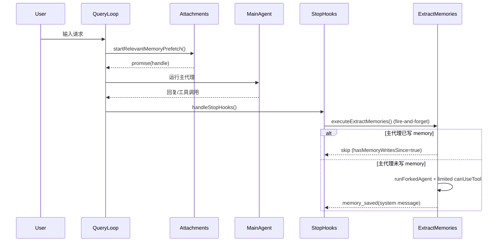

### 34.2 ExtractMemories 并发状态机

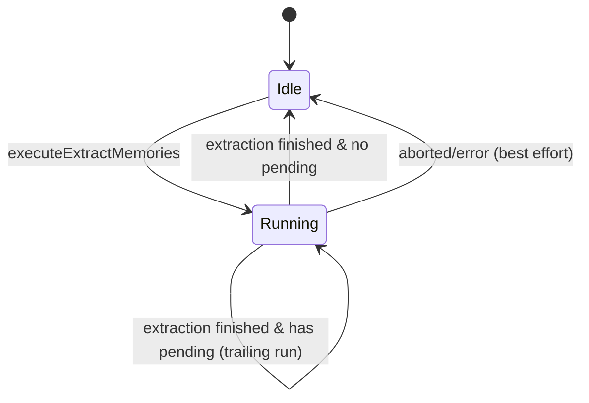

### 34.3 TeamMemory push 冲突重试图

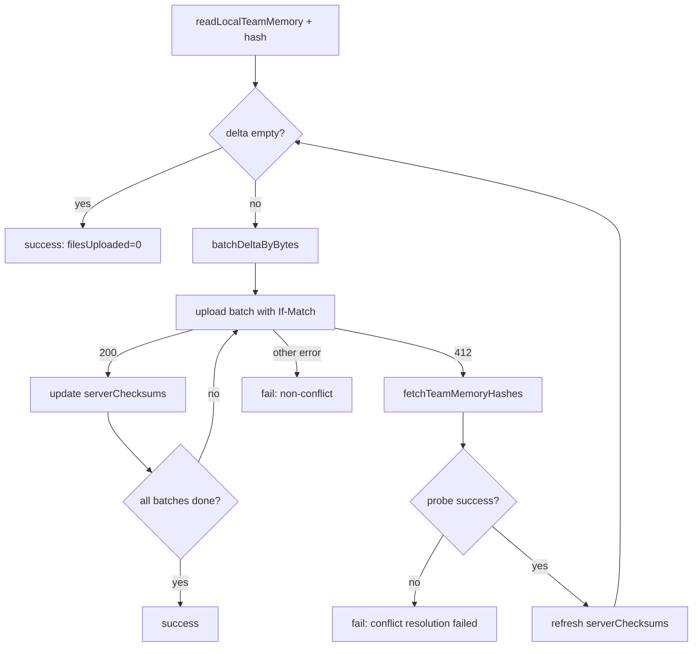

### 34.4 Session compact 不变量修正图

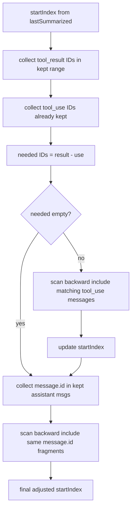

---

## 三十五、测试策略升级：从覆盖率到“行为证明”

你如果要把这套系统验证到“论文级可信”，建议测试不只看覆盖率，而是看“性质（property）”。

### 35.1 属性测试（Property-based）建议

1. **Tool pair 完整性属性**
   - 输入：随机消息序列（含 tool_use/tool_result、分片 message.id）
   - 断言：compact 后不存在 orphan tool_result。

2. **Team delta 收敛属性**
   - 输入：随机本地集合 + 随机冲突脚本
   - 断言：在有限冲突停止后，delta 单调不增并最终为空或成功。

3. **路径安全属性**
   - 输入：随机路径变体（编码、unicode、symlink、UNC）
   - 断言：非法路径永不通过 `validateTeamMemKey/WritePath`。

4. **去重属性**
   - 输入：随机 surfacing 历史 + readFileState
   - 断言：同一路径在无内容变化场景下不会重复注入。

### 35.2 故障注入（Fault Injection）建议

- 注入 `fetchTeamMemoryHashes` 网络失败；
- 注入目录读写权限错误；
- 注入 stopHooks 中断；
- 注入大文件与 413；
- 注入 dangling symlink。

观察指标应覆盖：

- 是否错误分型正确；
- 是否触发正确熔断/回退；
- 是否造成状态泄漏或死循环。

### 35.3 回归守护（Golden Tests）建议

为以下函数建立 golden fixtures：

- `truncateEntrypointContent`（长行/长文件组合）
- `buildMemoryLines`（各 gate 组合）
- `adjustIndexToPreserveAPIInvariants`（复杂消息序列）
- `batchDeltaByBytes`（边界字节切分）

这样重构时不会悄悄破坏协议语义。

---

## 三十六、最终补充结论：从“工程实现”到“可演化基础设施”

现在可以更严格地说：

Claude Code 的记忆系统已经具备“可演化基础设施”特征，而不是 feature patch：

- 有稳定语义层（类型学、存储约束、使用规则）；
- 有运行时状态机（预取、抽取、压缩、同步）；
- 有协议不变量（tool pair、message 分片、冲突重试）；
- 有安全边界（路径、权限、secret）；
- 有可观测与可验证机制（telemetry + property tests + fault injection）。

这意味着后续演进应遵循“协议升级”思路，而不是“模块小修补”思路：

1. 先定义语义与不变量；
2. 再调整模块实现；
3. 最后用性质测试和故障注入验证。

如果你后续继续要“论文深度”，下一步可以做的就是：

- 为第 31-35 章每条结论补“可执行实验脚本”；
- 将本文件变为“设计+验证报告”二合一文档（Design + Validation Report）。

---

## 三十七、逐函数实现剖析（A）：`src/memdir/paths.ts`

> 本章按函数给出“实现了什么、怎么实现、为什么这样实现”。  
> 记号说明：  
> - **职责**：函数对系统的功能贡献；  
> - **输入/输出**：含隐式输入（env/settings/global state）；  
> - **算法步骤**：按代码执行顺序展开；  
> - **关键分支**：影响行为的 if/early return；  
> - **副作用**：缓存、日志、外部状态变化；  
> - **边界与风险**：函数的已知假设与潜在误用点。

### 37.1 `isAutoMemoryEnabled(): boolean`

**职责**  
判定 AutoMemory 总开关，是几乎所有 memory 子系统的第一门槛。

**输入（隐式）**
- `CLAUDE_CODE_DISABLE_AUTO_MEMORY`
- `CLAUDE_CODE_SIMPLE`
- `CLAUDE_CODE_REMOTE`
- `CLAUDE_CODE_REMOTE_MEMORY_DIR`
- `getInitialSettings().autoMemoryEnabled`

**输出**
- `true/false`

**算法步骤**
1. 读取禁用 env；
2. 若 env truthy -> `false`；
3. 若 env defined falsy -> `true`；
4. 若 SIMPLE -> `false`；
5. 若 remote 且无 memory dir -> `false`；
6. 若 settings 明确给值 -> 使用 settings；
7. 否则默认 `true`。

**关键分支意义**
- 先 env 再 settings，体现“外部显式配置优先于持久配置”。
- SIMPLE 分支确保 bare 模式不会悄悄开启后台记忆能力。

**副作用**
- 无（纯判定）。

**边界与风险**
- 若调用者缓存结果过久，运行时 env 变化不会反映；但该系统默认 env/session 稳定。

---

### 37.2 `isExtractModeActive(): boolean`

**职责**  
判定“是否允许执行回合后记忆抽取（extractMemories）”。

**输入**
- GB gate: `tengu_passport_quail`
- 是否非交互会话
- GB gate: `tengu_slate_thimble`（允许非交互也执行）

**输出**
- `true/false`

**算法**
1. gate 未开直接 false；
2. 交互会话返回 true；
3. 非交互会话仅当第二 gate 开启时 true。

**设计原因**
- 抽取是后台增值能力，不应在所有模式默认运行。

---

### 37.3 `getMemoryBaseDir(): string`

**职责**  
返回 memory 根目录（用于 AutoMemory、AgentMemory 等）。

**算法**
1. 若 `CLAUDE_CODE_REMOTE_MEMORY_DIR` 存在，直接用它；
2. 否则使用 `getClaudeConfigHomeDir()`（通常 `~/.claude`）。

**边界**
- 假设该路径可读写；真正写入失败在上层处理。

---

### 37.4 `validateMemoryPath(raw, expandTilde): string | undefined`

**职责**  
对用户/环境提供的 memory 路径做安全规范化。

**实现步骤**
1. 空值直接 `undefined`；
2. 可选处理 `~/` 展开；
3. reject 展开后指向 home 根或上级（`.`/`..`）；
4. `normalize` + strip 尾分隔符；
5. reject 非绝对、长度过短、盘符根、UNC、null byte；
6. 返回 `normalized + sep`（统一尾分隔符）并 NFC 归一化。

**关键点**
- 统一尾分隔符是为了后续 `startsWith` 判定不出错。

**安全语义**
- 这是“防错误配置”+“防路径投毒”的双重校验。

---

### 37.5 `getAutoMemPathOverride()` / `getAutoMemPathSetting()`

**职责**
- `getAutoMemPathOverride`：读取 env 级绝对覆盖；
- `getAutoMemPathSetting`：读取 settings 覆盖（受信来源限定）。

**差异**
- env 覆盖不做 `~` 展开（假设程序化传值）；
- settings 覆盖支持 `~`（提升手工配置体验）。

---

### 37.6 `hasAutoMemPathOverride(): boolean`

**职责**  
告诉上层“是否处于外部显式 memory path 接管模式”。

**为什么有这个函数**
- 某些写权限 carve-out 逻辑需要区分“用户自己配置”与“SDK 强制接管”。

---

### 37.7 `getAutoMemPath`（memoized const）

**职责**  
返回 AutoMemory 目录绝对路径（最终值）。

**实现要点**
1. 优先 override（env > settings）；
2. 否则拼接 `<memoryBase>/projects/<sanitize(getAutoMemBase)>/memory/`；
3. 使用 memoize 缓存，key 为 `getProjectRoot()`。

**为何 memoize**
- 该函数会在 UI/render 路径高频调用，减少 repeated settings parse/realpath 开销。

**边界**
- 运行时动态改变 env/settings 在同 session 内不一定即时生效（这是有意 tradeoff）。

---

### 37.8 `getAutoMemDailyLogPath(date?)`

**职责**  
KAIROS 模式下返回当日日志文件路径：`logs/YYYY/MM/YYYY-MM-DD.md`。

**实现**
- 纯日期格式化 + 路径 join。

---

### 37.9 `getAutoMemEntrypoint()`

**职责**  
返回 `getAutoMemPath()/MEMORY.md`。

---

### 37.10 `isAutoMemPath(absolutePath)`

**职责**  
快速判定某绝对路径是否在 AutoMemory 子树中。

**算法**
1. normalize 输入；
2. `startsWith(getAutoMemPath())`。

**边界**
- 这是“快速路径判定”，不是 TeamMem 那种 realpath 级防逃逸验证。

---

## 三十八、逐函数实现剖析（B）：`src/memdir/memdir.ts`

### 38.1 `truncateEntrypointContent(raw)`

**职责**  
裁剪 `MEMORY.md` 并附带诊断元数据，避免索引过长拖垮 prompt。

**输入/输出**
- 输入：原始 entrypoint 文本；
- 输出：`{content, lineCount, byteCount, wasLineTruncated, wasByteTruncated}`。

**算法**
1. trim + split lines；
2. 判断 line cap 与 byte cap；
3. 若不超限直接返回；
4. 若超行，先按行切；
5. 若仍超字节，按最后换行切；
6. 拼接 warning 文本。

**关键实现细节**
- warning 会区分“仅行超限 / 仅字节超限 / 双超限”。

---

### 38.2 `ensureMemoryDirExists(memoryDir)`

**职责**  
确保目录存在，降低模型“先探测目录再写”的工具回合消耗。

**实现**
1. 调 fs.mkdir（递归）；
2. 异常不抛出到上层，只 debug 记录 code。

**为什么不抛错**
- prompt 构建阶段不应因目录权限问题阻塞整个系统；真正写文件时工具层会给出明确错误。

---

### 38.3 `logMemoryDirCounts(memoryDir, baseMetadata)`

**职责**  
异步统计目录 file/subdir 数量并埋点。

**实现**
- fire-and-forget `readdir`，成功记录 counts，失败记录基础事件。

---

### 38.4 `buildMemoryLines(displayName, memoryDir, extraGuidelines?, skipIndex?)`

**职责**  
构造系统提示词中的“记忆行为协议”文本。

**核心内容块**
1. 记忆目标叙述；
2. 保存触发条件（显式 remember/forget）；
3. 类型学（四类）；
4. 不应保存项；
5. 保存流程（含 frontmatter 模板）；
6. 访问记忆时机与漂移验证；
7. 与 plan/tasks 的职责边界；
8. 搜索历史上下文建议（可选 gate）。

**`skipIndex` 分支意义**
- 在某些 gate 下弱化 index 维护要求，减少模型做机械索引更新。

---

### 38.5 `buildMemoryPrompt(params)`

**职责**  
为 agent memory 构建“行为协议 + 当前 MEMORY.md 内容”完整 prompt。

**实现步骤**
1. 读取 entrypoint（sync read，因 prompt 构建是同步路径）；
2. 构建基础 lines；
3. 若有内容，先 `truncateEntrypointContent` 再注入；
4. 否则注入“empty memory”提示；
5. join 输出字符串。

**副作用**
- 会触发 memory dir telemetry。

---

### 38.6 `buildAssistantDailyLogPrompt(skipIndex?)`

**职责**  
KAIROS 模式下，将“写 topic/index”范式切换为“按日 append-only log”。

**关键点**
- 路径用模式字符串 `YYYY/MM/YYYY-MM-DD.md`，避免缓存 prompt 因跨日失效；
- 由 nightly dream 任务做后续蒸馏。

---

### 38.7 `buildSearchingPastContextSection(autoMemDir)`

**职责**  
可选注入“如何 grep memory/transcript”指导。

**实现**
- gate 关闭 -> 空数组；
- 否则根据是否 embedded tools/REPL，生成 grep shell 命令或 Grep tool 形式。

---

### 38.8 `loadMemoryPrompt()`

**职责**  
统一选择最终 memory prompt 变体。

**执行步骤**
1. 读取 autoEnabled + skipIndex；
2. KAIROS 分支优先；
3. TEAMMEM 分支；
4. auto-only 分支；
5. disabled 分支记录 telemetry 并返回 null。

**为什么是统一入口**
- 避免调用方自己拼策略，保证所有模式行为一致。

---

## 三十九、逐函数实现剖析（C）：`findRelevantMemories.ts` 与 `memoryScan.ts`

### 39.1 `scanMemoryFiles(memoryDir, signal)`

**职责**  
扫描候选记忆头信息，供召回与抽取复用。

**实现步骤**
1. `readdir(recursive)` 获取条目；
2. 过滤 `.md` 且排除 `MEMORY.md`；
3. 并发读取每个文件前 `FRONTMATTER_MAX_LINES`；
4. 解析 frontmatter（description/type）；
5. `Promise.allSettled` 过滤失败项；
6. 按 `mtimeMs` 新到旧排序；
7. 截断到 `MAX_MEMORY_FILES`。

**复杂度**
- 近似 O(N log N)，N capped（200）时稳定。

---

### 39.2 `findRelevantMemories(query, memoryDir, signal, recentTools, alreadySurfaced)`

**职责**  
返回“最相关且未被展示过”的记忆路径列表（含 mtime）。

**算法**
1. `scanMemoryFiles` 后先过滤 `alreadySurfaced`；
2. 调 `selectRelevantMemories` 获得 filename 列表；
3. filename -> header map 映射；
4. 过滤未知 filename；
5. 返回 `{path, mtimeMs}`。

**关键细节**
- 即便 selection 为空也可记录 telemetry shape（用于分析“检索执行但无命中”）。

---

### 39.3 `selectRelevantMemories(...)`

**职责**  
用 sideQuery 执行语义选择。

**输入**
- query；
- memory manifest；
- recentTools（抑制工具文档噪声）。

**实现**
1. 构造 system prompt 与 user content；
2. 指定 JSON schema 输出；
3. 解析 text block JSON；
4. 仅保留 `validFilenames`。

**失败策略**
- 异常/abort 返回空数组，不中断主回合。

---

## 四十、逐函数实现剖析（D）：`extractMemories.ts` 状态机函数

### 40.1 `countModelVisibleMessagesSince(messages, sinceUuid)`

**职责**  
计算“自游标以来可见于模型的消息数”。

**实现细节**
- 若 sinceUuid 不存在（被 compact 删除），回退为“统计全部可见消息”，避免后续永远不触发抽取。

---

### 40.2 `hasMemoryWritesSince(messages, sinceUuid)`

**职责**  
检测主链是否已写 AutoMemory。

**实现**
- 遍历 assistant content；
- 识别 tool_use 且工具名是 Edit/Write；
- 提取 file_path；
- `isAutoMemPath(file_path)`。

**作用**
- 主链已写 -> 抽取器跳过（互斥）。

---

### 40.3 `createAutoMemCanUseTool(memoryDir)`

**职责**  
定义抽取器工具权限策略。

**策略表**
- REPL: allow（内部 primitive 仍会二次校验）；
- Read/Grep/Glob: allow；
- Bash: 仅 read-only allow；
- Edit/Write: 仅 memoryDir 内 allow；
- 其他 deny。

---

### 40.4 `getWrittenFilePath(block)` / `extractWrittenPaths(agentMessages)`

**职责**
- 从 tool_use block 中提取写入路径；
- 汇总 fork agent 写入的唯一路径。

**用途**
- 统计 memory saved；
- 过滤掉 `MEMORY.md` 机械更新，仅展示 topic 文件。

---

### 40.5 `initExtractMemories()`

**职责**  
初始化闭包状态与公开执行器。

**创建的内部状态**
- `inFlightExtractions`
- `lastMemoryMessageUuid`
- `inProgress`
- `pendingContext`
- `turnsSinceLastExtraction`

**为什么闭包化**
- 测试可重置；
- 避免全局状态跨场景污染。

---

### 40.6 `executeExtractMemories(context, appendSystemMessage?)`

**职责**  
公开入口。若未初始化则 no-op。

**调用链**
- `query/stopHooks.ts` fire-and-forget 调用。

---

### 40.7 `drainPendingExtraction(timeoutMs?)`

**职责**  
尽力等待 in-flight 提取完成，用于进程收尾阶段。

---

## 四十一、逐函数实现剖析（E）：`SessionMemory` 与 `SessionMemoryUtils`

### 41.1 `shouldExtractMemory(messages)`

**职责**  
判定本轮是否触发 session memory 更新。

**条件组合**
1. 初始化阈值（context token >= minimumMessageTokensToInit）；
2. 更新阈值（tokens since last extraction >= minimumTokensBetweenUpdate）；
3. 工具调用阈值或自然回合断点；
4. 满足时更新 `lastMemoryMessageUuid`。

**关键语义**
- token 阈值是硬前提，避免频繁小更新。

---

### 41.2 `setupSessionMemoryFile(toolUseContext)`

**职责**
- 建立 session memory 文件与模板；
- 读取当前内容。

**实现步骤**
1. mkdir dir（700）；
2. 文件不存在则创建（600）并写模板；
3. 清 `readFileState` 缓存；
4. 调 FileReadTool 读取真实内容。

**重要细节**
- 清缓存是为了避免 `file_unchanged` 短路影响后续 edit。

---

### 41.3 `extractSessionMemory`（sequential 包装）

**职责**
- post-sampling hook 主体；
- 串行保证避免并发写 session note。

**执行流程**
1. 校验 querySource（仅主线程）；
2. gate 判定；
3. 初始化远端配置；
4. `shouldExtractMemory` 判定；
5. setup file + build prompt；
6. `runForkedAgent` 执行；
7. 记录 token 基线、更新 summarized id。

---

### 41.4 `manuallyExtractSessionMemory(messages, toolUseContext)`

**职责**
- `/summary` 等手动触发路径；
- 跳过自动阈值，直接做一次提取。

**实现差异**
- 手工构造 cacheSafeParams（系统 prompt + user/system context + fork messages）。

---

### 41.5 `createMemoryFileCanUseTool(memoryPath)`

**职责**
- 仅允许 FileEdit 且 file_path 精确等于 memoryPath。

---

### 41.6 `sessionMemoryUtils.ts` 核心函数组

#### 状态读写
- `getLastSummarizedMessageId`
- `setLastSummarizedMessageId`
- `markExtractionStarted/Completed`
- `recordExtractionTokenCount`

#### 阈值判定
- `hasMetInitializationThreshold`
- `hasMetUpdateThreshold`
- `getToolCallsBetweenUpdates`

#### 生命周期辅助
- `waitForSessionMemoryExtraction`（软超时 + stale 判断）
- `getSessionMemoryContent`
- `resetSessionMemoryState`

这些函数让 `sessionMemory.ts` 的主流程保持简洁，把状态管理与阈值逻辑解耦。

---

## 四十二、逐函数实现剖析（F）：`sessionMemoryCompact.ts`

### 42.1 `hasTextBlocks(message)`

**职责**
- 判定消息是否包含文本内容，用于最小文本消息数约束。

### 42.2 `getToolResultIds` / `hasToolUseWithIds`

**职责**
- 为不变量修复提供基础查询能力。

### 42.3 `adjustIndexToPreserveAPIInvariants(messages, startIndex)`

**职责**
- 保证 compact 切片不破坏工具配对与 message 分片连续性。

**步骤**
1. 收集 kept range tool_result IDs；
2. 计算缺失 tool_use IDs；
3. 向前补齐缺失 tool_use；
4. 收集 kept range assistant message.id；
5. 向前补齐同 message.id 前序分片。

### 42.4 `calculateMessagesToKeepIndex(messages, lastSummarizedIndex)`

**职责**
- 在 min/max token、min text block 约束下计算保留起点。

**实现**
- 从 `lastSummarized+1` 开始；
- 不足则向前扩展；
- 到 max cap 或满足 min 条件停止；
- 最后做不变量修正。

### 42.5 `trySessionMemoryCompaction(...)`

**职责**
- 试图用 session memory 替代传统 compact summary；
- 失败则安全返回 `null`，让上层 fallback。

**关键分支**
- no file / empty template / summarized id missing / threshold exceeded 均走 null。

---

## 四十三、逐函数实现剖析（G）：`teamMemorySync/index.ts`

### 43.1 `createSyncState()`

**职责**
- 初始化同步状态容器。

### 43.2 `hashContent(content)`

**职责**
- 生成 `sha256:<hex>`，与服务端 `entryChecksums` 格式对齐。

### 43.3 `fetchTeamMemoryOnce(...)` / `fetchTeamMemory(...)`

**职责**
- 拉取远端 team memory（含 304/404 语义处理）；
- 外层封装重试。

**关键语义**
- 304：not modified；
- 404：远端无数据；
- 200：解析 schema + 刷新 checksum。

### 43.4 `fetchTeamMemoryHashes(...)`

**职责**
- 冲突路径下的轻量探针：只拿 hashes，不拉正文。

**意义**
- 解决 412 后“只想知道谁变了，不想下载全量正文”的效率问题。

---

### 43.5 `batchDeltaByBytes(delta)`

**职责**
- 以请求体字节为约束切批。

**算法**
1. key 排序（稳定批次）；
2. 估算 entry 边际字节；
3. 贪心塞批，超限则开新批；
4. 返回批次数组。

### 43.6 `uploadTeamMemory(...)`

**职责**
- 执行单次 PUT（可带 If-Match）；
- 识别 412 conflict；
- 识别 413 结构化错误并提取 server limit。

### 43.7 `readLocalTeamMemory(maxEntries)`

**职责**
- 递归读取本地 team files；
- 过滤超大文件；
- secret scan；
- 在 learned maxEntries 下做确定性截断。

### 43.8 `writeRemoteEntriesToLocal(entries)`

**职责**
- 将远端 entries 写回本地（路径校验 + unchanged skip）。

**关键点**
- 先读 compare，内容相同则不写，避免 mtime 抖动和 watcher 假事件。

---

### 43.9 `pullTeamMemory(state, options?)`

**职责**
- 从远端拉取并落盘；
- 刷新 `serverChecksums`；
- 写入成功时清理 memory file cache。

### 43.10 `pushTeamMemory(state)`

**职责**
- 计算 delta 上传；
- 处理 conflict probe/retry；
- 处理 secret skip；
- 返回结构化结果（成功/失败原因）。

### 43.11 `syncTeamMemory(state)`

**职责**
- pull 再 push 的双向同步入口。

---

### 43.12 `logPull` / `logPush`

**职责**
- 统一事件埋点出口，携带状态、时长、错误分型、批次数等。

---

## 四十四、你要的“实现了什么，怎么实现”的一句话速览（函数版）

为了你快速检索，这里给出极简索引：

- `isAutoMemoryEnabled`：实现“是否开记忆”，通过 env/settings 多级短路实现。
- `getAutoMemPath`：实现“记忆目录解析”，通过 override 优先 + memoize 实现。
- `truncateEntrypointContent`：实现“索引控长”，通过行优先 + 字节兜底截断实现。
- `buildMemoryLines`：实现“行为协议注入”，通过模板化 section 拼装实现。
- `findRelevantMemories`：实现“相关召回”，通过 header 扫描 + sideQuery 选择实现。
- `startRelevantMemoryPrefetch`：实现“查询期预取”，通过异步 promise + abort 绑定实现。
- `createAutoMemCanUseTool`：实现“后台权限沙箱”，通过工具名/路径白名单实现。
- `runExtraction`：实现“回合后自动抽取”，通过互斥判定 + forked agent + trailing run 实现。
- `shouldExtractMemory`：实现“session 更新触发”，通过 token/tool 双阈值实现。
- `adjustIndexToPreserveAPIInvariants`：实现“compact 正确性”，通过工具配对/分片回溯修正实现。
- `pushTeamMemory`：实现“团队增量同步”，通过 hash delta + 412 probe 重算实现。
- `validateTeamMemKey`（teamMemPaths）：实现“路径安全”，通过规范化 + realpath containment 实现。

---

## 四十五、下一步（若继续要更深）

如果你继续要“函数级更深一层”（接近代码审计报告），我可以再补三部分：

1. **逐函数伪代码对照真实代码块**（每函数 20-40 行伪代码）；
2. **每函数的输入域/输出域与不变量列表**（形式化规格）；
3. **每函数的失败注入用例模板**（可直接转测试文件）。


---

## 四十六、代码审计级附录（一）：伪代码对照与形式化规格

> 本附录给出“可执行思维模型”。每个函数按统一模板描述：  
> **伪代码** -> **输入域/输出域** -> **不变量** -> **失败注入模板**。  
> 你可以直接把“失败注入模板”改成单测（Jest/Bun test）案例。

### 46.1 `isAutoMemoryEnabled`

#### 伪代码

```text
function isAutoMemoryEnabled():
  envVal = ENV.CLAUDE_CODE_DISABLE_AUTO_MEMORY
  if isTruthy(envVal): return false
  if isDefinedFalsy(envVal): return true

  if isTruthy(ENV.CLAUDE_CODE_SIMPLE): return false

  if isTruthy(ENV.CLAUDE_CODE_REMOTE) and not ENV.CLAUDE_CODE_REMOTE_MEMORY_DIR:
    return false

  settings = getInitialSettings()
  if settings.autoMemoryEnabled is defined:
    return settings.autoMemoryEnabled

  return true
```

#### 输入域/输出域

- 输入域：
  - `envVal ∈ {undefined, truthy, falsy}`
  - `CLAUDE_CODE_SIMPLE ∈ {true,false}`
  - `remoteMode ∈ {true,false}` + `remoteMemDir ∈ {set,unset}`
  - `settings.autoMemoryEnabled ∈ {undefined,true,false}`
- 输出域：`{true,false}`

#### 不变量

1. 若 `CLAUDE_CODE_DISABLE_AUTO_MEMORY` 明确 truthy，则输出必为 false。
2. 若 `CLAUDE_CODE_DISABLE_AUTO_MEMORY` 明确 falsy，则输出必为 true。
3. 当 env 未定义时，SIMPLE/remote 条件优先于 settings 默认值。

#### 失败注入模板

- Case A: env truthy + settings true -> 结果必须 false。
- Case B: env undefined + SIMPLE true + settings true -> 结果必须 false。
- Case C: remote true + remoteMemDir unset -> 结果必须 false。
- Case D: env undefined + settings undefined -> 结果必须 true。

---

### 46.2 `validateMemoryPath(raw, expandTilde)`

#### 伪代码

```text
function validateMemoryPath(raw, expandTilde):
  if raw is empty: return undefined
  candidate = raw

  if expandTilde and candidate startsWith "~/" or "~\":
    rest = candidate[2:]
    restNorm = normalize(rest or ".")
    if restNorm in {".",".."}: return undefined
    candidate = join(homedir(), rest)

  normalized = normalize(candidate).stripTrailingSlashes()

  if not isAbsolute(normalized): return undefined
  if length(normalized) < 3: return undefined
  if normalized matches "^[A-Za-z]:$": return undefined
  if normalized startsWith "\\\\" or "//": return undefined
  if normalized contains nullByte: return undefined

  return NFC(normalized + pathSeparator)
```

#### 输入域/输出域

- 输入：任意字符串路径（含空字符串、相对路径、绝对路径、UNC、盘符根、`~/`）
- 输出：`undefined` 或 “带尾分隔符的规范化绝对路径”

#### 不变量

1. 返回值若非 `undefined`，必为绝对路径，且包含单一尾分隔符。
2. 返回值不会是根目录或盘符根。
3. 返回值不含 null byte。

#### 失败注入模板

- `%2e%2e%2f` 类编码输入；
- `~/`、`~/..`、`~/foo/..`；
- Windows: `C:\`、`\\server\share`；
- Linux: `/`、`//tmp`；
- `abc`（相对路径）。

---

### 46.3 `truncateEntrypointContent`

#### 伪代码

```text
function truncateEntrypointContent(raw):
  trimmed = trim(raw)
  lines = split(trimmed, "\n")
  lineCount = len(lines)
  byteCount = len(trimmed)

  lineOverflow = lineCount > MAX_LINES
  byteOverflow = byteCount > MAX_BYTES
  if not lineOverflow and not byteOverflow:
    return full(trimmed)

  truncated = lineOverflow ? join(lines[0:MAX_LINES], "\n") : trimmed
  if len(truncated) > MAX_BYTES:
    cutAt = lastIndexOf("\n", MAX_BYTES)
    truncated = slice(truncated, 0, cutAt > 0 ? cutAt : MAX_BYTES)

  warning = buildWarning(lineOverflow, byteOverflow, lineCount, byteCount)
  return truncated + warning with metadata
```

#### 输入域/输出域

- 输入：任意 markdown 文本
- 输出：`EntrypointTruncation` 对象

#### 不变量

1. 输出 `content` 长度不超过字节阈值（近似字符长度阈值）。
2. 若超限，`wasLineTruncated` 或 `wasByteTruncated` 至少一者为 true。
3. 若未超限，`content == trimmed(raw)`。

#### 失败注入模板

- 超行不超字节（短行大量）；
- 超字节不超行（极长单行）；
- 双超限；
- 恰好等于阈值；
- 不含换行且超字节（cutAt = -1 路径）。

---

### 46.4 `findRelevantMemories`

#### 伪代码

```text
async function findRelevantMemories(query, memoryDir, signal, recentTools, alreadySurfaced):
  headers = await scanMemoryFiles(memoryDir, signal)
  candidates = filter(headers, h => h.filePath not in alreadySurfaced)
  if candidates empty: return []

  selectedNames = await selectRelevantMemories(query, candidates, signal, recentTools)
  byName = map filename -> header
  selectedHeaders = map selectedNames via byName and drop unknown

  logRecallShape(candidates, selectedHeaders) optional
  return map selectedHeaders => {path, mtimeMs}
```

#### 输入域/输出域

- 输入：query 字符串、目录路径、AbortSignal、工具名列表、已展示集合
- 输出：`RelevantMemory[]`（最多约 5，受选择器输出约束）

#### 不变量

1. 返回路径都来自 `scanMemoryFiles` 结果，不会凭空生成。
2. 返回路径不在 `alreadySurfaced`。
3. 中断或异常时返回空数组而非抛错。

#### 失败注入模板

- sideQuery 超时/异常；
- selector 返回未知 filename；
- `scanMemoryFiles` 返回空；
- signal 在 sideQuery 前后不同阶段 abort。

---

### 46.5 `createAutoMemCanUseTool`

#### 伪代码

```text
function createAutoMemCanUseTool(memoryDir):
  return async (tool, input):
    if tool.name == REPL: allow
    if tool.name in {READ, GREP, GLOB}: allow
    if tool.name == BASH:
      if parseSuccess(input) and tool.isReadOnly(parsed): allow
      else deny("read-only bash only")

    if tool.name in {EDIT, WRITE}:
      if typeof input.file_path == string and isAutoMemPath(input.file_path): allow

    deny("only specific tools and memoryDir writes allowed")
```

#### 输入域/输出域

- 输入：工具定义、工具输入对象
- 输出：`allow/deny` 决策对象（含拒绝原因）

#### 不变量

1. 非 memoryDir 写操作不会被允许。
2. Bash 非只读命令不会被允许。
3. Read/Grep/Glob 永远允许（只读）。

#### 失败注入模板

- Bash 命令包含重定向写文件；
- Write 到非 memory 路径；
- Edit 缺失 `file_path`；
- REPL 内调用 write 到非 memory 路径（应在内层再被拒）。

---

### 46.6 `runExtraction`（`initExtractMemories` 内部）

#### 伪代码（简化）

```text
async function runExtraction(context):
  newCount = countModelVisibleMessagesSince(messages, cursor)

  if hasMemoryWritesSince(messages, cursor):
    cursor = lastMessage.uuid
    log skip
    return

  if throttled and not trailing:
    turnsSinceLastExtraction++
    if turns < threshold: return
  turnsSinceLastExtraction = 0

  inProgress = true
  try:
    manifest = formatMemoryManifest(scanMemoryFiles(memoryDir))
    prompt = buildExtractPrompt(manifest, teamMode, skipIndex)
    result = runForkedAgent(prompt, canUseTool=createAutoMemCanUseTool)
    cursor = lastMessage.uuid
    paths = extractWrittenPaths(result.messages)
    emit telemetry + optional memorySaved system message
  catch:
    log error
  finally:
    inProgress = false
    if pendingContext exists:
      runExtraction(pendingContext, trailing=true)
```

#### 输入域/输出域

- 输入：`REPLHookContext`、`appendSystemMessage?`
- 输出：无显式返回（副作用型流程）

#### 不变量

1. 若主链已写 memory，则本轮不会再启动 fork 抽取。
2. `cursor` 只在成功抽取或主写跳过时前移。
3. 同时最多一个运行中的抽取流程。

#### 失败注入模板

- `runForkedAgent` 抛错；
- `scanMemoryFiles` 抛错；
- `appendSystemMessage` 不存在；
- 执行中收到多次新上下文（检查 pending 覆盖策略）。

---

### 46.7 `shouldExtractMemory`

#### 伪代码

```text
function shouldExtractMemory(messages):
  currentTokens = tokenCountWithEstimation(messages)

  if not initialized:
    if currentTokens < initThreshold: return false
    markInitialized()

  tokenOK = hasMetUpdateThreshold(currentTokens)
  toolCalls = countToolCallsSince(messages, lastMemoryMessageUuid)
  toolOK = toolCalls >= toolCallsBetweenUpdates
  lastTurnHasToolCalls = hasToolCallsInLastAssistantTurn(messages)

  should = (tokenOK and toolOK) or (tokenOK and not lastTurnHasToolCalls)
  if should:
    lastMemoryMessageUuid = lastMessage.uuid
    return true
  return false
```

#### 不变量

1. token 阈值未满足时绝不触发；
2. 初始化前必须先过 initThreshold；
3. 触发后会更新 `lastMemoryMessageUuid`。

#### 失败注入模板

- 大量 tool calls 但 token 不够；
- token 足够但始终有 tool calls；
- compact 后 uuid 不存在场景（观察计数是否合理）。

---

### 46.8 `adjustIndexToPreserveAPIInvariants`

#### 伪代码

```text
function adjustIndexToPreserveAPIInvariants(messages, start):
  adjusted = start

  resultIds = collect tool_result ids from [start, end)
  useIdsInRange = collect tool_use ids from [adjusted, end)
  needed = resultIds - useIdsInRange

  for i from adjusted-1 downto 0 while needed not empty:
    if message[i] contains any needed tool_use:
      adjusted = i
      remove found ids from needed

  msgIdsInRange = collect assistant.message.id from [adjusted, end)
  for i from adjusted-1 downto 0:
    if message[i].assistant and message[i].message.id in msgIdsInRange:
      adjusted = i

  return adjusted
```

#### 不变量

1. 调整后 kept range 不会缺失任何被引用的 tool_use（在可回溯找到前提下）。
2. 调整后同 message.id 的前序分片可被保留。

#### 失败注入模板

- 人工构造 tool_result 在 kept、tool_use 在被裁剪区；
- 同 message.id 跨多条消息分片；
- 嵌套 tool_use/tool_result 交错。

---

### 46.9 `pushTeamMemory`

#### 伪代码（简化）

```text
async function pushTeamMemory(state):
  assert oauth + repoSlug else fail(no_oauth/no_repo)

  {entries, skippedSecrets} = readLocalTeamMemory(state.serverMaxEntries)
  localHashes = map entries -> hashContent

  for conflictAttempt in [0..MAX_CONFLICT_RETRIES]:
    delta = {k | localHashes[k] != state.serverChecksums[k]}
    if delta empty: return success(filesUploaded=0, skippedSecrets)

    batches = batchDeltaByBytes(delta)
    filesUploaded = 0

    for batch in batches:
      r = uploadTeamMemory(state, repoSlug, batch, If-Match=state.lastKnownChecksum)
      if r.fail: break
      update state.serverChecksums for batch keys
      filesUploaded += batch.size

    if r.success: return success(filesUploaded, skippedSecrets)
    if not r.conflict: return fail(r)

    probe = fetchTeamMemoryHashes(state, repoSlug)
    if probe.fail: return fail(conflict resolution failed)
    state.serverChecksums = probe.entryChecksums

  return fail(unexpected end)
```

#### 不变量

1. 上传集合只包含“本地哈希与服务端哈希不一致”的键。
2. 冲突重试前一定刷新 serverChecksums。
3. 同一次 push 调用中，已成功批次的键会即时写回 `state.serverChecksums`。

#### 失败注入模板

- 第 1 批成功、第 2 批 412；
- `fetchTeamMemoryHashes` 返回 parse 错误；
- 413 结构化错误（学习 `serverMaxEntries`）；
- `scanForSecrets` 命中文件（应跳过而非整体失败）。

---

## 四十七、代码审计级附录（二）：函数副作用矩阵（可用于评审）

| 函数 | 读状态 | 写状态 | 外部IO | 关键副作用 |
|---|---|---|---|---|
| `isAutoMemoryEnabled` | env/settings | 无 | 无 | 决定整条 memory 链是否启用 |
| `getAutoMemPath` | env/settings/projectRoot | memoize cache | 无 | 生成全局 memory 路径基准 |
| `truncateEntrypointContent` | 文本入参 | 无 | 无 | 影响系统 prompt 大小 |
| `findRelevantMemories` | memory headers | 无 | sideQuery/read | 决定本轮注入哪些记忆 |
| `startRelevantMemoryPrefetch` | messages/readState | prefetch handle状态 | sideQuery/read | 异步预取 + 可取消 |
| `createAutoMemCanUseTool` | tool/input | 无 | 无 | 限制后台代理权限 |
| `runExtraction` | messages/cursor | cursor/pending/inProgress | fork+read/write | 自动补写 memory |
| `shouldExtractMemory` | messages + thresholds | lastMemoryMessageUuid | 无 | session 更新触发判定 |
| `adjustIndexToPreserveAPIInvariants` | message序列 | 无 | 无 | compact 协议正确性 |
| `pushTeamMemory` | local files + state | state.serverChecksums | network/read | team 增量同步与冲突收敛 |

---

## 四十八、代码审计级附录（三）：把文档直接转成测试任务的最小模板

你可以把下面模板复制成 issue / test plan：

### 模板 A：函数行为测试

```text
[目标函数]
- 名称:
- 文件:
- 断言性质:
  1)
  2)
  3)

[输入构造]
- 正常输入:
- 边界输入:
- 异常输入:

[预期]
- 返回值:
- 状态变化:
- 日志/事件:
```

### 模板 B：故障注入测试

```text
[故障点]
- 函数:
- 注入方式: throw / timeout / invalid response / partial success

[验证]
- 是否回退到安全路径:
- 是否保持不变量:
- 是否避免死循环:
- 是否给出可诊断事件:
```

### 模板 C：协议不变量测试

```text
[协议]
- 类型: tool_use/tool_result pairing 或 hash-delta convergence

[构造]
- 输入序列:
- 并发扰动:

[判定]
- 不变量是否成立:
- 失败是否可恢复:
```

---

## 四十九、流程图集（Mermaid）

> 这一节是“可视化导航层”，帮助你把前文文字分析映射到运行时数据流。  
> 建议在支持 Mermaid 的 Markdown 渲染器中查看（Cursor/VS Code 插件/Git 平台）。

### 49.1 记忆系统总架构流

文案解读（每步含 **输入 / 处理 / 输出**）：
1. `User Input -> Query Loop`
   - **输入**：用户消息、会话状态、项目根等运行时上下文。
   - **处理**：进入主查询循环，绑定本轮请求 ID 与消息序列。
   - **输出**：可继续构建 prompt 与执行推理的活跃回合。
2. `Query Loop -> Prompt Builder`
   - **输入**：系统默认 prompt 片段、技能/规则装配结果、memory 相关函数返回值。
   - **处理**：拼接系统提示词各段（含后续 Instruction / Auto Memory 段）。
   - **输出**：待发送给模型的系统消息体（或等价结构）。
3. `Prompt Builder -> Instruction Memory`
   - **输入**：仓库与用户目录下的 `CLAUDE.md` 及 include 链解析结果。
   - **处理**：加载、合并、去重或截断指令层文本。
   - **输出**：写入系统提示词的「指令记忆」段落。
4. `Prompt Builder -> Auto Memory Prompt`
   - **输入**：`loadMemoryPrompt` 产出的 memory 协议与索引信息、目录统计等。
   - **处理**：格式化为模型可执行的「如何维护 MEMORY / topic」说明。
   - **输出**：系统提示词中的 AutoMemory 行为段。
5. `Query Loop -> Relevant Retrieval`
   - **输入**：最新用户输入、memory 目录扫描能力、feature gate。
   - **处理**：异步启动预取（scan → select → read → attach），与主推理并行。
   - **输出**：后台任务句柄；完成后产生 `relevant_memories` 附件候选。
6. `Relevant Retrieval -> Main Agent`
   - **输入**：sideQuery 选中的路径、截断后的文件片段、去重后的附件列表。
   - **处理**：将附件并入本轮用户/上下文侧输入。
   - **输出**：主代理可见的「相关记忆」上下文块。
7. `Query Loop -> Main Agent`
   - **输入**：系统提示词、历史消息、工具状态、本轮用户消息、附件。
   - **处理**：主模型推理与（可选）工具调用循环。
   - **输出**：助手回复、工具调用序列、更新后的对话状态。
8. `Main Agent -> Stop Hooks`
   - **输入**：本轮完整消息轨迹与结束原因（正常停/工具结束等）。
   - **处理**：进入 `stopHooks` 编排，调度回合后任务。
   - **输出**：触发抽取、session 更新、telemetry 等副作用的入口信号。
9. `Stop Hooks -> ExtractMemories Fork`
   - **输入**：回合消息快照、memory 路径、gate 与节流状态。
   - **处理**：`executeExtractMemories` 异步 fork 子代理，白名单工具写 topic 文件。
   - **输出**：AutoMemory 文件变更、可选 `memory_saved` 系统消息、游标推进。
10. `Stop Hooks -> SessionMemory Update`
    - **输入**：token/工具调用计数、session memory 配置与当前文件内容。
    - **处理**：达阈值则 edit-only 子代理更新会话笔记文件。
    - **输出**：更新后的 session memory 文本与摘要边界元数据。
11. `SessionMemory Update -> SessionCompact`
    - **输入**：后续 compact 触发条件、session memory 文件、`tengu_sm_compact` 等 gate。
    - **处理**：compact 路径优先尝试以 session memory 为摘要锚点。
    - **输出**：压缩后的消息列表或回退 legacy compact 的结果。
12. `TeamMemory Watcher -> Team Sync -> Team Memory Files`
    - **输入**：`memory/team` 下文件变更事件、OAuth、repo slug、本地/服务端 checksum 状态。
    - **处理**：debounce → pull/push → delta 与 412 重试收敛。
    - **输出**：与远端一致的本地团队记忆文件集；更新后的同步状态。
13. `ExtractMemories -> Auto Memory Files` 与 `AMF/TMF -> Relevant Retrieval`
    - **输入**：抽取/同步写入后的磁盘上的 markdown 与 frontmatter。
    - **处理**：后续回合 `scanMemoryFiles` 将新内容纳入候选池；relevant 路径再被选中则重新注入。
    - **输出**：下一轮及之后主代理可能看到的记忆附件集合发生变化。

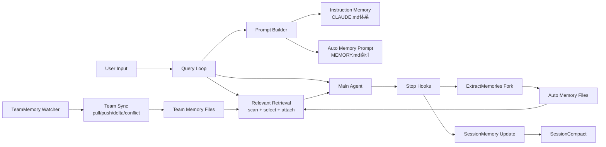

### 49.2 Prompt-time 记忆提示词构建流程

文案解读（每步含 **输入 / 处理 / 输出**）：
1. 入口 `loadMemoryPrompt`
   - **输入**：项目根、`isAutoMemoryEnabled`、KAIROS/TEAMMEM 构建期或运行时标志、目录路径解析结果。
   - **处理**：作为唯一入口聚合分支，避免在多处重复 if/else。
   - **输出**：进入 `AutoMemory Enabled?` 判定，或内部直接短路返回。
2. `AutoMemory Enabled?`
   - **输入**：env（如 SIMPLE/remote）、settings、`isAutoMemoryEnabled()` 结果。
   - **处理**：若关闭则不再读取 memdir、不拼接任何 memory 段。
   - **输出**：`no` → `return null`；`yes` → 进入 `KAIROS active?`。
3. `KAIROS active?`
   - **输入**：KAIROS 模式标志、当前 memdir 策略配置。
   - **处理**：选择 daily-log 专用提示词构建路径。
   - **输出**：`yes` → `buildAssistantDailyLogPrompt`；`no` → `TEAMMEM enabled?`。
4. `TEAMMEM enabled?`
   - **输入**：team memory feature gate、auto memory 已开启前提。
   - **处理**：决定是否要把 team 目录规则并入系统提示词。
   - **输出**：`yes` → combined 分支；`no` → auto-only 分支。
5. `buildCombinedMemoryPrompt`
   - **输入**：private memdir 与 team memdir 路径、类型说明模板。
   - **处理**：拼接双域行为约束与索引说明。
   - **输出**：合并后的 memory 提示词中间文本 → `ensureMemoryDirExists`。
6. `buildMemoryLines auto-only`
   - **输入**：单目录 memdir 元数据、memory 类型准则字符串。
   - **处理**：生成仅 AutoMemory 的协议与索引行。
   - **输出**：auto-only 中间文本 → `ensureMemoryDirExists`。
7. `buildAssistantDailyLogPrompt`（KAIROS 支路）
   - **输入**：append-only 日志语义、目录布局约定。
   - **处理**：生成与常规 topic 维护不同的 daily log 指引。
   - **输出**：KAIROS 中间文本 → `ensureMemoryDirExists`。
8. `ensureMemoryDirExists`
   - **输入**：解析后的 canonical memory 目录路径。
   - **处理**：`mkdir` 等确保目录存在（失败通常吞掉或记录，不阻断主流程）。
   - **输出**：目录就绪侧效应 + 与前面分支合并的文本流。
9. `return memory prompt text` / `return null`
   - **输入**：上述分支产出的字符串或空。
   - **处理**：返回给上层 prompt 装配。
   - **输出**：主系统提示词中 memory 段为字符串或完全省略。

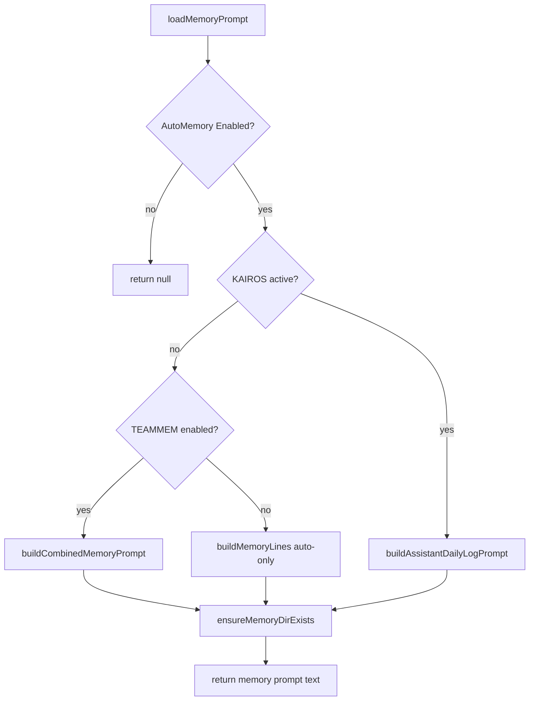

### 49.3 Relevant Retrieval 召回流程（query-time）

文案解读（每步含 **输入 / 处理 / 输出**）：
1. `Last user input -> Input valid?`
   - **输入**：当前轮最后一条用户可见文本、简单分词/长度启发式。
   - **处理**：判断是否足以支撑语义召回（如过滤单词、空串）。
   - **输出**：`valid` / `invalid` 分支。
2. `Input valid? = no -> Skip prefetch`
   - **输入**：无效输入标记。
   - **处理**：不发起扫描、不调用 sideQuery、不占用附件预算。
   - **输出**：无 `relevant_memories` 附件；预取任务结束。
3. `Input valid? = yes -> AutoMemory + Gate on?`
   - **输入**：`isAutoMemoryEnabled`、相关 feature gate（如 moth_copse 等）。
   - **处理**：与主链路门控对齐，避免禁用状态下仍预取。
   - **输出**：`gate on` / `gate off`。
4. `Gate = no -> Skip prefetch`
   - **输入**：门控关闭。
   - **处理**：同步骤 2，直接退出。
   - **输出**：无附件。
5. `Gate = yes -> scanMemoryFiles`
   - **输入**：memdir 根路径、递归扫描配置、节流读参数。
   - **处理**：读各 `.md` 文件头部/frontmatter，收集候选元数据。
   - **输出**：候选文件列表（路径、标题、类型、mtime 等）。
6. `filter alreadySurfaced`
   - **输入**：候选列表、历史已注入路径集合（already surfaced）。
   - **处理**：剔除本轮之前已展示过的路径。
   - **输出**：精简后的候选集。
7. `Candidates empty?`
   - **输入**：精简后候选集大小。
   - **处理**：若无候选则跳过后续模型调用。
   - **输出**：`empty` → `Skip prefetch`；`non-empty` → 进入 sideQuery。
8. `sideQuery selectRelevantMemories`
   - **输入**：用户问题文本、候选 manifest（文件名与白名单）、JSON schema 约束。
   - **处理**：对 Sonnet 等发起 sideQuery，解析结构化返回。
   - **输出**：模型选中的若干「合法文件名」。
9. `map filename->path`
   - **输入**：模型输出文件名、候选路径映射表。
   - **处理**：丢弃不在白名单中的名字，解析为绝对路径。
   - **输出**：待读取的真实路径列表。
10. `readMemoriesForSurfacing`
    - **输入**：路径列表、行数/字节上限。
    - **处理**：读文件并截断，组装可注入正文片段。
    - **输出**：内存中的 surfacing 文本块集合。
11. `filterDuplicateMemoryAttachments`
    - **输入**：surfacing 块、`readFileState` 等本轮已读记录。
    - **处理**：去掉与主代理已见内容重复的附件。
    - **输出**：去重后的附件候选。
12. `Attach relevant_memories`
    - **输入**：去重后的块与元数据。
    - **处理**：封装为 attachment 类型并挂入消息管线。
    - **输出**：主代理本轮请求携带的 `relevant_memories`。

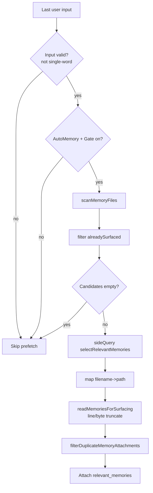

### 49.4 ExtractMemories 回合后抽取流程

文案解读（每步含 **输入 / 处理 / 输出**）：
1. `handleStopHooks -> executeExtractMemories`
   - **输入**：主回合结束事件、当前消息列表引用。
   - **处理**：注册 fire-and-forget 异步任务（不 await 阻塞 UI/流式输出）。
   - **输出**：抽取管线被调度；立即返回给 stop hook 其他逻辑。
2. `main thread + gate + autoMem?`
   - **输入**：线程标识、`isExtractModeActive` 等 gate、`isAutoMemoryEnabled`。
   - **处理**：三元与逻辑，任一 false 则拒绝执行。
   - **输出**：`pass` → 继续；`fail` → `return`。
3. 条件不满足 `-> return`
   - **输入**：失败原因（非主线程/无 gate/无 auto mem）。
   - **处理**：不写盘、不 fork、可记 telemetry skip。
   - **输出**：空闲状态；下一轮重新判定。
4. `inProgress?`
   - **输入**：模块内 `inProgress` 标志位。
   - **处理**：检测是否已有抽取运行中。
   - **输出**：`true` / `false`。
5. `inProgress = yes -> pendingContext = latest -> return`
   - **输入**：新上下文快照、旧 `pendingContext`。
   - **处理**：覆盖为最新上下文，避免排队多个并发 fork。
   - **输出**：当前 run 结束；待 inProgress 清零后消费 pending。
6. `inProgress = no -> runExtraction`
   - **输入**：通过前置检查后的完整抽取参数。
   - **处理**：置位 inProgress，进入互斥区。
   - **输出**：顺序执行后续子步骤。
7. `hasMemoryWritesSince?`
   - **输入**：主代理本轮工具写路径、memory 根路径集合、抽取游标。
   - **处理**：比对是否主线程已写 managed memory。
   - **输出**：`yes` → skip 分支；`no` → 节流检查。
8. `throttle passed?`
   - **输入**：上次抽取时间戳、配置的最小间隔。
   - **处理**：时间差与计数比较。
   - **输出**：未通过 → `return`；通过 → `scan manifest`。
9. `scan manifest`
   - **输入**：memdir 下现有文件枚举或清单摘要。
   - **处理**：注入子代理 system/user 上下文，引导更新而非重复造文件。
   - **输出**：manifest 文本进入 fork 输入。
10. `runForkedAgent maxTurns=5`
    - **输入**：回合消息、`createAutoMemCanUseTool` 白名单、工具实现。
    - **处理**：子代理最多 5 轮工具循环，写/编辑 memory 文件。
    - **输出**：子代理轨迹；磁盘上可能的文件变更。
11. `extractWrittenPaths`
    - **输入**：子代理 tool 调用记录或结果消息。
    - **处理**：解析实际写入的绝对路径，过滤非 topic 规则路径。
    - **输出**：写入路径列表 + 是否含 topic 记忆文件。
12. `memory topic files > 0?`
    - **输入**：上一步路径分类结果。
    - **处理**：若有 topic 产出则构造系统提示给用户可见反馈。
    - **输出**：`yes` → append `memory saved`；`no` → 静默。
13. `END`（`SKIP` / `SYS` / `END0` 汇合）
    - **输入**：本轮抽取最终结果（跳过/成功/无产出）。
    - **处理**：清除 inProgress、推进 last cursor、若有 pending 则链式触发下一次。
    - **输出**：模块回到可接受新回合的状态。

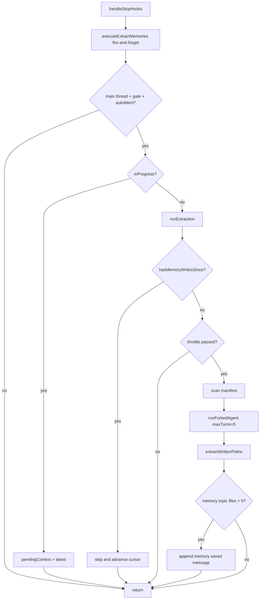

### 49.5 SessionMemory 更新与 SessionCompact 协同流

文案解读（每步含 **输入 / 处理 / 输出**）：

A. SessionMemory 更新链路（上半图）

1. `post-sampling hook`
   - **输入**：主线程 query 完成后的消息采样结果、session memory 配置。
   - **处理**：在 `sequential` 包装下排队，避免与同类 hook 并发踩踏。
   - **输出**：进入 `session gate on?`。
2. `session gate on?`
   - **输入**：`tengu_session_memory` 等 gate。
   - **处理**：判断是否启用会话记忆子系统。
   - **输出**：`off` → `return`；`on` → `shouldExtractMemory?`。
3. gate 关闭 `-> return`
   - **输入**：gate 关闭信号。
   - **处理**：不读盘、不 fork、不更新阈值计数（依实现可能仅短路）。
   - **输出**：会话记忆文件保持不变。
4. `shouldExtractMemory?`
   - **输入**：自上次提取以来的 token 增量、工具调用次数、`lastMemoryMessageUuid` 等。
   - **处理**：与配置阈值比较，决定是否值得跑一次更新。
   - **输出**：`no` → `return`；`yes` → `setupSessionMemoryFile`。
5. 阈值不满足 `-> return`
   - **输入**：未达阈值状态。
   - **处理**：跳过 fork，降低写放大与 API 成本。
   - **输出**：等待下次 hook 再评估。
6. `setupSessionMemoryFile`
   - **输入**：session memory 目标路径、默认模板字符串。
   - **处理**：不存在则创建并写入模板；存在则 `readFile`。
   - **输出**：当前文件内容与稳定路径句柄。
7. `buildSessionMemoryUpdatePrompt`
   - **输入**：文件内容、`analyzeSectionSizes` 超限提醒、变量替换表。
   - **处理**：拼装更新指令（保留结构、合并新事实、删冗余）。
   - **输出**：发给 fork 子代理的 user/system 片段。
8. `runForkedAgent (edit only session memory file)`
   - **输入**：上述 prompt、单文件 `canUseTool` 约束。
   - **处理**：子代理仅允许 edit 该 session 文件。
   - **输出**：磁盘上更新后的 session memory 文本。
9. `recordExtractionTokenCount`
   - **输入**：本轮对话 token 统计、子代理用量。
   - **处理**：写入模块状态，供下次 `shouldExtractMemory` 计算增量。
   - **输出**：更新后的基线与 telemetry 字段。
10. `setLastSummarizedMessageId if safe`
    - **输入**：当前消息 id、compact 安全条件（无悬空工具对等）。
    - **处理**：仅在安全时推进“已摘要边界”，避免 compact 切错。
    - **输出**：更新后的 `lastSummarizedMessageId` 或保持旧值。

B. SessionCompact 协同链路（下半图）

11. `compact trigger`
    - **输入**：上下文长度超阈、用户触发 compact、或内部策略信号。
    - **处理**：进入 compact 子系统入口。
    - **输出**：调用 `shouldUseSessionMemoryCompaction?`。
12. `shouldUseSessionMemoryCompaction?`
    - **输入**：`tengu_sm_compact`、`tengu_session_memory`、session 文件可用性标志。
    - **处理**：决定优先策略是否为 session-memory compaction。
    - **输出**：`no` → `legacy compact`；`yes` → `waitForSessionMemoryExtraction`。
13. 不满足 `-> legacy compact`
    - **输入**：gate 关闭或策略不允许。
    - **处理**：走历史 compact 实现（与 session 文件解耦）。
    - **输出**：传统压缩后的消息列表。
14. 满足 `-> waitForSessionMemoryExtraction`
    - **输入**：in-flight session extraction Promise、软超时毫秒数。
    - **处理**：await 或 race 超时，降低“压紧时文件仍陈旧”概率。
    - **输出**：同步点通过/超时结果 → `load session memory`。
15. `load session memory`
    - **输入**：session memory 文件路径。
    - **处理**：读入全文或截断版本供摘要使用。
    - **输出**：字符串内容 → `empty/template only?`。
16. `empty/template only?`
    - **输入**：文件内容与模板比对启发式。
    - **处理**：无有效摘要锚点则不可靠地压紧。
    - **输出**：`yes` → `legacy compact`；`no` → `calculateMessagesToKeepIndex`。
17. `calculateMessagesToKeepIndex`
    - **输入**：完整消息数组、token 预算、`lastSummarizedMessageId`。
    - **处理**：从尾部向前算保留窗口，得到初始 `startIndex`。
    - **输出**：数值索引 → `adjustIndexToPreserveAPIInvariants`。
18. `adjustIndexToPreserveAPIInvariants`
    - **输入**：`startIndex`、消息序列（tool 块、assistant 分片）。
    - **处理**：向前扩展以补齐 tool_use/tool_result 与同源 `message.id` 链。
    - **输出**：`adjustedIndex`。
19. `build compaction result`
    - **输入**：`adjustedIndex`、session memory 摘要正文、需丢弃区间。
    - **处理**：拼装新的压缩消息列表（通常含摘要 system/user 块）。
    - **输出**：可提交给 API 的 compact 后对话状态。

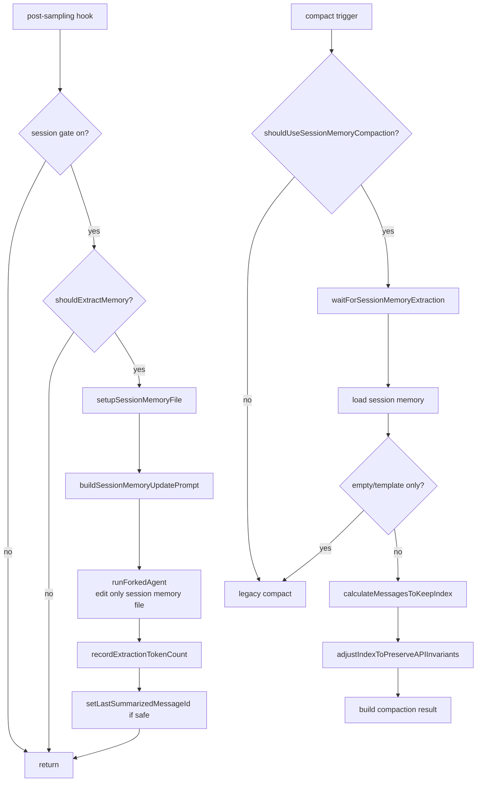

### 49.6 TeamMemory 同步与冲突收敛流程

文案解读（每步含 **输入 / 处理 / 输出**）：
1. `watch file change -> debounce`
   - **输入**：`fs.watch` 或等价事件、变更路径。
   - **处理**：定时器合并短时间 burst，抑制抖动。
   - **输出**：单次稳定的 `pushTeamMemory` 触发意图。
2. `debounce -> pushTeamMemory`
   - **输入**：防抖后的触发信号、同步状态对象。
   - **处理**：进入上传主函数，加锁或串行化（依实现）。
   - **输出**：进入 `OAuth + Repo ok?`。
3. `OAuth + Repo ok?`
   - **输入**：当前 OAuth token、GitHub remote 解析出的 repo slug。
   - **处理**：校验可调用 first-party API 的前置条件。
   - **输出**：`ok` / `fail` 及原因枚举。
4. 校验失败 `-> fail no_oauth/no_repo`
   - **输入**：失败原因码。
   - **处理**：记录事件；watcher 可能进入 suppression。
   - **输出**：本轮 push 终止；本地文件仍为脏直至条件恢复。
5. 校验通过 `-> readLocalTeamMemory + scan secrets`
   - **输入**：team memory 根目录、`scanForSecrets` 规则集。
   - **处理**：枚举条目读内容；命中 secret 的文件标记跳过。
   - **输出**：可上传条目集合 + 跳过列表。
6. `compute local hashes`
   - **输入**：每个 entry 的规范化内容字节。
   - **处理**：SHA256（或项目所用算法）逐条哈希。
   - **输出**：`localHashes` 映射。
7. `delta empty?`
   - **输入**：`localHashes`、内存中 `serverChecksums`。
   - **处理**：键集合并逐键比较，生成待上传子集。
   - **输出**：`empty` → `success filesUploaded=0`；否则进入分批。
8. `batchDeltaByBytes`
   - **输入**：delta 条目、单请求体字节上限。
   - **处理**：贪心或切片打包成若干 batch。
   - **输出**：batch 队列。
9. `uploadTeamMemory If-Match`
   - **输入**：batch 序列化体、每条目前服务端 etag/checksum。
   - **处理**：HTTP PUT + 条件头，实现乐观锁。
   - **输出**：HTTP 状态码 + 响应体（错误或新 checksum）。
10. `status 200? = yes`
    - **输入**：成功响应、本 batch 键列表。
    - **处理**：用响应中的权威 checksum 更新 `serverChecksums`。
    - **输出**：本批已收敛；进入 `more batches?`。
11. `more batches?`
    - **输入**：剩余 batch 队列。
    - **处理**：非空则回到步骤 9；空则整次 push 成功。
    - **输出**：`OK1 success` 或继续循环。
12. `status 200? = no -> status 412?`
    - **输入**：非 200 状态码、响应解析结果。
    - **处理**：区分冲突（412）与其它 4xx/5xx。
    - **输出**：路由到冲突解析或 `fail non-conflict`。
13. `status 412 = yes -> fetchTeamMemoryHashes`
    - **输入**：repo slug、鉴权头。
    - **处理**：调用 `view=hashes` 类端点拉全量或分页哈希视图。
    - **输出**：远端哈希映射或错误。
14. `probe success? = yes -> refresh serverChecksums -> delta`
    - **输入**：新远端哈希、本地内容。
    - **处理**：覆盖 `serverChecksums`，重新计算 delta（可能变小或变向）。
    - **输出**：回到步骤 7 的判定环，直至成功或重试上限。
15. `probe success? = no` 或 `status 412 = no`
    - **输入**：探针失败或 413/401/500 等非 412 错误。
    - **处理**：记录 telemetry；可能熔断 watcher 重试。
    - **输出**：`ERR` / `ERR2` 失败返回；本地与服务端可能仍不一致。

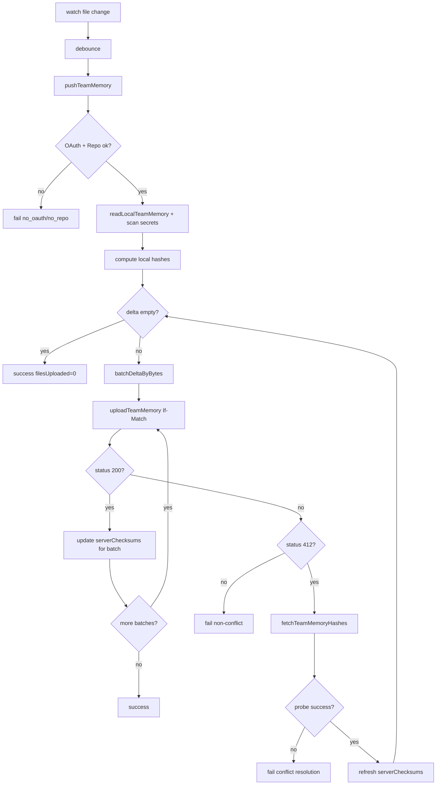

### 49.7 `adjustIndexToPreserveAPIInvariants` 细节流

文案解读（每步含 **输入 / 处理 / 输出**）：
1. 输入 `startIndex`
   - **输入**：`calculateMessagesToKeepIndex` 给出的初始裁剪下标、完整 `messages` 数组。
   - **处理**：作为算法当前保留窗口左边界候选。
   - **输出**：进入 tool 不变量修复阶段。
2. `collect tool_result IDs in kept range`
   - **输入**：`[adjustedIndex, end)` 内所有消息块。
   - **处理**：遍历 `tool_result` 块，收集其 `tool_use_id` 集合。
   - **输出**：`resultIds`（被引用集合）。
3. `collect tool_use IDs already kept`
   - **输入**：同一保留区间内的 `tool_use` 块。
   - **处理**：收集 `id` 字段。
   - **输出**：`useIds`（已存在调用集合）。
4. `needed IDs = result - use`
   - **输入**：`resultIds`、`useIds`。
   - **处理**：集合差分，得到孤儿引用所需的 tool_use id。
   - **输出**：`needed` 集合。
5. `needed empty?`（含 `scan backward ... tool_use`）
   - **输入**：`needed`、当前左边界索引、全序列。
   - **处理**：若非空则向左扩展窗口，每步吞入可能包含对应 `tool_use` 的 user 消息，直至 `needed` 清空或到 0。
   - **输出**：更新后的左边界 + `needed` 最终为空（或无法继续时的边界）。
6. `collect message.id in kept assistant messages`
   - **输入**：当前保留区内所有 assistant 消息及其 `message.id`。
   - **处理**：提取非空 id，表示“分片链”锚点。
   - **输出**：`fragmentIds` 集合。
7. `scan backward include same message.id fragments`
   - **输入**：`fragmentIds`、当前左边界。
   - **处理**：向左继续扩展，把相同 `message.id` 的相邻 assistant 片段全部纳入，避免半条消息进上下文。
   - **输出**：最终左边界索引。
8. `return adjustedIndex`
   - **输入**：最终左边界整数。
   - **处理**：作为函数返回值交给 compact 主流程切片。
   - **输出**：满足 API 配对与分片连续性的消息子数组起点。

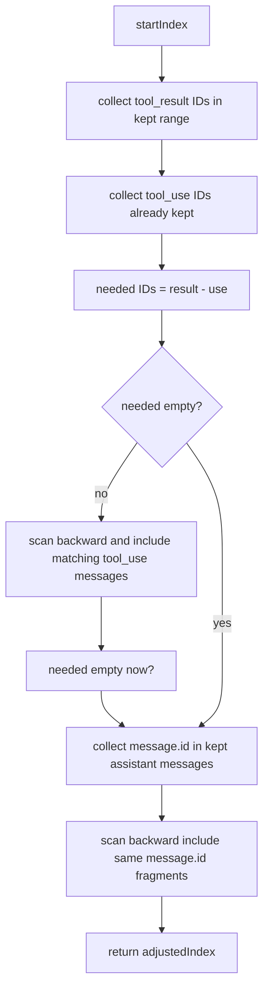

### 49.8 AgentMemory（子代理记忆）路径与加载流

文案解读（每步含 **输入 / 处理 / 输出**）：
1. 输入 `agentType + scope`
   - **输入**：子代理类型枚举、作用域（user / project / local）、项目根与用户主目录。
   - **处理**：决定记忆隔离策略（哪些路径可读、默认写哪里）。
   - **输出**：解析参数包 → `getAgentMemoryDir`。
2. `getAgentMemoryDir`
   - **输入**：上述参数、remote memory 目录覆盖（若存在）。
   - **处理**：拼接并规范化路径，应用 sanitize/校验。
   - **输出**：该 agent 的记忆根目录绝对路径。
3. `getAgentMemoryEntrypoint`
   - **输入**：记忆根目录。
   - **处理**：固定入口文件名（如 `MEMORY.md`）拼接。
   - **输出**：入口文件绝对路径。
4. `ensureMemoryDirExists fire-and-forget`
   - **输入**：记忆根目录路径。
   - **处理**：异步 `mkdir`（不 await 于关键路径上）。
   - **输出**：后台侧效应；主流程继续。
5. `buildMemoryPrompt Persistent Agent Memory`
   - **输入**：目录存在性探测结果（可选）、入口文件若存在则其摘要或全文（受截断策略）。
   - **处理**：生成「持久 Agent 记忆」说明段，与 AutoMem 文本风格对齐。
   - **输出**：待注入的 memory prompt 字符串。
6. `spawned agent system prompt`
   - **输入**：子代理 spawn 配置、其它系统段。
   - **处理**：合并为子代理初始化 system 消息。
   - **输出**：子代理运行时上下文；后续可读写自身记忆文件集合。

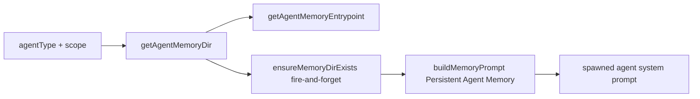


---

## 五十、运维与契约补充（生产可落地版）

> 本章补齐“代码有实现但文档易缺失”的部分：gate 矩阵、配置优先级、API 契约、攻击树、Runbook、事件字典与回归索引。  
> 目标是让该文档不仅能“读懂系统”，还能直接用于排障、上线评审与交接。

### 50.1 Feature Gate 全景矩阵

| Gate / 条件 | 作用模块 | 开启后行为 | 关闭后行为 | 代码锚点 |
|---|---|---|---|---|
| `tengu_passport_quail` | ExtractMemories | 回合后允许抽取 fork | 不执行 extract | `memdir/paths.ts:isExtractModeActive`, `services/extractMemories/extractMemories.ts` |
| `tengu_slate_thimble` | ExtractMemories（非交互） | 非交互会话也可抽取 | 非交互禁用抽取 | `memdir/paths.ts:isExtractModeActive` |
| `tengu_moth_copse` | Memory 索引注入策略 | 偏向 relevant memories 预取/附件 | 常规索引注入路径 | `memdir/memdir.ts`, `utils/claudemd.ts`, `utils/attachments.ts` |
| `tengu_herring_clock` | TEAMMEM | 启用 team memory 目录与逻辑 | team memory 全链路关闭 | `memdir/teamMemPaths.ts:isTeamMemoryEnabled` |
| `tengu_session_memory` | SessionMemory | 启用会话记忆更新 | 只走传统路径 | `services/SessionMemory/sessionMemory.ts` |
| `tengu_sm_compact` | SessionMemoryCompact | compact 优先尝试 session memory | fallback legacy compact | `services/compact/sessionMemoryCompact.ts` |
| `tengu_onyx_plover` | AutoDream | 控制 dream 的 minHours/minSessions | 使用默认阈值或不触发 | `services/autoDream/autoDream.ts` |
| `KAIROS`（build/runtime） | Memdir 模式切换 | 走 daily log append-only | 走常规 memory index/topic | `memdir/memdir.ts:buildAssistantDailyLogPrompt` |

补充：除 gate 外，以下硬条件也会强制关闭能力：

- `CLAUDE_CODE_SIMPLE=true`（关闭 auto-memory 周边能力）
- remote 模式无持久 memory dir
- TeamSync 无 OAuth / 无 GitHub repo

---

### 50.2 配置优先级矩阵（env > settings > default）

#### 50.2.1 AutoMemory 总开关优先级

1. `CLAUDE_CODE_DISABLE_AUTO_MEMORY`（显式 true/false）
2. `CLAUDE_CODE_SIMPLE`
3. remote + `CLAUDE_CODE_REMOTE_MEMORY_DIR` 约束
4. `settings.autoMemoryEnabled`
5. 默认 true

#### 50.2.2 AutoMemory 路径优先级

1. `CLAUDE_COWORK_MEMORY_PATH_OVERRIDE`
2. `settings.autoMemoryDirectory`（受信来源）
3. `<memoryBase>/projects/<sanitize(gitRoot)>/memory/`

#### 50.2.3 TeamMemory 启动条件

同时满足：

- TEAMMEM feature/build 存在
- `isAutoMemoryEnabled()==true`
- `isTeamMemoryEnabled()==true`（gate）
- OAuth 可用（first-party）
- repo slug 可解析（GitHub remote）

---

### 50.3 TeamMemory API 契约与状态码语义

#### 50.3.1 端点契约

- `GET /api/claude_code/team_memory?repo=<slug>`
  - 200: 返回 content + checksum + entryChecksums
  - 304: not modified（带 If-None-Match）
  - 404: 远端无数据
- `GET ...&view=hashes`
  - 200: 只返回哈希元数据（冲突重试探针）
  - 404: 远端空
- `PUT /api/claude_code/team_memory?repo=<slug>`
  - 200: upsert 成功
  - 412: If-Match 冲突（需刷新 hashes 重算 delta）
  - 413: payload/entry limit 超限（可能带结构化 max_entries）

#### 50.3.2 客户端行为语义

| 状态码 | 客户端动作 | 是否重试 |
|---|---|---|
| 200 | 更新 `lastKnownChecksum`，提交成功 | 否 |
| 304 | 视为无变化 | 否 |
| 404 | 视为远端空，清空 serverChecksums | 否 |
| 412 | `fetchTeamMemoryHashes` 后重算 delta | 是（有限） |
| 413 | 记录限制信息，必要时学习 `serverMaxEntries` | 否（当前调用） |

---

### 50.4 安全攻击树与防线映射

#### 50.4.1 攻击树 A：路径逃逸（Path Traversal / Symlink Escape）

- 攻击路径：
  - `..` 穿越
  - URL 编码穿越
  - Unicode 归一化绕过
  - dangling symlink 指向外部
  - symlink loop

- 防线函数：
  - `sanitizePathKey`
  - `validateTeamMemKey`
  - `validateTeamMemWritePath`
  - `realpathDeepestExisting`
  - `isRealPathWithinTeamDir`

#### 50.4.2 攻击树 B：敏感信息扩散

- 攻击路径：模型误写 key/credential 到 team memory -> push 同步扩散
- 防线函数：
  - 写前校验：`checkTeamMemSecrets`
  - push 前校验：`scanForSecrets`（命中即跳过该文件）

#### 50.4.3 攻击树 C：后台代理越权

- 攻击路径：extract/session/dream 代理调用非授权工具修改仓库
- 防线函数：
  - `createAutoMemCanUseTool`
  - `createMemoryFileCanUseTool`
  - Bash read-only 判定

---

### 50.5 运行手册（Runbook）

#### 50.5.1 症状：记忆没有自动更新

排查顺序：
1. 看 `isAutoMemoryEnabled` 相关配置（env/settings）
2. 看 extract gate（`tengu_passport_quail`）
3. 检查是否“主代理已写 memory 导致 extract skip”
4. 看 `tengu_extract_memories_*` 事件是否有错误

修复动作：
- 调整 gate/配置；
- 检查 memory 目录权限；
- 对抽取失败看 `canUseTool` deny 原因。

#### 50.5.2 症状：TeamMemory 一直不上传

排查顺序：
1. OAuth 是否有效（first-party + scopes）
2. repo slug 是否存在（GitHub remote）
3. watcher 是否 suppression（`tengu_team_mem_push_suppressed`）
4. 是否 413/冲突循环

修复动作：
- 处理认证或 remote 配置；
- 减少超大文件/超多 entry；
- 清理触发冲突的热点 key。

#### 50.5.3 症状：compact 后对话行为异常

排查顺序：
1. session memory 是否为空模板
2. 是否走了 `trySessionMemoryCompaction` 或 fallback
3. 检查 `adjustIndexToPreserveAPIInvariants` 相关回归

修复动作：
- 增加边界测试 fixture；
- 核查 tool_use/tool_result 保留链。

---

### 50.6 Telemetry 事件字典（精选）

| 事件名 | 触发时机 | 关键字段 |
|---|---|---|
| `tengu_memdir_loaded` | memory prompt 加载目录统计 | `total_file_count`, `total_subdir_count`, `memory_type` |
| `tengu_extract_memories_extraction` | extract fork 完成 | token usage, `files_written`, `memories_saved`, `duration_ms` |
| `tengu_extract_memories_skipped_direct_write` | 主链写入导致跳过 | `message_count` |
| `tengu_session_memory_extraction` | session memory 自动更新 | usage + config 阈值字段 |
| `tengu_sm_compact_flag_check` | compact 决策检查 | `tengu_session_memory`, `tengu_sm_compact`, `should_use` |
| `tengu_team_mem_sync_pull` | team pull | success/not_modified/files_written/status |
| `tengu_team_mem_sync_push` | team push | success/conflict/conflict_retries/files_uploaded/status |
| `tengu_team_mem_secret_skipped` | push 前 secret 命中 | `file_count`, `rule_ids` |
| `tengu_team_mem_push_suppressed` | watcher 熔断 | `reason`, `status` |

---

### 50.7 回归测试最小覆盖索引（函数 -> 必测点）

| 函数 | 必测点 |
|---|---|
| `isAutoMemoryEnabled` | env 覆盖优先级、SIMPLE 分支、remote 分支 |
| `validateMemoryPath` | `~/` 边界、UNC、盘符根、null byte |
| `truncateEntrypointContent` | 仅行超限、仅字节超限、双超限 |
| `findRelevantMemories` | selector 异常回退、unknown filename 过滤 |
| `startRelevantMemoryPrefetch` | abort 生命周期、单词输入短路 |
| `createAutoMemCanUseTool` | bash 非只读拒绝、非 memory 路径写拒绝 |
| `runExtraction` | 主写互斥、pending trailing、throttle 分支 |
| `shouldExtractMemory` | token/tool 双阈值组合 |
| `adjustIndexToPreserveAPIInvariants` | orphan tool_result 修复、同 message.id 分片修复 |
| `pushTeamMemory` | 412 收敛路径、413 限额路径、secret skip 路径 |
| `writeRemoteEntriesToLocal` | unchanged skip、路径校验失败跳过 |

---

### 50.8 文档维护建议（避免后续过期）

建议每次改动以下文件时同步更新本章：

- `src/memdir/paths.ts` / `memdir.ts`
- `src/services/extractMemories/extractMemories.ts`
- `src/services/SessionMemory/*`
- `src/services/compact/sessionMemoryCompact.ts`
- `src/services/teamMemorySync/*`

并在 PR 模板加入一项复选：

- [ ] 已更新 `docs/memory/claude-code-memory-system-deep-analysis.md` 的 gate/契约/runbook 变更

---

## 五十一、`SessionMemory/prompts.ts` 专项补充（函数级深拆）

> 你点名要补这一文件，这里按“实现了什么 + 怎么实现 + 为什么这样实现 + 边界风险”做专项分析。  
> 文件路径：`src/services/SessionMemory/prompts.ts`

### 51.1 文件定位：它不是业务逻辑，而是“提示词协议层”

`sessionMemory.ts` 负责“何时触发更新”，而 `prompts.ts` 负责“更新时让模型按什么协议写”。  
该文件的本质职责：

1. 提供默认 session note 模板；
2. 提供默认更新提示词与可覆盖机制（本地配置文件）；
3. 在生成更新提示词前，动态追加“超长 section / 总预算超限”的压缩提醒；
4. 在 compact 注入阶段，提供 section 级截断函数，防止 session memory 反向撑爆上下文。

---

### 51.2 常量设计

- `MAX_SECTION_LENGTH = 2000`
- `MAX_TOTAL_SESSION_MEMORY_TOKENS = 12000`

这两个阈值构成“双层预算”：

- section 层预算：避免某一节（如 Worklog）无限膨胀；
- 整体预算：保证 session memory 注入 compact 后仍留足空间给其他消息。

注意：实现里 token 是估算值（`roughTokenCountEstimation`），不是模型精确计费 token。  
这是性能/准确性的工程折中。

---

### 51.3 `DEFAULT_SESSION_MEMORY_TEMPLATE`

**实现了什么**  
定义 session note 的规范结构（10 个 section），作为首次创建文件时的初始内容，也作为“是否空模板”的对比基准。

**怎么实现**

- 多行模板字符串，section 标题 + 斜体说明行；
- 标题是结构锚点（`# ` 开头），斜体说明行是语义约束；
- 后续编辑提示词明确禁止改动这两类结构内容。

**为什么这样实现**

- 统一结构让后续自动提取、压缩、人工阅读都可预期；
- 避免模型每轮重塑文档结构导致“可追踪性崩溃”。

**边界/风险**

- 若用户自定义模板改动结构，部分依赖“`# ` 标题切分”的函数仍可工作，但语义可能漂移。

---

### 51.4 `getDefaultUpdatePrompt()`

**实现了什么**  
生成默认“更新 session notes”的系统任务提示词，强约束模型只做 Edit，不做其他工具调用。

**怎么实现**

- 用长文本协议明确：
  - “本提示不是用户对话内容”；
  - 仅允许 Edit 工具；
  - section/header/italic 行不可改；
  - 内容必须信息密集；
  - `Current State` 必须持续更新；
  - 支持多次并行 Edit 后立即停止；
  - 变量占位符 `{{notesPath}}`、`{{currentNotes}}` 待后续替换。

**为什么这样实现**

- 这是对模型“自由发挥”的强约束，目标是把更新行为从生成任务变成“结构化编辑任务”。

**边界/风险**

- 文本协议很长，若未来改动提示词需回归“是否仍严格禁止结构改写”。

---

### 51.5 `loadSessionMemoryTemplate()`

**实现了什么**  
支持用户本地覆盖默认模板（`~/.claude/session-memory/config/template.md`）。

**怎么实现**

1. 拼接模板路径；
2. `readFile` 尝试读取；
3. `ENOENT` -> 返回默认模板；
4. 其他错误 -> `logError` 并回退默认模板。

**为什么这样实现**

- 允许高级用户自定义结构；
- 失败时永不阻塞主流程（回退默认）。

**边界/风险**

- 自定义模板质量无自动校验，可能导致后续 section 分析逻辑适配变差。

---

### 51.6 `loadSessionMemoryPrompt()`

**实现了什么**  
支持用户本地覆盖默认更新提示词（`~/.claude/session-memory/config/prompt.md`）。

**怎么实现**

- 逻辑与 `loadSessionMemoryTemplate` 同构：
  - 成功读文件则使用；
  - `ENOENT` 或异常则回退 `getDefaultUpdatePrompt()`。

**为什么这样实现**

- 给 power-user 改 prompt 策略的能力，同时保留安全回退。

**边界/风险**

- 自定义 prompt 可能破坏“只 edit 单文件”纪律，建议在文档中提醒风险。

---

### 51.7 `analyzeSectionSizes(content)`

**实现了什么**  
按 section 粒度统计当前 notes 各 section token 估算值。

**怎么实现**

1. 按行遍历；
2. 遇到 `# ` 视为新 section；
3. 对上一 section 的 content 用 `roughTokenCountEstimation` 估算；
4. 返回 `Record<sectionHeader, tokenEstimate>`。

**为什么这样实现**

- 不依赖 markdown AST，成本低；
- 与模板的标题结构强耦合，足够稳定。

**边界/风险**

- 若模板标题不以 `# ` 开头，会影响切分；
- 估算 token 非精确，适合提醒，不适合计费级控制。

---

### 51.8 `generateSectionReminders(sectionSizes, totalTokens)`

**实现了什么**  
在生成更新 prompt 时追加“压缩提醒块”，引导模型主动瘦身超长 section。

**怎么实现**

1. 判定整体是否超 `MAX_TOTAL_SESSION_MEMORY_TOKENS`；
2. 收集并排序超 `MAX_SECTION_LENGTH` 的 section；
3. 无超限则返回空字符串；
4. 若整体超限，追加 CRITICAL 提醒；
5. 若有超长 section，追加逐项列表提醒。

**为什么这样实现**

- 不是在写后再被动截断，而是“写前提醒模型压缩”，减少后续截断信息损失。

**边界/风险**

- 提醒是软约束，最终还需 `truncateSessionMemoryForCompact` 做硬兜底。

---

### 51.9 `substituteVariables(template, variables)`

**实现了什么**  
将 `{{var}}` 占位符替换为实际内容。

**怎么实现**

- 使用单次 regex replace：`/\{\{(\w+)\}\}/g`；
- 回调中检查 key 是否存在于 `variables`；
- 不存在则保留原占位符。

**为什么“单次替换”是关键**

代码注释明确提到避免两个问题：

1. `$` 反向引用污染（字符串替换语义坑）；
2. 双重替换（用户内容里恰好包含 `{{var}}` 被二次替换）。

这属于“模板引擎最小实现”的正确做法。

---

### 51.10 `isSessionMemoryEmpty(content)`

**实现了什么**  
判断当前 session memory 是否还只是模板（尚无真实沉淀内容）。

**怎么实现**

1. 读取当前模板（可被用户覆盖）；
2. `trim()` 后字符串全等比较。

**为什么这样实现**

- compact 决策要区分“有文件但没信息”与“有真实摘要”。

**边界/风险**

- 若用户模板含动态内容或空白差异，`trim` 已处理基本空白，但语义等价不一定可捕获。

---

### 51.11 `buildSessionMemoryUpdatePrompt(currentNotes, notesPath)`

**实现了什么**  
组合最终给子代理的更新提示词（模板 + 变量替换 + 超限提醒）。

**怎么实现**

1. 加载 prompt 模板（默认或用户覆盖）；
2. `analyzeSectionSizes(currentNotes)`；
3. 估算整体 token；
4. 生成 `sectionReminders`；
5. 用 `substituteVariables` 注入 `currentNotes/notesPath`；
6. 返回 `basePrompt + sectionReminders`。

**为什么这样实现**

- 将“静态协议文本”与“动态状态提醒”分离，便于后续演进。

**副作用**

- 无外部副作用（纯字符串构建，仅读本地配置文件）。

---

### 51.12 `truncateSessionMemoryForCompact(content)`

**实现了什么**  
compact 场景下对 session memory 做 section 级硬截断，防止 summary 占满 token 预算。

**怎么实现**

1. 按行遍历 section；
2. 每个 section 调 `flushSessionSection`；
3. 聚合输出，记录是否发生截断；
4. 返回 `{truncatedContent, wasTruncated}`。

**关键策略**

- 不是按全文件硬截断，而是按 section 独立截断；
- 保留 section 标题，尽量保留结构可读性。

---

### 51.13 `flushSessionSection(sectionHeader, sectionLines, maxCharsPerSection)`

**实现了什么**  
执行单个 section 的截断动作。

**怎么实现**

1. 无 header（文件前导区）直接原样返回；
2. section 长度未超限，原样返回；
3. 超限时按行累积直到接近阈值；
4. 追加 `"[... section truncated for length ...]"` 标记。

**为什么是按字符近似 token**

- `roughTokenCountEstimation` 的近似关系是 `chars/4`，这里直接用 `MAX_SECTION_LENGTH * 4` 转字符阈值，避免重复 token 估算开销。

**边界/风险**

- 字符阈值近似对不同语言 token 密度有偏差；
- 但 compact 场景目的是“强制瘦身”，近似可接受。

---

### 51.14 `SessionMemory/prompts.ts` 与其他模块的调用关系

#### 调用方

- `sessionMemory.ts`
  - `loadSessionMemoryTemplate`（初始化文件）
  - `buildSessionMemoryUpdatePrompt`（更新任务）
- `sessionMemoryCompact.ts`
  - `isSessionMemoryEmpty`（是否可用于 compact）
  - `truncateSessionMemoryForCompact`（压缩前硬截断）

#### 被依赖语义

1. 模板结构稳定性（标题 + 说明行）；
2. 预算提醒与硬截断协同；
3. 空模板判定准确性。

---

### 51.15 建议补充到测试的专项用例（针对该文件）

1. **变量替换安全**
   - `currentNotes` 包含 `{{notesPath}}` 字样时，不应二次替换污染。
2. **section 分析正确性**
   - 多 section + 空 section + 尾 section 都应统计。
3. **超限提醒拼接**
   - only total overBudget / only oversizedSections / both / none 四象限。
4. **compact 截断稳定性**
   - 超长 section 保留 header 且带截断标记；
   - 未超长 section 完整保留。
5. **空模板判定**
   - 默认模板、用户模板、trim 空白差异都覆盖。


---

## 五十二、系统提示词详解（按代码还原）

> 本章把记忆系统相关的“系统提示词”按源码实现还原为可读模板。  
> 重点覆盖：主系统提示词的 memory 段、TEAMMEM 组合段、KAIROS 日志段、后台子代理提示词。  
> 说明：以下内容是依据实现逻辑整理的结构化还原，实际文本会随 gate、env、settings 和运行模式动态变化。

### 52.1 主系统提示词（Auto-only Memory）

**代码来源**
- `src/memdir/memdir.ts`：`buildMemoryLines()`, `loadMemoryPrompt()`
- `src/memdir/memoryTypes.ts`：类型学与规则段

**模板还原**

```text
# auto memory

You have a persistent, file-based memory system at `<AUTO_MEM_DIR>/`.
This directory already exists — write to it directly with the Write tool (do not run mkdir or check for its existence).

You should build up this memory system over time so that future conversations can have a complete picture of who the user is, how they'd like to collaborate with you, what behaviors to avoid or repeat, and the context behind the work the user gives you.

If the user explicitly asks you to remember something, save it immediately as whichever type fits best.
If they ask you to forget something, find and remove the relevant entry.

## Types of memory
<types>
  <type><name>user</name> ... </type>
  <type><name>feedback</name> ... </type>
  <type><name>project</name> ... </type>
  <type><name>reference</name> ... </type>
</types>

## What NOT to save in memory
- Code patterns, conventions, architecture, file paths, or project structure
- Git history / who changed what
- Debug recipes already represented in code
- Anything already in CLAUDE.md
- Ephemeral task details
- Even when user asks to save PR/activity list, ask for surprising/non-obvious part

## How to save memories
Step 1: Write memory into topic file with frontmatter:
---
name: ...
description: ...
type: user|feedback|project|reference
---
<content>

Step 2: Add one-line pointer into MEMORY.md index:
- [Title](file.md) — one-line hook

Rules:
- MEMORY.md is always loaded; beyond line cap gets truncated
- Keep name/description/type fresh
- Organize by semantic topic, not chronology
- Update/remove outdated memory
- Avoid duplicates

## When to access memories
- When relevant or user references past work
- MUST access when user asks to check/recall/remember
- If user says ignore memory: act as if MEMORY.md empty
- Memory can be stale; verify against current files/resources before acting

## Before recommending from memory
- File path claims: verify file exists
- Function/flag claims: grep first
- If user will act on recommendation: verify first
- “memory says X existed” != “X exists now”
- Snapshot memories are historical; for current/recent state prefer code/git

## Memory and other forms of persistence
- Plan is for approach alignment
- Tasks are for current conversation execution tracking
- Memory is for future conversation reuse
```

**实现要点**
- `loadMemoryPrompt()` 会根据 gate 决定是否注入该段；
- `MEMORY.md` 内容受 `truncateEntrypointContent()` 约束（行/字节双上限）；
- `buildSearchingPastContextSection()` 在指定 gate 下追加搜索建议。

---

### 52.2 主系统提示词（Auto + Team Combined）

**代码来源**
- `src/memdir/teamMemPrompts.ts`：`buildCombinedMemoryPrompt()`
- `src/memdir/memoryTypes.ts`：`TYPES_SECTION_COMBINED`

**模板还原**

```text
# Memory

You have a persistent, file-based memory system with two directories:
- private directory: `<AUTO_MEM_DIR>/`
- shared team directory: `<AUTO_MEM_DIR>/team/`
Both directories already exist — write to them directly with the Write tool.

## Memory scope
- private: private between assistant and current user
- team: shared across organization contributors in this project

## Types of memory
(same 4 types with scope guidance per type)
- user: always private
- feedback: default private, team only for project-wide conventions
- project: private or team, usually team-biased
- reference: usually team

## What NOT to save
(same exclusions as auto-only)
+ extra rule: never store sensitive secrets in team memory

## How to save
Step 1: write topic file in chosen scope directory
Step 2: add pointer into that directory's MEMORY.md
(private/team each own separate MEMORY.md)
```

**实现要点**
- team memory 作为 auto memory 子目录；
- `isTeamMemoryEnabled()` 受 auto-memory 总开关约束；
- combined 模式下类型学文本会包含 scope 指导，降低模型写错目录概率。

---

### 52.3 KAIROS 模式系统提示词（Daily Log 范式）

**代码来源**
- `src/memdir/memdir.ts`：`buildAssistantDailyLogPrompt()`

**模板还原**

```text
# auto memory

You have a persistent, file-based memory system at `<AUTO_MEM_DIR>/`.

This session is long-lived.
Record anything worth remembering by appending to today's daily log file:
`<AUTO_MEM_DIR>/logs/YYYY/MM/YYYY-MM-DD.md`

Substitute current date from context.
On date rollover, switch to the new file.

Write timestamped bullets.
Create file/parent dirs on first write.
Do not rewrite/reorganize log (append-only).

A nightly process distills logs into MEMORY.md and topic files.
Read MEMORY.md for orientation; do not maintain it directly in this mode.
```

**实现要点**
- 提示词中使用“路径模式”而非当天具体路径，降低 prompt cache 失效；
- 新信息先入日志，蒸馏任务后处理，减少长期会话下索引抖动。

---

### 52.4 ExtractMemories 子代理提示词（回合后抽取）

**代码来源**
- `src/services/extractMemories/prompts.ts`

**模板还原**

```text
You are now acting as the memory extraction subagent.
Analyze the most recent ~N messages and update persistent memory.

Available tools:
- FileRead, Grep, Glob
- read-only Bash
- FileEdit/FileWrite only within memory directory
- all other tools denied

You have limited turns.
Recommended strategy:
- turn 1: parallel reads
- turn 2: parallel writes/edits

MUST only use information from the recent messages.
Do not investigate code/git outside this context.

(optional) Existing memory manifest included:
- update existing memories instead of creating duplicates

Then includes:
- type taxonomy (individual/combined)
- what NOT to save
- how to save (skipIndex gate-dependent)
```

**实现要点**
- 提示词和 `createAutoMemCanUseTool()` 配套形成“软硬双约束”；
- main agent 已写 memory 时，该提示词对应流程会被跳过（互斥机制）。

---

### 52.5 SessionMemory 更新提示词（会话笔记编辑协议）

**代码来源**
- `src/services/SessionMemory/prompts.ts`：`getDefaultUpdatePrompt()`, `buildSessionMemoryUpdatePrompt()`

**模板还原**

```text
IMPORTANT: These note-taking instructions are not part of user conversation.
Do not mention note-taking/session extraction in notes.

File {{notesPath}} has been read:
<current_notes_content>
{{currentNotes}}
</current_notes_content>

ONLY use Edit tool on {{notesPath}}, then stop.
No other tools.

CRITICAL RULES:
- preserve all section headers and italic section-description lines
- only edit content below descriptions
- no new sections
- no filler
- include concrete technical details
- keep "Current State" updated
- keep section length under budget

(build-time appends dynamic reminders:)
- total token budget exceeded warning
- oversized sections list
```

**实现要点**
- 变量替换由 `substituteVariables()` 单次替换完成，避免二次替换污染；
- 预算提醒由 `generateSectionReminders()` 动态拼接；
- compact 侧仍有 `truncateSessionMemoryForCompact()` 硬兜底。

---

### 52.6 主系统提示词中的挂载位置

**代码来源**
- `src/constants/prompts.ts`：通过 `loadMemoryPrompt()` 把 memory 段接入系统提示词组装流程。

**结论**
- memory 不是独立请求参数，而是主系统提示词的一部分 section；
- 具体注入文本由当前 gate/env/settings/模式动态决定。

---

### 52.7 占位符参数说明（文档化建议）

| 占位符 | 来源 | 用途 |
|---|---|---|
| `<AUTO_MEM_DIR>` | `getAutoMemPath()` | 自动记忆根目录 |
| `<AUTO_MEM_DIR>/team/` | `getTeamMemPath()` | 团队共享目录 |
| `{{notesPath}}` | `buildSessionMemoryUpdatePrompt()` 参数 | 会话笔记文件路径 |
| `{{currentNotes}}` | `buildSessionMemoryUpdatePrompt()` 参数 | 当前会话笔记内容 |
| `~N messages` | extract 运行时统计 | 限定抽取语义窗口 |

---

