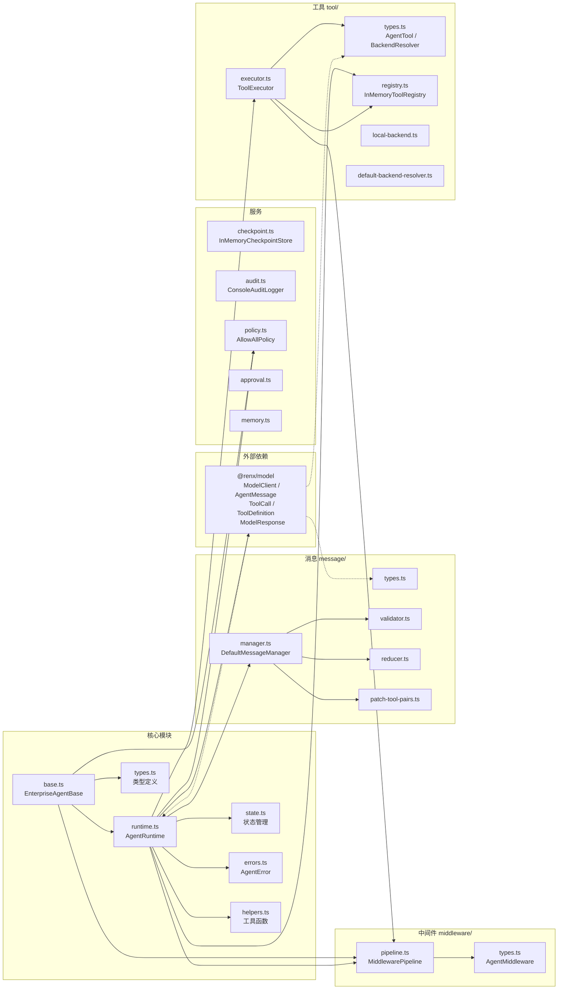
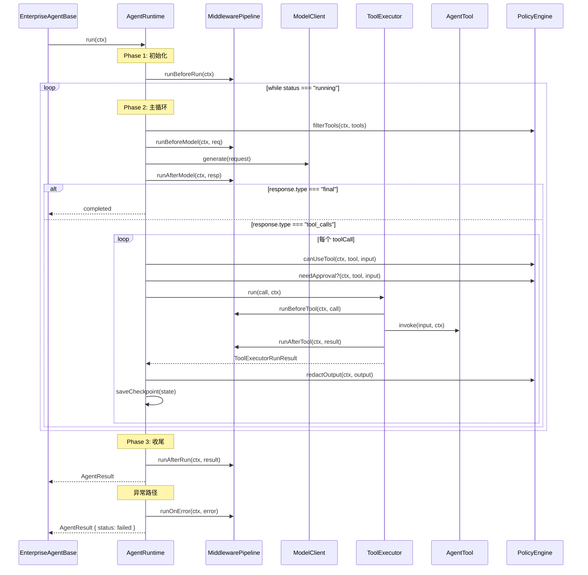
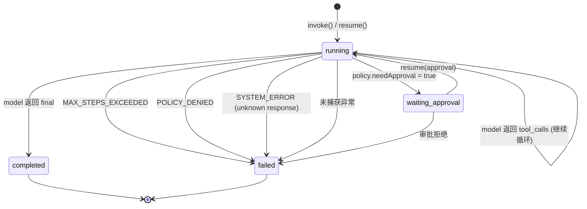

# @renx/agent 架构流程图

## 架构总览

```mermaid
flowchart TB
    %% ============ 入口层 ============
    subgraph Entry["入口层"]
        direction LR
        USER["用户调用"] --> INVOKE["EnterpriseAgentBase.invoke(input)"]
        USER2["恢复运行"] --> RESUME["EnterpriseAgentBase.resume(runId)"]
    end

    %% ============ 组装阶段 ============
    subgraph Setup["组装阶段"]
        direction TB
        INVOKE --> CREATE_CTX["createRunContext(input)
        创建 AgentRunContext"]
        RESUME --> CREATE_RESUME["createResumeContext(record)
        从 Checkpoint 恢复"]
        CREATE_CTX --> BUILD_SERVICES["buildServices()
        组装服务: Checkpoint / Audit / Approval / Memory"]
        CREATE_RESUME --> BUILD_SERVICES
        BUILD_SERVICES --> CREATE_RT["createRuntime(ctx)
        ──────────────────────
        调用子类抽象方法:
        getName / getSystemPrompt
        getTools / getModelClient
        getModelName / getMiddlewares
        getPolicy / getMaxSteps"]
        CREATE_RT --> RT["AgentRuntime
        (核心执行引擎)"]
    end

    %% ============ Phase 1: 初始化 ============
    subgraph Phase1["Phase 1: 初始化"]
        direction TB
        P1_NORM["normalizeIncoming(input)
        标准化输入消息"] --> P1_PATCH["patchState
        追加消息到 state"]
        P1_PATCH --> P1_BEFORE["pipeline.runBeforeRun(ctx)"]
        P1_BEFORE --> P1_MEM{"services.memory
        存在?"}
        P1_MEM -- 是 --> P1_LOAD["memory.load(ctx)"]
        P1_MEM -- 否 --> P1_CKPT
        P1_LOAD --> P1_CKPT["saveCheckpoint(state)
        保存初始快照"]
        P1_CKPT --> P1_AUDIT["emitAudit: run_started"]
    end

    RT --> Phase1

    %% ============ Phase 2: 主循环 ============
    subgraph Phase2["Phase 2: 主循环 while status === running"]
        direction TB
        P1_AUDIT --> LOOP_START(("循环开始"))
        LOOP_START --> STEP["stepCount++"]
        STEP --> MAX_CHECK{"stepCount > maxSteps?"}
        MAX_CHECK -- 是 --> FAIL_MAX["status = failed
        MAX_STEPS_EXCEEDED"]

        MAX_CHECK -- 否 --> BUILD_MSG["buildEffectiveMessages(ctx)"]

        subgraph MsgPipeline["消息处理流水线"]
            direction TB
            V["1. validate
            校验消息结构"] --> P["2. patchToolPairs
            修复工具调用/结果配对"]
            P --> W["3. applyHistoryWindow
            裁剪至最近 N 条消息"]
            W --> M["4. injectMemoryMessages
            注入记忆上下文"]
        end

        BUILD_MSG --> MsgPipeline
        MsgPipeline --> FILTER["policy.filterTools(ctx, tools)
        按策略过滤可用工具"]
        FILTER --> BUILD_REQ["构建 ModelRequest
        model / systemPrompt / messages / tools"]
        BUILD_REQ --> BEFORE_MDL["pipeline.runBeforeModel(ctx, req)"]
        BEFORE_MDL --> CALL_MDL["modelClient.generate(request)
        调用 LLM"]
        CALL_MDL --> AFTER_MDL["pipeline.runAfterModel(ctx, resp)"]
        AFTER_MDL --> BRANCH{"response.type?"}

        %% ---- final 分支 ----
        BRANCH -->|"final"| FINAL_APPEND["appendAssistantMessage(output)"]
        FINAL_APPEND --> FINAL_STATUS["status = completed"]

        %% ---- tool_calls 分支 ----
        BRANCH -->|"tool_calls"| TC_APPEND["appendAssistantToolCallMessage"]
        TC_APPEND --> TC_LOOP["遍历 toolCalls"]

        subgraph ToolExecution["单个工具执行"]
            direction TB
            TC_GET["registry.get(toolName)
            查找工具"]
            TC_POLICY{"policy.canUseTool?"}
            TC_GET --> TC_POLICY
            TC_POLICY -- 否 --> TC_DENIED["抛出 POLICY_DENIED"]
            TC_POLICY -- 是 --> TC_APPROVAL{"policy.needApproval?"}
            TC_APPROVAL -- 是 --> TC_WAIT["创建 ApprovalRequest
            status = waiting_approval
            saveCheckpoint"]
            TC_APPROVAL -- 否 --> TC_EXEC["ToolExecutor.run(call, ctx)"]

            subgraph ExecutorFlow["ToolExecutor 内部流程"]
                direction TB
                EX_BEFORE["middleware.runBeforeTool"]
                EX_STOP{"shouldStop?"}
                EX_BEFORE --> EX_STOP
                EX_STOP -- 是 --> EX_STOPPED["返回 stopped"]
                EX_STOP -- 否 --> EX_BACKEND["BackendResolver.resolve()
                解析执行后端"]
                EX_BACKEND --> EX_INVOKE["tool.invoke(input, ctx)
                执行工具"]
                EX_INVOKE --> EX_AFTER["middleware.runAfterTool"]
                EX_AFTER --> EX_DONE["返回 completed + patches"]
            end

            TC_EXEC --> ExecutorFlow
            ExecutorFlow --> TC_PATCH["应用 statePatches
            (中间件 + 工具结果)"]
            TC_PATCH --> TC_REDACT["policy.redactOutput()
            输出脱敏"]
            TC_REDACT --> TC_RESULT["appendToolResultMessage"]
            TC_RESULT --> TC_CKPT["saveCheckpoint"]
        end

        TC_LOOP --> ToolExecution
        TC_CKPT --> TC_SHOULD_STOP{"shouldStop?"}
        TC_SHOULD_STOP -- 是 --> LOOP_EXIT(("退出循环"))
        TC_SHOULD_STOP -- 否 --> TC_CONTINUE["continue → 下一次循环"]
        TC_CONTINUE --> LOOP_START

        %% ---- unknown 分支 ----
        BRANCH -- unknown --> UNK_FAIL["status = failed
        SYSTEM_ERROR"]
    end

    %% ============ Phase 3: 收尾 ============
    subgraph Phase3["Phase 3: 收尾"]
        direction TB
        F_RESULT["构建 AgentResult
        runId / status / output / error / state"]
        F_RESULT --> F_AFTER["pipeline.runAfterRun(ctx, result)"]
        F_AFTER --> F_MEM{"services.memory 存在?"}
        F_MEM -- 是 --> F_MEM_SAVE["memory.save(ctx, memory)"]
        F_MEM -- 否 --> F_CKPT
        F_MEM_SAVE --> F_CKPT["saveCheckpoint(state)
        保存最终快照"]
        F_CKPT --> F_AUDIT{"status?"}
        F_AUDIT -->|"completed"| F_OK["emitAudit: run_completed"]
        F_AUDIT -- 其他 --> F_FAIL["emitAudit: run_failed"]
        F_OK --> RETURN["return AgentResult"]
        F_FAIL --> RETURN
    end

    FAIL_MAX --> Phase3
    FINAL_STATUS --> Phase3
    TC_WAIT --> Phase3
    UNK_FAIL --> Phase3
    LOOP_EXIT --> Phase3

    %% ============ 异常处理 ============
    subgraph ErrorHandler["异常处理 catch"]
        direction TB
        ERR["捕获异常 → AgentError"] --> ERR_MW["pipeline.runOnError(ctx, error)"]
        ERR_MW --> ERR_CKPT["saveCheckpoint(state)"]
        ERR_CKPT --> ERR_AUDIT["emitAudit: run_failed"]
        ERR_AUDIT --> ERR_RET["return AgentResult
        status = failed"]
    end

    Phase3 --> RETURN_FINAL["返回结果给调用方"]
    ErrorHandler --> RETURN_FINAL

    %% ============ 样式 ============
    classDef entry fill:#4A90D9,stroke:#2C5F8A,color:#fff
    classDef process fill:#7B68EE,stroke:#5B48CE,color:#fff
    classDef decision fill:#F5A623,stroke:#D4891C,color:#fff
    classDef error fill:#E74C3C,stroke:#C0392B,color:#fff
    classDef success fill:#27AE60,stroke:#1E8449,color:#fff
    classDef service fill:#17A2B8,stroke:#128293,color:#fff

    class INVOKE,RESUME entry
    class P1_NORM,P1_PATCH,BUILD_MSG,BUILD_REQ,CALL_MDL process
    class MAX_CHECK,BRANCH,TC_POLICY,TC_APPROVAL,EX_STOP decision
    class FAIL_MAX,TC_DENIED,UNK_FAIL,ERR error
    class FINAL_STATUS,F_OK success
    class P1_MEM,F_MEM service
```

## 模块依赖关系

## Middleware 生命周期

## 状态机

## 关键文件说明

| 文件 | 核心职责 |
|------|---------|
| `base.ts` | 抽象基类，Template Method 模式，子类覆写声明工具/提示词/策略 |
| `runtime.ts` | 核心执行引擎，驱动主循环、状态转换、Checkpoint、错误处理 |
| `types.ts` | 全局类型定义：AgentState、AgentRunContext、AgentResult 等 |
| `state.ts` | 不可变状态管理，通过 `applyStatePatch` 更新状态 |
| `errors.ts` | 自定义错误类型 `AgentError`，含 code / message / metadata |
| `middleware/pipeline.ts` | 有序中间件执行框架，7 个生命周期钩子 |
| `message/manager.ts` | 消息生命周期管理：标准化、校验、修复、窗口裁剪、记忆注入 |
| `tool/registry.ts` | 内存工具注册表 `InMemoryToolRegistry` |
| `tool/executor.ts` | 工具执行器：查找 → beforeTool → 解析后端 → invoke → afterTool |
| `tool/local-backend.ts` | 本地执行后端 |
| `checkpoint.ts` | 内存 Checkpoint 存储，支持 run 的暂停/恢复 |
| `policy.ts` | 默认 `AllowAllPolicy`，允许所有工具调用 |
